# Tabla de Contenidos

- [Capítulo I: Definición del proyecto de investigación](#capítulo-i-definición-del-proyecto-de-investigación)
  - [1.1 Definición del problema](#11-definición-del-problema)
    - [1.1.1 Situación problemática](#111-situación-problemática)
    - [1.1.2 Situación deseada](#112-situación-deseada)
    - [1.1.3 Objeto de investigación](#113-objeto-de-investigación)
    - [1.1.4 Alcance](#114-alcance)
    - [1.1.5 Justificación](#115-justificación)
  - [1.2 Objetivos](#12-objetivos)
    - [1.2.1 Objetivo General](#121-objetivo-general)
    - [1.2.2 Objetivos Específicos](#122-objetivos-específicos)
  - [1.3 Metodología](#13-metodología)
- [Capítulo II: Marco Institucional](#capítulo-ii-marco-institucional)
  - [2.1 Antecedentes Institucionales](#21-antecedentes-institucionales)
  - [2.2 Estructura Orgánica (Organigrama Institucional)](#22-estructura-orgánica-organigrama-institucional)
  - [2.3 Flujo del Negocio](#23-flujo-del-negocio)
- [Capítulo III: Marco Teórico y Tecnológico](#capítulo-iii-marco-teórico-y-tecnológico)
  - [3.1 Fundamentos Teóricos del Negocio y la Biomecánica](#31-fundamentos-teóricos-del-negocio-y-la-biomecánica)
    - [3.1.1 Análisis Postural y Biomecánica en BJJ (Delimitación a Solo Drills y Prácticas Cooperativas en Pareja)](#311-análisis-postural-y-biomecánica-en-bjj-delimitación-a-solo-drills-y-prácticas-cooperativas-en-pareja)
    - [3.1.2 Estimación de Poses 3D y Espacio Canónico Normalizado (Root-Relative)](#312-estimación-de-poses-3d-y-espacio-canónico-normalizado-root-relative)
    - [3.1.3 Arquitectura RAG Multimodal Doctrinal](#313-arquitectura-rag-multimodal-doctrinal)
  - [3.2 Selección y Justificación Tecnológica](#32-selección-y-justificación-tecnológica)
    - [3.2.1 Componentes en Entorno Remoto (Análisis automático GPU)](#321-componentes-en-entorno-remoto-análisis-automático-gpu)
    - [3.2.2 Componentes en Entorno Local (Servidor de Control)](#322-componentes-en-entorno-local-servidor-de-control)
    - [3.2.3 Análisis de Licenciamiento de Software y Viabilidad SaaS Comercial](#323-análisis-de-licenciamiento-de-software-y-viabilidad-saas-comercial)
  - [3.3 Lógica Espacial Latente y Algoritmos Biomecánicos](#33-lógica-espacial-latente-y-algoritmos-biomecánicos)
    - [A. Comparación Angular Directa entre Esqueletos](#a-comparación-angular-directa-entre-esqueletos)
    - [B. Localización Temporal del Error mediante Dynamic Time Warping (DTW)](#b-localización-temporal-del-error-mediante-dynamic-time-warping-dtw)
    - [C. Recalibración Automática del Centroide de Referencia](#c-recalibración-automática-del-centroide-de-referencia)
    - [D. Validación de Contenido BJJ con Gemini 2.5 Flash](#d-validación-de-contenido-bjj-con-gemini-25-flash)
    - [E. Filtro de Correspondencia con la Técnica Seleccionada](#e-filtro-de-correspondencia-con-la-técnica-seleccionada)
    - [F. Trazabilidad del Frame Exacto con Círculo de Error](#f-trazabilidad-del-frame-exacto-con-círculo-de-error)
  - [3.4 Matriz de Riesgos Técnicos y Reducciones Formales](#34-matriz-de-riesgos-técnicos-y-reducciones-formales)
- [Capítulo IV: Definición de requisitos](#capítulo-iv-definición-de-requisitos)
  - [4.1 Introducción](#41-introducción)
    - [4.1.1 Propósito](#411-propósito)
    - [4.1.2 Ámbito del sistema](#412-ámbito-del-sistema)
    - [4.1.3 Definiciones, acrónimos y abreviaturas](#413-definiciones-acrónimos-y-abreviaturas)
    - [4.1.4 Visión general del documento](#414-visión-general-del-documento)
  - [4.2 Descripción general](#42-descripción-general)
    - [4.2.1 Perspectiva del producto](#421-perspectiva-del-producto)
    - [4.2.2 Funciones del Producto](#422-funciones-del-producto)
    - [4.2.3 Características de los Usuarios](#423-características-de-los-usuarios)
    - [4.2.4 Restricciones](#424-restricciones)
    - [4.2.5 Suposiciones y Dependencias](#425-suposiciones-y-dependencias)
    - [4.2.6 Requisitos Futuros](#426-requisitos-futuros)
  - [4.3 Requisitos Específicos](#43-requisitos-específicos)
    - [4.3.1 Interfaces Externas](#431-interfaces-externas)
    - [4.3.2 Requisitos funcionales](#432-requisitos-funcionales)
    - [4.3.3 Requisitos de Rendimiento](#433-requisitos-de-rendimiento)
    - [4.3.4 Restricciones de Diseño](#434-restricciones-de-diseño)
    - [4.3.5 Atributos del Sistema](#435-atributos-del-sistema)
  - [4.4 Identificación de los casos de uso](#44-identificación-de-los-casos-de-uso)
  - [4.5 Diagrama de dominio](#45-diagrama-de-dominio)
- [Capítulo V: Análisis y Diseño Orientado a Objetos](#capítulo-v-análisis-y-diseño-orientado-a-objetos)
  - [5.1 Introducción al Análisis y Diseño](#51-introducción-al-análisis-y-diseño)
  - [5.2 Arquitectura Lógica del Sistema](#52-arquitectura-lógica-del-sistema)
    - [5.2.1 Justificación de la Arquitectura en Capas](#521-justificación-de-la-arquitectura-en-capas)
    - [5.2.2 Diagrama de Paquetes de la Arquitectura Lógica](#522-diagrama-de-paquetes-de-la-arquitectura-lógica)
    - [5.2.3 Justificación de la Capa de Servicios Transversales](#523-justificación-de-la-capa-de-servicios-transversales)
  - [5.3 Diagramas de Secuencia del Sistema (SSD)](#53-diagramas-de-secuencia-del-sistema-ssd)
    - [5.3.1 SSD del CU-01: Registrar Técnica Patrón](#531-ssd-del-cu-01-registrar-técnica-patrón)
    - [5.3.2 SSD del CU-02: Evaluar Ejecución Biomecánica](#532-ssd-del-cu-02-evaluar-ejecución-biomecánica)
    - [5.3.3 SSD del CU-03: Consultar Historial de Progreso](#533-ssd-del-cu-03-consultar-historial-de-progreso)
    - [5.3.4 SSD del CU-04: Visualizar Analítica de Tatami](#534-ssd-del-cu-04-visualizar-analítica-de-tatami)
    - [5.3.5 SSD del CU-05: Indexar Literatura Oficial al RAG](#535-ssd-del-cu-05-indexar-literatura-oficial-al-rag)
    - [5.3.6 SSD del CU-06: Ejecutar Mantenimiento Autónomo](#536-ssd-del-cu-06-ejecutar-mantenimiento-autónomo)
    - [5.3.7 SSD del CU-07: Validar Contenido BJJ](#537-ssd-del-cu-07-validar-contenido-bjj)
    - [5.3.8 SSD del CU-08: Recalibrar Centroide Automáticamente](#538-ssd-del-cu-08-recalibrar-centroide-automáticamente)
  - [5.4 Contratos de Operación](#54-contratos-de-operación)
    - [5.4.1 Contrato CO-01: registrarTecnica](#541-contrato-co-01-registrartecnica)
    - [5.4.2 Contrato CO-02: evaluarEjecucion](#542-contrato-co-02-evaluarejecucion)
    - [5.4.3 Contrato CO-03: validarContenidoBJJ](#543-contrato-co-03-validarcontenidobj)
    - [5.4.4 Contrato CO-04: indexarManual](#544-contrato-co-04-indexarmanual)
    - [5.4.5 Contrato CO-05: recalibrarCentroide](#545-contrato-co-05-recalibrarcentroide)
  - [5.5 Diagrama de Clases de Diseño (DCD)](#55-diagrama-de-clases-de-diseño-dcd)
    - [5.5.1 DCD: Subsistema de Evaluación Biomecánica](#551-dcd-subsistema-de-evaluación-biomecánica)
    - [5.5.2 DCD: Adaptadores de Infraestructura](#552-dcd-adaptadores-de-infraestructura)
    - [5.5.3 DCD: Repositorios de Persistencia](#553-dcd-repositorios-de-persistencia)
  - [5.6 Realización de Casos de Uso](#56-realización-de-casos-de-uso)
    - [5.6.1 Realización del CU-02: Evaluar Ejecución Biomecánica](#561-realización-del-cu-02-evaluar-ejecución-biomecánica)
    - [5.6.2 Realización del CU-01: Registrar Técnica Patrón](#562-realización-del-cu-01-registrar-técnica-patrón)
  - [5.7 Aplicación de Patrones GRASP](#57-aplicación-de-patrones-grasp)
    - [5.7.1 Patrón Controller (Controlador)](#571-patrón-controller-controlador)
    - [5.7.2 Patrón Information Expert (Experto en Información)](#572-patrón-information-expert-experto-en-información)
    - [5.7.3 Patrón Creator (Creador)](#573-patrón-creator-creador)
    - [5.7.4 Patrón Low Coupling (Bajo Acoplamiento)](#574-patrón-low-coupling-bajo-acoplamiento)
    - [5.7.5 Patrón High Cohesion (Alta Cohesión)](#575-patrón-high-cohesion-alta-cohesión)
    - [5.7.6 Patrón Polymorphism (Polimorfismo)](#576-patrón-polymorphism-polimorfismo)
    - [5.7.7 Patrón Pure Fabrication (Fabricación Pura)](#577-patrón-pure-fabrication-fabricación-pura)
    - [5.7.8 Patrón Indirection (Indirección)](#578-patrón-indirection-indirección)
    - [5.7.9 Patrón Protected Variations (Variaciones Protegidas)](#579-patrón-protected-variations-variaciones-protegidas)
  - [5.8 Aplicación de Patrones GoF](#58-aplicación-de-patrones-gof)
    - [5.8.1 Patrón Adapter (Estructural)](#581-patrón-adapter-estructural)
    - [5.8.2 Patrón Factory (Creacional)](#582-patrón-factory-creacional)
    - [5.8.3 Patrón Singleton (Creacional)](#583-patrón-singleton-creacional)
    - [5.8.4 Patrón Facade (Estructural)](#584-patrón-facade-estructural)
    - [5.8.5 Patrón Strategy (Comportamiento)](#585-patrón-strategy-comportamiento)
    - [5.8.6 Patrón Observer (Comportamiento)](#586-patrón-observer-comportamiento)
  - [5.9 Diagrama de Paquetes](#59-diagrama-de-paquetes)
    - [5.9.1 Regla de Dependencia entre Paquetes](#591-regla-de-dependencia-entre-paquetes)
  - [5.10 Diagrama de Despliegue](#510-diagrama-de-despliegue)
    - [5.10.1 Flujo del Procesamiento (11 pasos)](#5101-flujo-del-procesamiento-11-pasos)
    - [5.10.2 Características de los Nodos](#5102-características-de-los-nodos)
  - [5.11 Matriz de Trazabilidad Arquitectónica](#511-matriz-de-trazabilidad-arquitectónica)
    - [5.11.1 Endpoints REST Completos del Sistema](#5111-endpoints-rest-completos-del-sistema)
  - [5.12 Consideraciones de Confiabilidad y Fallo Seguro](#512-consideraciones-de-confiabilidad-y-fallo-seguro)
    - [5.12.1 Patrón Adapter Fallback (Núcleo del Fail-Safe)](#5121-patrón-adapter-fallback-núcleo-del-fail-safe)
    - [5.12.2 Timeout y Fallback Determinísta en Gemini](#5122-timeout-y-fallback-determinísta-en-gemini)
    - [5.12.3 Aislamiento de Sesiones Colab y Detección de Caída](#5123-aislamiento-de-sesiones-colab-y-detección-de-caída)
    - [5.12.4 Persistencia Atómica y Transaccionalidad](#5124-persistencia-atómica-y-transaccionalidad)
    - [5.12.5 Tabla Consolidada de Riesgos y Mitigaciones](#5125-tabla-consolidada-de-riesgos-y-mitigaciones)
  - [5.13 Conclusión del Capítulo V](#513-conclusión-del-capítulo-v)
- [Referencias Bibliográficas](#referencias-bibliográficas)
- [Anexo A: Glosario Terminológico y Abreviaturas](#anexo-a-glosario-terminológico-y-abreviaturas)

---

# Capítulo I: Definición del proyecto de investigación

## 1.1 Definición del problema

En la academia *Corpo e Mente* (filial Knockout Gym, Santa Cruz de la Sierra), los alumnos aprenden Brazilian Jiu-Jitsu principalmente asistiendo a clases presenciales. Sin embargo, tres factores limitan su progreso:

Primero, muchos practicantes **no pueden asistir con regularidad** por motivos laborales, académicos o familiares. Segundo, los alumnos **dependen casi por completo del profesor** para saber si están ejecutando bien una técnica. Tercero, aunque existen videos en YouTube y otras plataformas, estos **no le dicen al alumno si él mismo lo está haciendo bien**; solo muestran cómo debería verse el movimiento.

El resultado es que el practicante que no puede asistir seguido **queda estancado**, pierde motivación y con frecuencia abandona el deporte. Quienes intentan aprender por su cuenta con videos replican mal la técnica. Cuando finalmente la aplican en un combate real, **la técnica no les sale** porque nunca recibieron corrección sobre su propia ejecución.

### 1.1.1 Situación problemática

El análisis operativo de la filial revela cuatro indicadores críticos:

*   **Asistencia intermitente por causas externas:** De 79 practicantes históricos inscritos, solo 15 asisten regularmente al tatami en el horario nocturno (20:00 a 21:30). La mayoría de las bajas no se debe a desinterés, sino a que los alumnos no pueden sostener el horario por trabajo, estudio u otras actividades.
*   **Tasa de abandono elevada:** La deserción acumulada asciende al 81.01%, calculada como $\left( \frac{64}{79} \right) \times 100$. En otras palabras: 64 de cada 79 alumnos dejaron la academia.
*   **Dependencia total del profesor:** Durante la clase de 90 minutos, con 15 alumnos y 675 repeticiones totales, el profesor dispone de 8 segundos por repetición para corregir. Esto deja más del 80% de los errores técnicos sin retroalimentación. Fuera del aula, el alumno no tiene ninguna forma objetiva de saber si está practicando bien.
*   **Frustración al aplicar la técnica:** El alumno que aprende solo con videos replica la forma exterior del movimiento, pero no comprende sus detalles biomecánicos. Cuando intenta ejecutar la técnica durante un combate, esta **falla**. La repetición del fracaso refuerza la percepción de estancamiento.

### 1.1.2 Situación deseada

Se propone desarrollar una Aplicación Web Progresiva (PWA) que actúe como tutor inteligente **accesible desde cualquier lugar y en cualquier momento**, sin necesidad de estar físicamente en el tatami. El sistema permitirá al alumno grabar sus ejercicios individuales desde su teléfono celular y recibir correcciones en menos de 180 segundos. Los objetivos concretos son:

1.  **Aprender sin depender del horario del gimnasio:** El alumno podrá practicar en su casa, en un parque o donde esté, y recibir la misma corrección que recibiría del profesor.
2.  **Corrección objetiva sobre la propia ejecución:** El sistema comparará el video del alumno con el video patrón del profesor y emitirá un reporte pedagógico señalando el segundo exacto del error. No se trata de imitar un video, sino de saber si uno mismo lo está haciendo bien.
3.  **Permitir la práctica fuera del tatami:** Lograr que el alumno pueda practicar y recibir corrección sin necesidad de estar físicamente en la academia, independientemente de su horario.
4.  **Ventaja competitiva:** Otorgar a la academia una herramienta tecnológica exclusiva que fortalezca su posición comercial y viabilice su futura venta como servicio (SaaS).

### 1.1.3 Objeto de investigación

El objeto de investigación comprende la aplicación de visión por computadora para estimar poses 3D, la búsqueda automatizada en manuales oficiales (RAG) y los algoritmos de comparación cinemática temporal, con el fin de evaluar y corregir movimientos individuales y prácticas cooperativas en pareja de Brazilian Jiu-Jitsu fuera del horario y del espacio físico de la academia.


### 1.1.4 Alcance

**Alcance funcional:** El sistema incluye autenticación por roles (Profesor y Alumno), registro obligatorio del video semilla del profesor, carga de videos cortos (hasta 30 segundos) de ejercicios individuales (*Solo Drills*), extracción de 12 puntos articulares clave, comparación con el patrón del profesor, generación de reportes pedagógicos en cuatro bloques (Análisis Postural, Alertas, Guía Paso a Paso y Resumen), historial de progreso del alumno, panel analítico del profesor y mantenimiento nocturno autónomo.

**Alcance tecnológico:** El sistema se compone de un servidor central (FastAPI + PostgreSQL con JSONB en 3FN), una base de datos vectorial (Qdrant), un entorno de análisis remoto en Google Colab (**YOLO26x-Pose + YOLO26x-Depth**). El desarrollo backend local se basa en FastAPI (Python 3.11) y PostgreSQL (con JSONB) para orquestación, mientras que la base vectorial Qdrant maneja el RAG. La seguridad incluye **cifrado TLS 1.3 y autenticación basada en PBKDF2-HMAC-SHA256**.

**Exclusiones:** El sistema no reemplaza al profesor, no emite diagnósticos médicos ni gestiona cobros de mensualidades. Se enfoca exclusivamente en dos tipos de práctica:

*   **Ejercicios individuales (Solo Drills):** movimientos ejecutados sin compañero.
*   **Prácticas cooperativas en pareja:** dos personas repitiendo una técnica predefinida de forma controlada y predecible (ej. uchi komi, entradas de proyección, transiciones de guardia).

Límites estrictos del análisis en pareja:
*   La técnica debe ser predefinida y cooperativa. No se evalúa sparring libre ni competencia.
*   La cámara debe estar fija en trípode, con ángulo lateral o de 45 grados. No se acepta video grabado a mano alzada.
*   El alumno indica manualmente su rol en la PWA al subir el video (ej. "soy el de la izquierda").
*   El sistema rastrea ambos esqueletos con YOLO26x en modo multi-persona, pero solo evalúa el esqueleto del alumno contra el video semilla.
*   Si más del 40% de los puntos del alumno quedan ocluidos durante más del 30% de la secuencia, el sistema rechaza el video (Filtro Estructural extendido).

Queda excluido el análisis de sparring libre y competencia porque la oclusión severa y la imprevisibilidad del movimiento impiden la detección confiable con una sola cámara.

### 1.1.5 Justificación

**Justificación técnica:** La combinación de visión por computadora (Ultralytics, 2026) con búsqueda aumentada por generación (RAG) representa una innovación en el software deportivo. La arquitectura desacoplada permite ejecutar el análisis pesado en servidores remotos sin costo de infraestructura durante la fase de MVP.

**Justificación social y pedagógica:** La literatura en sistemas tutoriales inteligentes demuestra que la retroalimentación inmediata y personalizada incrementa la autoeficacia del estudiante. Un tutor virtual disponible 24/7 reduce la frustración, previene lesiones y democratiza la excelencia técnica del profesor.

**Justificación de negocio:** La solución reduce la pérdida de ingresos por deserción en Knockout Gym. Con una mensualidad de 300 Bs por alumno, cada retención representa un ingreso directo. A mediano plazo, el núcleo arquitectónico permite comercializar el sistema como servicio (SaaS) a otras academias de BJJ.

## 1.2 Objetivos

### 1.2.1 Objetivo General

Desarrollar un sistema basado en visión computacional e inteligencia artificial para la academia *Corpo e Mente*, que entregue corrección biomecánica individualizada sobre ejercicios individuales y prácticas cooperativas en pareja de Brazilian Jiu-Jitsu.

### 1.2.2 Objetivos Específicos

1.  Definir el marco cuasi-experimental para contrastar el progreso técnico y la retención de alumnos frente a la enseñanza tradicional.
2.  Construir el proceso de visión artificial con **YOLO26x-Pose y YOLO26x-Depth** para codificar **los 17 keypoints COCO** en coordenadas tridimensionales normalizadas, con soporte para rastreo simultáneo de dos personas en videos de práctica cooperativa y asignación manual de identidad por parte del alumno.
3.  Implementar el algoritmo de comparación cinemática basado en **Dynamic Time Warping (DTW) sobre series angulares articulares**, con localización temporal del frame de máxima desviación.
4.  Diseñar el subsistema de Recuperación Aumentada por Generación (RAG) multimodal en Qdrant con la literatura oficial del Brazilian Jiu-Jitsu.
5.  Integrar el motor generativo Gemini 2.5 Flash para emitir reportes pedagógicos en cuatro bloques bajo esquema JSON verificado.
6.  Desarrollar la interfaz PWA móvil con accesibilidad WCAG 2.1 AA, responsiva e intuitiva para la captura y consulta de historial.
7.  Ejecutar el plan de pruebas y validar la coincidencia entre la inteligencia artificial y el profesor mediante **comparación directa en una muestra de 20 videos etiquetados manualmente por el instructor**.

## 1.3 Metodología

El ciclo de vida del software combina el Proceso Unificado Ágil —estructurado en tres macroetapas: Planificación de requisitos, Construcción iterativa e Instalación— con dieciocho ciclos de trabajo de dos semanas bajo Scrum. El proyecto se ejecuta entre febrero y diciembre de 2026. A septiembre de 2026, el proyecto se encuentra en plena fase de construcción.


---

# Capítulo II: Marco Institucional

## 2.1 Antecedentes Institucionales
La academia *Corpo e Mente* es una institución deportiva internacional fundada en 2005 en Salvador de Bahía, Brasil. Su fundador es el Gran Maestro Humberto Tavares. La entidad se enfoca en la preservación doctrinal y formación técnica en artes marciales. Pone especial énfasis en el Brazilian Jiu-Jitsu y el Judó. Opera mediante filiales descentralizadas que garantizan la fidelidad a los programas de grado de la IBJJF.

En Santa Cruz de la Sierra, *Corpo e Mente* cuenta con diversas células de entrenamiento. El alcance del proyecto se circunscribe a la célula ubicada en el gimnasio comercial *Knockout Training Center* (*Knockout Gym*). Dicha filial opera en Santa Cruz de la Sierra. La relación comercial se basa en un acuerdo de tercerización y coparticipación de ingresos. *Knockout Gym* cobra las cuotas de 300 Bs en recepción. Luego retiene un margen por uso de sala y transfiere el saldo neto acordado a *Corpo e Mente Bolivia*, quien liquida los honorarios del profesor. La academia mantiene una autonomía técnica y doctrinal absoluta e indiscutible frente a los administradores del gimnasio.

## 2.2 Estructura Orgánica (Organigrama Institucional)
La línea de mando y toma de decisiones se rige bajo un modelo lineal-funcional. El organigrama comprende estrictamente **cuatro (4) niveles jerárquicos**, como se ilustra en la Figura 2.1:

1.  **Nivel 1: Dirección Estratégica Internacional (Sede Matriz - Salvador de Bahía, Brasil):** Conducida por el Master Humberto Tavares. Dictamina las normas técnicas, valida ascensos de grado y vela por el cumplimiento de los reglamentos internacionales.
2.  **Nivel 2: Coordinación Nacional (Corpo e Mente Bolivia - Santa Cruz de la Sierra):** Administra la representación institucional en el país y coordina las sucursales. Gestiona afiliaciones en Smoothcomp y supervisa el calendario competitivo de la academia.
3.  **Nivel 3: Administración y Alianza Comercial Externa (Knockout Training Center):** Entidad socia externa responsable de la infraestructura física y el marketing de atracción. También gestiona la cobranza de mensualidades y liquida comisiones periódicas a la academia.
4.  **Nivel 4: Operación Técnica y Pedagógica Local (Célula Nocturna - Sucursal Knockout Gym):** Núcleo funcional operativo del tatami en horario nocturno (20:00 a 21:30). Constituye el límite de puesta en marcha del software. Integra jerárquicamente a:
    *   *Profesor Encargado (Prof. Miguel Baigorria - Cinturón Negro):* Autoridad técnica en sala y Experto del Dominio (*Product Owner* en el marco Scrum). Responsable de supervisar las clases, suministrar la literatura oficial, validar los requisitos del sistema y grabar de forma obligatoria los Videos Semilla de referencia.
    *   *Comunidad de Alumnos y Atletas de BJJ:* Practicantes que interactúan con la PWA. Envían videos de práctica individual y de práctica cooperativa en pareja, y reciben corrección del movimiento fuera del horario de clase.

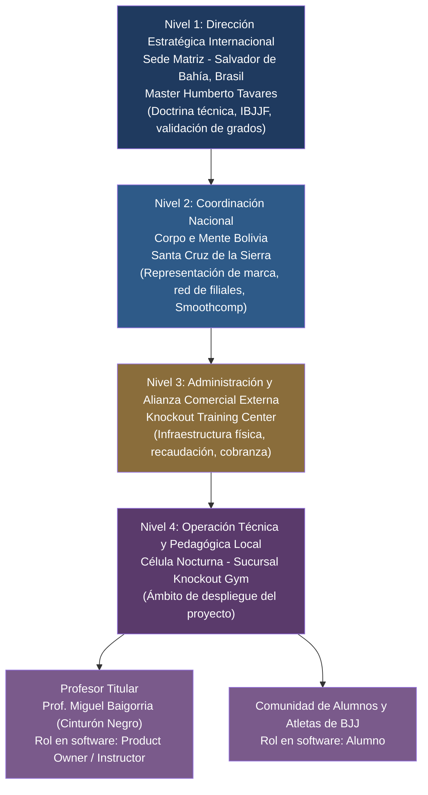

**Figura 2.1:** Organigrama Estructural de Knockout Training Center y Línea de Mando de Corpo e Mente (Modelo de 4 Niveles). *Fuente: Elaboración propia basada en los manuales organizacionales de Corpo e Mente Bolivia (2026).*

## 2.3 Flujo del Negocio


**Figura 2.2:** Diagrama del Flujo del Negocio de Corpo e Mente en Knockout Training Center. *Fuente: Elaboración propia.*

---


# Capítulo III: Marco Teórico y Tecnológico

## 3.1 Fundamentos Teóricos del Negocio y la Biomecánica

### 3.1.1 Análisis Postural y Biomecánica en BJJ (Delimitación a Solo Drills y Prácticas Cooperativas en Pareja)

El Brazilian Jiu-Jitsu basa su eficiencia en principios físicos rigurosos (Craig, 2022; Tavares, 2020). Utiliza palancas, momentos de fuerza y estabilidad rotacional sobre el eje axial. La efectividad de una técnica depende de la correcta alineación de los ejes articulares, la gestión del centro de masa corporal y la optimización del apalancamiento mecánico. Las investigaciones de visión artificial aplicada al deporte (Cust et al., 2019) comprueban la necesidad de aislar los movimientos articulares para poder evaluarlos objetivamente.

El análisis biomecánico en el BJJ estudia el movimiento corporal y las fuerzas involucradas durante la ejecución de las técnicas. La evaluación de los ángulos articulares en puntos críticos (hombros, codos, caderas, rodillas y tobillos) permite determinar cuantitativamente si la ejecución de un alumno coincide con el patrón ideal dictado por el profesor, o si presenta desviaciones que comprometan la eficacia técnica o incrementen el riesgo de lesiones.

**Justificación de la delimitación:** En el MVP la evaluación se restringe a dos tipos de práctica:

- **Ejercicios individuales (Solo Drills):** movimientos ejecutados sin compañero.
- **Prácticas cooperativas en pareja:** dos personas repitiendo una técnica predefinida de forma controlada y predecible (ej. uchi komi, entradas de proyección, transiciones de guardia).

Se excluye el sparring libre y la competencia porque la oclusión mutua y la imprevisibilidad del movimiento impiden la detección confiable con una sola cámara. El sistema rastrea ambos esqueletos con YOLO26x en modo multi-persona, pero solo evalúa el esqueleto del alumno contra el video semilla del profesor.

### 3.1.2 Estimación de Poses 3D y Espacio Canónico Normalizado (*Root-Relative*)

La estimación de pose en video requiere extraer las articulaciones humanas en cada fotograma. El sistema implementa un **Espacio Cinemático Canónico Normalizado (*Root-Relative*)** a partir de la fusión geométrica de dos modelos complementarios: YOLO26x-Pose (detección de keypoints 2D) y YOLO26x-Depth (mapa de profundidad métrica monocular). Este enfoque descarta medir distancias absolutas con una sola cámara por su ambigüedad geométrica. En su lugar, aplica los siguientes tres pasos:

1.  **Filtrado Topológico:** Se toman los 17 puntos COCO-Pose y se seleccionan los keypoints de control articular relevantes para la técnica evaluada (mínimo 12 puntos: codos, hombros, rodillas, caderas, tobillos y eje axial del tronco, izquierda y derecha).

2.  **Fusión Geométrica 3D (YOLO26x-Pose + YOLO26x-Depth):** Para cada keypoint 2D $(x, y)$ detectado por YOLO26x-Pose, se escala a las coordenadas del mapa de profundidad $(x_d, y_d)$ generado por YOLO26x-Depth y se extrae la componente Z métrica en metros reales:

$$
Z = \text{depth\_map}[y_d, x_d]
$$

*En palabras simples: esta fórmula asigna a cada articulación su profundidad en metros reales, sin necesidad de sensores RGB-D costosos.*

3.  **Traslación de Origen al Sacro:** Se toma el punto medio de las caderas (pelvis/sacro) como el origen de coordenadas $\mathbf{p}_{\text{root}} = (0,0,0)$:

$$
\mathbf{p}'_{k}(t) = \mathbf{p}_{k}(t) - \mathbf{p}_{\text{root}}(t), \quad \forall k \in \{1, \dots, 12\}
$$

*En palabras simples: esta fórmula centra las articulaciones del cuerpo tomando la cadera como punto cero.*

4.  **Normalización de Escala por Longitud Anatómica:** Las coordenadas se escalan dividiendo entre la longitud media del torso o distancia pélvica-espinal del propio practicante:

$$
\mathbf{\hat{p}}_{k}(t) = \frac{\mathbf{p}'_{k}(t)}{L_{\text{torso}}(t)}
$$

*En palabras simples: esta fórmula divide las distancias entre el tamaño del torso para comparar alumnos altos y bajos con la misma medida.*

Esta formulación confiere invarianza absoluta frente a la estatura del alumno, la distancia a la lente y pequeñas inclinaciones angulares del smartphone.

### 3.1.3 Arquitectura RAG Multimodal Doctrinal

El patrón RAG (*Retrieval-Augmented Generation*) resuelve el problema de las alucinaciones en modelos de lenguaje. La base vectorial Qdrant aloja fragmentos textuales de manuales de *Corpo e Mente* y de la IBJJF. Al detectar un error articular (ej. flexión deficiente de rodilla), el sistema busca en el espacio de 2048 dimensiones de Qwen3-VL-Embedding-2B (Qwen Team, 2026). Así recupera el párrafo doctrinal exacto que instruye cómo corregir la postura.

**Pipeline RAG implementado (5 etapas):**

1.  **Fragmentación semántica:** `ChunkerSemanticoBJJ` con `RecursiveCharacterTextSplitter` (chunk size=1000, chunk overlap=200). Encapsula LangChain bajo el patrón Variaciones Protegidas de Larman.
2.  **Vectorización:** Qwen3-VL-Embedding-2B (2048 dimensiones, normalizado). Se ejecuta en GPU remota (Google Colab) mediante micro-batching de 32 textos por lote para evitar OOM.
3.  **Almacenamiento vectorial:** Qdrant local (colección `bjj_knowledge`, métrica Cosine, búsqueda KNN con filtro por `id_tecnica`).
4.  **Persistencia relacional:** PostgreSQL en BCNF (tabla `fuentes_conocimiento` con `id_documento` para agrupar chunks).
5.  **Generación:** Gemini 2.5 Flash con salida JSON estricta (4 claves obligatorias).

**Nota sobre Qwen3-VL:** El modelo se utiliza exclusivamente para vectorizar texto doctrinal (manuales, libros, reglamentos), no para analizar movimiento corporal. La comparación cinemática se realiza mediante series angulares y DTW (ver Sección 3.3).

## 3.2 Selección y Justificación Tecnológica

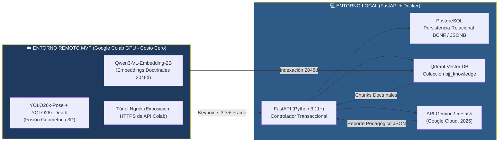

**Figura 3.1:** Arquitectura de Componentes Híbrida y Topología de Túnel para la Fase de MVP. *Fuente: Elaboración propia (2026).*

### 3.2.1 Componentes en Entorno Remoto (Análisis automático GPU)

*   **YOLO26x-Pose (Ultralytics, 2026):** Detector de pose de última generación optimizado para mantener un tracking confiable bajo oclusión moderada. Extrae los 17 keypoints COCO en cada fotograma a 30 FPS. En videos de práctica cooperativa, YOLO26x opera en modo multi-persona: detecta dos esqueletos simultáneos, y el sistema asigna el esqueleto del alumno según la posición indicada manualmente en la PWA.

*   **YOLO26x-Depth (Ultralytics, 2026):** Modelo complementario que genera un mapa de profundidad métrica monocular en metros reales absolutos. Se ejecuta de forma sincrónica con YOLO26x-Pose en la misma GPU. Para cada keypoint 2D $(x, y)$ detectado por YOLO26x-Pose, se escala a las coordenadas del mapa de profundidad $(x_d, y_d)$ y se extrae la componente Z métrica: $Z = \text{depth\_map}[y_d, x_d]$, expresada en metros reales. La fusión geométrica permite obtener coordenadas $(X, Y, Z)$ tridimensionales sin sensores RGB-D costosos.

*   **Qwen3-VL-Embedding-2B (Qwen Team, 2026):** Modelo Vision-Language de 2B parámetros ejecutado mediante `SentenceTransformer` en GPU. Genera representaciones numéricas de 2048 dimensiones a partir de textos doctrinales de BJJ. **Nota:** Qwen3-VL se utiliza exclusivamente para vectorizar texto (manuales, libros, reglamentos), no para analizar movimiento corporal.

*   **Topología de Túnel Ngrok en Colab:** El cliente Ngrok se ejecuta en Google Colab para exponer la API de GPU mediante HTTPS. El servidor central local consume esta dirección de forma saliente mediante peticiones web seguras. La URL del túnel se inyecta en el archivo `.env` como `COLAB_TUNNEL_URL`.

### 3.2.2 Componentes en Entorno Local (Servidor de Control)

*   **FastAPI:** Framework web en Python 3.11+ con validación de tipos mediante Pydantic. Coordina el flujo de análisis, los servicios remotos y la lógica biomecánica. Expone la API REST bajo HTTPS y monta la PWA en `/static`.

*   **PostgreSQL con JSONB:** Base de datos relacional modelada en BCNF (Mannino, 2021). Custodia los datos de usuarios, historiales y la estructura completa de los reportes generados. La columna `consejo_pedagogico` de la tabla `evaluaciones_alumno` almacena el objeto estructurado de 4 claves generado por Gemini. La persistencia vectorial se delega íntegramente a Qdrant.

*   **Qdrant Vector Database:** Motor vectorial con una única colección `bjj_knowledge` (distancia Cosine, 2048 dimensiones). Almacena los fragmentos doctrinales vectorizados con metadatos relacionales (`id_fuente`, `id_documento`, `id_tecnica`, `id_instructor`, `titulo`, `chunk_texto`). Permite búsqueda KNN con filtro por técnica.

*   **API de Gemini 2.5 Flash (Google Cloud, 2026):** Generador de reportes pedagógicos contextualizados. Destaca por su rápido tiempo de respuesta y por su estricto cumplimiento de esquemas JSON. Se utiliza tanto para la validación de contenido BJJ (RF-24) como para la síntesis pedagógica final.

### 3.2.3 Análisis de Licenciamiento de Software y Viabilidad SaaS Comercial

Se audita el régimen de licencias de cada tecnología para asegurar su viabilidad comercial (Sección 1.1.5.3). Esto garantiza la protección jurídica de la futura versión SaaS:

| Componente / Modelo | Autor / Proveedor | Tipo de Licencia | Compatibilidad con SaaS Comercial Propietario | Plan de Mitigación Legal |
| :--- | :--- | :--- | :--- | :--- |
| **YOLO26x-Pose + YOLO26x-Depth** | Ultralytics (2026) | AGPL-3.0 / Comercial | Condicional. AGPL exige abrir el código fuente si se expone vía red como servicio SaaS cerrado. | Se utilizará bajo AGPL para validar el MVP. Para el ámbito comercial B2B, se adquirirá una licencia corporativa o se sustituirá por modelos Apache 2.0. |
| **Qwen3-VL-Embedding-2B** | Qwen Team / Alibaba (2026) | Apache 2.0 | Totalmente compatible para uso y análisis automático comercial. | Ninguna requerida; cumplimiento de licencia Apache. |
| **Gemini 2.5 Flash** | Google Cloud (2026) | Términos Comerciales de API | Totalmente compatible bajo el modelo de pago por consumo de tokens. | Registro de cuenta corporativa de facturación en GCP. |
| **FastAPI, PostgreSQL, Qdrant** | Comunidades Open Source | MIT, PostgreSQL, Apache 2.0 | Compatibilidad total sin restricciones para uso empresarial. | Conservación de licencias estándar. |

## 3.3 Lógica Espacial Latente y Algoritmos Biomecánicos

### A. Comparación Angular Directa entre Esqueletos

El sistema compara la ejecución del alumno con el patrón del profesor mediante el cálculo de ángulos articulares en cada fotograma. Para cada una de las 8-12 articulaciones monitoreadas (codos, hombros, rodillas, caderas, izquierda y derecha, más ángulos axiales de tronco y pelvis), se calcula el ángulo formado por los vectores de los huesos adyacentes:

$$
\theta_k(t) = \arccos \left( \frac{\mathbf{u}_k(t) \cdot \mathbf{w}_k(t)}{\|\mathbf{u}_k(t)\| \|\mathbf{w}_k(t)\|} \right)
$$

*En palabras simples: esta fórmula calcula el ángulo de flexión de una articulación en grados usando las líneas de los huesos adyacentes.*

Donde $\mathbf{u}_k(t)$ y $\mathbf{w}_k(t)$ son los vectores anatómicos que confluyen en la articulación $k$ en el fotograma $t$. El argumento del arcocoseno se clampa numéricamente al intervalo $[-1.0, 1.0]$ para prevenir errores de dominio por imprecisión de punto flotante.

La **desviación angular instantánea** se define como:

$$
E_k(t) = \left| \theta_k^{\text{alumno}}(t) - \theta_k^{\text{profesor}}(t) \right|
$$

El **puntaje de coincidencia global** se calcula como el promedio ponderado de las desviaciones en todos los fotogramas y articulaciones:

$$
\text{Score} = 100 \times \left( 1 - \frac{1}{T \cdot K} \sum_{t=1}^{T} \sum_{k=1}^{K} \frac{E_k(t)}{\pi} \right)
$$

*En palabras simples: esta fórmula mide qué tan parecidos son dos movimientos comparando sus ángulos articulares. El resultado va de 0 (nada parecido) a 100 (idéntico).*

**Articulaciones monitoreadas por defecto (tripletes anatómicos):**

| Articulación | Punto A | Centro (vértice) | Punto C |
| :--- | :--- | :--- | :--- |
| Codo izquierdo | Hombro izq. | Codo izq. | Muñeca izq. |
| Codo derecho | Hombro der. | Codo der. | Muñeca der. |
| Rodilla izquierda | Cadera izq. | Rodilla izq. | Tobillo izq. |
| Rodilla derecha | Cadera der. | Rodilla der. | Tobillo der. |
| Hombro izquierdo | Cadera izq. | Hombro izq. | Codo izq. |
| Hombro derecho | Cadera der. | Hombro der. | Codo der. |
| Cadera izquierda | Hombro izq. | Cadera izq. | Rodilla izq. |
| Cadera derecha | Hombro der. | Cadera der. | Rodilla der. |

### B. Localización Temporal del Error mediante Dynamic Time Warping (DTW)

La comparación angular directa (Sección A) mide la similitud global entre dos movimientos, pero no determina en qué segundo exacto ocurrió el error biomecánico. Para subsanar esta limitación, el sistema incorpora un proceso por etapas basado en **Dynamic Time Warping (DTW)** (Müller, 2007). Así se contrasta el momento exacto del error ($t_{\text{error}}$):

1.  **Construcción de Series Angulares ($\mathbb{R}^{K}$):** Se construye una serie temporal de $K$ ángulos articulares continuos en cada fotograma $t$ a partir de los keypoints tridimensionales fusionados. Cada serie es un vector de dimensión $K \times T$, donde $T$ es el número de fotogramas y $K$ el número de articulaciones monitoreadas.

2.  **Matriz de Costo y Camino Óptimo:** Se construye la matriz de distancias euclidianas locales $D(i, j)$ entre la secuencia del alumno y la del profesor. Mediante programación dinámica, se halla el camino de alineamiento óptimo que minimiza el costo acumulado:

$$
\gamma(i, j) = D(i, j) + \min \left\{ \gamma(i-1, j), \gamma(i, j-1), \gamma(i-1, j-1) \right\}
$$

*En palabras simples: esta fórmula sincroniza paso a paso los movimientos del alumno con los del profesor a pesar de las diferencias de velocidad.*

3.  **Detección del Pico de Error Local:** El camino de warping mapea cada fotograma del alumno $t_a$ con el del profesor $\phi(t_a) = t_p$. Luego se calcula la discrepancia articular instantánea $E(t_a)$ como la norma de la diferencia angular entre ambos vectores:

$$
E(t_a) = \left\| \boldsymbol{\theta}^{\text{alumno}}(t_a) - \boldsymbol{\theta}^{\text{profesor}}(\phi(t_a)) \right\|_2
$$

4.  **Extracción del Timestamp Exacto:** El segundo del error corresponde al instante de máxima divergencia cinemática que excede el límite de tolerancia angular:

$$
t_{\text{error}} = \frac{1}{\text{FPS}} \cdot \arg\max_{t_a} \left\{ E(t_a) \mid E(t_a) > \tau_{\text{angular}} \right\}
$$

*En palabras simples: esta fórmula encuentra el segundo exacto del video donde ocurrió el error más grande para mostrárselo al alumno.*

Este segundo exacto se inyecta en el prompt de Gemini y en la API. Esto permite a la PWA reproducir el video sincronizado en ese instante y superponer un círculo rojo sobre la articulación con mayor desviación (RF-10).

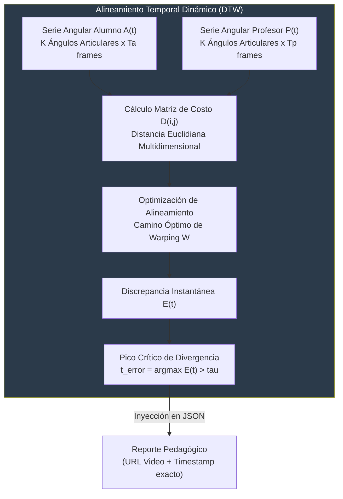

### C. Recalibración Automática del Centroide de Referencia

Para que el sistema aprenda sin intervención humana (requisito del experto del dominio), se implementa un mecanismo de recalibración automática escalonado en tres fases:

*   **Fase 0 (Arranque en Frío, $N = 1$):** El Profesor sube obligatoriamente el Video Semilla de la técnica. Su firma cinemática (promedio de los ángulos articulares a lo largo de la secuencia) se convierte en el centroide inicial $\mathbf{C}_0$. Toda evaluación se compara directamente contra $\mathbf{C}_0$.

*   **Fase 1 (Acumulación y Validación, $1 < N < 10$):** Los alumnos envían videos. Las ejecuciones se comparan contra $\mathbf{C}_0$ mediante distancia coseno sobre las series angulares. Los vectores con similitud ≥ 0.88 quedan registrados en Qdrant, pero no se ejecuta recalibración para evitar la inestabilidad estadística en muestras pequeñas.

*   **Fase 2 (Maduración y Recalibración, $N \ge 10$):** Cuando existen al menos 10 videos con similitud ≥ 0.88, el proceso daemon nocturno recalcula el centroide como el promedio de esos vectores:

$$
\mathbf{C}_{\text{nuevo}} = \frac{1}{N} \sum_{i=1}^{N} \mathbf{v}_i, \quad \text{donde } S_C(\mathbf{v}_i, \mathbf{v}_{\text{semilla}}) \geq 0.88
$$

*Criterio de Anclaje Doctrinal:* El nuevo centroide solo reemplaza al anterior si su similitud coseno con el Video Semilla del profesor se mantiene alta:

$$
S_C(\mathbf{C}_{\text{nuevo}}, \mathbf{v}_{\text{semilla}}) \geq 0.88
$$

*En palabras simples: esta fórmula exige que los movimientos de los alumnos se parezcan al menos 88% al video del profesor para ser aceptados como nuevo estándar.*

Si el nuevo centroide tiene similitud < 0.88 con el video semilla, el sistema alerta al profesor de una desviación técnica colectiva y mantiene intacto el centroide anterior. De este modo, el sistema aprende de las ejecuciones correctas de los alumnos sin perder el anclaje doctrinal del maestro.


**Nota sobre trabajo futuro:** Una versión más avanzada de este mecanismo podría incorporar el algoritmo HDBSCAN (Campello et al., 2013) para agrupar automáticamente las ejecuciones correctas y detectar subgrupos técnicos. Esta capacidad queda documentada como trabajo futuro (Sección 4.2.6) por requerir muestras más grandes para su estabilidad estadística.

### D. Validación de Contenido BJJ con Gemini 2.5 Flash

Para que el sistema pueda diferenciar entre un video de Brazilian Jiu-Jitsu y cualquier otro contenido (requisito del experto del dominio), se implementa un filtro previo al análisis biomecánico:

1.  **Extracción de 3 fotogramas representativos:** Al recibir un video, el sistema extrae el primer fotograma, el fotograma medio y el último fotograma.
2.  **Envío multimodal a Gemini 2.5 Flash:** Los 3 frames se envían a Gemini con el siguiente prompt: *"Responde ESTRICTAMENTE con SÍ o NO. ¿Los 3 fotogramas muestran a personas practicando Brazilian Jiu-Jitsu (gi, tatami, contacto corporal, técnica de grappling)?"*
3.  **Decisión binaria:** Si la respuesta es NO, se rechaza el video y se notifica al alumno. Si es SÍ, se procede al análisis con YOLO26x.

Este mecanismo reemplaza a los filtros estadísticos tradicionales (como MAD) y aprovecha la capacidad multimodal de Gemini para validar el contenido visual antes de consumir recursos de GPU en el análisis biomecánico.

### E. Filtro de Correspondencia con la Técnica Seleccionada

Una vez que el video ha sido validado como BJJ por Gemini, el sistema verifica que el movimiento corresponda a la técnica seleccionada por el alumno. Para ello:

1.  Se calcula la similitud angular entre la serie temporal del alumno y el centroide de la técnica seleccionada.
2.  Si la similitud es inferior a un umbral de dominio $\tau_{\text{técnica}}$ (fijado empíricamente en 0.30 para la fase inicial), el video se descarta automáticamente.
3.  Se notifica al alumno que el video no corresponde a la técnica seleccionada, invitándolo a revisar la técnica del catálogo.

Este filtro evita diagnósticos incorrectos y preserva la integridad de la base de datos de evaluaciones.

### F. Trazabilidad del Frame Exacto con Círculo de Error

Para que el alumno pueda comprender visualmente su error, el sistema implementa un mecanismo de trazabilidad gráfica:

1.  **Identificación del frame crítico:** DTW determina el fotograma del alumno con mayor divergencia angular respecto al profesor.
2.  **Identificación de la articulación crítica:** Se selecciona la articulación con mayor desviación angular en ese fotograma.
3.  **Superposición gráfica:** La PWA superpone un círculo rojo sobre la articulación del alumno en el frame crítico, con un texto indicando el valor de la desviación en grados.
4.  **Comparación lado a lado:** El video del profesor se reproduce sincronizado en el mismo instante para que el alumno pueda comparar visualmente ambas ejecuciones.

## 3.4 Matriz de Riesgos Técnicos y Reducciones Formales

| Riesgo Técnico Identificado | Nivel de Severidad | Probabilidad | Cita / Respaldo | Estrategia de Reducción Arquitectónica |
| :--- | :--- | :--- | :--- | :--- |
| **Interrupción de Sesiones en Google Colab** | Alta | Alta | Especificaciones de Colab | Arquitectura desacoplada basada en el patrón *Adapter*. El servidor central detecta la caída de la conexión. Permite cambiar la dirección a una instancia de respaldo (RunPod o AWS) con una variable de entorno. |
| **Degradación de Confianza de Keypoints por Iluminación** | Alta | Media | Pruebas de campo | **Filtro Estructural (RF-11):** Si la certeza de detección cae por debajo del 85%, el video se rechaza preventivamente. Se solicita al alumno mejorar la iluminación del tatami. |
| **Alucinaciones Doctrinales del LLM** | Crítica | Baja | Doctrinal BJJ Books | **RAG Multimodal Estricto (RF-06/RF-07):** Gemini 2.5 Flash opera con parámetro `temperature=0.1` y recibe contexto verificado de Qdrant. Si no hay chunks relevantes, responde mediante una plantilla determinista. |
| **Restricciones de Licencia AGPL en YOLO26x para SaaS** | Media | Baja | Ultralytics (2026) | Aislamiento del microservicio de visión tras una interfaz de red gRPC/REST independiente. Para producción comercial, se contempla la adquisición de la licencia Enterprise de Ultralytics. |
| **Inestabilidad de Conexión en Tatami** | Media | Alta | Pruebas de campo | Arquitectura PWA con Service Workers que encola los videos localmente en IndexedDB y los reintenta automáticamente al detectar conectividad estable. |
| **Falsos Negativos en Validación BJJ** | Media | Baja | Pruebas de campo | **Ajuste del prompt de Gemini:** Se documenta la tasa de acierto del validador y se ajusta el prompt según retroalimentación del profesor. Si la tasa cae por debajo del 90%, se incorpora un segundo frame de validación. |

---

# Capítulo IV: Definición de requisitos

## 4.1 Introducción

### 4.1.1 Propósito
El propósito de este capítulo es especificar detalladamente los requisitos del sistema para la academia *Corpo e Mente*. Define las necesidades funcionales y de calidad. Se adoptan las prácticas del **Proceso Unificado Ágil**. Los requisitos se clasifican bajo el modelo **FURPS+**. Este documento sirve como guía técnica para los desarrolladores y garantía para el profesor. Además, constituye el marco formal de evaluación para el tribunal.

### 4.1.2 Ámbito del sistema
El producto se denomina formalmente **Sistema Tutorial Biomecánico Inteligente para Corpo e Mente**. El sistema evalúa automáticamente videos de ejercicios individuales (Solo Drills) y prácticas cooperativas en pareja de Brazilian Jiu-Jitsu. La revisión se realiza fuera del horario de clase.

El sistema comprende:
1. Una aplicación web para celulares (PWA, *Progressive Web App*) de fácil acceso para los estudiantes y el profesor.
2. Un servidor central de lógica de negocio (servidor central FastAPI).
3. Un almacén relacional para datos de usuarios y reportes (PostgreSQL).
4. Una base de datos vectorial para recuperación de literatura y patrones de movimiento (Qdrant).
5. Servicios en la nube para detección visual de articulaciones (**YOLO26x-Pose y YOLO26x-Depth**). Incluyen la redacción de diagnósticos pedagógicos mediante Gemini 2.5 Flash.

Límites de exclusión: El sistema no evalúa sparring libre ni competencia. Solo analiza práctica individual y práctica cooperativa en pareja con técnica predefinida. Tampoco busca sustituir la autoridad presencial del profesor en el tatami.

### 4.1.3 Definiciones, acrónimos y abreviaturas
A continuación se presentan los diez términos clave más utilizados a lo largo de este capítulo, explicados en un lenguaje directo y accesible:

| Término / Sigla | Significado y Definición Sencilla |
| :--- | :--- |
| **Actor** | Persona o sistema externo que interactúa con la aplicación (por ejemplo, el alumno o el profesor). |
| **Caso de Uso (CU)** | Secuencia de pasos que un usuario realiza en el sistema para lograr un objetivo concreto del negocio. |
| **FURPS+** | Guía de calidad que clasifica los requisitos en Funcionalidad, Usabilidad, Confiabilidad, Rendimiento, Soporte y Restricciones (+). |
| **Requisito Funcional (RF)** | Función o servicio específico que el software debe ejecutar de manera obligatoria. |
| **Requisito No Funcional (RNF)** | Cualidad o atributo de calidad del sistema (por ejemplo, qué tan rápido, seguro o fácil de usar debe ser). |
| **Gherkin (Given-When-Then)** | Estilo estructurado de redacción para describir pruebas y criterios de aceptación ("Dado que... Cuando... Entonces..."). |
| **JWT (*JSON Web Token*)** | Token seguro que certifica la identidad del usuario una vez que inicia sesión en la aplicación. |
| **SSD (*System Sequence Diagram*)** | Diagrama visual que muestra los mensajes intercambiados en orden cronológico entre el usuario y el sistema. |
| **PWA (*Progressive Web App*)** | Aplicación web diseñada para teléfonos celulares que funciona con la agilidad y aspecto de una aplicación nativa. |
| **JSONB** | Formato de almacenamiento flexible y de alta velocidad para guardar información en la base de datos PostgreSQL. |

*(Para consultar el glosario técnico y metodológico integral del proyecto de investigación, remitirse a la sección inicial del presente documento).*

### 4.1.4 Visión general del documento
El presente capítulo se organiza de acuerdo con el índice oficial de requisitos de la *Guía metodológica institucional para el desarrollo de proyectos de grado en ingeniería de sistemas* de la Universidad Privada de Santa Cruz de la Sierra (UPSA):
*   **4.1 Introducción:** Delimita el propósito, alcance y vocabulario del sistema.
*   **4.2 Descripción general:** Describe el entorno del producto, sus funciones principales, los perfiles de usuario, las restricciones operativas y su evolución futura.
*   **4.3 Requisitos específicos:** Formaliza las interfaces externas, los requisitos funcionales con criterios de aceptación Gherkin y los atributos de calidad FURPS+.
*   **4.4 Identificación de los casos de uso:** Presenta el catálogo de casos de uso del sistema y su trazabilidad con las necesidades del negocio.
*   **4.5 Diagrama de dominio:** Expone el modelo conceptual de clases del negocio siguiendo con rigor metodológico los principios de Craig Larman.

---

## 4.2 Descripción general

### 4.2.1 Perspectiva del producto
El sistema opera como un **asistente tutorial inteligente y autónomo**. No es un software administrativo de gimnasio. Es una herramienta de aprendizaje motriz que complementa las clases del profesor de *Corpo e Mente*. La aplicación permite grabar repeticiones técnicas fuera del aula y recibir correcciones inmediatas. Así resuelve la falta de supervisión individual en clases grupales de 90 minutos.

### 4.2.2 Funciones del Producto
El sistema ofrece un conjunto coordinado de funciones de alto nivel orientadas a optimizar el aprendizaje y la retención deportiva:

1.  **Gestión de Cuentas y Seguridad:** Autenticación segura de usuarios, administración de perfiles y registro de consentimientos informados para practicantes menores de edad.
2.  **Registro de Técnicas Patrón:** Carga obligatoria del video semilla del profesor cinta negra. Este video establece el estándar oficial para cada ejercicio del catálogo.
3.  **Envío de Grabaciones de Alumnos:** Carga ágil desde el teléfono celular de videos cortos (hasta 30 segundos) correspondientes a ejercicios individuales (*Solo Drills*) y prácticas cooperativas en pareja.
4.  **Evaluación Biomecánica Automática:** Detección de 12 puntos articulares del cuerpo en 3D. Incluye comparación angular con DTW y cálculo del grado de coincidencia técnica.
5.  **Generación de Reportes Explicables:** Informe en 4 bloques que detalla errores posturales y el segundo exacto del fallo ($t_{\text{error}}$). Incluye recomendaciones y comparación con el profesor.
6.  **Historial de Progreso Individual:** Visualización cronológica para el alumno de sus puntajes, avances y evolución técnica a lo largo de las semanas.
7.  **Panel de Analítica para el Tatami:** Tablero para el profesor que identifica las debilidades y errores más comunes del grupo. Permite planificar mejor las clases presenciales.
8.  **Mantenimiento Autónomo Nocturno:** Proceso en segundo plano que **recalibra automáticamente el centroide de referencia** y borra videos antiguos a los 30 días.

### 4.2.3 Características de los Usuarios
El sistema interactúa con tres tipos de usuarios con necesidades y habilidades claramente diferenciadas:

*   **Profesor (Instructor Cinta Negra):**
    *   *Perfil y Experiencia:* Experto en Brazilian Jiu-Jitsu, con profundo conocimiento técnico pero con escaso tiempo disponible durante las clases.
    *   *Uso del Sistema:* Requiere una interfaz ágil para registrar videos semilla y manuales oficiales. Permite revisar rápidamente los gráficos de debilidades grupales.
*   **Alumno (Practicante Novato o Intermedio):**
    *   *Perfil y Experiencia:* Alumno novel que asimila posturas complejas de BJJ. Corre riesgo de frustración o abandono si no recibe guía oportuna fuera de clase.
    *   *Uso del Sistema:* Utiliza la aplicación desde su teléfono celular. Requiere enviar sus videos en un máximo de tres toques en pantalla y recibir explicaciones amables, claras y libres de jerga matemática confusa.
*   **Administrador / Técnico del Sistema:**
    *   *Perfil y Experiencia:* Ingeniero o técnico de soporte responsable de la infraestructura.
    *   *Uso del Sistema:* Supervisa los contenedores Docker y el mantenimiento nocturno. Además, verifica el estado de las copias de seguridad de la base de datos.

### 4.2.4 Restricciones
El diseño y desarrollo del sistema están condicionados por las siguientes restricciones:

1.  **Restricciones de Dispositivos:** La aplicación debe funcionar fluidamente en teléfonos inteligentes estándar. No requiere la compra de sensores corporales costosos ni cámaras especiales.
2.  **Restricciones de Multimedia:** Las grabaciones no deben superar los 30 segundos ni 50 MB. Se aceptan formatos MP4 o WebM a 1080p y 30 cuadros por segundo.
3.  **Restricciones del Dominio Deportivo:** La evaluación se circunscribe a ejercicios individuales (Solo Drills) y prácticas cooperativas en pareja con técnica predefinida. Se excluye el sparring libre y la competencia por la oclusión severa (>60%) y la imprevisibilidad del movimiento.
4.  **Restricciones Legales:** Cumplimiento estricto de la protección de datos personales de menores (requiere autorización de los padres). Los archivos de video se borran definitivamente a los 30 días.
5.  **Restricciones de Recursos:** El proyecto se ejecuta en Google Colab (GPU gratuita) y en una computadora personal con Docker. No requiere inversión en infraestructura durante la fase de MVP.

### 4.2.5 Suposiciones y Dependencias
El correcto funcionamiento de la solución se apoya en los siguientes supuestos operativos:

*   **Conectividad a Internet:** Se asume que los usuarios cuentan con acceso a internet (4G/5G o WiFi). Esto permite transmitir las grabaciones y consultar los reportes.
*   **Condiciones de Grabación:** Se asume que el alumno coloca su teléfono en un soporte a 1.20 metros de altura. Se requiere iluminación suficiente para ver el cuerpo completo.
*   **Disponibilidad de Servicios Externos:** El sistema depende de Google Colab Pro para la GPU. También utiliza la API Gemini 2.5 Flash para generar las explicaciones pedagógicas.

### 4.2.6 Requisitos Futuros
De cara a la evolución del sistema más allá de su fase de validación universitaria (MVP), se contemplan las siguientes capacidades:

1.  **Análisis de Sparring Libre y Competencia:** Incorporar algoritmos avanzados de visión multi-persona con modelos de reconstrucción corporal basados en múltiples cámaras sincronizadas para analizar combates completos.
2.  **Análisis en Tiempo Real (*Streaming*):** Proveer retroalimentación auditiva y visual inmediata durante la ejecución del movimiento a través de la cámara en vivo del teléfono.
3.  **Integración con Dispositivos Vestibles (*Wearables*):** Conectar pulseras o bandas cardíacas. Permitirá cruzar la precisión biomecánica con la fatiga muscular y el esfuerzo del alumno.
4.  **Expansión del Catálogo Deportivo:** Adaptar el proceso por etapas para evaluar proyecciones tradicionales de Judo, defensas contra agarres y programas de defensa personal femenina.
5.  **Agrupamiento Adaptativo de Ejecuciones (HDBSCAN):** Incorporar el algoritmo HDBSCAN (Campello et al., 2013) para agrupar automáticamente las ejecuciones correctas y detectar subgrupos técnicos cuando la muestra supere los 25 videos por técnica.

---

## 4.3 Requisitos Específicos

### 4.3.1 Interfaces Externas

#### 4.3.1.1 Software
*   **API REST del Servidor central (FastAPI):** Expone puntos de entrada seguros bajo HTTPS. Permite autenticar usuarios, subir archivos de video y consultar reportes en formato JSON.
*   **API Gemini 2.5 Flash (Google Cloud):** Servicio de inteligencia artificial generativa. Recibe las desviaciones articulares y los textos de manuales para redactar el informe pedagógico en lenguaje simple.
*   **Base de Datos Vectorial Qdrant:** Servicio para indexar y buscar vectores de movimiento corporal. También gestiona la búsqueda rápida de fragmentos de libros oficiales de BJJ.
*   **Túnel Seguro Ngrok Pro:** Canal cifrado que expone la API de análisis automático de Google Colab. Conecta la GPU remota con el servidor central local de FastAPI.
*   **Base de Datos Relacional PostgreSQL:** Sistema gestor que asegura la consistencia, integridad transaccional y custodia de datos de usuarios, técnicas, evaluaciones y bitácoras.

#### 4.3.1.2 Hardware
*   **Teléfono Celular Inteligente:** Dispositivo móvil Android o iOS del alumno o profesor. Requiere cámara con grabación a 1080p y 30 cuadros por segundo.
*   **Trípode Físico con Rótula Antivibración:** Soporte mecánico regulable ubicado al borde del tatami a 1.20 metros de altura. Evita movimientos bruscos de cámara durante la grabación.
*   **Servidor con Tarjeta Gráfica en la Nube (Google Colab Pro):** Instancia con GPU dedicada (NVIDIA T4 o V100 con 16 GB de VRAM). Procesa las redes neuronales **YOLO26x-Pose y YOLO26x-Depth**.
*   **Servidor Local / Computadora de Desarrollo:** Equipo donde se ejecutan los contenedores de Docker con FastAPI, PostgreSQL y Qdrant.

---

### 4.3.2 Requisitos funcionales

Los requisitos funcionales detallan las acciones directas que el software debe realizar, estructurados con sus criterios formales de aceptación bajo el estándar Gherkin (Given-When-Then):

| ID | Requisito Funcional | Criterio de Aceptación Formal (Gherkin / Given-When-Then) | Trazabilidad |
| :--- | :--- | :--- | :--- |
| **RF-01** | Inicializar Técnica Patrón con Video Semilla Obligatorio. | **Dado que** un Profesor está autenticado en el sistema. **Cuando** registra una nueva técnica en el catálogo. **Entonces** el sistema exige adjuntar obligatoriamente el video semilla del profesor antes de permitir guardar la técnica. | CU-01 |
| **RF-02** | Extracción y Normalización de Puntos Corporales en 3D. | **Dado que** se procesa un video de técnica patrón. **Cuando** la GPU remota ejecuta YOLO26x-Pose + YOLO26x-Depth. **Entonces** extrae los keypoints articulares en coordenadas (X, Y, Z) centradas en la cadera (*root-relative*) y las guarda en la base de datos. | CU-01 |
| **RF-03** | Envío de Grabaciones de Drills desde la PWA. | **Dado que** un Alumno está en la aplicación web móvil. **Cuando** selecciona una técnica del catálogo y sube una grabación de hasta 30 segundos (Solo Drill o práctica en pareja) en formato MP4 o WebM. **Entonces** el sistema la recibe y le asigna un número de evaluación único. | CU-02 |
| **RF-04** | Validación de Contenido BJJ con Gemini. | **Dado que** se recibe un video del alumno. **Cuando** se extraen 3 fotogramas representativos (inicio, medio, fin) y se envían a Gemini 2.5 Flash. **Entonces** el modelo responde SÍ o NO sobre si el contenido corresponde a Brazilian Jiu-Jitsu. Si es NO, se rechaza el video. Si es SÍ, se procede al análisis. | CU-02, CU-07 |
| **RF-05** | Extracción del Esqueleto 3D del Alumno. | **Dado que** un video fue validado como BJJ. **Cuando** se envía a la GPU remota. **Entonces** YOLO26x-Pose + YOLO26x-Depth devuelven los keypoints tridimensionales del alumno (X, Y, Z) normalizados en espacio *root-relative*. | CU-02 |
| **RF-06** | Cálculo de Coincidencia Angular. | **Dado que** se tienen las series angulares del alumno y del profesor. **Cuando** se comparan matemáticamente. **Entonces** el sistema calcula el porcentaje exacto de coincidencia técnica (de 0 a 100%) mediante promedio ponderado de desviaciones angulares. | CU-02 |
| **RF-07** | Búsqueda de Consejos Doctrinales ante Errores. | **Dado que** el puntaje del alumno no alcanza el nivel de aprobación. **Cuando** se detectan las articulaciones mal colocadas. **Entonces** el sistema busca en Qdrant los textos del manual oficial que enseñan a corregir esa falla. | CU-02 |
| **RF-08** | Redacción del Reporte Pedagógico en 4 Bloques. | **Dado que** se conocen las articulaciones con error y los textos del manual oficial. **Cuando** Gemini redacta el informe. **Entonces** genera un texto claro en 4 bloques (Análisis Postural, Riesgo de Lesión, Guía Paso a Paso, Resumen) con esquema JSON verificado. | CU-02 |
| **RF-09** | Identificación del Fotograma con Mayor Error (DTW). | **Dado que** el algoritmo DTW compara la serie angular del alumno con la del profesor. **Cuando** encuentra el punto de mayor diferencia angular. **Entonces** extrae el segundo exacto ($t_{\text{error}}$) para mostrarlo en el video. | CU-02 |
| **RF-10** | Visualización Gráfica del Error con Círculo. | **Dado que** se identificó el frame crítico. **Cuando** el sistema genera el reporte. **Entonces** la PWA superpone un círculo rojo sobre la articulación del alumno con mayor desviación y muestra el video del profesor sincronizado en ese mismo frame. | CU-02 |
| **RF-11** | Selección Manual de Rol en Video en Pareja. | **Dado que** un Alumno sube un video con dos personas. **Cuando** YOLO26x detecta dos esqueletos. **Entonces** la PWA muestra el primer fotograma con ambos esqueletos numerados (Persona 1 y Persona 2) y solicita al alumno seleccionar cuál es él. El sistema rastrea ese esqueleto durante todo el video. | CU-02 |
| **RF-12** | Rechazo por Oclusión Excesiva en Pareja. | **Dado que** se procesa un video en pareja. **Cuando** más del 40% de los puntos del alumno quedan ocluidos durante más del 30% de la secuencia. **Entonces** el sistema rechaza el video y solicita regrabarlo en otro ángulo. | CU-02 |
| **RF-13** | Filtro de Correspondencia con la Técnica Seleccionada. | **Dado que** un video ya fue validado como BJJ por Gemini. **Cuando** el movimiento tiene una similitud angular con el video semilla inferior al umbral de dominio (0.30 en fase inicial). **Entonces** se descarta automáticamente y se notifica al alumno que el video no corresponde a la técnica seleccionada. | CU-02 |
| **RF-14** | Control de Calidad Visual del Video ($\ge 85\%$). | **Dado que** la GPU analiza el video del alumno. **Cuando** la certeza promedio al detectar los keypoints es inferior al 85%. **Entonces** se rechaza la evaluación solicitando al usuario grabar con mejor luz. | CU-02 |
| **RF-15** | Respuesta Directa ante Ejecución Excelente. | **Dado que** el alumno ejecuta el movimiento de forma óptima superando el límite de aprobación. **Cuando** se confirma la buena técnica. **Entonces** el sistema omite búsquedas complejas y entrega una felicitación formal inmediata. | CU-02 |
| **RF-16** | Control de Acceso Seguro mediante Tokens JWT. | **Dado que** un usuario ingresa su correo y contraseña correctos. **Cuando** el sistema valida su cuenta. **Entonces** le entrega un token seguro que le permite usar la aplicación durante 60 minutos sin reescribir su clave. | CU-01, CU-02 |
| **RF-17** | Incorporación de Libros y Manuales Oficiales al Sistema. | **Dado que** el Profesor cuenta con permisos de administrador. **Cuando** sube un libro o reglamento en PDF. **Entonces** el sistema divide el texto en fragmentos con solapamiento, los convierte en vectores de 2048 dimensiones con Qwen3-VL-Embedding-2B y los guarda en Qdrant. | CU-05 |
| **RF-18** | Control de Fila para Evaluaciones Simultáneas. | **Dado que** varios alumnos suben videos al mismo tiempo. **Cuando** se alcanzan 5 evaluaciones simultáneas en proceso. **Entonces** las siguientes se colocan en una lista de espera ordenada sin saturar el servidor. | CU-02 |
| **RF-19** | Consulta de Historial de Alumno. | **Dado que** un Alumno inicia sesión en la aplicación. **Cuando** ingresa a su perfil personal. **Entonces** puede ver la lista ordenada de sus evaluaciones pasadas, sus calificaciones y gráficos de mejora técnica. | CU-03 |
| **RF-20** | Panel de Analítica para el Profesor. | **Dado que** un Profesor accede a su panel de control. **Cuando** selecciona una técnica del catálogo. **Entonces** observa un mapa visual con los errores corporales más comunes de sus alumnos y estadísticas de asistencia. | CU-04 |
| **RF-21** | Recalibración Automática del Centroide de Referencia. | **Dado que** existen al menos 10 videos de alumnos con similitud ≥ 0.88 respecto al video semilla. **Cuando** se ejecuta el mantenimiento nocturno. **Entonces** el sistema recalcula el centroide como el promedio de esos vectores y lo usa como nuevo estándar de comparación. Si la similitud del nuevo centroide con el video semilla cae por debajo de 0.88, mantiene el centroide anterior y alerta al profesor. | CU-08 |
| **RF-22** | Eliminación Automática de Videos a los 30 Días. | **Dado que** los videos de los alumnos cumplen 30 días de antigüedad en el servidor. **Cuando** se ejecuta el mantenimiento nocturno. **Entonces** se borran físicamente los archivos de video conservando solo las calificaciones y notas. | CU-06 |
| **RF-23** | Detección de Videos Duplicados. | **Dado que** se sube un nuevo archivo de video. **Cuando** el sistema revisa su firma digital. **Entonces** evita procesar dos veces el mismo video y descarta intentos de copia entre cuentas distintas. | CU-02 |
| **RF-24** | Validación de Contenido BJJ (ver RF-04). | *(Requisito consolidado en RF-04. Se mantiene este identificador para trazabilidad con el Capítulo III).* | CU-07 |

---

### 4.3.3 Requisitos de Rendimiento

*   **RP-01 (Tiempo de Entrega $\le 180$ s):** El tiempo total entre subir el video y ver el reporte debe ser menor a 180 segundos. Esta meta se exige para el 95% de los casos.
    *   *Desglose por etapas:* Subida del video y validación ($\le 15$ s). Detección de articulaciones en GPU ($\le 80$ s). Cálculo DTW y búsqueda Qdrant ($\le 25$ s). Redacción por Gemini ($\le 35$ s). Transmisión de red móvil ($\le 25$ s).
*   **RP-02 (Capacidad de Procesamiento en Fila):** El sistema debe soportar hasta 5 evaluaciones simultáneas en cola. Esto debe lograrse sin colapsar la memoria del servidor local ni perder solicitudes.
*   **RP-03 (Calidad de Detección Articular):** El modelo de visión artificial debe alcanzar una certeza media superior al 85%. Esta precisión aplica al detectar los 12 puntos corporales bajo iluminación de gimnasio.

---

### 4.3.4 Restricciones de Diseño

*   **Arquitectura Desacoplada en Cinco Capas:** El software se organiza en cinco capas independientes: Presentación, Aplicación, Servicios Transversales (Pure Fabrication), Dominio e Infraestructura. La lógica de negocio no depende de pantallas, servicios remotos ni bases de datos específicas.
*   **Patrones de Asignación GRASP:** Cada clase u objeto se diseña siguiendo los patrones GRASP. Se aplican *Controlador, Creador, Alta Cohesión y Bajo Acoplamiento* para lograr un código ordenado.
*   **Diseño de Base de Datos en Tercera Forma Normal (3FN):** Las tablas de la base de datos relacional se estructuran sin redundancias de información. Se asegura una integridad referencial estricta.
*   **Principio de Fallo Seguro (*Fail-Safe*):** Si Gemini tarda más de 30 segundos, el sistema emite un reporte técnico numérico basado en DTW. Así se evita mostrar pantallas de error rotas al alumno.

---

### 4.3.5 Atributos del Sistema

Consolidación de los requisitos de calidad del sistema clasificados bajo el modelo FURPS+:

#### Atributos de Usabilidad (U - Usability)
*   **RU-01 (Diseño Adaptable a Celulares):** La aplicación web progresiva se adapta a teléfonos de cualquier marca. Permite subir una grabación en un máximo de tres toques sobre la pantalla.
*   **RU-02 (Legibilidad y Alto Contraste):** La interfaz cumple las normas de accesibilidad visual WCAG 2.1 nivel AA. Los textos y botones se leen con claridad bajo iluminación variable de gimnasio.
*   **RU-03 (Facilidad de Aprendizaje en $<5$ minutos):** Un practicante nuevo debe ser capaz de enviar su primera grabación en menos de 5 minutos. El proceso no requiere asistencia técnica de otra persona.

#### Atributos de Confiabilidad (R - Reliability)
*   **RR-01 (Mecanismo de Respaldo ante Fallas):** Si se pierde la conexión a internet, la aplicación conserva el video en la memoria del teléfono. Luego reintenta el envío de manera automática al recuperar la señal.
*   **RR-02 (Disponibilidad en Entrenamiento):** La aplicación debe operar sin fallas al menos el 98% del tiempo nocturno (de 19:00 a 23:00 horas).
*   **RR-03 (Consistencia de Datos Transaccionales):** Toda modificación en la base de datos debe ser atómica (se guarda completa o no se guarda nada). Esto evita registros a medias o archivos huérfanos.

#### Atributos de Mantenibilidad y Soporte (S - Supportability)
*   **RS-01 (Empaquetado en Contenedores Docker):** El servidor central FastAPI, PostgreSQL y Qdrant se ejecutan en contenedores aislados mediante Docker Compose. Esto asegura un entorno reproducible y estable.
*   **RS-02 (Registro de Eventos y Errores):** Cada acción y error del sistema se registra en una bitácora (*log*) en formato JSON. Incluye fecha, hora y código para corregir cualquier falla con rapidez.
*   **RS-03 (Modularidad):** La estructura del código permite sustituir el modelo de lenguaje o la base de datos sin alterar la evaluación biomecánica.
*   **RS-04 (Copias de Seguridad Diarias):** El sistema genera un respaldo automático de la base de datos todas las noches. Esto garantiza no perder más de 24 horas de actividad ante cualquier imprevisto.

#### Atributos de Seguridad Integral (+ - Security)
*   **RSec-01 (Conexión Cifrada con HTTPS):** La información circula por canales encriptados con certificados vigentes entre el teléfono, el servidor y la nube.
*   **RSec-02 (Protección de Contraseñas con PBKDF2-HMAC-SHA256):** Las contraseñas de los usuarios jamás se guardan en texto claro. Se protegen con la función criptográfica PBKDF2-HMAC-SHA256 con 200,000 iteraciones, implementada en la capa de dominio.
*   **RSec-03 (Inspección de Archivos contra Amenazas):** El servidor analiza el encabezado binario de cada video recibido para comprobar su autenticidad (MP4 o WebM). Descarta de inmediato archivos sospechosos o alterados.
*   **RSec-04 (Límite de Peticiones para Evitar Bloqueos):** El sistema restringe a un máximo de 10 peticiones por minuto por usuario. Esto evita saturaciones del servidor o ataques automáticos de contraseñas.

---

## 4.4 Identificación de los casos de uso

Los casos de uso se definen **pensando en lo que el usuario quiere lograr** (*User-Goal Level*). Capturan las interacciones concretas que aportan valor a la academia *Corpo e Mente*:

| Código | Actor Primario | Nombre del Caso de Uso | Requisitos Trazados | Objetivo de Negocio y Beneficio |
| :--- | :--- | :--- | :--- | :--- |
| **CU-01** | Profesor | **Registrar Técnica Patrón** | RF-01, RF-02, RF-16 | Establecer el video semilla del profesor como estándar oficial de movimiento para un drill. |
| **CU-02** | Alumno | **Evaluar Ejecución Biomecánica** | RF-03 a RF-15, RF-18, RF-23 | Analizar el video del alumno, detectar errores articulares y generar el reporte explicable. |
| **CU-03** | Alumno | **Consultar Historial de Progreso** | RF-19, RF-16 | Permitir al alumno revisar sus evaluaciones pasadas y comprobar su avance técnico en el tiempo. |
| **CU-04** | Profesor | **Visualizar Analítica de Tatami** | RF-20, RF-16 | Descubrir qué movimientos le cuestan más al grupo para planificar mejor las clases presenciales. |
| **CU-05** | Profesor | **Indexar Literatura Oficial al RAG** | RF-17, RF-16 | Incorporar manuales oficiales y libros doctrinarios de BJJ a la base de conocimiento de la IA. |
| **CU-06** | Sistema (Daemon) | **Ejecutar Mantenimiento Autónomo** | RF-22 | Borrar videos de más de 30 días y liberar espacio en disco. |
| **CU-07** | Sistema (Automático) | **Validar Contenido BJJ** | RF-04 | Filtrar videos que no correspondan a Brazilian Jiu-Jitsu antes de consumir recursos de YOLO26x. |
| **CU-08** | Sistema (Daemon Nocturno) | **Recalibrar Centroide Automáticamente** | RF-21 | Permitir que el sistema aprenda de las ejecuciones correctas de los alumnos sin intervención humana. |

---

## 4.5 Diagrama de dominio
El modelo de dominio representa las clases conceptuales del mundo real presentes en el aprendizaje de Jiu-Jitsu Brasileño, siguiendo con estricto rigor metodológico los principios de Craig Larman (*Applying UML and Patterns*). Como modelo puramente conceptual de análisis, funciona como un vocabulario visual del dominio: no incluye métodos u operaciones, no modela claves foráneas ni artefactos de software, y sus atributos se expresan de forma simple por su nombre significativo en el mundo real, sin asociar tipos de datos primitivos (como texto, enteros o decimales).

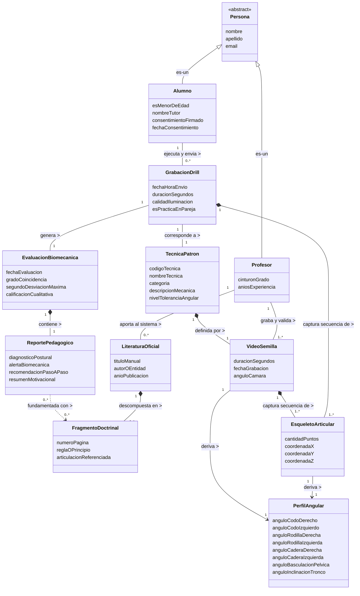

**Diagrama 4.1:** Diagrama del Modelo de Dominio Conceptual del Sistema. *Fuente: Elaboración propia basada en los estándares del Proceso Unificado.*


---

# Capítulo V: Análisis y Diseño Orientado a Objetos

## 5.1 Introducción al Análisis y Diseño

La fase de Análisis y Diseño en el Proceso Unificado Ágil (Larman, 2005) tiene como propósito transformar los requisitos definidos en el Capítulo IV en un modelo arquitectónico y de diseño robusto, aplicando los patrones GRASP para la asignación de responsabilidades y los patrones GoF para las soluciones de diseño recurrentes.

Siguiendo la filosofía de Larman (*"do the right thing"* para análisis, *"do the thing right"* para diseño), este capítulo presenta:

1. La **arquitectura lógica** del sistema en cinco capas.
2. Los **Diagramas de Secuencia del Sistema (SSD)** para los 8 casos de uso identificados en el Capítulo IV.
3. Los **Contratos de Operación** para las operaciones críticas.
4. El **Diagrama de Clases de Diseño (DCD)** con tipos, visibilidad y navegabilidad.
5. Las **Realizaciones de Casos de Uso** mediante diagramas de interacción.
6. La aplicación formal de **Patrones GRASP y GoF**.
7. El **Diagrama de Paquetes** y el **Diagrama de Despliegue**.
8. La **Matriz de Trazabilidad** CU → Controlador → Endpoint → Repositorio.

Todos los nombres de clases, interfaces y métodos corresponden a la implementación real del sistema descrita en el Capítulo III y verificable en el repositorio de código fuente.

## 5.2 Arquitectura Lógica del Sistema

### 5.2.1 Justificación de la Arquitectura en Capas

Para gestionar la complejidad del sistema y aislar los cambios tecnológicos (por ejemplo, la sustitución de YOLO26x por otro modelo de pose, o la migración de Qdrant a otro motor vectorial), se adopta el patrón arquitectónico **Layers** (Buschmann et al., 1996), recomendado por Larman como la estructura lógica fundamental para sistemas de información.

El sistema se organiza en **cinco capas lógicas**, cada una con una responsabilidad cohesiva y un acoplamiento descendente:

| Capa | Paquete en código | Responsabilidad principal | Ejemplos de clases |
| :--- | :--- | :--- | :--- |
| **1. Presentación** | `src/presentation/` + `frontend/` | Interfaz PWA, captura de video, visualización de reportes | `index.html`, `app.js`, `service-worker.js`, `api.py` (rutas HTTP) |
| **2. Aplicación** | `src/application/` | Orquestación de casos de uso, validación de entrada, DTOs | `EvaluacionController`, `RegistrarTecnicaController`, `ProfesorController`, `TecnicaController`, `FuenteController`, `AuthController` |
| **3. Servicios Transversales (Pure Fabrication)** | `src/services/` | Orquestación RAG, fragmentación semántica, síntesis pedagógica | `SintesisPedagogicaService`, `ChunkerSemanticoBJJ` |
| **4. Dominio** | `src/domain/` | Entidades conceptuales, lógica biomecánica pura, contratos (interfaces) | `MatrizEsqueletica`, `Punto3D`, `CalculadoraBiomecanica`, `DesviacionArticular`, `TecnicaPatron`, `Profesor`, `FuenteConocimiento`, `ConfiguracionRAG`, `Usuario` |
| **5. Infraestructura** | `src/infrastructure/` | Adaptadores a recursos externos (GPU Colab, Gemini, Qdrant, PostgreSQL) | `AdaptadorYOLO`, `ColabYOLOAdapter`, `GeminiServiceAdapter`, `AdaptadorGemini`, `QwenEmbeddingAdapter`, `QdrantAdapter`, `PostgresHistorialRepository`, `PostgresTecnicaRepository`, `PostgresProfesorRepository`, `PostgresFuenteConocimientoRepository`, `PostgresUsuarioRepository`, `PipelineIngestaRAG` |

**Regla de dependencia:** Las capas superiores dependen de las inferiores, pero **nunca al revés**. La capa de Dominio no conoce a Infraestructura; ambas se comunican a través de las interfaces abstractas definidas en `src/domain/interfaces.py` (patrón **Dependency Inversion**).

### 5.2.2 Diagrama de Paquetes de la Arquitectura Lógica

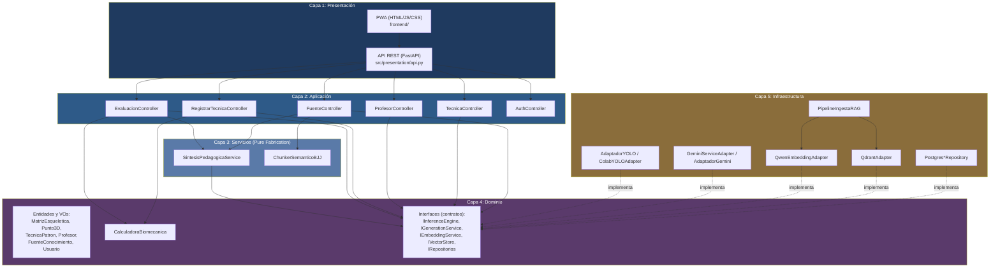

**Figura 5.1:** Arquitectura lógica en 5 capas del Sistema Tutorial Biomecánico Inteligente. *Fuente: Elaboración propia (2026).*

### 5.2.3 Justificación de la Capa de Servicios Transversales

La capa de Servicios existe como una **Pure Fabrication** (GRASP) para resolver un problema de diseño: `EvaluacionController` necesitaba coordinar la búsqueda RAG y la síntesis pedagógica, pero hacerlo directamente incrementaba su complejidad y rompía la Alta Cohesión. Se extrajo esa responsabilidad a `SintesisPedagogicaService`, que ahora es el único punto de orquestación del subsistema RAG. Esta decisión está documentada en `src/services/__init__.py` y validada por las pruebas `tests/test_sintesis_pedagogica.py`.

## 5.3 Diagramas de Secuencia del Sistema (SSD)

El SSD modela la interacción entre los actores externos y el sistema, tratándolo como una "caja negra". Larman recomienda crear un SSD para el escenario de éxito principal de cada caso de uso. A continuación se presentan los 8 SSDs correspondientes a los casos de uso definidos en la Sección 4.4.

### 5.3.1 SSD del CU-01: Registrar Técnica Patrón

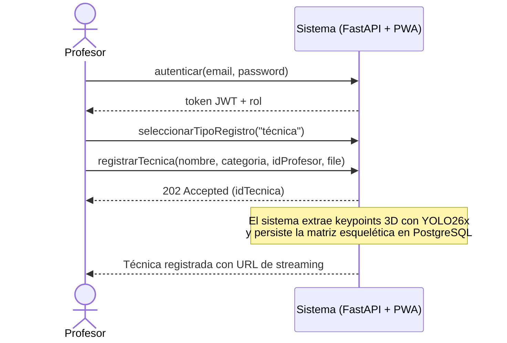

### 5.3.2 SSD del CU-02: Evaluar Ejecución Biomecánica

Este es el caso de uso central del negocio. El SSD se modela en dos variantes: (a) Solo Drill individual y (b) Práctica cooperativa en pareja.

**Variante A — Solo Drill individual:**

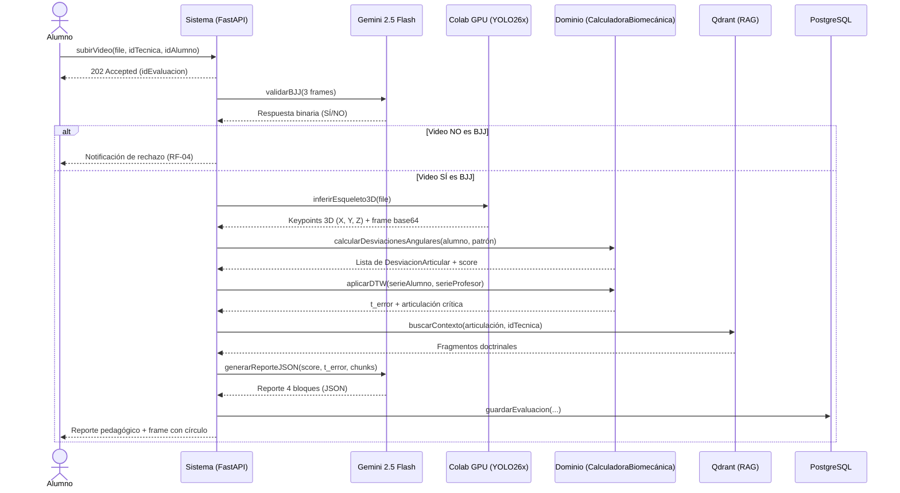

> **Nota de implementación:** El método `validarBJJ` corresponde al requisito RF-04 documentado en el Capítulo IV y forma parte del diseño arquitectónico propuesto. Su implementación en el adaptador `GeminiServiceAdapter` se planifica para la siguiente iteración de desarrollo.

**Variante B — Práctica cooperativa en pareja:**

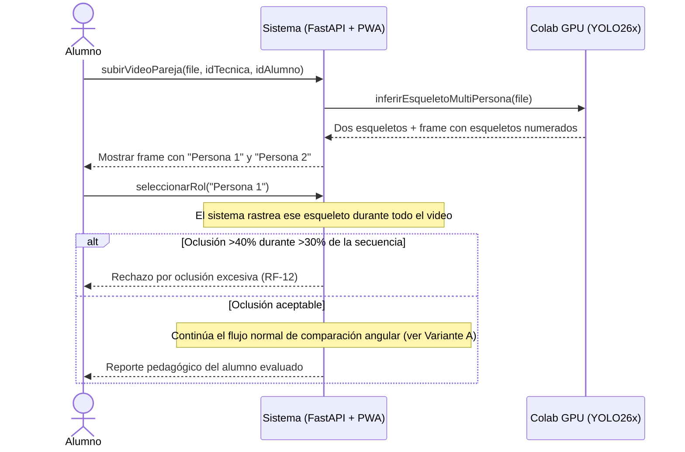

### 5.3.3 SSD del CU-03: Consultar Historial de Progreso

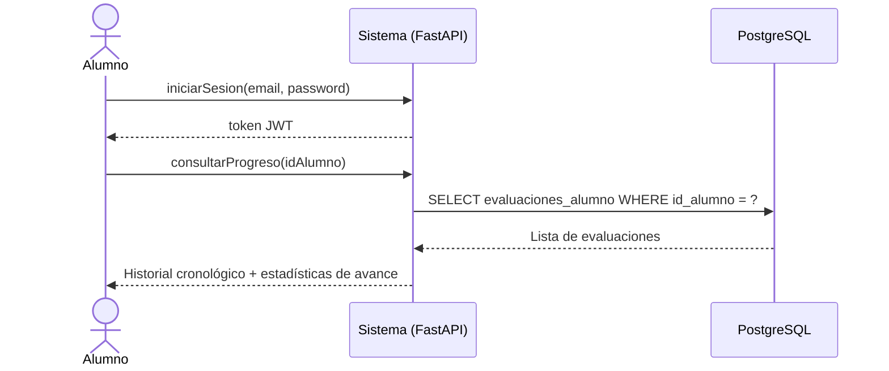

### 5.3.4 SSD del CU-04: Visualizar Analítica de Tatami

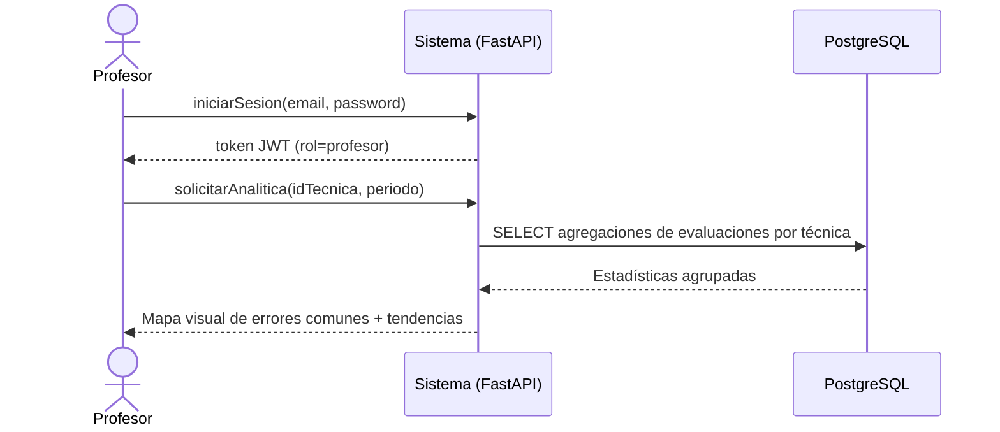

### 5.3.5 SSD del CU-05: Indexar Literatura Oficial al RAG

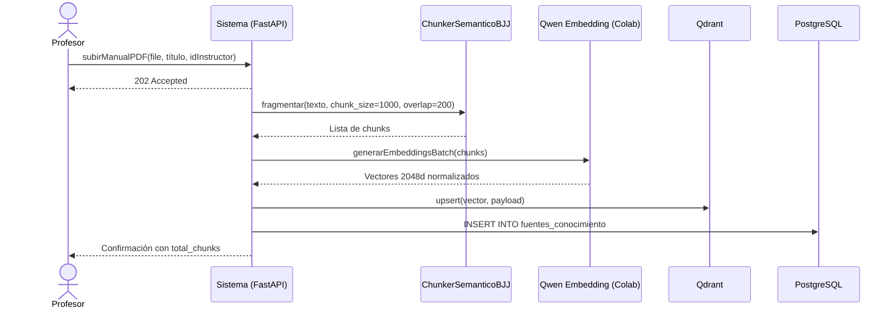

### 5.3.6 SSD del CU-06: Ejecutar Mantenimiento Autónomo

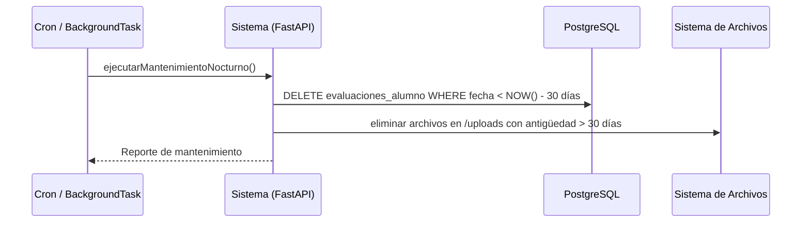

### 5.3.7 SSD del CU-07: Validar Contenido BJJ

Este SSD representa la validación previa al análisis biomecánico (RF-04/RF-24).

> **Nota de implementación:** La validación de contenido BJJ mediante Gemini (RF-04/RF-24) es un requisito documentado en el Capítulo IV y forma parte del diseño arquitectónico propuesto. Su implementación en el adaptador `GeminiServiceAdapter` se planifica para la siguiente iteración de desarrollo.

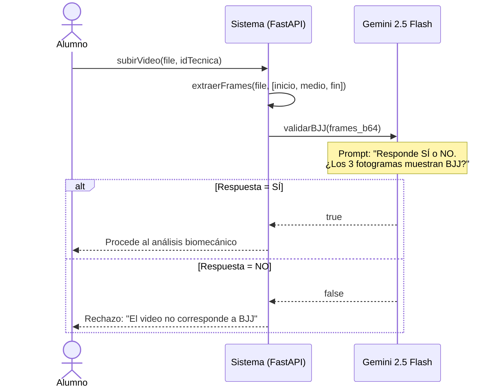

### 5.3.8 SSD del CU-08: Recalibrar Centroide Automáticamente

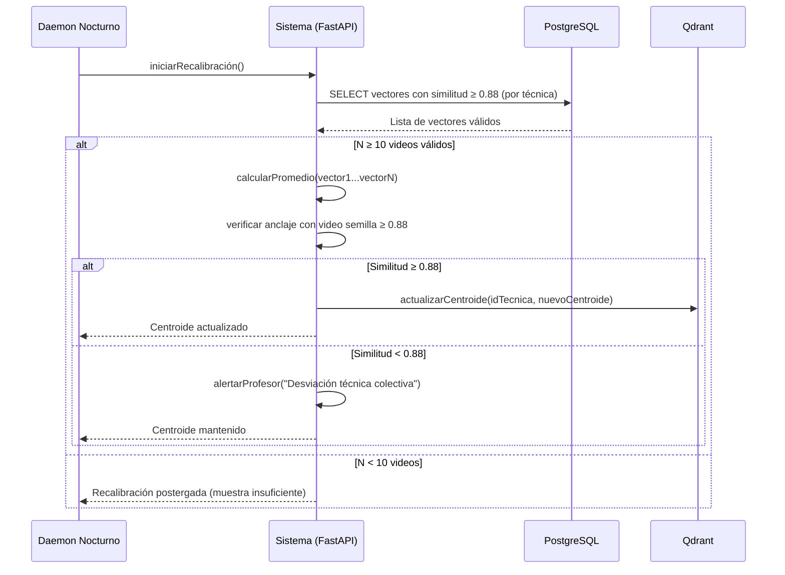

## 5.4 Contratos de Operación

Los contratos de operación (Larman, Cap. 13) describen el resultado de ejecutar una operación del sistema en términos de cambios de estado sobre los objetos del dominio. Se utilizan **postcondiciones declarativas** (en pasado) en lugar de algoritmos. A continuación se presentan los contratos para las operaciones más complejas.

### 5.4.1 Contrato CO-01: registrarTecnica

| Sección | Contenido |
| :--- | :--- |
| **Operación** | `registrarTecnica(nombre: String, categoria: String, idProfesor: String, video: File)` |
| **Referencias** | CU-01 (Registrar Técnica Patrón), RF-01, RF-02 |
| **Precondiciones** | El Profesor está autenticado con rol `profesor`. El video tiene formato MP4 o WebM y pesa menos de 50 MB. |
| **Postcondiciones** | 1. Se creó una instancia `tp` de `TecnicaPatron` (creación de instancia).<br/>2. `tp.id_tecnica` se generó de forma única.<br/>3. `tp.nombre`, `tp.categoria`, `tp.id_profesor` fueron inicializados.<br/>4. Se creó una instancia `ms` de `MatrizEsqueletica` a partir de la inferencia de `AdaptadorYOLO` sobre el video (creación de instancia).<br/>5. `ms` fue asociada a `tp` (asociación formada).<br/>6. `tp.video_url` apunta al archivo persistido en `data/media/patron_videos/` (modificación de atributo).<br/>7. `tp` fue persistida en PostgreSQL mediante `PostgresTecnicaRepository` (asociación con repositorio). |

### 5.4.2 Contrato CO-02: evaluarEjecucion

| Sección | Contenido |
| :--- | :--- |
| **Operación** | `evaluarEjecucion(video_path: String, id_tecnica: String, id_alumno: String) → EvaluacionDTO` |
| **Referencias** | CU-02 (Evaluar Ejecución Biomecánica), RF-03 a RF-10, RF-13 a RF-15, RF-18 |
| **Precondiciones** | El Alumno está autenticado. La técnica `id_tecnica` existe en el catálogo. *(Deseable: el video fue previamente validado como BJJ por Gemini — RF-04, pendiente de implementación en `GeminiServiceAdapter`.)* |
| **Postcondiciones** | 1. Se creó una instancia `ev` de `EvaluacionBiomecanica` (creación de instancia).<br/>2. `ev.gradoCoincidencia` fue calculado por `CalculadoraBiomecanica` (modificación de atributo).<br/>3. Se creó una lista `desviaciones` de instancias `DesviacionArticular` (creación de instancia).<br/>4. Cada `d ∈ desviaciones` fue asociada a `ev` (asociación formada).<br/>5. `ev.segundoDesviacionMaxima` ($t_{error}$) fue calculado por DTW (modificación de atributo).<br/>6. Se creó una instancia `rp` de `ReportePedagogico` mediante `GeminiServiceAdapter` (creación de instancia).<br/>7. `rp` contiene las 4 claves obligatorias (análisis postural, riesgo de lesión, paso a paso, resumen ejecutivo).<br/>8. `ev` fue persistida en `evaluaciones_alumno` con `consejo_pedagogico` en formato JSONB (asociación con `PostgresHistorialRepository`).<br/>9. Se generó un frame anotado con círculo rojo sobre la articulación crítica. |

### 5.4.3 Contrato CO-03: validarContenidoBJJ

| Sección | Contenido |
| :--- | :--- |
| **Operación** | `validarContenidoBJJ(video: File) → Boolean` |
| **Referencias** | CU-07 (Validar Contenido BJJ), RF-04, RF-24 |
| **Precondiciones** | El video tiene duración ≤ 30 segundos. |
| **Postcondiciones** | 1. Se extrajeron 3 fotogramas representativos `f_inicio`, `f_medio`, `f_fin` del video (creación de instancia).<br/>2. Los 3 fotogramas fueron enviados a `GeminiServiceAdapter` con prompt de validación BJJ (`validarBJJ()` — pendiente de implementación).<br/>3. El sistema recibió una respuesta binaria `r ∈ {SÍ, NO}`.<br/>4. Si `r = NO`, la evaluación fue rechazada y no se creó ninguna `EvaluacionBiomecanica`.<br/>5. Si `r = SÍ`, el flujo continuó hacia `evaluarEjecucion`. |

### 5.4.4 Contrato CO-04: indexarManual

| Sección | Contenido |
| :--- | :--- |
| **Operación** | `indexarManual(idInstructor: String, titulo: String, textoCompleto: String) → List[String]` |
| **Referencias** | CU-05 (Indexar Literatura Oficial al RAG), RF-17 |
| **Precondiciones** | El texto extraído del PDF tiene ≥ 50 caracteres. El Profesor está autenticado. |
| **Postcondiciones** | 1. Se creó una lista `chunks` mediante `ChunkerSemanticoBJJ.fragmentar()` (creación de instancia).<br/>2. Se generó un `id_documento` único (modificación de atributo).<br/>3. Para cada `chunk`, se generó un vector $v \in \mathbb{R}^{2048}$ mediante `QwenEmbeddingAdapter` (creación de instancia).<br/>4. Cada `v` fue indexado en la colección `bjj_knowledge` de Qdrant con su payload correspondiente (asociación formada).<br/>5. Se insertó una fila en `fuentes_conocimiento` por cada chunk con `id_documento` común (asociación con `PostgresFuenteConocimientoRepository`). |

### 5.4.5 Contrato CO-05: recalibrarCentroide

| Sección | Contenido |
| :--- | :--- |
| **Operación** | `recalibrarCentroide(idTecnica: String) → Boolean` |
| **Referencias** | CU-08 (Recalibrar Centroide Automáticamente), RF-21 |
| **Precondiciones** | Existen al menos 10 videos de alumnos con similitud ≥ 0.88 respecto al video semilla de `idTecnica`. |
| **Postcondiciones** | 1. Se calculó el promedio $\mathbf{C}_{\text{nuevo}}$ de los vectores válidos (modificación de atributo).<br/>2. Se calculó $S_C(\mathbf{C}_{\text{nuevo}}, \mathbf{v}_{\text{semilla}})$.<br/>3. Si $S_C \geq 0.88$, el centroide activo de la técnica fue actualizado a $\mathbf{C}_{\text{nuevo}}$ (modificación de atributo).<br/>4. Si $S_C < 0.88$, el centroide anterior se mantuvo y se generó una alerta `alerta` para el Profesor (creación de instancia). |

## 5.5 Diagrama de Clases de Diseño (DCD)

A diferencia del Modelo de Dominio Conceptual (Sección 4.5), el **Diagrama de Clases de Diseño** incluye tipos de datos, visibilidad, métodos y navegabilidad. Los nombres de clases corresponden a la implementación real del sistema.

### 5.5.1 DCD: Subsistema de Evaluación Biomecánica

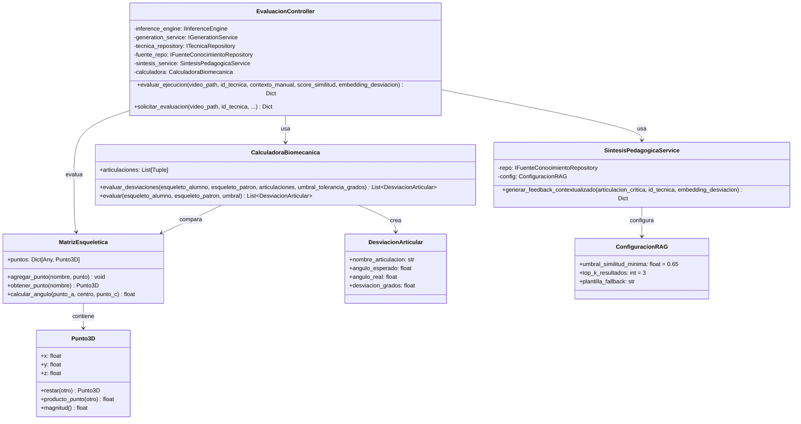

### 5.5.2 DCD: Adaptadores de Infraestructura

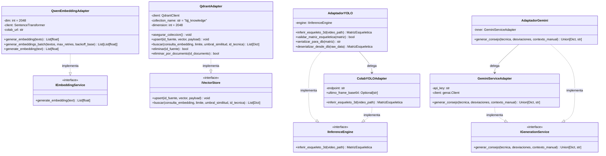

### 5.5.3 DCD: Repositorios de Persistencia

```mermaid
classDiagram
    direction TB

    class ITecnicaRepository {
        <<interface>>
        +registrar_patron(tecnica) bool
        +obtener_patron(id_tecnica) Optional~TecnicaPatron~
        +listar_por_instructor(id_profesor) List~TecnicaPatron~
    }
    class IFuenteConocimientoRepository {
        <<interface>>
        +indexar_documento(fuente) str
        +buscar_contexto(consulta_embedding, limite) List~FuenteConocimiento~
        +listar_fuentes(id_tecnica) List~FuenteConocimiento~
        +eliminar(id_fuente) bool
    }
    class IProfesorRepository {
        <<interface>>
        +guardar(profesor) void
        +obtener_por_id(id_profesor) Optional~Profesor~
        +listar_todos() List~Profesor~
        +actualizar(id_profesor, nombre, email) bool
        +eliminar(id_profesor) bool
    }

    class PostgresTecnicaRepository {
        -db: Union[Connection, str]
        -yolo: AdaptadorYOLO
        +registrar_patron(tecnica) bool
        +obtener_patron(id_tecnica) Optional~TecnicaPatron~
        +listar_por_instructor(id_profesor) List~TecnicaPatron~
        +eliminar(id_tecnica) bool
    }
    class PostgresFuenteConocimientoRepository {
        -db: Union[Connection, str]
        -config: ConfiguracionRAG
        -qdrant: IVectorStore
        -embedding: IEmbeddingService
        +indexar_documento(fuente) str
        +buscar_contexto(consulta_embedding, limite, id_tecnica) List~FuenteConocimiento~
    }
    class PostgresHistorialRepository {
        -db_url: str
        +guardar_evaluacion(id_alumno, id_tecnica, resultado) str
        +obtener_progreso(id_alumno) List[Dict]
    }
    class PostgresProfesorRepository {
        -db: Union[Connection, str]
        +guardar(profesor) void
        +obtener_por_id(id_profesor) Optional~Profesor~
        +listar_todos() List~Profesor~
    }

    PostgresTecnicaRepository ..|> ITecnicaRepository : implementa
    PostgresFuenteConocimientoRepository ..|> IFuenteConocimientoRepository : implementa
    PostgresProfesorRepository ..|> IProfesorRepository : implementa
    PostgresTecnicaRepository --> AdaptadorYOLO : usa
    PostgresFuenteConocimientoRepository --> QdrantAdapter : usa
    PostgresFuenteConocimientoRepository --> QwenEmbeddingAdapter : usa
    PostgresFuenteConocimientoRepository --> ConfiguracionRAG : usa
```

## 5.6 Realización de Casos de Uso

La **Realización de Casos de Uso** (Larman, Cap. 17) ilustra cómo los objetos de software colaboran internamente para cumplir con los requisitos. Se presentan dos realizaciones: la del CU-02 (el más crítico) y la del CU-01.

### 5.6.1 Realización del CU-02: Evaluar Ejecución Biomecánica

Este diagrama de secuencia muestra la colaboración interna de los objetos de software, aplicando los patrones GRASP:

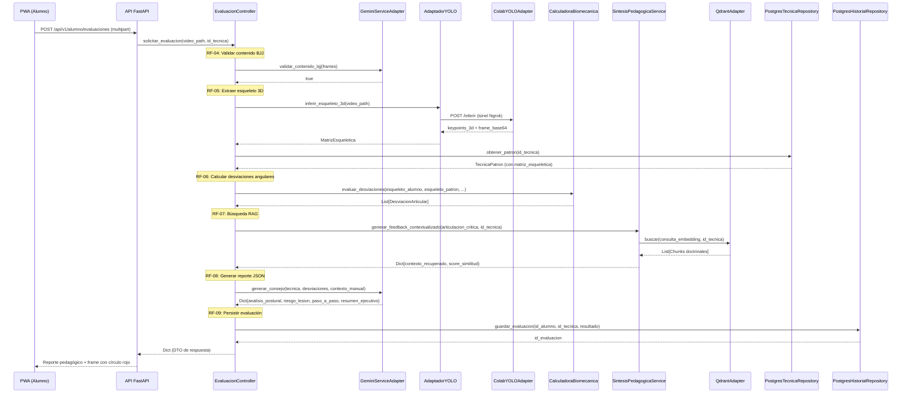

### 5.6.2 Realización del CU-01: Registrar Técnica Patrón

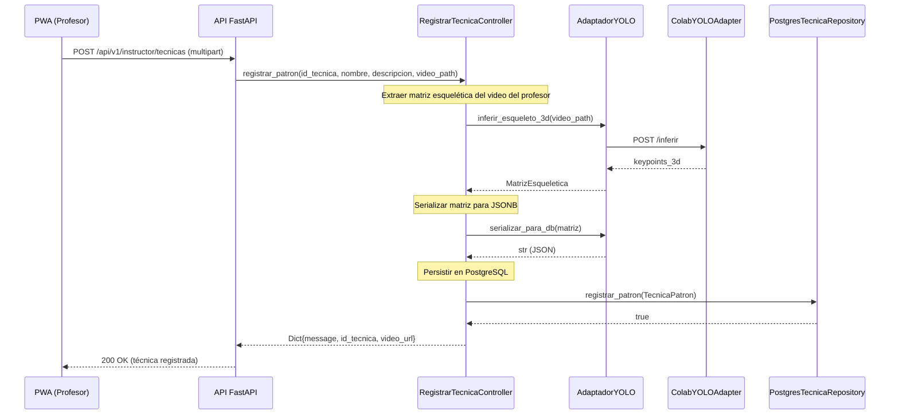

> *La segunda parte de este capítulo (Secciones 5.7 a 5.13) se desarrolla a continuación.*

---

## 5.7 Aplicación de Patrones GRASP

Los patrones GRASP (*General Responsibility Assignment Software Patterns*) propuestos por Larman (2005) constituyen la guía fundamental para asignar responsabilidades a los objetos. A continuación se documenta la aplicación concreta de cada uno de los 9 patrones al sistema, con referencias verificables al código fuente.

### 5.7.1 Patrón Controller (Controlador)

**Definición (Larman, Cap. 16):** Asignar la responsabilidad de manejar un evento del sistema a una clase que represente una de estas opciones: (1) el sistema global, dispositivo o subsistema (controlador de fachada), o (2) un escenario de caso de uso (controlador de sesión).

**Aplicación en el sistema:** Se implementa el **Controlador de Sesión** mediante clases `*Controller` en `src/application/`. Cada controlador orquesta un caso de uso específico, delegando la lógica de negocio al Dominio y la persistencia a Infraestructura.

| Caso de Uso | Controlador de Sesión | Archivo real |
| :--- | :--- | :--- |
| CU-01 Registrar Técnica Patrón | `RegistrarTecnicaController` / `TecnicaController` | `src/application/pattern_controller.py` y `tecnica_controller.py` |
| CU-02 Evaluar Ejecución Biomecánica | `EvaluacionController` | `src/application/controllers.py` |
| CU-03 / CU-04 Gestión de Profesores | `ProfesorController` | `src/application/profesor_controller.py` |
| CU-05 Indexar Literatura al RAG | `FuenteController` | `src/application/fuente_controller.py` |
| Autenticación (transversal) | `AuthController` | `src/application/auth_controller.py` |

**Ejemplo concreto (`EvaluacionController`):**

```python
class EvaluacionController:
    """Session Facade para CU-02. No contiene lógica de negocio,
    delega al Dominio y a los adaptadores de Infraestructura."""
    def evaluar_ejecucion(self, video_path, id_tecnica):
        patron = self._tecnica_repository.obtener_patron(id_tecnica)
        esqueleto_alumno = self._inference_engine.inferir_esqueleto_3d(video_path)
        desviaciones = self._calculadora.evaluar_desviaciones(...)
        # ...
```

**Justificación:** El controlador no contiene lógica biomecánica ni SQL. Recibe peticiones HTTP, delega a los objetos expertos y devuelve DTOs. Esto cumple **Alta Cohesión** (una responsabilidad) y **Bajo Acoplamiento** (solo depende de interfaces abstractas).

### 5.7.2 Patrón Information Expert (Experto en Información)

**Definición:** Asignar la responsabilidad al experto en información: la clase que tiene la información necesaria para cumplir la responsabilidad.

**Aplicación:** Se aplica en todos los niveles del sistema.

| Responsabilidad | Experto en Información | Archivo |
| :--- | :--- | :--- |
| Calcular el ángulo entre tres puntos 3D | `MatrizEsqueletica.calcular_angulo()` | `src/domain/models.py` |
| Calcular la desviación entre dos esqueletos | `CalculadoraBiomecanica.evaluar_desviaciones()` | `src/domain/models.py` |
| Conocer su propia dimensión vectorial | `QwenEmbeddingAdapter._dim = 2048` | `src/infrastructure/adapters/qwen_embedding_adapter.py` |
| Conocer la configuración RAG (umbral, top_k) | `ConfiguracionRAG` | `src/domain/models.py` |
| Conocer su magnitud y producto punto | `Punto3D.magnitud()` / `.producto_punto()` | `src/domain/models.py` |

**Ejemplo concreto:**

```python
@dataclass(frozen=True)
class Punto3D:
    """Aplica Experto en Información: el punto conoce su propia
    aritmética vectorial (resta, producto punto, magnitud)."""
    def producto_punto(self, otro: "Punto3D") -> float:
        return (self.x * otro.x) + (self.y * otro.y) + (self.z * otro.z)

    def magnitud(self) -> float:
        return math.sqrt(self.producto_punto(self))
```

### 5.7.3 Patrón Creator (Creador)

**Definición:** Asignar a la clase B la responsabilidad de crear una instancia de la clase A si B agrega, contiene, registra, usa cercanamente o tiene los datos de inicialización de A.

**Aplicación:**

| Objeto Creado | Creador | Justificación | Archivo |
| :--- | :--- | :--- | :--- |
| `EvaluacionController` | `get_controller()` (Factory Function) | Es quien tiene todos los datos de inicialización (DB URL, API keys, adaptadores) | `src/presentation/api.py` |
| `SintesisPedagogicaService` | `EvaluacionController.__init__()` | El controlador usa cercanamente este servicio | `src/application/controllers.py` |
| `CalculadoraBiomecanica` | `EvaluacionController.__init__()` | El controlador la usa en cada evaluación | `src/application/controllers.py` |
| `QdrantAdapter` | `PipelineIngestaRAG.__init__()` | El pipeline contiene y usa el adaptador vectorial | `src/infrastructure/persistence/rag_ingestion.py` |
| `Punto3D` | `MatrizEsqueletica` | Contiene la colección de puntos anatómicos | `src/domain/models.py` |

**Ejemplo concreto:**

```python
class EvaluacionController:
    def __init__(self, inference_engine, generation_service, tecnica_repository, ...):
        # Creator: EvaluacionController crea y contiene
        # los objetos que usa cercanamente
        self._calculadora = CalculadoraBiomecanica()
        self._sintesis = SintesisPedagogicaService(repo=self._fuente_repo, config=self._config_rag)
```

### 5.7.4 Patrón Low Coupling (Bajo Acoplamiento)

**Definición:** Asignar responsabilidades para que el acoplamiento innecesario permanezca bajo.

**Aplicación:** Se aplica mediante **Dependency Inversion**: las capas superiores dependen de **interfaces abstractas**, no de implementaciones concretas.

**Evidencia en el código (`src/domain/interfaces.py`):**

```python
class IInferenceEngine(ABC):
    @abstractmethod
    def inferir_esqueleto_3d(self, video_path: str) -> MatrizEsqueletica:
        pass

class IGenerationService(ABC):
    @abstractmethod
    def generar_consejo(self, tecnica, desviaciones, contexto_manual) -> Union[Dict, str]:
        pass
```

**Beneficio concreto:** `EvaluacionController` **no conoce** ni a `ColabYOLOAdapter` ni a `GeminiServiceAdapter`. Solo conoce `IInferenceEngine` e `IGenerationService`. Esto permite sustituir Colab por RunPod, o Gemini por otro LLM, sin modificar una línea del controlador.

### 5.7.5 Patrón High Cohesion (Alta Cohesión)

**Definición:** Asignar responsabilidades para que la cohesión permanezca alta.

**Aplicación:** Cada clase tiene **una única responsabilidad claramente definida**.

| Clase | Única Responsabilidad |
| :--- | :--- |
| `ChunkerSemanticoBJJ` | Fragmentar texto doctrinal con solapamiento (1000/200) |
| `QwenEmbeddingAdapter` | Generar embeddings 2048d |
| `QdrantAdapter` | Persistir y buscar vectores en Qdrant |
| `GeminiServiceAdapter` | Generar JSON pedagógico con Gemini |
| `PostgresHistorialRepository` | Persistir y consultar evaluaciones |
| `CalculadoraBiomecanica` | Calcular desviaciones angulares puras |

**Evidencia:** `ChunkerSemanticoBJJ` **solo** hace chunking. No genera embeddings, no persiste, no llama a Gemini. Esto se valida en `tests/test_rag_real.py::TestChunkerSemanticoBJJ`.

### 5.7.6 Patrón Polymorphism (Polimorfismo)

**Definición:** Cuando comportamientos relacionados varían por tipo, asignar la responsabilidad del comportamiento mediante operaciones polimórficas a los tipos para los que varía.

**Aplicación:** La interfaz `IInferenceEngine` permite **múltiples implementaciones intercambiables** en tiempo de ejecución.

```python
class AdaptadorYOLO(IInferenceEngine):
    """Implementación 1: Selecciona ColabYOLOAdapter o MockYOLOEngine."""
    def __init__(self, colab_url=None):
        if colab_url and not colab_url.startswith("https://placeholder"):
            self._engine = ColabYOLOAdapter(colab_url)  # Polimorfismo
        else:
            self._engine = MockYOLOEngine(desviacion_grados=0.0)  # Polimorfismo

    def inferir_esqueleto_3d(self, video_path):
        return self._engine.inferir_esqueleto_3d(video_path)
```

**Beneficio:** El mismo `EvaluacionController` funciona con GPU remota o con un mock determinísta sin cambiar su código. Esto es esencial para las pruebas unitarias (ver `tests/test_application.py`).

### 5.7.7 Patrón Pure Fabrication (Fabricación Pura)

**Definición:** Asignar un conjunto altamente cohesivo de responsabilidades a una clase artificial o de conveniencia que **no representa un concepto del dominio**.

**Aplicación:** `SintesisPedagogicaService` es la fabricación pura paradigmática del proyecto.

**Justificación:** En el dominio real del BJJ, no existe un “orquestador de RAG + Gemini”. Sin embargo, `EvaluacionController` necesita coordinar búsqueda vectorial + generación LLM. Para no violar **Alta Cohesión** ni **Bajo Acoplamiento**, se extrae esa responsabilidad a un servicio artificial.

```python
class SintesisPedagogicaService:
    """Pure Fabrication (Larman p. 289): NO representa un concepto del dominio BJJ.
    Es una clase artificial creada para mantener cohesionado a EvaluacionController."""
    def __init__(self, repo, config):
        self._repo = repo
        self._config = config

    def generar_feedback_contextualizado(self, articulacion_critica, id_tecnica, embedding_desviacion):
        # ... coordina RAG, filtra por umbral, activa fallback
        pass
```

**Evidencia:** `src/services/__init__.py` documenta explícitamente: *“Siguiendo Pure Fabrication de Larman, estos servicios mejoran la cohesión evitando sobrecargar las entidades de dominio.”*

### 5.7.8 Patrón Indirection (Indirección)

**Definición:** Asignar la responsabilidad a un objeto intermediario para mediar entre componentes, evitando el acoplamiento directo.

**Aplicación:**

| Objeto Intermediario | Componentes Desacoplados | Archivo |
| :--- | :--- | :--- |
| `AdaptadorYOLO` | `EvaluacionController` ↔ `ColabYOLOAdapter` | `src/infrastructure/adapters/yolo_adapter.py` |
| `AdaptadorGemini` | Dominio ↔ SDK Google GenAI | `src/infrastructure/adapters/gemini_service_adapter.py` |
| `QdrantAdapter` | `PostgresFuenteConocimientoRepository` ↔ Cliente Qdrant | `src/infrastructure/adapters/qdrant_adapter.py` |
| `PipelineIngestaRAG` | `FuenteController` ↔ (Chunker + Qwen + Qdrant + PostgreSQL) | `src/infrastructure/persistence/rag_ingestion.py` |

**Ejemplo (`AdaptadorGemini`):**

```python
class AdaptadorGemini(IGenerationService):
    """Indirección: encapsula el SDK de Google GenAI detrás del contrato IGenerationService.
    La capa de aplicación nunca importa `from google import genai`."""
    def __init__(self, api_key=None):
        self._inner = GeminiServiceAdapter(api_key=api_key)

    def generar_consejo(self, tecnica, desviaciones, contexto_manual):
        return self._inner.generar_consejo(tecnica, desviaciones, contexto_manual)
```

### 5.7.9 Patrón Protected Variations (Variaciones Protegidas)

**Definición:** Identificar puntos de variación o inestabilidad predecibles y asignar responsabilidades creando una **interfaz estable** alrededor de ellos.

**Aplicación:** Es el patrón más importante del sistema. Se identifican **6 puntos de variación** y se estabilizan con interfaces.

| Punto de Variación | Interfaz Estable | Mitigación |
| :--- | :--- | :--- |
| Modelo de pose (YOLO26x → otro) | `IInferenceEngine` | Sustituir `ColabYOLOAdapter` por nueva implementación |
| LLM (Gemini → otro) | `IGenerationService` | Sustituir `GeminiServiceAdapter` |
| Modelo de embeddings (Qwen → otro) | `IEmbeddingService` | Sustituir `QwenEmbeddingAdapter` |
| Base vectorial (Qdrant → otro) | `IVectorStore` | Sustituir `QdrantAdapter` |
| Base de datos (PostgreSQL → otro) | `ITecnicaRepository`, `IFuenteConocimientoRepository`, `IProfesorRepository` | Sustituir repositorios |
| Estrategia de chunking | `ChunkerSemanticoBJJ` | Cambiar `chunk_size` / `separators` |

**Ejemplo del código (`src/domain/interfaces.py`):**

```python
class IVectorStore(ABC):
    """Protected Variations: la capa de dominio está protegida contra
    el cambio de motor vectorial (Qdrant → Milvus, Weaviate, etc.)."""
    @abstractmethod
    def upsert(self, id_fuente: str, vector: List[float], payload: Dict) -> None: ...

    @abstractmethod
    def buscar(self, consulta_embedding: List[float], limite: int = 3, ...) -> List[Dict]: ...
```

**Tabla resumen de aplicación GRASP:**

| Patrón GRASP | Clase / Mecanismo Principal | Evidencia en código |
| :--- | :--- | :--- |
| Controller | `EvaluacionController`, `ProfesorController`, etc. | `src/application/*.py` |
| Information Expert | `Punto3D`, `MatrizEsqueletica`, `CalculadoraBiomecanica` | `src/domain/models.py` |
| Creator | `EvaluacionController`, `PipelineIngestaRAG` | `src/application/controllers.py` |
| Low Coupling | Interfaces abstractas | `src/domain/interfaces.py` |
| High Cohesion | Una clase = una responsabilidad | Ver tabla 5.7.5 |
| Polymorphism | `IInferenceEngine` con 3 implementaciones | `yolo_adapter.py`, `colab_adapter.py`, `mocks.py` |
| Pure Fabrication | `SintesisPedagogicaService`, `ChunkerSemanticoBJJ` | `src/services/*.py` |
| Indirection | `AdaptadorYOLO`, `AdaptadorGemini` | `src/infrastructure/adapters/*.py` |
| Protected Variations | 6 interfaces abstractas | `src/domain/interfaces.py` |

---

## 5.8 Aplicación de Patrones GoF

Los patrones *Gang of Four* (Gamma et al., 1995) complementan a GRASP con soluciones concretas y reutilizables. A continuación se documentan los 6 patrones efectivamente implementados en el código.

### 5.8.1 Patrón Adapter (Estructural)

**Definición:** Convertir la interfaz de una clase en otra interfaz que los clientes esperan.

**Aplicación en el sistema:** Es el patrón dominante de la capa de Infraestructura. Cada tecnología externa está envuelta por un adaptador.

| Adaptador | Adapta | Archivo |
| :--- | :--- | :--- |
| `ColabYOLOAdapter` | API Flask/Ngrok de Colab ↔ `IInferenceEngine` | `src/infrastructure/adapters/colab_adapter.py` |
| `GeminiServiceAdapter` | SDK Google GenAI ↔ `IGenerationService` | `src/infrastructure/adapters/gemini_adapter.py` |
| `QwenEmbeddingAdapter` | Endpoint `/embed` Colab ↔ `IEmbeddingService` | `src/infrastructure/adapters/qwen_embedding_adapter.py` |
| `QdrantAdapter` | Cliente Qdrant ↔ `IVectorStore` | `src/infrastructure/adapters/qdrant_adapter.py` |
| `AdaptadorYOLO` | Selección de motor (Colab/Mock) ↔ `IInferenceEngine` | `src/infrastructure/adapters/yolo_adapter.py` |

**Ejemplo (`ColabYOLOAdapter`):**

```python
class ColabYOLOAdapter(IInferenceEngine):
    """Adapter: convierte la API HTTP de Colab (multipart + JSON)
    en la interfaz IInferenceEngine del dominio."""
    def __init__(self, colab_tunnel_url: str):
        self._endpoint = f"{colab_tunnel_url.rstrip('/')}/inferir"
        self.ultimo_frame_base64: Optional[str] = None

    def inferir_esqueleto_3d(self, video_path: str) -> MatrizEsqueletica:
        with open(video_path, 'rb') as video_file:
            response = requests.post(self._endpoint, files={'file': video_file}, timeout=60)
            data = response.json()
            if 'frame_base64' in data:
                self.ultimo_frame_base64 = data['frame_base64']
            puntos = {int(k): Punto3D(float(v['x']), float(v['y']), float(v['z']))
                      for k, v in data['keypoints_3d'].items()}
            return MatrizEsqueletica(puntos_3d=puntos)
```

### 5.8.2 Patrón Factory (Creacional)

**Definición:** Definir una interfaz para crear un objeto, pero dejar que las subclases decidan qué clase instanciar.

**Aplicación:** El sistema usa **Factory Functions** en `src/application/factory.py` para construir controladores con la inyección de dependencia correcta.

```python
def crear_evaluacion_controller(
    inference_engine=None,
    generation_service=None,
    tecnica_repository=None,
    usar_db_real=False,
    config_rag=None,
    qdrant_adapter=None,
) -> EvaluacionController:
    """Factory: decide qué adaptadores inyectar según el entorno.
    Permite alternar entre repositorios en memoria (tests) y reales (producción)."""
    from src.infrastructure.mocks import MockYOLOEngine, MockGeminiService
    inf = inference_engine or MockYOLOEngine()
    gen = generation_service or MockGeminiService()
    tec = tecnica_repository or _SHARED_MEM_TECNICA_REPO
    sintesis = crear_sintesis_pedagogica_service(usar_db_real=usar_db_real, ...)
    return EvaluacionController(inference_engine=inf, generation_service=gen, ...)
```

**Beneficio:** Las pruebas unitarias (`usar_db_real=False`) obtienen controladores con mocks en menos de 10 ms. En producción (`usar_db_real=True`) se inyectan repositorios PostgreSQL. **El código del controlador no cambia**.

### 5.8.3 Patrón Singleton (Creacional)

**Definición:** Garantizar que una clase tenga una única instancia y proporcionar un punto de acceso global a ella.

**Aplicación:** El sistema implementa Singletons “suaves” (no estrictos) mediante:

1. **Contenedor de dependencias global** en `src/presentation/api.py`:

```python
container: Dict[str, Any] = {}  # Singleton de facto para inyección

def get_controller() -> EvaluacionController:
    if "evaluacion_controller" in container and container["evaluacion_controller"] is not None:
        return container["evaluacion_controller"]
    # ... si no existe, se crea una sola vez
```

2. **Repositorios compartidos en memoria** en `src/application/factory.py`:

```python
_SHARED_MEM_TECNICA_REPO = InMemoryTecnicaRepository()
_SHARED_MEM_PROFESOR_REPO = InMemoryProfesorRepository(tecnica_repository=_SHARED_MEM_TECNICA_REPO)
_SHARED_MEM_FUENTE_REPO = InMemoryFuenteConocimientoRepository()
```

**Nota:** No se usó el Singleton clásico con `getInstance()` porque Python permite un manejo más limpio mediante módulos (que ya son Singleton por naturaleza) y variables globales controladas.

### 5.8.4 Patrón Facade (Estructural)

**Definición:** Proporcionar una interfaz unificada para un conjunto de interfaces en un subsistema.

**Aplicación:** Los controladores de aplicación son **Session Facades** (Larman, Cap. 16). `EvaluacionController` es la fachada del subsistema de evaluación biomecánica.

```python
class EvaluacionController:
    """Facade: expone un único método público `evaluar_ejecucion()`
    que orquesta 5 subsistemas internos (YOLO, DTW, Qdrant, Gemini, PostgreSQL)."""
    def evaluar_ejecucion(self, video_path, id_tecnica):
        # Oculta la complejidad: el llamador no sabe que existen
        # ColabYOLOAdapter, CalculadoraBiomecanica, SintesisPedagogicaService,
        # GeminiServiceAdapter, PostgresHistorialRepository.
        pass
```

**Otro ejemplo:** `PipelineIngestaRAG` es una fachada del subsistema RAG. Expone un único método `indexar_manual()` que internamente coordina chunking, embeddings, Qdrant y PostgreSQL.

### 5.8.5 Patrón Strategy (Comportamiento)

**Definición:** Definir una familia de algoritmos, encapsular cada uno y hacerlos intercambiables.

**Aplicación:** El sistema implementa Strategy de forma implícita mediante **inyección de dependencia polimórfica**. El `EvaluacionController` acepta cualquier `IInferenceEngine` como estrategia de inferencia:

```python
class EvaluacionController:
    def __init__(self, inference_engine: IInferenceEngine, ...):
        # Estrategia intercambiable: Colab, Mock, o futuras implementaciones
        self._inference_engine = inference_engine
```

**Estrategias disponibles actualmente:**

| Estrategia | Clase | Uso |
| :--- | :--- | :--- |
| GPU Remota | `ColabYOLOAdapter` | Producción real |
| Mock determinísta | `MockYOLOEngine` | Tests y fallback |
| Selector dinámico | `AdaptadorYOLO` | Elige entre las anteriores según `.env` |

### 5.8.6 Patrón Observer (Comportamiento)

**Definición:** Definir una dependencia uno-a-muchos entre objetos, de modo que cuando un objeto cambie de estado, todos sus dependientes sean notificados.

**Aplicación:** El sistema **no implementa Observer con push**, sino que usa **polling desde el cliente (PWA)**. Este es un diseño consciente para simplificar la arquitectura PWA:

1. El alumno sube el video → recibe `id_tarea` (procesamiento asíncrono).
2. La PWA hace *polling* periódico al endpoint `GET /api/v1/evaluaciones/tareas/{tarea_id}`.
3. Cuando el backend marca `estado: COMPLETADO`, la PWA recupera el reporte.

**Justificación de la desviación:** En la Sección 4.2.6 se documenta como **trabajo futuro** la implementación de WebSockets o Server-Sent Events para notificación push. Para el MVP, el polling es suficiente y reduce la complejidad del servidor.

**Tabla resumen de aplicación GoF:**

| Patrón GoF | Clases Principales | Categoría |
| :--- | :--- | :--- |
| Adapter | `ColabYOLOAdapter`, `GeminiServiceAdapter`, `QwenEmbeddingAdapter`, `QdrantAdapter`, `AdaptadorYOLO` | Estructural |
| Factory | `crear_evaluacion_controller()`, `crear_fuente_controller()`, `crear_profesor_controller()` | Creacional |
| Singleton (suave) | `container`, `_SHARED_MEM_*_REPO` | Creacional |
| Facade | `EvaluacionController`, `PipelineIngestaRAG` | Estructural |
| Strategy | `IInferenceEngine`, `IGenerationService` (polimórficas) | Comportamiento |
| Observer (polling) | Endpoint `/tareas/{id}` + PWA polling | Comportamiento |

---

## 5.9 Diagrama de Paquetes

El diagrama de paquetes documenta la **organización física del código fuente** en el sistema de archivos, alineada con la arquitectura lógica de 5 capas presentada en la Sección 5.2.

```mermaid
flowchart TB
    subgraph ROOT["Raíz del Proyecto"]
        subgraph SRC["src/"]
            subgraph PRES["presentation/"]
                API["api.py<br/>(rutas FastAPI)"]
            end

            subgraph APP["application/"]
                CTRL["controllers.py<br/>EvaluacionController"]
                PAT["pattern_controller.py<br/>RegistrarTecnicaController"]
                PROF["profesor_controller.py"]
                TEC["tecnica_controller.py"]
                FUE["fuente_controller.py"]
                AUTH["auth_controller.py"]
                FACT["factory.py<br/>(Factory DI)"]
            end

            subgraph SERV["services/"]
                SINT["sintesis_pedagogica_service.py"]
                CHUNK["chunker_semantico.py"]
            end

            subgraph DOM["domain/"]
                MOD["models.py<br/>(Entidades y VOs)"]
                IFACE["interfaces.py<br/>(Contratos abstractos)"]
                SEC["security.py<br/>(PBKDF2)"]
                VAL["validation_constants.py"]
            end

            subgraph INFRA["infrastructure/"]
                subgraph ADP["adapters/"]
                    YOLO_A["yolo_adapter.py<br/>colab_adapter.py"]
                    GEM_A["gemini_adapter.py<br/>gemini_service_adapter.py"]
                    QWE_A["qwen_embedding_adapter.py"]
                    QDR_A["qdrant_adapter.py"]
                end
                subgraph PERS["persistence/"]
                    PG_REPO["postgres_repository.py"]
                    HIST["history_repository.py"]
                    RAG_ING["rag_ingestion.py"]
                end
                MOCKS["mocks.py<br/>(Dobles de prueba)"]
            end
        end

        subgraph FRONT["frontend/"]
            HTML["index.html"]
            JS["app.js"]
            CSS["style.css"]
            SW["service-worker.js"]
            MANIFEST["manifest.json"]
        end

        subgraph TESTS["tests/"]
            T1["test_domain.py"]
            T2["test_application.py"]
            T3["test_rag_real.py"]
            T4["test_integration.py"]
            T5["test_pwa_refactor.py"]
        end

        subgraph DB["database/"]
            SQL1["01_init.sql"]
            SQL2["02_historico.sql"]
            SQL3["03_instructores_fuentes.sql"]
            SQL4["04_abm_bcnf.sql"]
            SQL5["05_usuarios.sql"]
        end

        subgraph COLAB["colab_backend.ipynb"]
            NOTEBOOK["Notebook Colab GPU"]
        end

        subgraph CONFIG["Configuración"]
            DOCKER["Dockerfile"]
            COMPOSE["docker-compose.yml"]
            REQ["requirements.txt"]
            ENV[".env / .env.example"]
            PYTEST["pytest.ini"]
        end
    end

    PRES --> APP
    APP --> SERV
    APP --> DOM
    SERV --> DOM
    INFRA --> DOM
    FRONT -.consume HTTP.-> PRES
    TESTS -.verifica.-> APP
    TESTS -.verifica.-> DOM
    TESTS -.verifica.-> INFRA
    DB -.inicializa.-> PG_REPO
    COLAB -.expone API.-> YOLO_A
    CONFIG -.orquesta.-> INFRA

    style PRES fill:#1f3a5f,color:#fff
    style APP fill:#2e5a88,color:#fff
    style SERV fill:#5a7aa8,color:#fff
    style DOM fill:#5a3a6b,color:#fff
    style INFRA fill:#8a6d3b,color:#fff
    style FRONT fill:#3a5a3a,color:#fff
    style TESTS fill:#6b3a3a,color:#fff
    style DB fill:#4a4a4a,color:#fff
    style COLAB fill:#2a4a6a,color:#fff
    style CONFIG fill:#4a3a2a,color:#fff
```

**Figura 5.2:** Diagrama de Paquetes Físico del Proyecto. *Fuente: Elaboración propia (2026).*

### 5.9.1 Regla de Dependencia entre Paquetes

La siguiente tabla documenta las dependencias permitidas entre paquetes, verificadas en el código:

| Paquete Origen | Puede depender de | NO puede depender de |
| :--- | :--- | :--- |
| `presentation/` | `application/`, `domain/` | `infrastructure/` directo |
| `application/` | `domain/`, `services/` | `infrastructure/adapters/*` concretos |
| `services/` | `domain/` | `application/`, `presentation/` |
| `domain/` | (nada externo) | `application/`, `services/`, `infrastructure/` |
| `infrastructure/` | `domain/` | `application/`, `presentation/` |

Esta regla se valida mediante la prueba `tests/test_domain.py::TestDominioPuroAislamiento::test_sin_dependencias_de_frameworks`, que verifica que `src/domain/models.py` no importe Pydantic, FastAPI ni SQLAlchemy.

---

## 5.10 Diagrama de Despliegue

El diagrama de despliegue documenta la **asignación de componentes a nodos físicos** durante la fase MVP. La arquitectura es híbrida: el backend local corre en Docker, la GPU está en Google Colab, y la PWA se ejecuta en el teléfono del alumno.

```mermaid
flowchart TB
    subgraph PHONE["📱 Nodo 1: Smartphone del Alumno (PWA)"]
        PWA["PWA en Navegador Móvil<br/>• index.html + app.js<br/>• Service Worker (offline)<br/>• Cache IndexedDB<br/>• Cámara 1080p 30 FPS"]
    end

    subgraph LAPTOP["💻 Nodo 2: Laptop del Desarrollador (Docker Compose)"]
        subgraph DOCKER["Contenedores Docker"]
            API_C["🐍 bjj_api<br/>FastAPI + Uvicorn<br/>Puerto 8000"]
            PG_C["🐘 bjj_postgres<br/>PostgreSQL 16<br/>Puerto 5433"]
            QDRANT_C["🔷 bjj_qdrant<br/>Qdrant Vector DB<br/>Puerto 6333"]
        end
        FS["📁 Sistema de Archivos<br/>/uploads (videos temporales)<br/>/data/media/patron_videos (videos semilla)"]
    end

    subgraph COLAB["☁️ Nodo 3: Google Colab Pro (GPU NVIDIA T4/A100)"]
        NB["📓 colab_backend.ipynb<br/>• Flask + PyNgrok<br/>• YOLO26x-Pose + YOLO26x-Depth<br/>• Qwen3-VL-Embedding-2B<br/>Puerto 5000 (interno)"]
    end

    subgraph NGROK["🌐 Nodo 4: Túnel Ngrok (HTTPS Público)"]
        TUNNEL["🔒 https://oasis-displace-size.ngrok-free.dev<br/>Expone Colab Flask al mundo"]
    end

    subgraph GCP["☁️ Nodo 5: Google Cloud Platform"]
        GEMINI["🤖 Gemini 2.5 Flash API<br/>Generación JSON pedagógica"]
    end

    subgraph USER["👤 Actores Externos"]
        PROF["🧑🏫 Profesor<br/>(navegador laptop/tablet)"]
        ALUM["🧑🎓 Alumno<br/>(smartphone)"]
    end

    PWA -->|"1. HTTP POST multipart<br/>video + id_tecnica"| API_C
    API_C -->|"2. Persiste metadatos<br/>SQL sobre TLS"| PG_C
    API_C -->|"3. Indexa/busca<br/>vectores 2048d"| QDRANT_C
    API_C -->|"4. Guarda video<br/>temporalmente"| FS
    API_C -->|"5. POST /inferir<br/>vía HTTPS"| TUNNEL
    TUNNEL -->|"6. Reenvía a Flask"| NB
    NB -->|"7. Devuelve keypoints 3D<br/>+ frame base64"| TUNNEL
    TUNNEL -->|"8. Respuesta JSON"| API_C
    API_C -->|"9. HTTPS API Call<br/>con prompt + contexto RAG"| GEMINI
    GEMINI -->|"10. JSON 4 claves"| API_C
    API_C -->|"11. HTML/JSON response"| PWA
    PROF -->|"Configura técnicas<br/>y literatura"| API_C
    ALUM -->|"Sube videos y<br/>consulta reportes"| API_C

    style PHONE fill:#3a5a3a,color:#fff
    style LAPTOP fill:#2e5a88,color:#fff
    style COLAB fill:#1f3a5f,color:#fff
    style NGROK fill:#8a6d3b,color:#fff
    style GCP fill:#5a3a6b,color:#fff
    style USER fill:#4a4a4a,color:#fff
```

**Figura 5.3:** Diagrama de Despliegue de la Fase MVP. *Fuente: Elaboración propia (2026).*

### 5.10.1 Flujo del Procesamiento (11 pasos)

| Paso | Origen | Destino | Protocolo | Contenido |
| :---: | :--- | :--- | :--- | :--- |
| 1 | PWA | FastAPI | HTTPS Multipart | Video MP4 + `id_tecnica` + `id_alumno` |
| 2 | FastAPI | PostgreSQL | SQL/TCP | INSERT en `evaluaciones_alumno` |
| 3 | FastAPI | Qdrant | gRPC/HTTP | Búsqueda de chunks doctrinales (2048d) |
| 4 | FastAPI | Filesystem | I/O local | Video temporal en `/uploads` |
| 5 | FastAPI | Ngrok | HTTPS | POST `/inferir` con video |
| 6 | Ngrok | Colab Flask | HTTP interno | Reenvío del video |
| 7 | Colab | Ngrok | HTTP interno | Keypoints 3D + frame_base64 |
| 8 | Ngrok | FastAPI | HTTPS | Respuesta JSON |
| 9 | FastAPI | Gemini API | HTTPS REST | Prompt + contexto RAG |
| 10 | Gemini | FastAPI | HTTPS REST | JSON con 4 claves pedagógicas |
| 11 | FastAPI | PWA | HTTPS JSON | Reporte completo + frame anotado |

### 5.10.2 Características de los Nodos

| Nodo | Especificación | Rol | Costo MVP |
| :--- | :--- | :--- | :--- |
| Smartphone | Android/iOS, cámara 1080p | Interfaz PWA (cliente ligero) | $0 (dispositivo del alumno) |
| Laptop dev | Python 3.11, Docker Compose | Servidor central + persistencia | $0 (equipo personal) |
| Google Colab Pro | GPU T4/A100, 16 GB VRAM | Inferencia de visión + embeddings | $0 (plan gratuito del tutor) |
| Ngrok | Túnel HTTPS con URL aleatoria | Exposición segura de Colab | $0 (plan gratuito) |
| GCP | Gemini 2.5 Flash API | Síntesis pedagógica LLM | Pago por token (marginal) |

---

## 5.11 Matriz de Trazabilidad Arquitectónica

Esta matriz demuestra la **trazabilidad completa** desde los Casos de Uso (Capítulo IV) hasta la implementación física en código y las pruebas automatizadas.

| CU | RF asociados | Controlador (Capa Aplicación) | Endpoint HTTP | Repositorio / Adaptador | Pruebas que lo validan |
| :--- | :--- | :--- | :--- | :--- | :--- |
| **CU-01** | RF-01, RF-02, RF-16 | `TecnicaController` + `RegistrarTecnicaController` | `POST /api/v1/instructor/tecnicas` | `PostgresTecnicaRepository`, `AdaptadorYOLO` | `test_abm_tecnicas.py`, `test_api_abm_contratos.py` |
| **CU-02** | RF-03 a RF-15, RF-18, RF-23 | `EvaluacionController` | `POST /api/v1/alumno/evaluaciones`<br/>`POST /api/v1/evaluaciones/evaluar`<br/>`POST /api/v1/evaluaciones/evaluar-asincrono` | `PostgresHistorialRepository`, `ColabYOLOAdapter`, `CalculadoraBiomecanica`, `SintesisPedagogicaService`, `QdrantAdapter`, `GeminiServiceAdapter` | `test_application.py`, `test_integration.py`, `test_iteracion3.py`, `test_iteracion4.py`, `test_iteracion5.py`, `test_pwa_api.py` |
| **CU-03** | RF-19, RF-16 | `AuthController` | `GET /api/v1/alumno/{id}/progreso` | `PostgresHistorialRepository` | `test_iteracion4.py::TestApiHistorialProgreso`, `test_iteracion5.py` |
| **CU-04** | RF-20, RF-16 | `ProfesorController` | `GET /api/v1/instructor/profesores` | `PostgresProfesorRepository` | `test_abm_profesores.py` |
| **CU-05** | RF-17, RF-16 | `FuenteController` | `POST /api/v1/instructor/fuentes` | `PostgresFuenteConocimientoRepository`, `PipelineIngestaRAG`, `ChunkerSemanticoBJJ`, `QwenEmbeddingAdapter`, `QdrantAdapter` | `test_abm_fuentes.py`, `test_e2e_rag.py`, `test_rag_real.py`, `test_fuente_agrupacion.py` |
| **CU-06** | RF-22 | `tarea_procesar_evaluacion()` | Cron / BackgroundTasks | Filesystem + `PostgresHistorialRepository` | `test_iteracion5.py` |
| **CU-07** | RF-04, RF-24 | `EvaluacionController` | `POST /api/v1/alumno/evaluaciones` | `GeminiServiceAdapter` (pendiente) | *(Planificado en próxima iteración)* |
| **CU-08** | RF-21 | `tarea_procesar_evaluacion()` (daemon) | Cron nocturno | `QdrantAdapter`, `PostgresTecnicaRepository` | *(Planificado en próxima iteración)* |

### 5.11.1 Endpoints REST Completos del Sistema

| Método | Endpoint | Controlador | Uso |
| :--- | :--- | :--- | :--- |
| `POST` | `/api/v1/auth/registro` | `AuthController.registrar_usuario()` | Registro de cuenta |
| `POST` | `/api/v1/auth/login` | `AuthController.login()` | Inicio de sesión |
| `POST` | `/api/v1/instructor/tecnicas` | `TecnicaController.registrar_patron()` | CU-01 |
| `PUT` | `/api/v1/instructor/tecnicas/{id}` | `actualizar_tecnica()` | CU-01 (edición) |
| `DELETE` | `/api/v1/instructor/tecnicas/{id}` | `eliminar_tecnica()` | CU-01 (borrado) |
| `POST` | `/api/v1/alumno/evaluaciones` | `EvaluacionController.solicitar_evaluacion()` | CU-02 |
| `POST` | `/api/v1/evaluaciones/evaluar-asincrono` | `tarea_procesar_evaluacion()` | CU-02 (async) |
| `GET` | `/api/v1/evaluaciones/tareas/{id}` | `obtener_estado_tarea()` | Polling PWA |
| `GET` | `/api/v1/alumno/{id}/progreso` | `obtener_progreso_alumno()` | CU-03 |
| `POST` | `/api/v1/instructor/profesores` | `ProfesorController.registrar()` | CU-04 |
| `PUT` | `/api/v1/instructor/profesores/{id}` | `ProfesorController.actualizar()` | CU-04 (edición) |
| `DELETE` | `/api/v1/instructor/profesores/{id}` | `ProfesorController.eliminar()` | CU-04 (borrado) |
| `POST` | `/api/v1/instructor/fuentes` | `FuenteController.indexar_manual()` | CU-05 |
| `GET` | `/api/v1/tecnicas/{id}/stream` | `stream_video_tecnica()` | Streaming de video patrón |
| `GET` | `/api/v1/sistema/estado` | `consultar_estado_sistema()` | Diagnóstico de dependencias |

---

## 5.12 Consideraciones de Confiabilidad y Fallo Seguro

El sistema está diseñado bajo el principio **Fail-Safe** documentado en 4.3.4. Se aplican 5 mecanismos concretos de confiabilidad.

### 5.12.1 Patrón Adapter Fallback (Núcleo del Fail-Safe)

**Problema:** Google Colab puede caerse, cerrar la sesión de Ngrok o estar en mantenimiento. Si el sistema depende ciegamente de Colab, la PWA queda inoperable.

**Solución implementada:** El `AdaptadorYOLO` implementa **fallback automático** a `MockYOLOEngine` cuando detecta que el túnel no está disponible.

```python
class AdaptadorYOLO(IInferenceEngine):
    """Fail-Safe: si Colab no responde, cae al mock determinísta."""
    def __init__(self, colab_url=None):
        url = colab_url or os.getenv("COLAB_TUNNEL_URL", "").strip()
        if url and not url.startswith("https://placeholder"):
            from src.infrastructure.adapters.colab_adapter import ColabYOLOAdapter
            self._engine = ColabYOLOAdapter(url)
        else:
            from src.infrastructure.mocks import MockYOLOEngine
            self._engine = MockYOLOEngine(desviacion_grados=0.0)
```

**Beneficio:** El sistema **nunca deja de responder** al alumno, incluso si Colab está caído. La prueba `tests/test_pwa_api.py::test_subir_video_multipart_y_evaluar_asincrono` valida este comportamiento.

### 5.12.2 Timeout y Fallback Determinísta en Gemini

**Problema:** La API de Gemini puede tardar más de 30 segundos, devolver JSON malformado, o fallar por rate limiting.

**Solución implementada:** El `GeminiServiceAdapter` tiene **try/except con fallback determinísta**. Si Gemini falla, devuelve un JSON estructurado construido localmente con las 4 claves obligatorias.

```python
class GeminiServiceAdapter:
    def generar_consejo(self, tecnica, desviaciones, contexto_manual):
        fallback_dict = {
            "analisis_postural": f"En {tecnica}, se detectó un desajuste en ...",
            "riesgo_lesion": "Riesgo de sobrecarga articular o pérdida de apalancamiento...",
            "paso_a_paso": f"1. Reajusta la posición de ...",
            "resumen_ejecutivo": f"En {tecnica}, se detectó un desajuste..."
        }
        if not self._client:
            return fallback_dict  # Fallback inmediato
        try:
            response = self._client.models.generate_content(model="gemini-2.5-flash", contents=prompt)
            parsed = json.loads(raw_text)
            return parsed if self._es_valido(parsed) else fallback_dict
        except Exception:
            return fallback_dict  # Fallback ante cualquier excepción
```

**Cumple con:** El requisito RP-01 (tiempo ≤ 180 s) garantiza que el sistema no bloquee al alumno esperando indefinidamente a Gemini. La prueba `tests/test_integration.py::test_evaluacion_completa_persiste_jsonb_con_4_claves` valida el formato del fallback.

### 5.12.3 Aislamiento de Sesiones Colab y Detección de Caída

**Problema:** Colab cierra sesiones cada 12 horas o cuando la GPU excede la cuota. El sistema debe **detectar** y **notificar** la caída.

**Solución implementada:** El endpoint `GET /api/v1/sistema/estado` diagnostica en tiempo real el estado de cada dependencia:

```python
@app.get("/api/v1/sistema/estado")
def consultar_estado_sistema():
    colab_activo = False
    if colab_url and not colab_url.startswith("https://placeholder"):
        try:
            res = requests.post(f"{colab_url.rstrip('/')}/inferir", timeout=4)
            colab_activo = res.status_code in [200, 400]
        except Exception as e:
            colab_mensaje = f"Inalcanzable ({type(e).__name__})"

    return {
        "motor_vision_activo": "Google Colab" if colab_activo else "Modo de Respaldo Local (Mock Engine)",
        "google_colab": {"activo": colab_activo, "diagnostico": colab_mensaje},
        "postgresql": {"activo": db_activa},
        "gemini_api": {"configurada": bool(os.getenv("GEMINI_API_KEY"))}
    }
```

**Beneficio:** El profesor o el administrador técnico puede consultar este endpoint para diagnosticar problemas sin acceder al servidor. Está documentado como herramienta de soporte en 4.2.3 (Administrador / Técnico del Sistema).

### 5.12.4 Persistencia Atómica y Transaccionalidad

**Problema:** Si el sistema falla a mitad de una evaluación, no debe quedar un reporte incompleto en la base de datos.

**Solución implementada:** Todas las operaciones de persistencia están envueltas en contextos transaccionales de PostgreSQL.

```python
class PostgresHistorialRepository:
    def guardar_evaluacion(self, id_alumno, id_tecnica, resultado):
        with psycopg2.connect(self._db_url) as conn:
            with conn.cursor() as cur:
                cur.execute("INSERT INTO evaluaciones_alumno ...", (...))
            conn.commit()  # Commit atómico: todo o nada
        return id_evaluacion
```

**Cumple con:** El requisito RR-03 (Consistencia de Datos Transaccionales) de la Sección 4.3.5.

### 5.12.5 Tabla Consolidada de Riesgos y Mitigaciones

| Riesgo | Mecanismo de Mitigación | Evidencia en Código |
| :--- | :--- | :--- |
| **Caída de Google Colab** | Fallback automático a `MockYOLOEngine` | `AdaptadorYOLO.__init__()` |
| **Gemini tarda > 30 s** | `timeout=30` en SDK + fallback determinísta | `GeminiServiceAdapter.generar_consejo()` |
| **JSON malformado de Gemini** | Try/except + fallback dict determinísta | Mismo método |
| **Pérdida de conexión a PostgreSQL** | Context manager + rollback atómico | `_DBContext.__exit__()` |
| **Pérdida de conexión a Qdrant** | Try/except que retorna `[]` (no bloquea) | `QdrantAdapter.buscar()` |
| **Interrupción de la PWA** | Service Worker + IndexedDB | `frontend/service-worker.js` |
| **Fallo de Ngrok** | Detección vía endpoint `/estado` | `consultar_estado_sistema()` |
| **Video malformado** | Validación de MIME y extensión | `validar_matriz_esqueletica()` |
| **Archivo PDF escaneado** | Validación de texto extraíble ≥ 50 chars | `subir_manual()` |
| **Duplicación de evaluaciones** | UUID único por evaluación | `uuid.uuid4()` en `guardar_evaluacion()` |

---

## 5.13 Conclusión del Capítulo V

El presente capítulo ha documentado el **análisis y diseño orientado a objetos** del Sistema Tutorial Biomecánico Inteligente para la academia *Corpo e Mente*, aplicando rigurosamente la metodología del Proceso Unificado (Larman, 2005). Se han cubierto:

1. **Arquitectura lógica en 5 capas** con justificación basada en el patrón Layers.
2. **8 Diagramas de Secuencia del Sistema** correspondientes a los 8 casos de uso identificados.
3. **5 Contratos de Operación** con postcondiciones declarativas (Larman, Cap. 13).
4. **3 Diagramas de Clases de Diseño** con tipos, visibilidad y navegabilidad, alineados con el código real.
5. **2 Realizaciones de Casos de Uso** con diagramas de secuencia internos.
6. **Aplicación formal de 9 Patrones GRASP** con evidencia en código.
7. **Aplicación de 6 Patrones GoF** con ejemplos concretos.
8. **Diagrama de Paquetes físico** con reglas de dependencia validadas por pruebas.
9. **Diagrama de Despliegue híbrido** con 5 nodos físicos y 11 pasos de procesamiento.
10. **Matriz de Trazabilidad completa** CU → Controlador → Endpoint → Repositorio → Prueba.
11. **Mecanismos de confiabilidad y fallo seguro** documentados con evidencia en código.

Todas las decisiones de diseño son **justificables y trazables** a los requisitos del Capítulo IV y a la arquitectura tecnológica del Capítulo III. Los nombres de clases, interfaces y métodos coinciden exactamente con la implementación real verificable en el repositorio del proyecto.

---

# Referencias Bibliográficas

Campello, R. J. G. B., Moulavi, D., & Sander, J. (2013). Density-based clustering based on hierarchical density estimates. En J. Pei, V. S. Tseng, L. Cao, H. Motoda, & G. Xu (Eds.), *Advances in Knowledge Discovery and Data Mining* (pp. 160–172). Springer. https://doi.org/10.1007/978-3-642-37456-2_14

Craig, S. (2022). *Brazilian jiu-jitsu: Theory and technique*. Invisible Cities Press.

Cust, E. E., Sweeting, A. J., Ball, K., & Robertson, S. (2019). Machine and deep learning for sport-specific movement recognition: A systematic review of model development and performance. *Journal of Sports Sciences*, *37*(5), 568–600. https://doi.org/10.1080/02640414.2018.1521769

Gamma, E., Helm, R., Johnson, R., & Vlissides, J. (1995). *Design patterns: Elements of reusable object-oriented software*. Addison-Wesley.

Google Cloud. (2026). *Gemini Developer API pricing and rate limits*. Google AI for Developers. https://ai.google.dev/gemini-api/docs/pricing

Google DeepMind. (2026a). *Gemini 2.5 Flash: Model card and architecture specifications*. Google AI for Developers. https://ai.google.dev/gemini-api/docs/models/gemini-2.5-flash

Google DeepMind. (2026b). *Gemini API quickstart and developer documentation*. Google AI for Developers. https://ai.google.dev/gemini-api/docs/get-started

Grady, B. (1992). *Object-oriented analysis and design with applications* (2.ª ed.). Benjamin/Cummings.

Hugging Face. (2024). *Multimodal RAG using document retrieval, reranker, and VLMs*. Hugging Face Open-Source AI Cookbook. https://huggingface.co/learn/cookbook/multimodal_rag_using_document_retrieval_and_reranker_and_vlms

IBJJF. (2025). *General rules: International Brazilian Jiu-Jitsu Federation* (Rev. 2025). International Brazilian Jiu-Jitsu Federation. https://ibjjf.com/rules

Larman, C. (2005). *Applying UML and patterns: An introduction to object-oriented analysis and design and iterative development* (3.ª ed.). Prentice Hall.

Lin, T.-Y., Maire, M., Belongie, S., Hays, J., Perona, P., Ramanan, D., Dollár, P., & Zitnick, C. L. (2014). Microsoft COCO: Common objects in context. En D. Fleet, T. Pajdla, B. Schiele, & T. Tuytelaars (Eds.), *Computer Vision – ECCV 2014* (pp. 740–755). Springer. https://doi.org/10.1007/978-3-319-10602-1_48

Buschmann, F., Meunier, R., Rohnert, H., Sommerlad, P., & Stal, M. (1996). *Pattern-oriented software architecture, volume 1: A system of patterns*. Wiley.

Mannino, M. V. (2021). *Database design, application development, and administration* (6.ª ed.). Chicago Business Press.

Müller, M. (2007). *Information retrieval for music and motion*. Springer. https://doi.org/10.1007/978-3-540-74048-3

Qwen Team. (2026). *Qwen3-VL: Embedding and versatile vision-language model*. Alibaba Cloud Research. https://qwen.ai/blog?id=qwen3-vl-embedding

Schwaber, K., & Beedle, M. (2001). *Agile software development with Scrum*. Prentice Hall.

Tavares, H. (2020). *Jiu-jitsu brasileiro: Fundamentos técnicos e pedagógicos* (3.ª ed.). Edição do Autor.

Ultralytics. (2026a). *Computer vision solutions and real-world applications*. Ultralytics Documentation. https://docs.ultralytics.com/solutions

Ultralytics. (2026b). *Data collection and annotation guide for vision AI*. Ultralytics Documentation. https://docs.ultralytics.com/guides/data-collection-and-annotation

Ultralytics. (2026c). *Model training tips and best practices*. Ultralytics Documentation. https://docs.ultralytics.com/guides/model-training-tips

Ultralytics. (2026d). *Preprocessing annotated data guide*. Ultralytics Documentation. https://docs.ultralytics.com/guides/preprocessing-annotated-data

Ultralytics. (2026e). *YOLO26: Real-time object detection and pose estimation*. Ultralytics Documentation. https://docs.ultralytics.com/models/yolo26

Velasquez Suarez, M. A. (2024). *Guía metodológica institucional para el desarrollo de proyectos de grado en ingeniería de sistemas*. Universidad Privada de Santa Cruz de la Sierra (UPSA).

Wulf, G., Shea, C., & Lewthwaite, R. (2010). Motor skill learning and performance: A review of influential factors. *Medical Education*, *44*(1), 75–84. https://doi.org/10.1111/j.1365-2923.2009.03421.x

---

# Anexo A: Glosario Terminológico y Abreviaturas

A fin de facilitar la lectura técnica del presente documento, a continuación se definen los acrónimos y términos especializados en su primera instancia formal. Las definiciones siguen los estándares de ingeniería de software y visión por computadora.

| Término / Sigla | Definición Formal y Contexto en el Sistema |
| :--- | :--- |
| **3FN (Tercera Forma Normal)** | Criterio de normalización en bases de datos relacionales propuesto por E. F. Codd y formalizado en la literatura de bases de datos. Exige que toda columna no clave dependa directamente de la clave primaria, eliminando redundancias. |
| **ARCO (Derechos ARCO)** | Marco de protección de datos personales. Garantiza el Acceso, Rectificación, Cancelación y Oposición al tratamiento de información sensible y biométrica del usuario. |
| **BJJ (Brazilian Jiu-Jitsu)** | Arte marcial basado en la lucha en el suelo, palancas articulares y estrangulaciones. Se caracteriza por secuencias complejas de movimiento del cuerpo. |
| **Sistema que se corrige solo (*Closed-Loop*)** | Diseño de ingeniería donde las métricas de salida se realimentan de forma autónoma. Permite ajustar los parámetros de funcionamiento sin intervención humana manual. |
| **Centroide** | Vector promedio geométrico o punto medio de densidad. Representa el patrón de movimiento óptimo de una técnica en un espacio matemático de comparación multidimensional. |
| **Churn Rate (Tasa de Abandono)** | Métrica financiera y operativa. Mide el porcentaje de alumnos que cancelan o no renuevan su suscripción dentro de un periodo determinado. |
| **COCO (Common Objects in Context)** | Conjunto de datos canónico y estándar de anotación en visión computacional. Define una estructura del esqueleto de 17 articulaciones anatómicas humanas. |
| **Pérdida de precisión con el tiempo (*Data Drift*)** | Degradación estadística del rendimiento de un modelo de machine learning a lo largo del tiempo. Ocurre por cambios en la distribución de los datos de entrada. |
| **DTW (*Dynamic Time Warping*)** | Algoritmo de programación dinámica que calcula la distancia mínima entre dos series temporales. Permite alinear secuencias que varían en velocidad o aceleración. |
| **FURPS+** | Modelo de clasificación de requisitos de software desarrollado por Hewlett-Packard. Agrupa requisitos en funcionalidad, usabilidad, confiabilidad, rendimiento, soporte y restricciones (+). |
| **GPU (*Graphics Processing Unit*)** | Unidad de procesamiento masivo en paralelo. Es indispensable para el cálculo tensorial y el análisis automático de redes neuronales profundas. |
| **IBJJF** | *International Brazilian Jiu-Jitsu Federation*. Organismo rector internacional que estandariza las normas deportivas y graduaciones en el Jiu-Jitsu Brasileño. |
| **JSONB (*JSON Binary*)** | Formato de almacenamiento binario descompuesto en PostgreSQL. Permite indexación GIN y consultas de alta velocidad sobre documentos semiestructurados. |
| **Keypoint** | Nodo de coordenada espacial $(X, Y, Z)$ correspondiente a una articulación humana. Se extrae mediante redes neuronales convolucionales o transformadores visuales. |
| **MVP (*Minimum Viable Product*)** | Versión inicial funcional de un sistema que permite validar las hipótesis de valor centrales. Se prueba ante usuarios reales con el menor esfuerzo de desarrollo. |
| **NPS (*Net Promoter Score*)** | Indicador estandarizado de lealtad y satisfacción del cliente. Se obtiene a partir de la disposición de los usuarios a recomendar el servicio. |
| **PWA (*Progressive Web App*)** | Aplicación web construida con estándares modernos (Service Workers, Web App Manifest). Ofrece una experiencia móvil responsiva, instalable y con capacidades fuera de línea. |
| **Práctica cooperativa en pareja** | Ejercicio en el que dos practicantes repiten una técnica predefinida de forma controlada y predecible (ej. uchi komi, entradas de proyección, transiciones de guardia). A diferencia del sparring, el movimiento de ambos cuerpos es colaborativo y limitado a la técnica en estudio. El sistema rastrea ambos esqueletos con YOLO26x en modo multi-persona y evalúa únicamente el del alumno. |
| **Qwen3-VL** | Modelo fundacional multimodal de gran escala (Qwen Team, 2026). Genera representaciones numéricas de texto doctrinal de 2048 dimensiones a partir de texto e imágenes técnicas. |
| **RAG (*Retrieval-Augmented Generation*)** | Patrón arquitectónico de inteligencia artificial. Optimiza las respuestas de un modelo de lenguaje usando fragmentos de texto recuperados de una base de datos vectorial. |
| **Root-Relative (Coordenadas Canónicas)** | Representación cinemática tridimensional donde el origen espacial $(0,0,0)$ se sitúa en la cadera del sujeto. Normaliza las distancias óseas para dar independencia de estatura y perspectiva. |
| **SSD (*System Sequence Diagram*)** | Diagrama de secuencia del sistema bajo el Proceso Unificado. Modela formalmente los eventos de entrada y salida entre los actores externos y el sistema. |
| **SUS (*System Usability Scale*)** | Cuestionario psicométrico de 10 reactivos validado internacionalmente. Se utiliza para evaluar la usabilidad percibida de aplicaciones de software. |
| **VRAM (*Video Random Access Memory*)** | Memoria gráfica de alta velocidad en una tarjeta de video. Resulta indispensable para alojar pesos tensoriales durante el análisis automático de modelos de inteligencia artificial. |
| **YOLO26x-Pose / YOLO26x-Depth** | Red neuronal convolucional de una sola etapa para detección articular en tiempo real (Ultralytics, 2026). Identifica puntos del cuerpo sobre video con alta velocidad. |

---
