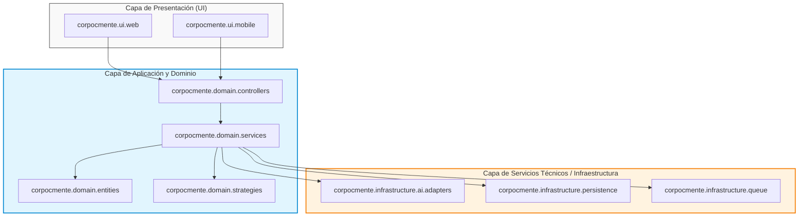
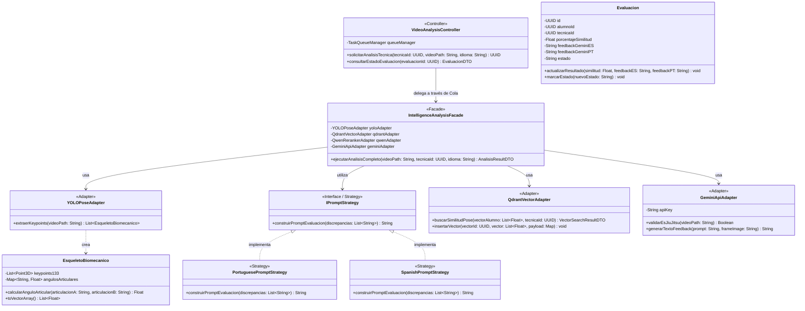
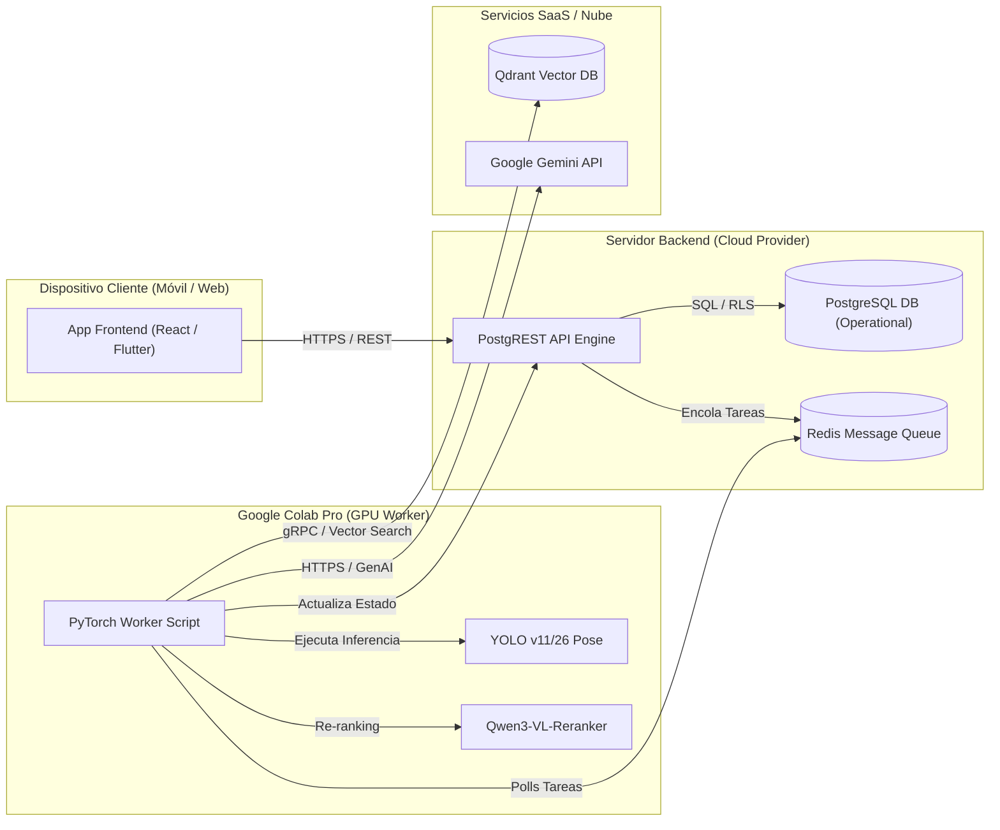

# DOCUMENTO DE ARQUITECTURA DE SOFTWARE (SAD)
## SISTEMA DE ANÁLISIS BIOMECÁNICO DE TÉCNICAS DE JIU-JITSU BRASILEÑO (CORPO E MENTE)

---

Este documento formaliza la arquitectura del sistema aplicando las recomendaciones del **Documento de Arquitectura de Software (SAD)** y el **Diseño Lógico Orientado a Objetos** según la metodología de **Craig Larman** en *"Applying UML and Patterns"* (Capítulos 19, 20, 30, 31 y 32).

---

## 1. TABLA DE FACTORES ARQUITECTÓNICOS (Capítulo 32)

Identificación de los requisitos no funcionales (NFRs) críticos y las soluciones arquitectónicas diseñadas para mitigarlos.

| Factor Arquitectónico | Restricción / Desafío | Solución de Diseño / Patrón Adoptado |
| :--- | :--- | :--- |
| **Bajo Presupuesto Hardware** | No se dispone de servidor propio con GPU para inferencia pesada de IA. | **Procesamiento Asíncrono en Google Colab Pro:** El backend delega la inferencia de YOLO y Qwen3-VL a un Worker ejecutado en Colab Pro. |
| **Límite de Cuota (Gemini API)** | Nivel Gratuito de Gemini API impone cuotas estrictas de solicitudes por minuto (RPM). | **Patrón Message Queue (Cola de Tareas):** Encolado de tareas asíncronas con reintentos para no saturar las llamadas a Gemini. |
| **Búsqueda Vectorial Rápida** | Búsqueda por similitud de 133 keypoints de esqueleto biomecánico. | **Qdrant Vector DB:** Almacenamiento especializado con índice HNSW y métrica de distancia de Coseno. |
| **Internacionalización (i18n)** | Soporte fluído para alumnos y profesores en Portugués y Español. | **Patrón Strategy (GoF):** Algoritmos de construcción de prompts encapsulados en estrategias polimórficas por idioma. |
| **Multi-Tenancy / Privacidad** | Múltiples sucursales internacionales de la academia "Corpo e Mente". | **Row Level Security (RLS) en PostgreSQL:** Aislamiento de datos por sucursal a nivel de motor de base de datos. |

---

## 2. ARQUITECTURA LÓGICA EN CAPAS Y DIAGRAMA DE PAQUETES (Capítulos 30 y 31)

Se adopta una **Arquitectura en Capas (Layers)** para garantizar alta cohesión y bajo acoplamiento, asegurando que la capa de Dominio no dependa directamente de la interfaz de usuario ni de detalles técnicos específicos de las bibliotecas de IA.

### 2.1 Diagrama de Paquetes UML (Package Diagram)



---

## 3. DIAGRAMA DE CLASES DE DISEÑO (DCD - Design Class Diagram) [Capítulo 19]

El DCD traduce el Modelo de Dominio Conceptual en clases de software con visibilidad (`+` público, `-` privado), tipos de datos concretos, firmas de métodos y estereotipos de diseño GRASP/GoF.



---

## 4. VISTA DE DESPLIEGUE (DEPLOYMENT VIEW)

Ilustra la distribución física de los componentes de software en los nodos de ejecución distribuidos.



---

## 5. MAPEO DE DISEÑO A CÓDIGO (Capítulo 20)

Traducción directa de los diagramas de diseño a código fuente en Python (Backend / Worker).

### 5.1 Definición de la Interfaz y Estrategias (Patrón Strategy en Python)

```python
from abc import ABC, abstractmethod
from typing import List

class IPromptStrategy(ABC):
    @abstractmethod
    def construir_prompt_evaluacion(self, discrepancias: List[str]) -> str:
        pass

class PortuguesePromptStrategy(IPromptStrategy):
    def construir_prompt_evaluacion(self, discrepancias: List[str]) -> str:
        prompt = "Você é um mestre faixa preta de Jiu-Jitsu Brasileiro. "
        prompt += "Analise os seguintes erros biomecânicos detectados na técnica:\n"
        for d in discrepancias:
            prompt += f"- {d}\n"
        prompt += "Forneça instruções claras e corretivas em português."
        return prompt

class SpanishPromptStrategy(IPromptStrategy):
    def construir_prompt_evaluacion(self, discrepancias: List[str]) -> str:
        prompt = "Eres un maestro cinturón negro de Jiu-Jitsu Brasileño. "
        prompt += "Analiza los siguientes errores biomecánicos detectados en la técnica:\n"
        for d in discrepancias:
            prompt += f"- {d}\n"
        prompt += "Proporciona instrucciones claras y correctivas en español."
        return prompt
```

### 5.2 Fachada de Análisis de IA (Patrón Facade en Python)

```python
class IntelligenceAnalysisFacade:
    def __init__(self, yolo_adapter, qdrant_adapter, gemini_adapter):
        self.yolo = yolo_adapter
        self.qdrant = qdrant_adapter
        self.gemini = gemini_adapter

    def ejecutar_analisis_completo(self, video_path: str, tecnica_id: str, idioma: str) -> dict:
        # 1. Extraer esqueleto con YOLO
        esqueletos = self.yolo.extraer_keypoints(video_path)
        vector_alumno = esqueletos[0].to_vector_array()

        # 2. Buscar similitud en Qdrant
        resultado_vector = self.qdrant.buscar_similitud_pose(vector_alumno, tecnica_id)

        # 3. Seleccionar estrategia de idioma
        strategy = PortuguesePromptStrategy() if idioma == 'pt' else SpanishPromptStrategy()
        prompt = strategy.construir_prompt_evaluacion(resultado_vector.discrepancias)

        # 4. Generar feedback con Gemini API
        feedback_texto = self.gemini.generar_texto_feedback(prompt, resultado_vector.frame_path)

        return {
            "similitud": resultado_vector.score,
            "feedback": feedback_texto
        }
```

---

## 6. CONCLUSIÓN DE LA FASE DE ELABORACIÓN (UP)

Con la publicación de este documento (**SAD**), la especificación del **DCD**, el **Diagrama de Paquetes** y la **Vista de Despliegue**, se da por concluida satisfactoriamente la **Fase de Elaboración del Proceso Unificado (Craig Larman)**.

Todos los riesgos principales (Rate Limits de Gemini, Inferencia pesada sin GPU local, Búsqueda Vectorial, Soporte Multilingüe e Integridad de BD Híbrida) quedan arquitectónicamente mitigados y listos para la **Fase de Construcción**.
