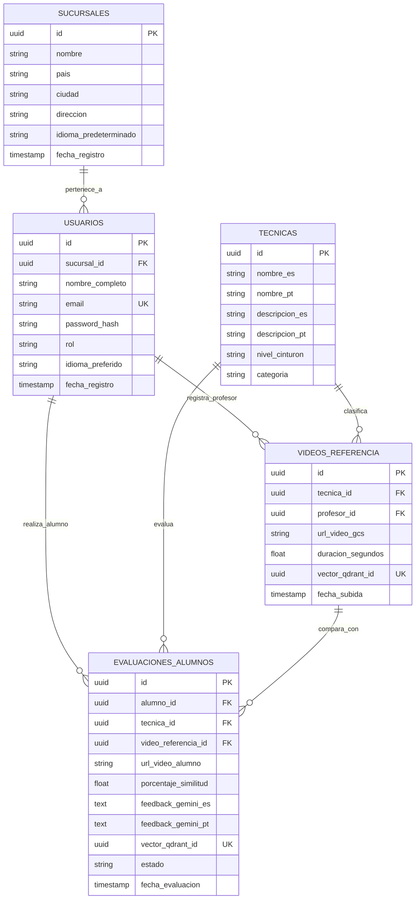

# DISEÑO DE BASE DE DATOS HÍBRIDA (RELACIONAL + VECTORIAL)
## SISTEMA DE ANÁLISIS BIOMECÁNICO DE TÉCNICAS DE JIU-JITSU BRASILEÑO (CORPO E MENTE)

---

### 1. FUNDAMENTACIÓN TEÓRICA Y ARQUITECTURA DE DATOS

Siguiendo las directrices metodológicas de **Michael V. Mannino** en *"Database Design, Application Development, and Administration (7th Edition)"*, el diseño de almacenamiento de datos para un sistema multi-sucursal e internacional exige separar los datos operacionales transaccionales de las estructuras de índice especializado de alta dimensión.

#### 1.1 Justificación de la Arquitectura Híbrida
* **Capa Operacional Relacional (PostgreSQL + PostgREST):** Garantiza las propiedades **ACID** (Atomicidad, Consistencia, Aislamiento, Durabilidad), la integridad referencial mediante claves foráneas y la eliminación de anomalías de modificación mediante la normalización hasta la **Tercera Forma Normal (3NF) / BCNF**. La capa PostgREST expone automáticamente un API REST declarativo y seguro con Row Level Security (RLS).
* **Capa Vectorial Especializada (Qdrant Vector DB):** Proporciona almacenamiento óptimo e indexación mediante grafos **HNSW (Hierarchical Navigable Small World)** para los vectores numéricos biomecánicos (133 keypoints de pose YOLO v11/26 y embeddings del modelo Reranker Qwen3-VL).

```
+-----------------------------------------------------------------------+
|                           CAPA DE APLICACIÓN                          |
|                       (Frontend / API Gateway)                        |
+-----------------------------------+-----------------------------------+
                                    |
            +-----------------------+-----------------------+
            |                                               |
            v                                               v
+-----------------------+                       +-----------------------+
|  PostgREST API Layer  |                       |   Qdrant REST/gRPC    |
+-----------+-----------+                       +-----------+-----------+
            |                                               |
            v                                               v
+-----------------------+                       +-----------------------+
|  PostgreSQL Database  |                       |  Qdrant Engine (HNSW) |
|  (Datos Operacionales)|                       | (Vectores Biomecánicos|
|   3NF/BCNF + RLS      |<==== UUID Linkage ===>|  + Payloads Mínimos)  |
+-----------------------+                       +-----------------------+
```

---

### 2. MODELO ENTIDAD-RELACIÓN (DER) - POSTGRESQL



---

### 3. ESQUEMA DDL SQL (POSTGRESQL + POSTGREST)

```sql
-- Habilitar extensión para UUIDs
CREATE EXTENSION IF NOT EXISTS "uuid-ossp";

-- 1. TABLA SUCURSALES
CREATE TABLE sucursales (
    id UUID PRIMARY KEY DEFAULT uuid_generate_v4(),
    nombre VARCHAR(100) NOT NULL,
    pais VARCHAR(50) NOT NULL, -- Ej: 'Brasil', 'Colombia'
    ciudad VARCHAR(50) NOT NULL,
    direccion TEXT NOT NULL,
    idioma_predeterminado VARCHAR(5) DEFAULT 'pt' CHECK (idioma_predeterminado IN ('es', 'pt')),
    fecha_registro TIMESTAMP WITH TIME ZONE DEFAULT CURRENT_TIMESTAMP
);

-- 2. TABLA USUARIOS
CREATE TABLE usuarios (
    id UUID PRIMARY KEY DEFAULT uuid_generate_v4(),
    sucursal_id UUID NOT NULL REFERENCES sucursales(id) ON DELETE RESTRICT,
    nombre_completo VARCHAR(150) NOT NULL,
    email VARCHAR(150) UNIQUE NOT NULL,
    password_hash VARCHAR(255) NOT NULL,
    rol VARCHAR(20) NOT NULL CHECK (rol IN ('admin', 'profesor', 'alumno')),
    idioma_preferido VARCHAR(5) DEFAULT 'pt' CHECK (idioma_preferido IN ('es', 'pt')),
    fecha_registro TIMESTAMP WITH TIME ZONE DEFAULT CURRENT_TIMESTAMP
);

-- 3. TABLA TÉCNICAS DE JIU-JITSU
CREATE TABLE tecnicas (
    id UUID PRIMARY KEY DEFAULT uuid_generate_v4(),
    nombre_es VARCHAR(100) NOT NULL,
    nombre_pt VARCHAR(100) NOT NULL,
    descripcion_es TEXT,
    descripcion_pt TEXT,
    nivel_cinturon VARCHAR(20) DEFAULT 'blanco' CHECK (nivel_cinturon IN ('blanco', 'azul', 'morado', 'marron', 'negro')),
    categoria VARCHAR(50) NOT NULL -- Ej: 'Pasaje de Guardia', 'Finalización', 'Derribo'
);

-- 4. TABLA VIDEOS DE REFERENCIA (PATRÓN DE PROFESORES)
CREATE TABLE videos_referencia (
    id UUID PRIMARY KEY DEFAULT uuid_generate_v4(),
    tecnica_id UUID NOT NULL REFERENCES tecnicas(id) ON DELETE RESTRICT,
    profesor_id UUID NOT NULL REFERENCES usuarios(id) ON DELETE RESTRICT,
    url_video_gcs TEXT NOT NULL,
    duracion_segundos NUMERIC(5,2) NOT NULL,
    vector_qdrant_id UUID UNIQUE NOT NULL, -- Enlace 1:1 con Qdrant Point ID
    fecha_subida TIMESTAMP WITH TIME ZONE DEFAULT CURRENT_TIMESTAMP
);

-- 5. TABLA EVALUACIONES DE ALUMNOS (CORREGIDA)
CREATE TABLE evaluaciones_alumnos (
    id UUID PRIMARY KEY DEFAULT uuid_generate_v4(),
    alumno_id UUID NOT NULL REFERENCES usuarios(id) ON DELETE CASCADE,
    tecnica_id UUID NOT NULL REFERENCES tecnicas(id) ON DELETE RESTRICT,
    video_referencia_id UUID NOT NULL REFERENCES videos_referencia(id) ON DELETE RESTRICT,
    url_video_alumno TEXT NOT NULL,
    porcentaje_similitud NUMERIC(5,2), -- Ej: 87.50%
    feedback_gemini_es TEXT,
    feedback_gemini_pt TEXT,
    vector_qdrant_id UUID UNIQUE, -- Se permite NULL en la creación inicial (asíncrono)
    estado VARCHAR(25) DEFAULT 'procesando' CHECK (estado IN ('procesando', 'en_espera_worker', 'completado', 'invalida', 'error_procesamiento', 'error')),
    fecha_evaluacion TIMESTAMP WITH TIME ZONE DEFAULT CURRENT_TIMESTAMP
);

-- ÍNDICES PARA OPTIMIZACIÓN DE CONSULTAS POSTGREST
CREATE INDEX idx_usuarios_sucursal ON usuarios(sucursal_id);
CREATE INDEX idx_evaluaciones_alumno ON evaluaciones_alumnos(alumno_id);
CREATE INDEX idx_evaluaciones_tecnica ON evaluaciones_alumnos(tecnica_id);

-- POLÍTICAS DE SEGURIDAD RLS EXTENDIDAS (Row Level Security PARA POSTGREST)
ALTER TABLE evaluaciones_alumnos ENABLE ROW LEVEL SECURITY;

-- Política 1: El alumno ve sus propias evaluaciones
CREATE POLICY alumno_ver_sus_evaluaciones ON evaluaciones_alumnos
    FOR SELECT USING (alumno_id = current_setting('request.jwt.claim.sub', true)::uuid);

-- Política 2: Profesores y Admins ven evaluaciones de alumnos de su misma sucursal
CREATE POLICY personal_ver_evaluaciones_sucursal ON evaluaciones_alumnos
    FOR SELECT USING (
        EXISTS (
            SELECT 1 FROM usuarios u_staff
            JOIN usuarios u_alumno ON u_alumno.id = evaluaciones_alumnos.alumno_id
            WHERE u_staff.id = current_setting('request.jwt.claim.sub', true)::uuid
              AND u_staff.sucursal_id = u_alumno.sucursal_id
              AND u_staff.rol IN ('profesor', 'admin')
        )
    );

```

---

### 4. DISEÑO DE COLECCIONES EN QDRANT (VECTOR DB)

En Qdrant se almacenan las firmas matemáticas numéricas extraídas por YOLO v11/26 y Qwen3-VL.

#### 4.1 Colección: `vectores_poses_jiujitsu`
* **Métrica de Distancia:** `Cosine` (Coseno) o `Euclidean` (según normalización de ángulos biomecánicos).
* **Tamaño del Vector:** 128 o 256 dimensiones (Embedding reducido de secuencia de keypoints).
* **Parámetros HNSW:**
  * `m`: 16 (conexiones por nodo).
  * `ef_construct`: 100 (precisión en la construcción del índice).

```json
{
  "name": "vectores_poses_jiujitsu",
  "vectors": {
    "size": 128,
    "distance": "Cosine"
  },
  "hnsw_config": {
    "m": 16,
    "ef_construct": 100
  }
}
```

#### 4.2 Estructura del Payload en Qdrant (Linkage con PostgreSQL)

```json
{
  "id": "c0a80121-863a-4a87-8d91-112233445566",
  "vector": [0.012, -0.451, 0.892, 0.114, "... (128 dims)"],
  "payload": {
    "postgres_id": "c0a80121-863a-4a87-8d91-112233445566",
    "tipo_entidad": "evaluacion_alumno",
    "tecnica_id": "a1b2c3d4-e5f6-7890-abcd-ef1234567890",
    "sucursal_id": "99887766-5544-3322-1100-aabbccddeeff",
    "num_frames_analizados": 150
  }
}
```

---

### 5. MECANISMO DE SINCRONIZACIÓN Y CONSULTA

1. **Captura y Análisis:** El alumno sube el video mediante la interfaz de la app. PostgREST inserta el registro inicial en `evaluaciones_alumnos` con estado `'procesando'`.
2. **Procesamiento Asíncrono (Google Colab Pro / Worker Python):**
   * YOLO v11/26 extrae la secuencia de coordenadas y ángulos biomecánicos.
   * Se genera el vector numérico definitivo.
   * Se inserta el punto vectorial en **Qdrant** utilizando el mismo `UUID` generado por PostgreSQL.
3. **Búsqueda por Similitud (Qdrant):**
   * Se consulta Qdrant para comparar el vector del alumno con los vectores de la técnica de referencia.
   * Qdrant retorna la distancia métrica / porcentaje de coincidencia biomecánica.
4. **Enriquecimiento con IA (Gemini API):**
   * Con la discrepancia detectada por Qdrant, Gemini genera el reporte cualitativo en **Español** y **Portugués**.
5. **Actualización Relacional:** Se actualiza el registro en `evaluaciones_alumnos` con el porcentaje final, los textos de feedback y estado `'completado'`.

---

### 6. CUMPLIMIENTO DE CRITERIOS MANNINO

| Criterio de Mannino | Implementación en la Arquitectura |
| :--- | :--- |
| **Integridad Referencial** | Garantizada mediante Foreign Keys `ON DELETE RESTRICT/CASCADE` en PostgreSQL. |
| **Normalización (3NF/BCNF)** | Eliminación de redundancia: datos de sucursales y usuarios aislados en tablas dedicadas. |
| **Transaccionalidad ACID** | Manejada por PostgreSQL para cobros, usuarios y cambios de roles. |
| **Rendimiento Vectorial** | Delegado a Qdrant (índices HNSW) sin sobrecargar el motor relacional. |
| **Soporte Multilingüe/Multisucursal** | Tablas relacionales con soporte i18n (`_es`, `_pt`) y filtrado por `sucursal_id`. |
