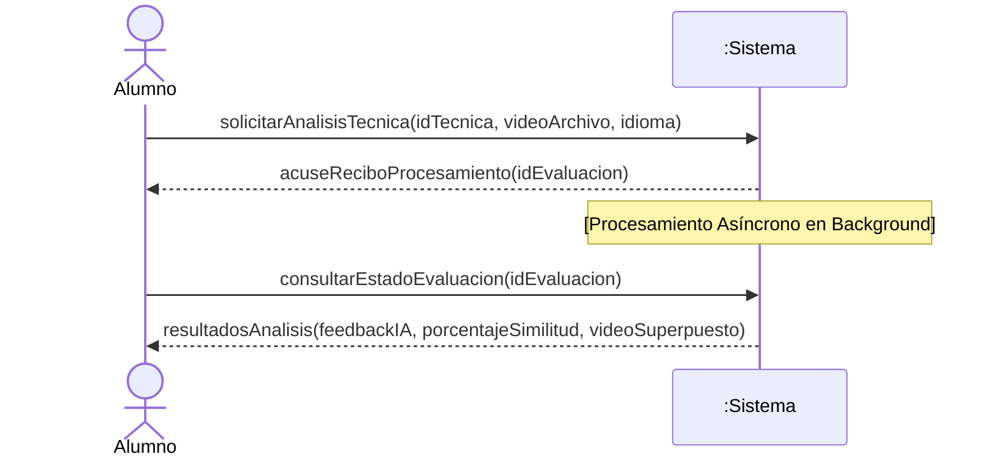
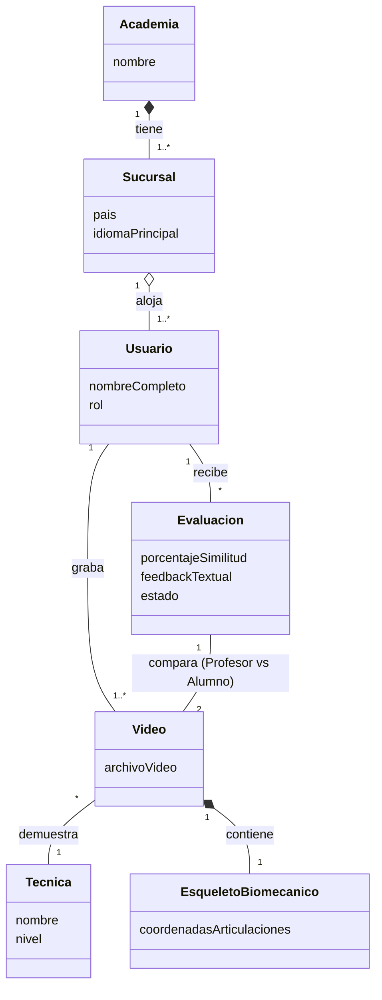
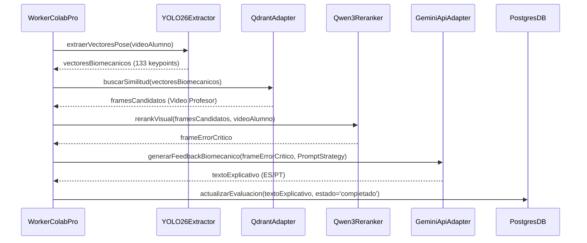

# Análisis y Diseño Orientado a Objetos (Proceso Unificado)
## Sistema de Análisis Biomecánico de Técnicas de Jiu-Jitsu Brasileño (Corpo e Mente)

Este documento aplica estrictamente la metodología iterativa e incremental de **Craig Larman** descrita en *"Applying UML and Patterns"*, estructurando el ciclo de vida del software mediante las Fases e Iteraciones del **Proceso Unificado (UP)**.

---

## FASE 1: INCEPCIÓN (Visión y Delimitación)

El objetivo de la Incepción es establecer la visión, el caso de negocio y delimitar el alcance del Producto Mínimo Viable (MVP).

* **Visión:** Desarrollar un sistema de análisis biomecánico por inteligencia artificial para la red internacional de academias "Corpo e Mente" (Soporte i18n PT/ES).
* **Restricciones de Negocio y Arquitectura:**
  * **Zero-Shot AI:** Solo se dispone de 2 videos por técnica. No hay datos para entrenar un modelo; se usará inferencia directa con **YOLO v11/26** (Pose Estimation).
  * **Procesamiento de Bajo Costo:** Inferencia pesada aislada en **Google Colab Pro** (Worker asíncrono).
  * **Modelos IA Gratuitos:** **Gemini API Free Tier** para lenguaje natural y retroalimentación, requiriendo un control estricto de cuotas (Rate Limits).
  * **Almacenamiento:** Arquitectura Híbrida (PostgreSQL/PostgREST para operacional + Qdrant para vectores).

---

## FASE 2: ELABORACIÓN - ITERACIÓN 1 (Núcleo Biomecánico)

La primera iteración aborda los riesgos fundamentales del negocio y modela la lógica básica para el análisis de una técnica.

### 2.1 Caso de Uso UC1: Analizar Técnica y Generar Feedback (*Fully Dressed*)

*   **Caso de Uso UC1:** Analizar Técnica y Generar Feedback
*   **Actor Principal:** Alumno
*   **Partes Interesadas e Intereses:**
    *   **Alumno:** Desea subir un video de su ejecución, recibir una evaluación objetiva y precisa en su idioma (PT/ES), y obtener retroalimentación biomecánica clara sin demoras excesivas.
    *   **Profesor / Academia ("Corpo e Mente"):** Desea garantizar que los alumnos ejecuten las técnicas de acuerdo con el patrón de referencia y mantener un estándar de enseñanza uniforme en todas las sucursales.
    *   **Administrador del Sistema:** Requiere un control estricto sobre el consumo de recursos (Google Colab Pro, cuotas de Gemini API Free Tier) y prevención de SPAM en el almacenamiento.
*   **Precondición:** El alumno está autenticado en la plataforma y pertenece a una sucursal válida.
*   **Garantía de Éxito (Postcondiciones):** El video de la técnica es procesado, los vectores biomecánicos son extraídos y comparados contra la referencia, se genera el informe explicativo multimodal en el idioma correspondiente y los resultados son almacenados de forma persistente en PostgreSQL y Qdrant.

**Flujo Principal (Escenario Principal de Éxito):**
1. El Alumno selecciona el idioma de evaluación (PT/ES), elige la Técnica a evaluar y sube el archivo de video de su intento.
2. El Sistema valida mediante la API de Gemini Flash que el video contenga una ejecución válida de Jiu-Jitsu (prevención de contenido no relacionado / SPAM).
3. El Sistema registra la evaluación con estado 'procesando' y encola la tarea de análisis asíncrono para el Worker de Colab Pro.
4. El Worker extrae los vectores del esqueleto biomecánico (keypoints) del video del Alumno utilizando el modelo YOLO (Pose Estimation).
5. El Worker consulta la base de datos vectorial Qdrant y calcula la similitud del coseno entre la pose del Alumno y el esqueleto de referencia del Profesor.
6. El Sistema orquesta el re-ranking visual y genera el feedback biomecánico estructurado utilizando la estrategia de prompt en el idioma seleccionado mediante Gemini.
7. El Sistema actualiza el estado de la evaluación a 'completado' y presenta los resultados visuales (video con esqueleto superpuesto) y textuales al Alumno.

**Extensiones (Flujos Alternativos y de Excepción):**
*   **2a. El contenido del video no es reconocido como Jiu-Jitsu:**
    1. El Sistema rechaza el procesamiento, marca la evaluación como 'inválida' y notifica al Alumno el motivo del rechazo.
*   **3a. El servicio de cola o Worker en Colab Pro no se encuentra disponible:**
    1. El Sistema registra el estado como 'en_espera_worker' y reintenta la conexión de acuerdo con la política de tolerancia a fallos.
    2. Si el tiempo de espera excede el límite (timeout), se envía una notificación al Alumno informando que su video será procesado en diferido.
*   **4a. YOLO no logra detectar la estructura corporal en el video (baja iluminación o encuadre incompleto):**
    1. Worker notifica falla de extracción, el Sistema cambia el estado a 'error_procesamiento' y solicita al Alumno volver a grabar el video siguiendo las recomendaciones de captura.
*   **6a. Se supera el límite de cuota (Rate Limit) en Gemini API (Free Tier):**
    1. El Sistema aplica una pausa o delega la petición a una estrategia de prompts de contingencia, reteniendo la tarea en la cola hasta la renovación del token.

**Requisitos Especiales:**
*   El procesamiento del video en el Worker de Colab Pro no debe exceder los 90 segundos por intento.
*   La interfaz debe soportar internacionalización fluida (i18n) en Portugués y Español.
*   El control de privacidad debe garantizar que el video y las evaluaciones solo sean accesibles por el Alumno y los instructores de su sucursal (mediante políticas RLS en PostgreSQL).

**Lista de Variaciones Tecnológicas y de Datos:**
*   Formatos de video de entrada: MP4, MOV o WebM con resolución mínima de 720p.
*   Dispositivos de captura: Cámaras de dispositivos móviles (iOS/Android) o cámaras web.

**Frecuencia de Ocurrencia:** Alta en horarios de entrenamiento (estimado de 5 a 20 evaluaciones por alumno a la semana).

**Cuestiones Abiertas:**
*   ¿Se debe permitir la comparación del video del alumno contra más de un video de referencia de distintos profesores?

### 2.2 Diagrama de Secuencia del Sistema (SSD)

Modela los eventos en la frontera del sistema para el escenario principal.

### 2.3 Contratos de Operación
* **Operación:** `solicitarAnalisisTecnica(idTecnica, videoArchivo, idioma)`
* **Pre-condiciones:** Existe una `Tecnica` con el `idTecnica`. El Alumno está autenticado.
* **Post-condiciones:** 
  * Se creó una instancia `ev` de `Evaluacion`.
  * Se asoció `ev` al `Alumno` y a la `Tecnica`.
  * El estado de `ev` pasó a 'procesando'.

### 2.4 Modelo de Dominio Conceptual
Muestra los conceptos del problema del mundo real (sin identificadores de base de datos ni métodos de software).

### 2.5 Diseño Lógico Orientado a Objetos (GRASP)
Asignación de responsabilidades mediante patrones GRASP.
* **Controller:** Un `VideoAnalysisController` recibe el evento `solicitarAnalisisTecnica`. Delega el almacenamiento y encola la petición.
* **Creator & Information Expert:** La entidad `Video` contiene la responsabilidad de extraer el `EsqueletoBiomecanico` (alta cohesión), ya que posee la imagen base.

---

## FASE 2: ELABORACIÓN - ITERACIÓN 2 (Comparación IA y RAG Multimodal)

La iteración 2 aborda el riesgo tecnológico de la integración de Inteligencia Artificial (YOLO, Qdrant, Qwen3-VL, Gemini).

### 3.1 Diseño de Objetos y Patrones GoF
Para mantener el bajo acoplamiento con servicios externos (API de Gemini, Qdrant DB), se aplican Patrones GoF:

* **Adapter (GoF):** `QdrantVectorAdapter` traduce los requerimientos del dominio (búsqueda por similitud de pose) a la sintaxis HNSW de Qdrant. `GeminiApiAdapter` encapsula la lógica de red para consultar a Google.
* **Strategy (GoF):** Para soportar la internacionalización sin bucles condicionales (`if idioma == 'pt'`), se instancian clases polimórficas `PortuguesePromptStrategy` y `SpanishPromptStrategy` que construyen el texto inyectado en la IA.
* **Facade (GoF):** `IntelligenceAnalysisFacade` proporciona una interfaz unificada (`generarAnalisis(video, idioma)`) ocultando la orquestación compleja entre YOLO, Qdrant y Qwen3-VL.

### 3.2 Diagrama de Interacción de Software (Secuencia UML)

---

## FASE 2: ELABORACIÓN - ITERACIÓN 3 (Persistencia Híbrida y Resiliencia)

La iteración 3 estabiliza la infraestructura de software y maneja problemas de rendimiento, concurrencia de múltiples sucursales y almacenamiento robusto.

### 4.1 Arquitectura de Cola Asíncrona (Resiliencia Rate Limits)
El Nivel Gratuito de la API de Gemini impone límites estrictos (RPM/RPD). Larman aconseja manejar estos riesgos en la capa de **Servicios Técnicos (Infraestructura)**.
* Se implementará una cola de mensajes (Broker, ej. Redis o RabbitMQ, consumida por el script de Colab Pro).
* El controlador web no espera a Gemini; añade la tarea a la cola y retorna inmediatamente (Patrón `Fire-and-Forget`).

### 4.2 Persistencia de Objetos (Híbrida)
* **Datos Operacionales (PostgreSQL + PostgREST):** El modelo de dominio conceptual se traduce a tablas relacionales normalizadas (3NF) gestionando Usuarios, Roles, Sucursales y Evaluaciones. Se implementa seguridad **RLS (Row Level Security)** en PostgreSQL para garantizar que un alumno solo vea sus propias evaluaciones y el administrador de Brasil no vea los datos de Colombia.
* **Datos Vectoriales (Qdrant):** El objeto `EsqueletoBiomecanico` y su estado trigonométrico se guarda como un arreglo de punto flotante indexado por HNSW en Qdrant, vinculado a la BD transaccional por un `UUID`. *(Ver detalles técnicos en el documento de Diseño de Base de Datos).*

---

---

## FASE 3: CONSTRUCCIÓN - ITERACIONES E INCREMENTOS EJECUTABLES

La Fase de Construcción sigue el Proceso Unificado (UP) de Craig Larman, construyendo incrementos probados de grado de producción.

### 5.1 Iteración C1: Infraestructura de API y Mocks
- **Objetivo:** Codificar el núcleo de FastAPI, Controladores (`VideoAnalysisController`) y Fachadas (`IntelligenceAnalysisFacade`).
- **Logros:** Implementación de enrutamiento REST, validación con Pydantic, y pruebas unitarias aisladas (`test_intelligence_facade.py`) usando inyección de dependencias y objetos Mock, cumpliendo el principio de *Test-First Programming* de Larman.

### 5.2 Iteración C2: Seguridad (RLS/JWT), Base de Datos 3NF y Extracción Biomecánica (YOLO)
- **Caso de Uso (UC2 - Autenticación y Privacidad Multi-Tenant):**
  - **Actores:** Alumno / Profesor
  - **Flujo:** El usuario se autentica y el sistema garantiza, mediante **Row Level Security (RLS)** en PostgreSQL (`03_rls_policies.sql`), que un Alumno solo acceda a sus propias evaluaciones y un Profesor a las de su sucursal.
- **Implementación de YOLOPoseAdapter:**
  - Se materializó el *Experto de Información (Information Expert)* para la extracción vectorial de la pose usando `ultralytics` (`yolo11n-pose.pt`).
  - Aplicación efectiva del patrón *Adapter (GoF)* para encapsular el aplanamiento de tensores de 133 dimensiones y su mapeo al modelo conceptual `EsqueletoBiomecanico`.
- **Capa de Datos Transaccional (Mannino):**
  - Esquema en **Tercera Forma Normal (3NF)** y Boyce-Codd (BCNF) en SQL puro (`01_schema_3nf.sql`).
  - Funciones nativas de base de datos (`pgcrypto`) delegando la autenticación a PostgREST (`02_auth_jwt.sql`).

### 5.3 Iteración C3: Sistema de Diseño e Interfaz de Usuario (React + Vite)
- **Caso de Uso (UC3 - Carga e Inspección Visual de la Técnica):**
  - **Actores:** Alumno / Atleta
  - **Interfaz de Usuario:** Construcción de la Web App en React + Vite utilizando un Sistema de Diseño basado en tokens de Vanilla CSS (Tema Oscuro con Rojo Institucional `#d01118` y Glassmorphism).
- **Componentes Creados:**
  - `ProgressRing.jsx`: Anillo de progreso biomecánico mediante `<progress>` nativo animado con `conic-gradient` CSS.
  - `VideoUpload.jsx`: Módulo de carga mediante *Drag & Drop* con previsualización del archivo de video (`URL.createObjectURL`).
  - `FeedbackView.jsx`: Tarjeta de resultados cualitativos y cuantitativos que utiliza `
` y `
` semánticos.

### 5.4 Iteración C4: Filtro Inteligente Anti-SPAM (Gemini Multimodal API)
- **Caso de Uso (UC4 - Prevenir Contenido No Relacionado / SPAM):**
  - **Actores:** Sistema / Gemini API
  - **Flujo:** Antes de enviar un video a la GPU de procesamiento pesado, el sistema realiza una llamada asíncrona a `GeminiApiAdapter.validar_es_jiujitsu()` enviando el video a la *Files API* de Gemini para verificar si contiene ejecuciones de Jiu-Jitsu o Grappling.
- **Resiliencia y Manejo de Estado:**
  - Implementación de espera activa de estado (`PROCESSING` -> `ACTIVE`) en Gemini Files API.
  - Aplicación del patrón *Lazy Loading* en `YOLOPoseAdapter` y `QdrantVectorAdapter` para desacoplar el arranque del servidor HTTP de la disponibilidad de modelos pesados o BDs externas.
  - Endpoint REST expuesto en `/api/v1/evaluaciones/validar-spam` devolviendo HTTP 422 si el contenido es rechazado.

---
*(La fase de **Transición** contemplará la corrección de errores finales, pruebas beta en las sedes de Corpo e Mente, y el despliegue en producción).*
