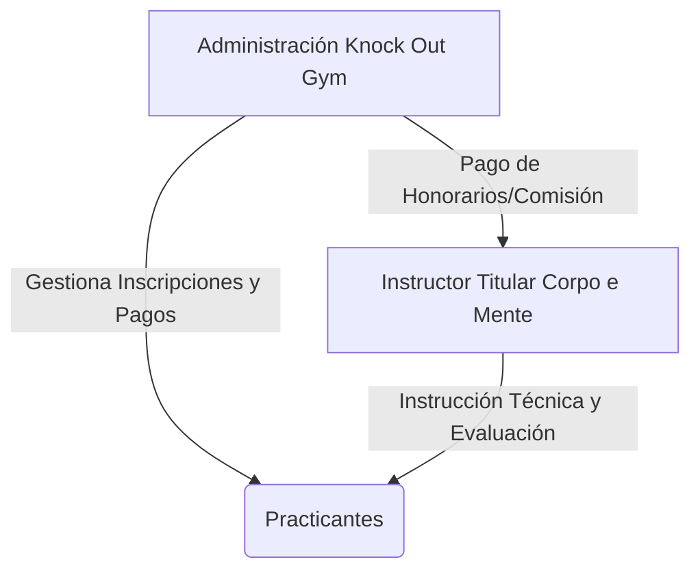
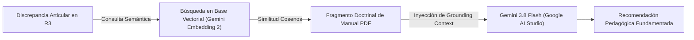
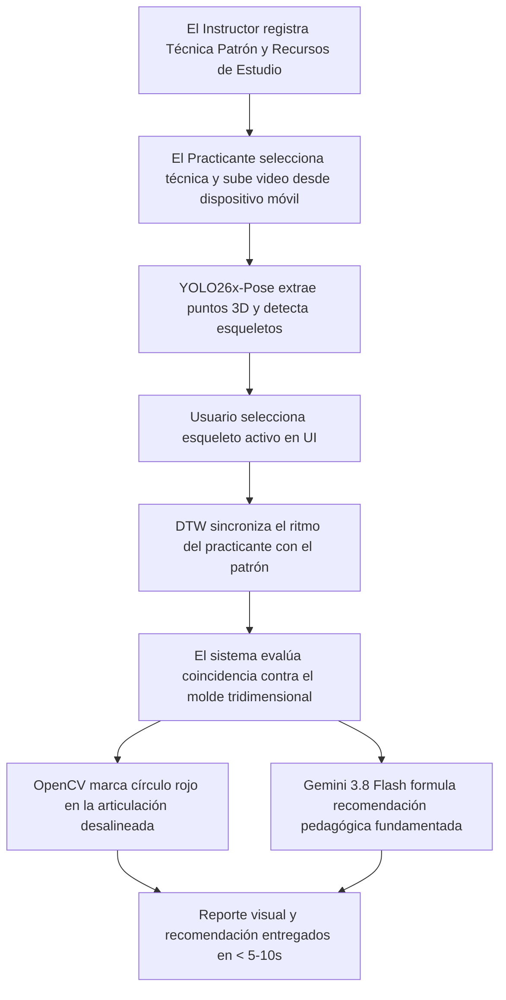
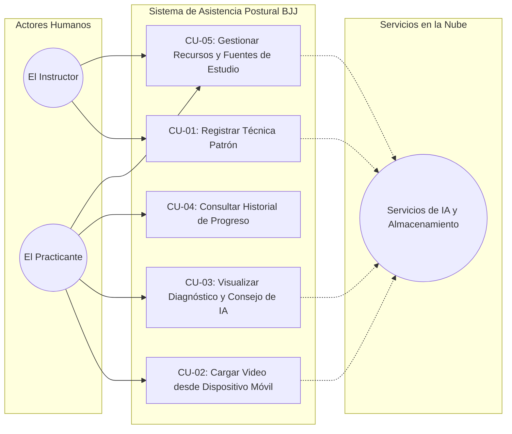
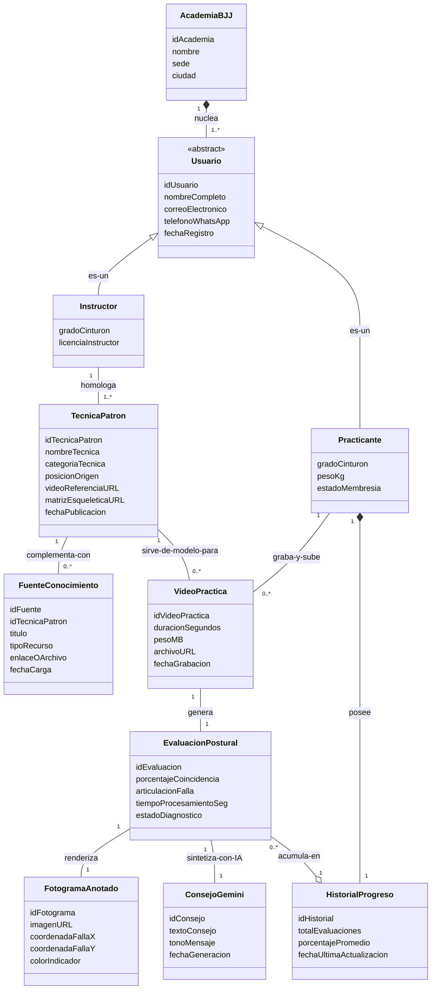
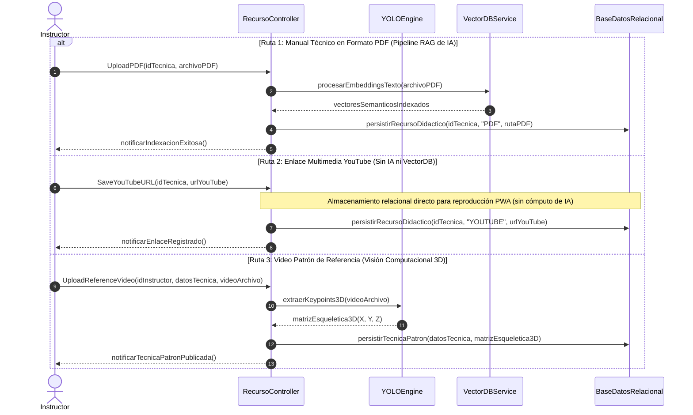
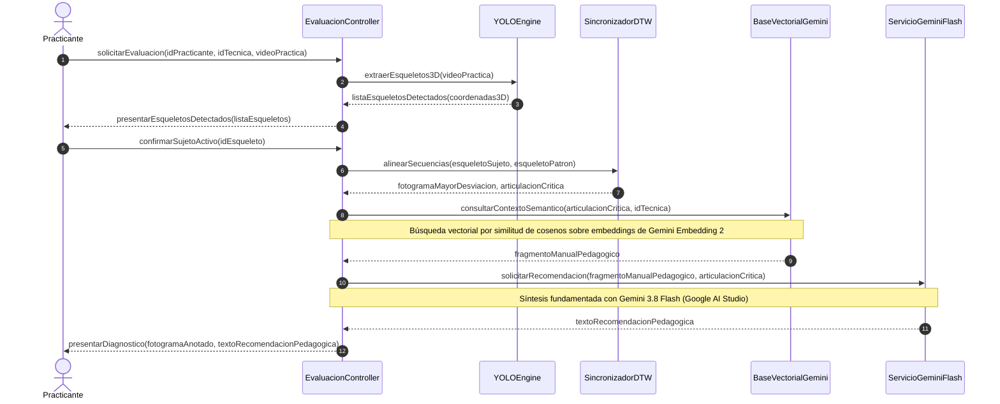
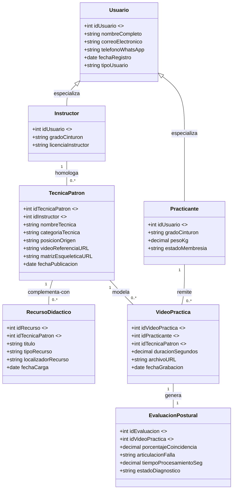

# Capítulo I: Definición del Proyecto de Investigación

## 1.1 Definición del Problema

### 1.1.1 Situación Problemática
En la enseñanza de artes marciales, particularmente en el Jiu-Jitsu Brasileño (BJJ), la corrección técnica constituye un pilar fundamental para el aprendizaje efectivo y la prevención de lesiones. En el modelo tradicional de instrucción presencial, un único docente debe supervisar a múltiples practicantes que ejecutan técnicas de forma simultánea en parejas. Esta dinámica impone una limitación física y de atención para el instructor: en la práctica, resulta imposible brindar una supervisión detallada, continua y de carácter cuantitativo a cada estudiante durante toda la sesión.

En la academia piloto Corpo e Mente, ubicada en las instalaciones de Knock Out Gym en Santa Cruz de la Sierra, Bolivia, se cuenta con una comunidad de aproximadamente 77 miembros registrados y una asistencia promedio diaria de 15 personas. Se evidencia una notable tasa de rotación y deserción temporal, en la cual los practicantes interrumpen y retoman la disciplina tras varios meses de inactividad. Durante estas fases, los practicantes tienden a internalizar errores posturales y desajustes técnicos recurrentes —tales como la incorrecta colocación de apoyos, alineaciones articulares desfavorables o ángulos inadecuados del torso— que escapan a la vista del instructor debido a las restricciones de la supervisión simultánea. La ausencia de un instrumento visual, objetivo y persistente que permita al practicante contrastar su ejecución con el modelo técnico de referencia impartido por el instructor conduce a una desaceleración en la curva de dominio técnico y a la consolidación prolongada de patrones de movimiento erróneos.

### 1.1.2 Situación Deseada
Se propone el desarrollo e implementación de un sistema computacional de asistencia al entrenamiento basado en visión artificial, concebido para comparar la ejecución técnica del practicante con un video de referencia provisto por el instructor. El sistema opera como un sistema de auditoría técnica asincrónica: el practicante graba su secuencia de práctica en el tatami, la sube a la plataforma y recibe la retroalimentación diagnóstica en tiempo diferido. Este modelo asincrónico evita falsas expectativas de procesamiento instantáneo durante el combate y permite ejecutar un análisis cinemático profundo y riguroso.

El software detecta las diferencias en la postura corporal respecto al modelo del instructor y genera reportes visuales con indicadores claros y directos sobre la imagen. Adicionalmente, el sistema integra capacidades de procesamiento de lenguaje natural y recuperación de información técnica a partir de manuales y libros oficiales indexados. Esta retroalimentación objetiva y constante está disponible para el practicante a través de una interfaz informática en su dispositivo móvil, facilitando el autoaprendizaje guiado y liberando tiempo para que el instructor concentre su labor pedagógica en correcciones tácticas y estratégicas avanzadas.

### 1.1.3 Objeto de Investigación
El objeto de investigación comprende el diseño, desarrollo e implementación de un sistema de visión por computadora y recuperación de información basado en redes neuronales profundas para la estimación de pose humana tridimensional (3D) mediante reconstrucción monocular de coordenadas de profundidad y el modelado de bases de conocimiento técnico mediante Vector Embeddings, diseñado para detectar, cuantificar y señalar visualmente discrepancias biomecánicas en la ejecución de técnicas de artes marciales mediante comparación cinemática en el espacio $\mathbb{R}^3$ frente a un patrón de referencia, operando bajo una arquitectura distribuida local-nube (Edge-Cloud).

### 1.1.4 Alcance

* **Delimitación temporal:** La investigación se desarrollará durante el periodo académico correspondiente a la elaboración, implementación y defensa del proyecto de grado en la UPSA.
* **Delimitación espacial:** La recolección del corpus de video y la prueba piloto experimental se llevarán a cabo en las instalaciones de la academia Corpo e Mente (Knock Out Gym, Santa Cruz de la Sierra, Bolivia).
* **Delimitación temática y técnica:** El sistema operará con un enfoque agnóstico de comparación técnica: procesará cualquier técnica de artes marciales siempre que se disponga de un video de referencia del instructor y un video de ejecución del practicante. La estimación postural se enfocará en la extracción de puntos clave articulares (*keypoints*) en tres dimensiones (3D), obteniendo las coordenadas de posición (X, Y, Z) a partir de grabaciones de video convencionales de una sola cámara (visión monocular) mediante el modelo YOLO26x-Pose. El sistema analizará las variaciones angulares en el espacio tridimensional a lo largo del tiempo, eliminando la dependencia estricta de un ángulo de grabación perpendicular de 90 grados. La contextualización de las recomendaciones automáticas de texto se limitará a manuales e instrucciones en formato PDF previamente vectorizados mediante el modelo Gemini Embedding 2 provisto por Google AI Studio, mientras que la generación de retroalimentación en lenguaje natural se procesará mediante Gemini 3.8 Flash para neutralizar alucinaciones. Se excluyen del alcance el reconocimiento automático o clasificación de técnicas no catalogadas, el escaneo volumétrico por malla poligonal densa y la medición de variables biomecánicas de fuerza, potencia o fatiga física.

### 1.1.5 Justificación

* **Justificación teórica:** El proyecto contribuye al área de la visión artificial y el procesamiento de lenguaje natural aplicados a las ciencias del deporte y la biomecánica motriz. Valida la eficacia de algoritmos de estimación de pose tridimensional monocular combinados con técnicas de Generación Aumentada por Recuperación (RAG) en bases de datos vectoriales dentro de disciplinas de contacto con interacción cercana, proporcionando evidencia empírica en un contexto de investigación deportiva local.
* **Justificación práctica:** Proporciona a la academia Corpo e Mente una solución de software accesible que optimiza los tiempos de supervisión del cuerpo docente, mitiga la consolidación de hábitos técnicos perjudiciales y brinda a los practicantes un medio de autoevaluación objetivo y sistemático.
* **Justificación metodológica:** La investigación adopta un proceso riguroso de ingeniería de software caracterizado por un diseño modular orientado a objetos impulsado por el Proceso Unificado (Larman, 2004) y las pautas de modelado de bases de datos (Mannino, 2019). La implementación de pruebas automáticas garantiza la validez matemática en los cálculos de geometría articular, la indexación semántica de textos y la sincronización algorítmica de trayectorias espaciales.

## 1.2 Objetivos

### 1.2.1 Objetivo General
Desarrollar un sistema de visión artificial y recuperación semántica de información para la detección y comparación objetiva de discrepancias biomecánicas en la ejecución de técnicas de artes marciales, que permita a instructores y practicantes obtener retroalimentación diagnóstica visual y textual mediante el análisis de video e indexación vectorial en tiempo diferido.

### 1.2.2 Objetivos Específicos

1. **Analizar** los requerimientos funcionales, no funcionales y pedagógicos del proceso de enseñanza-aprendizaje técnico, estableciendo un protocolo de captura de video monocular y un corpus de documentación técnica escrita para Jiu-Jitsu.
2. **Diseñar** la arquitectura de software, el esquema relacional de base de datos bajo los fundamentos de Mannino (2019) y los modelos de datos vectoriales que permitan la integración desacoplada entre la captura de video, el procesamiento esquelético tridimensional, el almacenamiento de embeddings de texto y la entrega de reportes.
3. **Implementar** la arquitectura y modelado computacional para la estimación de pose humana en tres dimensiones (3D) con YOLO26x-Pose, el alineamiento temporal con DTW, la vectorización de manuales mediante el modelo Gemini Embedding 2 de Google AI Studio y la síntesis pedagógica contextualizada a través de Gemini 3.8 Flash.
4. **Validar** la precisión y exactitud diagnóstica del sistema mediante pruebas experimentales de concordancia frente al criterio evaluativo de instructores certificados, evaluando la usabilidad y la adopción de la herramienta por parte de los practicantes en la academia piloto.

## 1.3 Metodología
La investigación se clasifica como un estudio aplicado y de desarrollo tecnológico, fundamentado en un diseño metodológico mixto: cuantitativo para la determinación de métricas de precisión articular, distancias de embeddings y rendimiento computacional; y cualitativo para la evaluación de la experiencia de usuario en el entorno de entrenamiento.

El proceso de construcción del sistema adopta el Proceso Unificado propuesto por Larman (2004), estructurándose en cuatro fases iterativas e incrementales:

1. **Inicio (Inception):** Definición del modelo de negocio, delimitación del alcance del sistema, identificación preliminar de los casos de uso principales y evaluación de la viabilidad técnica de la estimación postural 3D monocular y la arquitectura RAG.
2. **Elaboración (Elaboration):** Especificación profunda de requisitos bajo la norma IEEE 830, diseño de la arquitectura base del sistema, modelado de dominio conceptual y mitigación de los riesgos arquitectónicos más severos (tales como la latencia de inferencia en la nube y la integridad en la selección del sujeto activo).
3. **Construcción (Construction):** Desarrollo modular del software en lenguaje Python. En esta fase se codifican los pipelines de visión computacional, los módulos de embeddings vectoriales y la lógica relacional de almacenamiento. Los incrementos se guían por el diseño guiado por pruebas (TDD).
4. **Transición (Transition):** Despliegue piloto del sistema en las instalaciones de Corpo e Mente, migración de los datos de las técnicas patrón y realización de pruebas de aceptación de usuario con los practicantes activos.

---

# Capítulo II: Descripción de la Empresa

## 2.1 Descripción de la Empresa
La academia piloto objeto de estudio es **Corpo e Mente**, un centro especializado en la enseñanza técnica de Jiu-Jitsu Brasileño (BJJ). En la sucursal analizada, ubicada en Santa Cruz de la Sierra, Bolivia, la academia opera bajo un modelo de alianza estratégica y externalización de servicios (*outsourcing*) con el gimnasio **Knock Out Gym**.

Bajo este esquema operativo, Knock Out Gym centraliza la infraestructura física, la gestión comercial, el marketing, la administración de membresías y la recaudación económica directa de los practicantes. Por su parte, Corpo e Mente aporta el capital intelectual, el programa pedagógico estructurado y el capital humano especializado (instructores) para la instrucción técnica en el tatami. Esta simbiosis permite a Corpo e Mente enfocarse exclusivamente en la excelencia técnica, delegando la carga administrativa y financiera al socio estratégico.

## 2.2 Descripción Organizacional de la Empresa
Dada la naturaleza del modelo de alianza descrito, la estructura organizativa de Corpo e Mente en esta sucursal es minimalista y especializada. No existe una jerarquía administrativa interna, ya que todas las funciones de soporte, cobranza y mantenimiento son absorbidas por la estructura organizativa de Knock Out Gym. La estructura operativa de la academia se reduce a un esquema unipersonal en el nivel técnico, representado exclusivamente por el Instructor Titular. Este rol posee autonomía total sobre el diseño curricular, la ejecución de clases y la evaluación técnica, actuando como el único punto de contacto técnico para la comunidad de usuarios.

_Figura 1._ Estructura organizativa de la academia y flujo de delegación operativa.

## 2.3 Descripción de los Servicios y Productos de la Empresa
El servicio núcleo de Corpo e Mente consiste en la formación técnico-deportiva en Jiu-Jitsu Brasileño, estructurada en tres categorías principales:

* **Programa de Fundamentos para Adultos:** Enfocado en la enseñanza de palancas mecánicas, escapes, posiciones de control y derribos básicos para alumnos principiantes.
* **Programa Avanzado de Competición:** Sesiones orientadas al desarrollo de transiciones dinámicas, combinaciones tácticas y preparación física para atletas de torneos.
* **Programa Infantil (BJJ Kids):** Clases adaptadas pedagógicamente para el desarrollo de la psicomotricidad, la disciplina y la defensa personal no violenta en niños.

Como producto secundario, la academia provee certificaciones de grado y exámenes de cinturón homologados, evaluando periódicamente el dominio conceptual y físico de las técnicas por parte de los alumnos registrados.

## 2.4 Manual de Funciones
Al existir un único puesto de trabajo representativo de la marca Corpo e Mente en esta sucursal, las responsabilidades se concentran en un perfil multifuncional de alto rendimiento.

* **Cargo:** Instructor Titular
* **Objetivo del Cargo:** Dirigir, planificar y supervisar la formación técnica, física y táctica de los practicantes de Jiu-Jitsu, garantizando la seguridad, la progresión técnica y la retención de practicantes dentro del ecosistema de Knock Out Gym.
* **Funciones Principales:**
  1. **Área Pedagógica:** Diseñar la currícula técnica diaria y mensual, adaptando contenidos según las categorías de edad y niveles de cinturón.
  2. **Área Operativa:** Dirigir todas las fases de la sesión de entrenamiento: desde el calentamiento dirigido y movilidad articular, hasta la demostración biomecánica de la técnica del día.
  3. **Área de Supervisión y Corrección:** Fiscalizar la práctica simultánea de múltiples parejas en el tatami. Al ser el único instructor, debe rotar constantemente entre las parejas, lo que genera intervalos de tiempo donde los practicantes entrenan sin retroalimentación inmediata.
  4. **Área Evaluativa:** Coordinar, evaluar y ejecutar los exámenes de grado para las distintas categorías de edad y niveles de cinturón, validando la progresión técnica.
  5. **Área de Coordinación Interinstitucional:** Mantener comunicación fluida con la administración de Knock Out Gym para reportar asistencia, gestionar bajas temporales y analizar el comportamiento de la comunidad (los 77 miembros registrados).

## 2.5 Flujo del Negocio

### 2.5.1 Flujo Comercial y de Recaudación
El proceso financiero sigue una ruta triangular que separa la captación del cliente de la prestación del servicio técnico:

1. **Captación y Cobro:** El interesado acude a las instalaciones de Knock Out Gym, se registra en su sistema administrativo y cancela su membresía directamente en la recepción del gimnasio.
2. **Asignación de Servicio:** El gimnasio otorga al practicante el acceso al área de tatami asignada contractualmente a Corpo e Mente.
3. **Compensación Económica:** Knock Out Gym liquida de forma periódica los honorarios correspondientes al Instructor Titular de Corpo e Mente por los servicios de enseñanza prestados a la base de usuarios activa.

### 2.5.2 Flujo Operativo de la Clase Diaria (El Cuello de Botella Crítico)
La dinámica interna de la clase revela la necesidad de apoyo tecnológico debido a la limitación de recursos humanos:

1. **Ingreso al Tatami:** El Instructor Titular y los practicantes activos (promedio de 15 diarios) acceden al espacio asignado.
2. **Fase de Calentamiento:** El instructor dirige los ejercicios de movilidad y acondicionamiento.
3. **Explicación de la Técnica:** El instructor demuestra la biomecánica de la técnica del día (por ejemplo, el escape de la montada), utilizando a un practicante avanzado como apoyo visual.
4. **Práctica Simultánea en Parejas:** Los practicantes se dividen en un promedio de 7 u 8 parejas. Una persona ejecuta la técnica y la otra la recibe de forma pasiva.
5. **El Cuello de Botella Crítico:** El Instructor debe pasar pareja por pareja corrigiendo detalles finos. Mientras corrige a una pareja específica, las 6 o 7 parejas restantes quedan sin supervisión directa. Si un practicante comete un error biomecánico en ese intervalo, lo repite de forma continua, fijando el desajuste técnico en su memoria motriz. Este problema se agrava con los practicantes de asistencia irregular (que vuelven tras meses de pausa), quienes requieren correcciones constantes que el instructor no puede cubrir simultáneamente para todos debido a las limitaciones cognitivas y físicas de la supervisión masiva presencial.

---

# Capítulo III: Marco Teórico e Ingeniería de Selección

## 3.1 Ingeniería de Selección de Modelos de Estimación de Pose (HPE)
Para la extracción automatizada del esqueleto anatómico tridimensional de los practicantes, se evaluaron las tres arquitecturas de vanguardia más representativas en el área de la visión artificial: MediaPipe Pose, OpenPose y Ultralytics YOLO26x-Pose. La evaluación se fundamentó en criterios de latencia de procesamiento, capacidad de regresión monocular de profundidad en el espacio tridimensional $\mathbb{R}^3$, robustez ante oclusiones corporales severas y viabilidad de integración en una canalización de software basada en Python.

### 3.1.1 Matriz Comparativa de Modelos Core de Visión

**Tabla 1**  
*Matriz comparativa de arquitecturas de estimación de pose humana*

| Criterio Técnico | MediaPipe Pose | OpenPose (Baseline) | Ultralytics YOLO26x-Pose |
|---|---|---|---|
| Enfoque de Red | Top-down (Monorregión con profundidad aproximada) | Bottom-up plano 2D (Campos de Afinidad de Partes) | Single-Shot Extra Large con regresión directa de profundidad ($Z$) |
| Inferencia en Hardware | Alta eficiencia en CPU móvil | Inviable en procesamiento diferido ágil en CPU | Diseñada para ejecución pesada sobre GPU en la nube |
| Manejo de Oclusión en 3D | Deficiente ante contacto corporal (colapso de profundidad) | Sin soporte tridimensional nativo de una sola cámara | Estimación espacial mediante algoritmo STAL y restricciones óseas |
| Post-procesamiento | No requiere etapas adicionales | Requiere Supresión de No Máximos y enlace de grafos | Arquitectura NMS-Free nativa de cero latencia post-red |
| Formatos de Exportación | Propietario (.tflite) | Complejo (C++ nativo y Caffe) | Versatilidad total (.pt, ONNX, TensorRT) |

*Nota.* Comparación técnica de especificaciones de modelos de estimación de pose humana.

### 3.1.2 Justificación de la Elección de YOLO26x-Pose en Jiu-Jitsu
Se determinó la selección de la arquitectura YOLO26x-Pose a partir de tres ventajas estructurales críticas para el dominio del Jiu-Jitsu Brasileño:

1. **Regresión Monocular Tridimensional y Coordenada de Profundidad ($Z$):** A diferencia de las iteraciones convencionales que limitan su salida a coordenadas planas (X, Y), la variante Extra Large YOLO26x incorpora capas de convolución profundas optimizadas para proyectar la tercera dimensión espacial ($Z$) relativa al centroide pélvico del atleta. Esto faculta el cálculo cinemático en el espacio euclidiano $\mathbb{R}^3$ desde cualquier cámara convencional, eliminando las restricciones de angulación de captura en el gimnasio.
2. **Mecanismo de Asignación STAL (Small-Target-Aware Label Assignment):** En las transiciones de suelo del Jiu-Jitsu (como la guardia abierta o el control lateral), determinados segmentos distales como las muñecas y los tobillos ocupan una fracción de píxeles extremadamente reducida. El algoritmo STAL eleva la tasa de acierto y la cobertura de etiquetas positivas para elementos de escala menor, mitigando el parpadeo de las articulaciones en el espacio.
3. **Inferencia Libre de Supresión de No Máximos (NMS-Free):** Al remover la dependencia de algoritmos geométricos posteriores para limpiar predicciones duplicadas, el modelo predice directamente las matrices esqueléticas. Esto estabiliza los tiempos de cómputo en el backend remoto y asegura el cumplimiento de las ventanas de rendimiento exigidas por el sistema.

## 3.2 Extracción de Características y Cinemática Vectorial Tridimensional (3D)
Una vez que el modelo YOLO26x-Pose devuelve las coordenadas espaciales de los 17 puntos clave del estándar COCO, la canalización en Python construye un espacio formal para evaluar el desempeño biomecánico de las maniobras de combate.

### 3.2.1 Formalismo Matemático para el Análisis Angular Espacial
Cada articulación analizada se modela como un vértice dinámico inmerso en el espacio vectorial tridimensional $\mathbb{R}^3$. Para cuantificar la apertura o cierre de una articulación central $B$ (por ejemplo, el codo o la rodilla) vinculada a sus vértices adyacentes proximal $A$ y distal $C$, se calculan los vectores de segmento corporal correspondientes:

$$\vec{u} = \vec{BA} = (x_A - x_B, \, y_A - y_B, \, z_A - z_B)$$

$$\vec{v} = \vec{BC} = (x_C - x_B, \, y_C - y_B, \, z_C - z_B)$$

La magnitud del ángulo interarticular tridimensional $\theta(t)$ en cualquier fotograma o instante temporal $t$ se obtiene mediante el cálculo del producto escalar espacial y la división de sus respectivas normas vectoriales:

$$\theta(t) = \arccos\left( \frac{\vec{u} \cdot \vec{v}}{\Vert{}\vec{u}\Vert{} \, \Vert{}\vec{v}\Vert{}} \right)$$

Desarrollando analíticamente los componentes para la programación del algoritmo de control, la ecuación se define de la siguiente manera:

$$\theta(t) = \arccos\left( \frac{(x_A - x_B)(x_C - x_B) + (y_A - y_B)(y_C - y_B) + (z_A - z_B)(z_C - z_B)}{\sqrt{(x_A - x_B)^2 + (y_A - y_B)^2 + (z_A - z_B)^2} \; \sqrt{(x_C - x_B)^2 + (y_C - y_B)^2 + (z_C - z_B)^2}} \right)$$

Esta formulación trigonométrica dota al sistema de invarianza geométrica frente a traslaciones en el plano y variaciones de escala visual. Al procesar vectores espaciales, el ángulo $\theta(t)$ mantiene su validez matemática independientemente de si el practicante ejecuta el movimiento cerca o lejos de la cámara, o si se encuentra rotado respecto al eje óptico, permitiendo una comparación directa y justa contra la Técnica Patrón del instructor.

## 3.3 Sincronización Temporal de Movimientos Heterogéneos
La velocidad de ejecución motriz difiere sistemáticamente entre un instructor experimentado y un practicante en fase de aprendizaje. Para resolver este desfase cronológico y asegurar una evaluación equitativa se analizaron dos aproximaciones matemáticas:

1. **Resampleo Lineal Dinámico:** Fuerza una correspondencia fotograma a fotograma mediante interpolación algebraica simple. Se descartó debido a que asume erróneamente que los seres humanos se mueven a una velocidad constante, destruyendo la física real del movimiento deportivo.
2. **Alineación Temporal Dinámica (Dynamic Time Warping - DTW):** Estrategia seleccionada. El algoritmo opera calculando una ruta de costo mínimo sobre una matriz de distancias locales de orden $M \times K$, donde $M$ representa la cantidad de fotogramas del Modelo de Referencia del instructor y $K$ la secuencia del practicante, minimizando recursivamente la distancia acumulada:

$$D(i, j) = \text{dist}(\theta_{\text{inst}}(i), \theta_{\text{prac}}(j)) + \min \left[ D(i-1, j), D(i, j-1), D(i-1, j-1) \right]$$

El algoritmo DTW funciona de manera equivalente a emparejar dos interpretaciones musicales ejecutadas a ritmos diferentes. Aunque el practicante realice pausas, titubeos o ejecute la técnica con mayor lentitud que el instructor, el sistema alinea los hitos cinemáticos idénticos (como el punto culminante de una elevación pélvica). Esto permite aislar con exactitud el fotograma de máxima discrepancia espacial para efectuar la anotación visual mediante OpenCV.

## 3.4 Vector Embeddings y Arquitectura de Recuperación Semántica (RAG)
Para que el sistema trascienda la entrega de métricas numéricas frías y ofrezca una asesoría formativa comprensible, la arquitectura integra técnicas de modelado semántico de texto orientadas al Jiu-Jitsu sustentadas en el ecosistema técnico puro de Google Gemini.

### 3.4.1 Definición de Embeddings Vectoriales y Modelo Gemini Embedding 2 de Google AI Studio
Los *embeddings* o incrustaciones de texto representan conceptos lingüísticos complejos en forma de vectores matemáticos densos dentro de un espacio continuo de alta dimensionalidad. Para este proyecto se seleccionó el modelo **Gemini Embedding 2**, provisto por **Google AI Studio**, el cual transforma descripciones de maniobras, principios de palanca y fundamentos teóricos en vectores numéricos de alta precisión semántica. Este modelo matemático posiciona a menor distancia espacial aquellos bloques de texto que comparten afinidad conceptual o principios de control mecánico (por ejemplo, los términos "mantener la cadera baja" y "distribuir el centro de gravedad" se ubicarán en coordenadas próximas dentro del espacio vectorial).

### 3.4.2 Base de Datos Vectorial y Similitud por Cosenos
La base de datos vectorial funciona como el motor de persistencia encargado de almacenar e indexar estos vectores de alta dimensionalidad generados por Gemini Embedding 2. Cuando la etapa de visión computacional detecta una falla biomecánica específica (por ejemplo, una desalineación en el codo durante un escape), el sistema convierte este identificador físico en una consulta semántica. Para localizar de forma inmediata el fundamento pedagógico aplicable dentro de la base de datos se emplea la métrica de similitud por cosenos, la cual evalúa la colinealidad de los vectores densos:

$$\text{Similitud}_{\text{coseno}}(\vec{A}, \vec{B}) = \frac{\sum_{i=1}^{n} A_i B_i}{\sqrt{\sum_{i=1}^{n} A_i^2} \sqrt{\sum_{i=1}^{n} B_i^2}}$$

El sistema extrae el fragmento documental que presente la máxima correspondencia semántica (valor más próximo a 1), asegurando una recuperación precisa de la información doctrinal sin depender de coincidencias de palabras exactas.

### 3.4.3 Estructuración de la Generación Aumentada por Recuperación (RAG) con Gemini 3.8 Flash
El flujo semántico del software se consolida mediante el patrón de diseño RAG (*Retrieval-Augmented Generation*), el cual actúa como un puente de traducción entre los datos cinemáticos duros y la pedagogía humana. El proceso se articula a través de tres etapas secuenciales:

_Figura 2._ Flujo del patrón arquitectónico de Generación Aumentada por Recuperación (RAG).

1. **Segmentación e Indexación (Chunking):** Los manuales técnicos oficiales en PDF (como *Jiu-Jitsu University*) cargados por el instructor son divididos en bloques lógicos y procesados mediante el modelo **Gemini Embedding 2** de Google AI Studio para poblar la base de datos vectorial de forma persistente.
2. **Recuperación Contextual:** Al aislarse la articulación desalineada en el espacio $\mathbb{R}^3$, las discrepancias geométricas gatillan una búsqueda vectorial por similitud de cosenos, recuperando los párrafos exactos del manual que describen la mecánica correcta para esa posición específica de Jiu-Jitsu.
3. **Generación Fundamentada (Grounding):** La síntesis de recomendaciones textuales para los practicantes la ejecuta el modelo **Gemini 3.8 Flash**. El software concatena los bloques de texto recuperados del manual con las métricas de la falla cinemática y los inyecta en una plantilla de prompt estructurada hacia Gemini 3.8 Flash. El modelo de lenguaje procesa esta información con contexto directo (*grounding*), neutralizando alucinaciones y generando una recomendación formal, directa y doctrinalmente válida (por ejemplo: *"Se evidencia una apertura del codo que compromete su defensa; el manual prescribe mantener la articulación pegada a las costillas para denegar el espacio de control al oponente"*).

---

# Capítulo IV: Definición de Requisitos (Estándar IEEE 830)

## 4.1 Introducción

### 4.1.1 Propósito
El propósito del presente documento es especificar formal, exhaustiva y pedagógicamente los requisitos funcionales, no funcionales y de interfaz que rigen la construcción del **Asistente Inteligente de Corrección Postural para Jiu-Jitsu Brasileño (BJJ)** en la academia *Corpo e Mente* (Santa Cruz de la Sierra, Bolivia). Este pliego de requisitos sigue las directrices internacionales del estándar **IEEE 830** (Recomendaciones para la Especificación de Requisitos de Software), articulándose bajo un enfoque centrado en el usuario humano. Su diseño busca tender un puente conceptual claro entre el rigor técnico de la ingeniería de software y la realidad práctica del tatami, permitiendo su cabal comprensión por parte de un tribunal evaluador multidisciplinario.

### 4.1.2 Ámbito del Sistema
El sistema constituye una plataforma computacional de asistencia técnica y pedagógica basada en visión artificial y modelos de inteligencia artificial, cuyo alcance operativo comprende:

1. **Gestión de Técnicas Patrón:** Permite al Instructor registrar, etiquetar y homologar los videos del Modelo de Referencia demostrados en el tatami.
2. **Gestión de Fuentes de Conocimiento:** Permite al Instructor gestionar libros en formato PDF (como *Jiu-Jitsu University*) y registrar recursos externos mediante enlaces a videos oficiales de YouTube, sirviendo como base de conocimiento oficial indexada vectorialmente mediante **Gemini Embedding 2** de Google AI Studio.
3. **Carga de Video desde Dispositivo Móvil:** Facilita a los Practicantes seleccionar la técnica del día y subir grabaciones de su práctica en pareja (secuencias de hasta 45 segundos y 50 MB) directamente desde su dispositivo móvil.
4. **Extracción y Selección del Sujeto Activo:** Identifica los puntos clave del cuerpo (*keypoints*) en tres dimensiones (3D) mediante **YOLO26x-Pose** y permite la selección manual del practicante activo sobre la interfaz visual, aislando su estructura corporal para la comparación.
5. **Sincronización y Comparación Postural:** Alinea los tiempos de ejecución mediante **DTW** (*Dynamic Time Warping*) y compara la postura del Practicante con la técnica del Instructor, utilizándola como un molde esquelético tridimensional de referencia.
6. **Diagnóstico Visual Inmediato:** Señala visualmente sobre la imagen la articulación desalineada mediante un círculo rojo, indicando con claridad el punto exacto de falla.
7. **Asesoría Pedagógica Asistida por IA:** Genera consejos directos, constructivos y formativos mediante el modelo **Gemini 3.8 Flash** (Google AI Studio), traduciendo el análisis visual e indexación semántica a recomendaciones claras de entrenamiento fundamentadas en la doctrina oficial.
8. **Monitoreo Histórico:** Permite al Practicante revisar su progreso y evolución técnica a lo largo de las clases.

**Límites y Exclusiones Explícitas del Sistema:**
* **Naturaleza de Auditoría Asincrónica (no en tiempo real):** El sistema opera bajo un modelo de procesamiento en tiempo diferido; el practicante graba su repetición técnica, la envía al servidor y consulta el reporte diagnóstico con posterioridad, descartando cualquier expectativa de procesamiento simulado en vivo en medio del combate.
* **Protocolo de Grabación Flexibilizado:** El sistema reduce las restricciones de captura gracias al análisis tridimensional (3D). Se elimina la exigencia de un ángulo lateral estricto a 90 grados, permitiendo grabaciones desde perspectivas diagonales o frontales, siempre que se mantenga un Plano General que asegure la visibilidad de cuerpo entero del practicante y su compañero a una distancia recomendada de entre 2.5 y 3.5 metros.
* **Deslinde Médico y Fisioterapéutico:** El sistema no emite diagnósticos traumatológicos, médicos ni de rehabilitación física.
* **Exclusión de Combate Libre (Spárring):** El sistema se delimita a repeticiones técnicas estructuradas en plano general; no procesa combates caóticos ni múltiples parejas simultáneas en el encuadre.

### 4.1.3 Definiciones, Acrónimos y Abreviaturas
* **BJJ (*Brazilian Jiu-Jitsu*):** Jiu-Jitsu Brasileño. Arte marcial enfocado en el control corporal en el suelo, agarres y sumisiones mecánicas.
* **Puntos Clave del Cuerpo (*Keypoints*):** Coordenadas en tres dimensiones $(X, Y, Z)$ que señalan las articulaciones principales del cuerpo (hombros, codos, muñecas, caderas, rodillas y tobillos).
* **Similitud de Postura:** Nivel de coincidencia entre la posición tridimensional del cuerpo del Practicante y el Modelo de Referencia del Instructor en una fase técnica equivalente.
* **DTW (*Dynamic Time Warping*):** Método que empareja movimientos que ocurren a diferente velocidad, permitiendo comparar la técnica aunque el Practicante se mueva más despacio o haga pausas.
* **YOLO26x-Pose:** Modelo de visión artificial que detecta cuerpos y extrae los puntos articulares calculando su profundidad relativa para la reconstrucción en el espacio tridimensional (3D).
* **Gemini Embedding 2:** Modelo de embeddings vectoriales de vanguardia provisto por Google AI Studio, diseñado para transformar texto técnico en representaciones numéricas densas para búsquedas semánticas por similitud de cosenos.
* **Gemini 3.8 Flash:** Modelo de lenguaje multimodal de alta velocidad y fidelidad conceptual provisto por Google AI Studio, optimizado para la formulación de sugerencias pedagógicas fundamentadas en contexto (*grounding*) con nula tasa de alucinación.
* **PWA (*Progressive Web App*):** Aplicación web que funciona en el navegador del celular con la apariencia y agilidad de una app instalada.

### 4.1.4 Visión General del Documento
El capítulo se organiza conforme a las directrices de la ingeniería de software y el estándar IEEE 830: La Sección 4.2 detalla la perspectiva del producto, funciones esenciales, características de los usuarios y restricciones del entorno; la Sección 4.3 formaliza los requisitos específicos de rendimiento, interfaces de hardware y software junto con los atributos del sistema; la Sección 4.4 identifica los casos de uso principales estructurados según Larman (2004); y la Sección 4.5 presenta el diagrama de dominio conceptual del negocio.

## 4.2 Descripción General

### 4.2.1 Perspectiva del Producto
El sistema opera mediante una estructura distribuida local-nube ejecutada íntegramente en lenguaje Python:

1. **Entorno Local (Dispositivo de Usuario y Laptop del Tatami):** Una interfaz web progresiva (PWA) ligera se ejecuta en los teléfonos celulares de los usuarios para la captura de video y consumo de reportes. El backend local orquestador se estructura desde su concepción en dos controladores lógicos especializados bajo el patrón GRASP: `RecursoController` (encargado de la recepción, validación y derivación de manuales PDF hacia la indexación vectorial, enlaces de YouTube para la PWA y videos patrón para la extracción de keypoints) y `EvaluacionController` (responsable de coordinar el flujo asincrónico de auditoría postural entre la visión artificial, la sincronización DTW y la síntesis con Gemini 3.8 Flash). Este backend actúa como una pasarela ligera ejecutada en la computadora portátil del tatami, recibiendo las transmisiones HTTP POST y despachándolas inmediatamente hacia los servicios de procesamiento sin almacenar estados pesados en disco local.
2. **Capa de Procesamiento Remoto (Google Colab Pro + APIs Nube):** Un entorno en Google Colab Pro configurado con aceleración por GPU ejecuta el procesamiento pesado mediante Python. Este entorno aloja el modelo de visión artificial YOLO26x-Pose, ejecuta la matriz matemática DTW, administra las consultas semánticas hacia la base de datos vectorial cargada con Gemini Embedding 2 de Google AI Studio y consolida la síntesis pedagógica consultando el modelo Gemini 3.8 Flash.

_Figura 3._ Arquitectura y canalización de procesamiento distribuido del sistema.

### 4.2.2 Funciones del Producto
* **Gestión de Catálogo Curricular:** Registro de Técnicas Patrón y asignación de identificadores a las posiciones de control del Jiu-Jitsu.
* **Indexación Vectorial Semántica:** Carga de manuales en PDF, fragmentación de texto en bloques lógicos, generación de embeddings de alta densidad mediante el modelo Gemini Embedding 2 (Google AI Studio) e indexación en base de datos vectorial para consultas por similitud de cosenos.
* **Pipeline de Visión Computacional:** Recepción directa de secuencias de video de práctica, estimación esquelética tridimensional y selección manual del sujeto activo mediante interacción del usuario en la interfaz web (click/tap sobre el esqueleto detectado).
* **Análisis Cinemático Espacial:** Sincronización temporal no lineal de trayectorias esqueléticas mediante DTW, aislamiento del fotograma de mayor desviación angular en $\mathbb{R}^3$ y graficación automática de alertas sobre la imagen.
* **Generación de Retroalimentación Contextualizada (RAG):** Búsqueda de la base de conocimiento emparejada al error articular detectado en $\mathbb{R}^3$, inyección directa del fragmento doctrinal del manual al modelo Gemini 3.8 Flash y formulación de la sugerencia de entrenamiento en lenguaje natural neutralizando alucinaciones.

### 4.2.3 Características de los Usuarios
* **Instructor (Perfil Técnico-Docente):** Posee autonomía total sobre el contenido del sistema. Demuestra las técnicas oficiales y gestiona las fuentes de conocimiento (PDFs y enlaces). Su interacción digital requiere operaciones directas y ágiles que no interrumpan la dinámica presencial de la clase.
* **Practicante (Perfil Alumno en Formación):** Usuario que entrena las repeticiones técnicas en el tatami. Su nivel de competencia digital es regular. Demanda respuestas visuales simplificadas (un círculo sobre la articulación incorrecta) y textos cortos de orientación práctica que pueda asimilar rápidamente entre rondas de entrenamiento.

### 4.2.4 Restricciones
* **Restricción Presupuestaria de Cómputo Nube:** El sistema debe operar dentro de las limitaciones de hardware de una cuenta base de Google Colab Pro, requiriendo que toda la canalización de procesamiento en Python optimice el uso de memoria de la GPU NVIDIA A100.
* **Restricción de Ejecución en Dispositivos Móviles:** Queda prohibida la inferencia o procesamiento de modelos de IA locales dentro del navegador del teléfono inteligente del usuario, delegando toda la carga matemática al backend.
* **Límites de Carga Multimedia:** Los archivos de video de práctica transmitidos por los alumnos tendrán una duración máxima estricta de 45 segundos y un peso tope de 50 MB.
* **Latencia Operativa Crítica:** El tiempo total de procesamiento en la nube, incluyendo la inferencia esquelética, la alineación DTW, la búsqueda vectorial y la respuesta del LLM, no deberá superar la ventana de 5 a 10 segundos para clips estandarizados.
* **Restricción de Alcance de Vectorización (Exclusividad de Texto PDF):** La generación de embeddings y la indexación en base de datos vectorial para el pipeline RAG opera de forma exclusiva sobre el texto digital extraído de manuales y libros técnicos en formato PDF con Gemini Embedding 2. Los enlaces de video externo (YouTube) y los videos de práctica o patrón quedan expresamente excluidos de vectorizaciones multimodales o transcripciones automatizadas, manteniendo la alta eficiencia del sistema, acotando los tiempos de respuesta y previniendo costos innecesarios por consumo de API en la generación de texto pedagógico.

### 4.2.5 Suposiciones y Dependencias
* **Encuadre del Plano General:** Se asume que los practicantes colocarán el dispositivo móvil en un trípode o soporte a una distancia recomendada de entre 2.5 y 3.5 metros, asegurando la visibilidad del cuerpo entero de ambos atletas durante la secuencia.
* **Disponibilidad de Canales de API:** La operación del software depende de la disponibilidad en línea de los servicios de Google AI Studio (Gemini Embedding 2 y Gemini 3.8 Flash).
* **Conectividad de Red:** Se asume que el gimnasio Knock Out Gym dispone de una conexión a internet comercial inalámbrica con un ancho de banda de subida mínimo de 10 Mbps para soportar las transmisiones HTTP POST asíncronas.

### 4.2.6 Requisitos Futuros
* **Clasificación Autónoma de Técnicas:** Incorporación de redes neuronales de reconocimiento de acción para identificar de forma automática el movimiento ejecutado sin selección manual en el catálogo.
* **Módulo de Gamificación Técnica:** Sistema de puntuaciones de pulcritud cinemática e insignias históricas para incentivar la constancia de los practicantes que reingresan a la academia.

## 4.3 Requisitos Específicos

### 4.3.1 Interfaces Externas

#### 4.3.1.1 Software
* **Cliente Web PWA:** Interfaz móvil responsiva desarrollada en JavaScript/HTML5, compatible con navegadores Safari (iOS) y Google Chrome (Android).
* **Servicios Backend (FastAPI en Python):** Orquestador local y microservicio remoto ejecutados sobre Python 3.10+, exponiendo endpoints REST estructurados bajo protocolo seguro HTTPS.
* **Base de Datos Vectorial:** Repositorio en la nube para el indexado y almacenamiento persistente de los vectores densos calculados con Gemini Embedding 2.

#### 4.3.1.2 Hardware
* **Unidad de Captura Móvil:** Teléfonos inteligentes comerciales con cámaras capaces de registrar video a una resolución mínima de 720p a 30 fotogramas por segundo.
* **Servidor Orquestador Local (Tatami Laptop):** Computadora portátil estándar del gimnasio encargada del redireccionamiento directo de flujos de datos.
* **Acelerador Gráfico Remoto:** GPU NVIDIA A100 provista de forma asíncrona dentro del entorno de ejecución de Google Colab Pro.

### 4.3.2 Requisitos Funcionales

**Tabla 2**  
*Especificación de requisitos funcionales del sistema (IEEE 830)*

| Código | Requisito Funcional | Historia de Usuario y Criterio de Aceptación |
| :---: | :--- | :--- |
| **RF-01** | **Registro de Técnica Patrón** | **Como** Instructor, se requiere registrar el video del Modelo de Referencia de una técnica oficial, **para que** actúe como el molde esquelético tridimensional contra el cual se evaluará la práctica de los alumnos. *Criterio de Aceptación:* El sistema permite cargar el video patrón y extrae su matriz de puntos articulares 3D en menos de 30 segundos. |
| **RF-02** | **Carga de Video desde Dispositivo Móvil** | **Como** Practicante, el sistema debe permitir seleccionar una técnica y subir el video de su práctica en pareja (hasta 45s y 50 MB) vía API REST directa, **para que** se realice la auditoría asincrónica. *Criterio de Aceptación:* La interfaz valida las restricciones de tamaño y duración antes de iniciar la transferencia HTTPS POST, rechazando archivos inválidos de forma controlada. |
| **RF-03** | **Detección Automática de Puntos Clave 3D** | **El sistema procesa** el video mediante el modelo YOLO26x-Pose en Python para identificar los 17 puntos anatómicos corporales del estándar COCO, estimando la coordenada de profundidad ($Z$) relativa al centroide pélvico para cada articulación. |
| **RF-04** | **Selección Manual del Sujeto Activo** | **Selección Manual del Sujeto Activo:** El sistema presenta al usuario (Instructor o Practicante) los esqueletos detectados por YOLO26x-Pose sobre el video cargado. El usuario debe seleccionar manualmente cuál de los esqueletos corresponde al sujeto de estudio (ejecutor de la técnica). El sistema descartará los datos de los demás esqueletos no seleccionados para el análisis comparativo. *Criterio de Aceptación:* La interfaz permite hacer click/tap sobre un esqueleto detectado. Si el usuario no selecciona ningún esqueleto o la detección falla, el sistema retornará un código de estado HTTP 422 (Unprocessable Entity) con un mensaje estructurado en la interfaz de la PWA ("No se detectaron sujetos claros o selección inválida"), abortando el procesamiento de forma controlada sin dejar peticiones colgadas ni generar registros inconsistentes. |
| **RF-05** | **Sincronización Temporal No Lineal** | **El sistema aplica** el algoritmo DTW en Python para alinear la velocidad del practicante con la del video patrón, emparejando los hitos biomecánicos críticos con independencia del ritmo o pausas en la ejecución. |
| **RF-06** | **Detección de Máxima Discrepancia Espacial** | **El sistema aísla** el fotograma específico donde la configuración corporal tridimensional del practicante exhibe la mayor desviación angular en $\mathbb{R}^3$ respecto al molde de referencia del instructor. |
| **RF-07** | **Señalización Visual del Error** | **El sistema renderiza** sobre el fotograma clave un marcador gráfico circular de color rojo (mediante OpenCV) centrado en la articulación desalineada, proporcionando una alerta visual directa. |
| **RF-08** | **Generación de Consejos con IA Semántica** | **Como** Practicante, el sistema debe recibir una recomendación en lenguaje natural sobre la causa del desajuste postural y cómo corregirla basándose en el manual indexado, **para que** el usuario disponga del fundamento bibliográfico exacto asociado a la corrección. *Criterio de Aceptación:* El modelo Gemini 3.8 Flash (Google AI Studio) devuelve un texto claro de 2 o 3 líneas contextualizado por las fuentes de conocimiento recuperadas por similitud de cosenos mediante Gemini Embedding 2. |
| **RF-09** | **Aviso por Oclusión Severa o Encuadre Inválido** | **El sistema interrumpe** de forma controlada el proceso si las articulaciones principales sufren bloqueos visuales continuos, notificando al usuario un mensaje explícito en pantalla para repetir la captura sin registrar datos corruptos. |
| **RF-10** | **Consulta de Historial de Progreso** | **Como** Practicante, el sistema debe proveer un panel histórico de evaluaciones cronológicas, **para que** se pueda auditar la evolución del desempeño técnico a lo largo del tiempo. |
| **RF-11** | **Gestión de Fuentes de Conocimiento (PDFs)** | **Como** Instructor, se requiere cargar archivos PDF de manuales oficiales de Jiu-Jitsu, **para que** el sistema fragmente e indexe el texto en una base de datos vectorial mediante el modelo Gemini Embedding 2 provisto por Google AI Studio. *Criterio de Aceptación:* El sistema procesa el documento, calcula los embeddings vectoriales con Gemini Embedding 2 e indexa los bloques lógicos para búsquedas semánticas. |
| **RF-12** | **Gestión de Recursos Externos (YouTube)** | **Como** Instructor, se requiere asociar enlaces de videos de YouTube vinculados a cada técnica, **para que** los practicantes dispongan de ejemplos complementarios de consulta. *Criterio de Aceptación:* El sistema valida el formato de la URL de YouTube, la guarda en el catálogo relacional y permite su reproducción directa en la PWA. |

*Nota.* Requisitos funcionales estructurados conforme al estándar IEEE 830.

### 4.3.3 Requisitos de Rendimiento
* **RP-01 (Ventana de Latencia de Inferencia):** El tiempo transcurrido desde el despacho HTTP POST del video hasta el retorno del diagnóstico JSON y la imagen OpenCV anotada se mantendrá en un rango de 5.0 a 10.0 segundos.
* **RP-02 (Carga Liviana de Retorno):** El paquete de datos de salida transmitido de regreso al dispositivo móvil (fotograma JPG comprimido y texto del consejo) no superará un peso máximo de 100 KB.
* **RP-03 (Arranque de Interfaz):** La PWA móvil cargará completamente su estructura de navegación en un tiempo menor a 2.0 segundos bajo conexiones 4G estándar.

### 4.3.4 Restricciones de Diseño
* **RD-01 (Uso de YOLO26x-Pose y Google Colab Pro):** La arquitectura de visión tridimensional debe sustentarse estrictamente en la variante Extra Large (YOLO26x-Pose) ejecutada en Python sobre un backend acelerado por GPU en Colab Pro, garantizando la resolución espacial de profundidad ($Z$).
* **RD-02 (Integración Obligatoria de Gemini Embedding 2 y Delimitación a PDFs):** La base de conocimiento debe estructurarse mediante embeddings vectoriales provistos por el modelo Gemini Embedding 2 de Google AI Studio con dimensiones densas homogéneas. Dicha vectorización semántica aplica exclusivamente al contenido textual procesado a partir de archivos PDF oficiales, restringiendo el uso de recursos de IA para la generación de texto a fuentes puramente bibliográficas.
* **RD-03 (Arquitectura Web Multiplataforma):** La interfaz frontal debe ser accesible de forma directa a través de navegadores web móviles sin requerir instalación por medio de tiendas de aplicaciones comerciales.
* **RD-04 (Restricción de Procesamiento RAG a Documentos Textuales):** El subsistema de Generación Aumentada por Recuperación (RAG) no procesará contenidos multimedia de audio o video procedentes de YouTube o grabaciones de tatami. Las consultas semánticas y la inyección de contexto pedagógico al modelo Gemini 3.8 Flash se abastecen única y directamente de los fragmentos indexados de manuales técnicos en PDF con Gemini Embedding 2, asegurando la reproducibilidad, exactitud bibliográfica y optimización de costos computacionales.

### 4.3.5 Atributos del Sistema

#### AS-01 (Seguridad y Confidencialidad)
Los videos de práctica y los reportes diagnósticos generados se encuentran protegidos bajo identificadores seguros de sesión relacionales, restringiendo el acceso exclusivamente al alumno propietario y al instructor titular de la sucursal.

#### AS-02 (Ergonomía Térmica y de Batería)
La PWA móvil operará bajo un diseño computacional liviano, restringiendo cualquier procesamiento pesado o cálculo matricial en el dispositivo del usuario para evitar el recalentamiento térmico y el consumo acelerado de batería en el entorno del tatami.

#### AS-03 (Cláusula de Deslinde de Responsabilidad Legal)
El presente software constituye una herramienta computacional de carácter estrictamente pedagógico, formativo y de asistencia técnica visual al entrenamiento deportivo. En ninguna circunstancia la información, imágenes o textos generados por el sistema (incluyendo los análisis de visión artificial y los mensajes formativos generados a través de las APIs en la nube) constituyen diagnósticos médicos, dictámenes traumatológicos, evaluaciones fisioterapéuticas, prescripciones de rehabilitación física ni certificaciones de aptitud médica para el esfuerzo atlético.

El Jiu-Jitsu Brasileño es una disciplina de combate cuerpo a cuerpo que conlleva riesgos inherentes de lesión física accidental. La práctica de cualquier maniobra, palanca articular, derribo o estrangulación debe realizarse siempre bajo la supervisión presencial y atenta de instructores profesionales certificados. Los autores del proyecto de grado, el cuerpo docente y la Universidad Privada de Santa Cruz de la Sierra (UPSA) quedan exentos de toda responsabilidad civil, médica, penal o patrimonial frente a accidentes, daños o lesiones que pudieran suscitarse durante o con posterioridad a la ejecución de las actividades deportivas asistidas por este sistema.

## 4.4 Detección de los Casos de Uso
El sistema identifica tres actores principales que interactúan con la plataforma: el Instructor (actor humano docente), el Practicante (actor humano en formación) y los Servicios en la Nube (actor de cómputo externo que ejecuta las inferencias de YOLO26x-Pose, los embeddings y los modelos lingüísticos).

_Figura 4._ Diagrama general de casos de uso del sistema según Larman (2004).

**Tabla 3**  
*Matriz de casos de uso principales del sistema según Larman (2004)*

| Código | Nombre del Caso de Uso | Actor Principal | Requisitos Asociados | Descripción Sintética |
| :---: | :--- | :---: | :---: | :--- |
| **CU-01** | **Registrar Técnica Patrón** | El Instructor | RF-01, RF-03 | El Instructor graba y transmite el video del Modelo de Referencia. El sistema procesa los puntos corporales espaciales (3D) de la técnica patrón y lo almacena en la base de datos relacional. |
| **CU-02** | **Cargar Video desde Dispositivo Móvil** | El Practicante | RF-02, RF-03, RF-04, RF-05, RF-09 | El Practicante selecciona la maniobra y transmite su grabación (< 45s, < 50 MB) vía API REST. El sistema muestra los keypoints detectados y solicita al usuario confirmar cuál es el ejecutor de la técnica mediante selección visual, sincroniza los tiempos con el algoritmo DTW y valida el encuadre de cuerpo entero. |
| **CU-03** | **Visualizar Diagnóstico y Consejo de IA** | El Practicante | RF-06, RF-07, RF-08, RP-01, RP-02 | El sistema expone en la interfaz móvil la imagen clave anotada con un marcador circular de OpenCV en la articulación desalineada y la recomendación pedagógica adaptada y fundamentada por el modelo Gemini 3.8 Flash (Google AI Studio) en una ventana menor a 10 segundos. |
| **CU-04** | **Consultar Historial de Progreso** | El Practicante | RF-10 | El Practicante accede a su panel cronológico para auditar los porcentajes de coincidencia postural obtenidos a lo largo de las clases. |
| **CU-05** | **Gestionar Recursos y Fuentes de Estudio** | El Instructor / El Practicante | RF-11, RF-12 | El Instructor administra manuales en PDF (indexados en la base de datos vectorial mediante Gemini Embedding 2) y enlaces de YouTube. El Practicante los consulta como material oficial de estudio para sus exámenes de grado. |

*Nota.* Trazabilidad entre casos de uso, actores y requisitos funcionales.

## 4.5 Diagrama de Dominio
El modelo conceptual de dominio organiza las clases lógicas esenciales de la aplicación. Se omiten tipos de datos primitivos de implementación física y se enfoca estrictamente en reflejar las relaciones del negocio deportivo y de inteligencia artificial según Larman (2004).

Dentro de este modelo conceptual se destacan dos decisiones de diseño biomecánico y pedagógico:
* **Entidad `TecnicaPatron` y su atributo `matrizEsqueleticaURL`:** Incorpora conceptualmente la localización de la matriz de puntos clave esqueléticos tridimensionales ($X, Y, Z$) extraída del video del instructor mediante `YOLOEngine`. Este atributo refleja la persistencia del molde cinemático de referencia del cual el algoritmo DTW extrae las trayectorias matemáticas contra las que se contrastan los videos de los alumnos.
* **Entidad `FuenteConocimiento` y discriminación por `tipoRecurso`:** Discrimina la naturaleza operativa del contenido suministrado por el Instructor:
  1. `'PDF'`: Asociado al pipeline de RAG (extracción textual, cálculo de embeddings vectoriales mediante Gemini Embedding 2 de Google AI Studio y recuperación semántica de contexto pedagógico).
  2. `'YOUTUBE'`: Asociado a la reproducción audiovisual directa embebida en la PWA (flujo relacional sin consumo de servicios de IA ni almacenamiento vectorial).
  3. `'VIDEO_PATRON'`: Asociado a la entidad `TecnicaPatron` para la extracción de puntos clave articulares tridimensionales en `YOLOEngine` y conformación del molde biomecánico de referencia.

_Figura 5._ Diagrama de clases del modelo conceptual de dominio según Larman (2004).

---

# Capítulo V: Análisis y Diseño

El presente capítulo expone la transición del modelo de requisitos hacia la arquitectura lógica y el diseño de la base de datos del sistema, aplicando de forma rigurosa los patrones de asignación de responsabilidades generales del software (GRASP) postulados por Larman (2004) y los principios de diseño lógico y normalización de bases de datos relacionales de Mannino (2019).

## 5.1 Arquitectura del Sistema e Inclusión del Patrón de Diseño GRASP
Para estructurar los componentes del sistema, el diseño lógico adopta una arquitectura modular basada en capas y patrones GRASP (*General Responsibility Assignment Software Patterns*), garantizando una adecuada separación de responsabilidades y facilitando la extensibilidad (Larman, 2004):

1. **Patrón Controlador (Controller):** Se formalizan dos controladores lógicos especializados:
   * `RecursoController`: Gestiona las operaciones de ingestión y catalogación curricular ejecutadas por el Instructor (CU-01 y CU-05). Discrimina las tres rutas de entrada del sistema: envía documentos PDF al servicio `VectorDBService` para cálculo de embeddings vectoriales mediante el modelo Gemini Embedding 2 (Google AI Studio) e indexación semántica; persiste directamente los enlaces multimedia externos de YouTube en el repositorio relacional (sin procesamiento de IA); y remite grabaciones de referencia a `YOLOEngine` (YOLO26x-Pose) para extraer la matriz de puntos clave articulares tridimensionales en el espacio $\mathbb{R}^3$.
   * `EvaluacionController`: Orquesta el caso de uso central de auditoría postural asincrónica (CU-02 y CU-03), coordinando el flujo de datos entre la inferencia esquelética tridimensional con YOLO26x-Pose, la sincronización temporal con Dynamic Time Warping (DTW), la consulta semántica por similitud de cosenos y la síntesis de recomendaciones pedagógicas fundamentadas mediante el modelo Gemini 3.8 Flash provisto por Google AI Studio.
2. **Patrón Experto en Información (Information Expert):** Asignado a la entidad `EvaluacionPostural`. Esta clase concentra el conocimiento sobre los puntos clave anatómicos, las desviaciones espaciales calculadas en $\mathbb{R}^3$ y los umbrales de tolerancia biomecánica, siendo la responsable de computar el porcentaje global de concordancia postural y tipificar la articulación con mayor desvío cinemático.
3. **Patrón Creador (Creator):** Asignado a la clase `EvaluacionController`. Dado que el controlador gestiona el caso de uso completo de auditoría y agrega los resultados intermedios producidos por los motores de cálculo, posee la responsabilidad legítima de instanciar los objetos de tipo `EvaluacionPostural`.
4. **Bajo Acoplamiento y Alta Cohesión (Low Coupling / High Cohesion):** Los servicios de inteligencia artificial (`YOLOEngine`, `VectorDBService` que encapsula Gemini Embedding 2, y `ServicioGeminiFlash` que encapsula Gemini 3.8 Flash) se comunican mediante interfaces abstractas y estructuras de datos normalizadas. El subsistema analítico opera de forma independiente de la capa de persistencia relacional, garantizando el aislamiento del dominio frente a los servicios cognitivos de Google AI Studio y permitiendo optimizar o sustituir componentes de visión o de lenguaje sin perturbar el modelo de negocio.

## 5.2 Diseño de Casos de Uso Críticos (Diagramas de Secuencia del Proceso Unificado)
Conforme a la metodología del Proceso Unificado expuesta por Larman (2004), los Diagramas de Secuencia del Sistema (DSS) describen la interacción temporal y el intercambio de mensajes entre los actores externos, los objetos controladores del sistema y los servicios lógicos de procesamiento.

### 5.2.1 Diagrama de Secuencia: Gestión y Catalogación de Recursos por el Instructor (CU-01 y CU-05)
Para garantizar la máxima eficiencia operativa y evitar costos computacionales innecesarios, el sistema diferencia estrictamente el flujo de procesamiento de los tres tipos de recursos que ingresa el Instructor:
* **Ruta PDF (Manuales y Libros Técnicos):** El Instructor despacha el archivo mediante `UploadPDF()`. El controlador deriva el contenido hacia `VectorDBService` para su fragmentación y vectorización semántica mediante el modelo Gemini Embedding 2 de Google AI Studio, persistiendo los metadatos en la base de datos relacional para dar soporte al pipeline RAG.
* **Ruta YouTube (Material Audiovisual Complementario):** El Instructor registra la URL mediante `SaveYouTubeURL()`. El sistema persiste de forma inmediata el registro en la entidad `RecursoDidactico` de la base de datos relacional. **Nota de diseño:** Este flujo no involucra modelos de IA ni almacenamiento vectorial, sirviendo exclusivamente como recurso embebido para la PWA móvil del practicante.
* **Ruta Video Patrón (Molde Biomecánico de Referencia):** El Instructor transmite el video mediante `UploadReferenceVideo()`. El controlador lo remite a `YOLOEngine` para extraer la matriz de puntos clave esqueléticos tridimensionales ($X, Y, Z$) mediante YOLO26x-Pose y la almacena asociada a la entidad `TecnicaPatron`, consolidando el molde cinemático de comparación.

_Figura 6._ Diagrama de secuencia del sistema para la gestión y catalogación de recursos del instructor (CU-01 y CU-05) según Larman (2004).

### 5.2.2 Diagrama de Secuencia: Auditoría Postural Asincrónica (CU-02 y CU-03)
El flujo de evaluación asincrónica modela la recepción del video de práctica, la selección interactiva del sujeto activo por parte del usuario y la posterior coordinación cinemática y semántica para entregar el diagnóstico. Las discrepancias geométricas halladas en el espacio $\mathbb{R}^3$ tras el alineamiento temporal asíncrono con Dynamic Time Warping (DTW) gatillan una búsqueda vectorial por similitud de cosenos en la base de datos indexada con Gemini Embedding 2, extrayendo el fragmento del manual en PDF que se inyecta como contexto directo al modelo Gemini 3.8 Flash para neutralizar alucinaciones y generar una retroalimentación técnica fundamentada:

_Figura 7._ Diagrama de secuencia del sistema para la auditoría postural asincrónica (CU-02 y CU-03) según Larman (2004).

## 5.3 Diseño de la Base de Datos Relacional (Metodología de Mannino)
El diseño de los datos persistentes se fundamenta en la metodología de Mannino (2019), la cual establece la transformación rigurosa del modelo conceptual hacia un esquema lógico relacional antes de cualquier consideración de implementación física. En esta etapa se definen las relaciones, claves primarias, claves foráneas, reglas de integridad referencial y cardinalidades lógicas que sustentan las operaciones del sistema.

### 5.3.1 Esquema Lógico Relacional y Diagrama UML de Datos
Siguiendo la notación formal de esquemas relacionales formulada por Mannino (2019), donde la clave primaria se destaca subrayada y las claves foráneas mediante un asterisco de referencia, se definen las siguientes entidades lógicas:

* **Usuarios** ($\underline{\text{idUsuario}}$, nombreCompleto, correoElectronico, telefonoWhatsApp, fechaRegistro, tipoUsuario)
* **Instructores** ($\underline{\text{idUsuario}}^*$, gradoCinturon, licenciaInstructor)  
  *Integridad referencial:* $\text{idUsuario}^*$ referencia a $\text{Usuarios}(\text{idUsuario})$.
* **Practicantes** ($\underline{\text{idUsuario}}^*$, gradoCinturon, pesoKg, estadoMembresia)  
  *Integridad referencial:* $\text{idUsuario}^*$ referencia a $\text{Usuarios}(\text{idUsuario})$.
* **TecnicasPatron** ($\underline{\text{idTecnicaPatron}}$, $\text{idInstructor}^*$, nombreTecnica, categoriaTecnica, posicionOrigen, videoReferenciaURL, matrizEsqueleticaURL, fechaPublicacion)  
  *Integridad referencial:* $\text{idInstructor}^*$ referencia a $\text{Instructores}(\text{idUsuario})$.
* **RecursosDidacticos** ($\underline{\text{idRecurso}}$, $\text{idTecnicaPatron}^*$, titulo, tipoRecurso, localizadorRecurso, fechaCarga)  
  *Integridad referencial:* $\text{idTecnicaPatron}^*$ referencia a $\text{TecnicasPatron}(\text{idTecnicaPatron})$. La vinculación con el instructor docente se resuelve por navegación relacional natural mediante la técnica homologada ($\text{idRecurso} \rightarrow \text{idTecnicaPatron} \rightarrow \text{idInstructor}$), suprimiendo la clave externa redundante para erradicar cualquier dependencia funcional transitiva y blindar el cumplimiento estricto de la Tercera Forma Normal (3FN).  
  *Semántica del atributo `tipoRecurso`:* Define la lógica de negocio y el subsistema de destino:
  - `'PDF'`: Asociado estrictamente a la lógica de RAG (extracción textual, cálculo de embeddings vectoriales con Gemini Embedding 2 de Google AI Studio y recuperación semántica de contexto pedagógico).
  - `'YOUTUBE'`: Asociado a la lógica de reproducción embebida en la PWA para consulta audiovisual de los alumnos (no pasa por modelos de IA ni almacenamiento vectorial).
  - `'VIDEO_PATRON'`: Asociado a la entidad `TecnicaPatron` y su matriz de coordenadas esqueléticas tridimensionales generada por `YOLOEngine` (YOLO26x-Pose) como molde cinemático de referencia para DTW.
* **VideosPractica** ($\underline{\text{idVideoPractica}}$, $\text{idPracticante}^*$, $\text{idTecnicaPatron}^*$, duracionSegundos, archivoURL, fechaGrabacion)  
  *Integridad referencial:* $\text{idPracticante}^*$ referencia a $\text{Practicantes}(\text{idUsuario})$; $\text{idTecnicaPatron}^*$ referencia a $\text{TecnicasPatron}(\text{idTecnicaPatron})$.
* **EvaluacionesPosturales** ($\underline{\text{idEvaluacion}}$, $\text{idVideoPractica}^*$, porcentajeCoincidencia, articulacionFalla, tiempoProcesamientoSeg, estadoDiagnostico)  
  *Integridad referencial:* $\text{idVideoPractica}^*$ referencia a $\text{VideosPractica}(\text{idVideoPractica})$ con restricción de unicidad (relación 1:1).

_Figura 8._ Diagrama UML del modelo lógico de datos relacionales y clases de diseño según Mannino (2019).

### 5.3.2 Verificación de Dependencias Funcionales y Reglas de Normalización
Conforme a los criterios formales de calidad expuestos por Mannino (2019), se audita el esquema lógico sobre las entidades principales para demostrar que satisfacen la Tercera Forma Normal (3FN), garantizando la ausencia de redundancias lógicas y anomalías de actualización:

1. **Primera Forma Normal (1FN):** Todos los atributos del esquema representan valores atómicos e indivisibles. No existen atributos multivaluados, listas anidadas ni grupos repetitivos dentro de las tuplas. Las matrices intermedias generadas por la estimación esquelética y el alineamiento temporal se gestionan exclusivamente en memoria volátil de procesamiento, persistiendo en el modelo relacional únicamente las métricas consolidadas del diagnóstico.
2. **Segunda Forma Normal (2FN):** Toda relación que cumple con la 1FN y cuya clave primaria es simple (compuesta por un único atributo) se encuentra automáticamente en 2FN (Mannino, 2019). Tanto `EvaluacionesPosturales` (clave `idEvaluacion`) como `RecursosDidacticos` (clave `idRecurso`) cuentan con claves primarias simples, eliminando por definición cualquier posibilidad de dependencia funcional parcial.
3. **Tercera Forma Normal (3FN):** Se verifica que ningún atributo no clave presente dependencia funcional transitiva respecto a la clave primaria. 
   
   Para la entidad `EvaluacionesPosturales`:
   * $\text{idEvaluacion} \rightarrow \text{idVideoPractica}$
   * $\text{idEvaluacion} \rightarrow \text{porcentajeCoincidencia}$
   * $\text{idEvaluacion} \rightarrow \text{articulacionFalla}$
   * $\text{idEvaluacion} \rightarrow \text{tiempoProcesamientoSeg}$
   * $\text{idEvaluacion} \rightarrow \text{estadoDiagnostico}$

   Para la entidad `RecursosDidacticos`:
   * $\text{idRecurso} \rightarrow \text{idTecnicaPatron}$
   * $\text{idRecurso} \rightarrow \text{titulo}$
   * $\text{idRecurso} \rightarrow \text{tipoRecurso}$
   * $\text{idRecurso} \rightarrow \text{localizadorRecurso}$
   * $\text{idRecurso} \rightarrow \text{fechaCarga}$

   La eliminación del atributo redundante `idInstructor` en `RecursosDidacticos` suprime la dependencia transitiva $\text{idRecurso} \rightarrow \text{idTecnicaPatron} \rightarrow \text{idInstructor}$, asegurando que todo atributo no primo dependa exclusivamente de la clave primaria `idRecurso`. Cada determinante en estos conjuntos es una superclave de la relación, y ningún atributo no primo determina a otro atributo no primo. En consecuencia, el esquema relacional cumple de manera rigurosa con la Tercera Forma Normal (3FN), asegurando la integridad semántica de los datos y la robustez lógica del sistema ante consultas concurrentes de auditoría técnica en la academia.