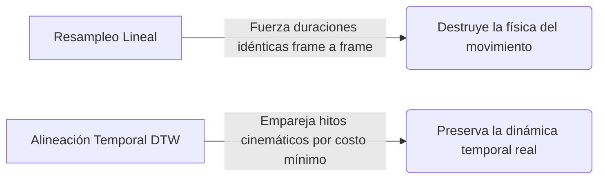
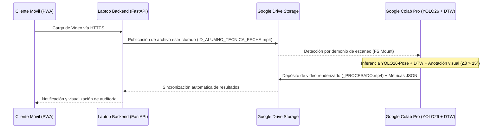
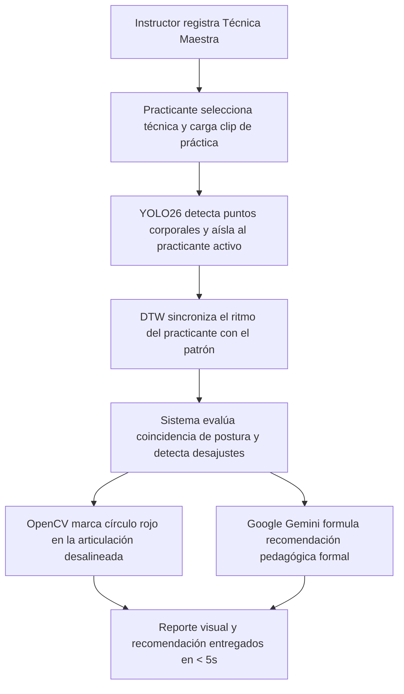
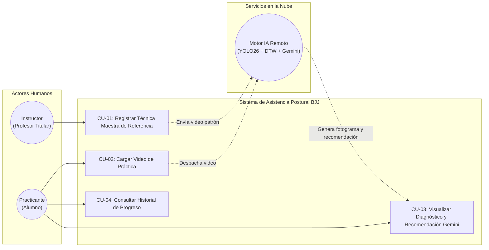
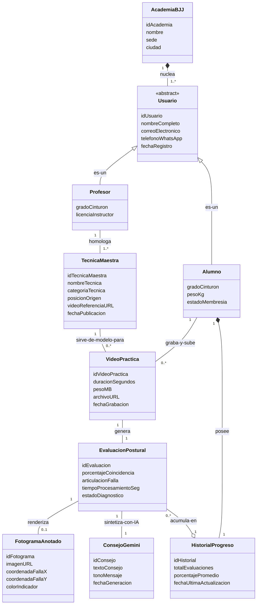

# Capítulo 1: Definición del Proyecto de Investigación

## 1.1 Definición del Problema

### 1.1.1 Situación Problemática

En la enseñanza de artes marciales, particularmente en el Jiu-Jitsu Brasileño (BJJ), la corrección técnica constituye un pilar fundamental para el aprendizaje efectivo y la prevención de lesiones. En el modelo tradicional de instrucción presencial, un único docente debe supervisar a múltiples practicantes que ejecutan técnicas de forma simultánea en parejas. Esta dinámica impone una limitación física y cognitiva inherente: la imposibilidad práctica de suministrar una supervisión masiva, exhaustiva, continua y objetiva a cada estudiante durante toda la sesión.

En la academia piloto Corpo e Mente (ubicada en las instalaciones de Knock Out Gym, Santa Cruz de la Sierra, Bolivia), se cuenta con una comunidad de aproximadamente 77 miembros registrados y una asistencia promedio diaria de 15 personas. Se evidencia una notable tasa de rotación y deserción temporal, en la cual los estudiantes interrumpen y retoman la disciplina tras varios meses de inactividad. Durante estas fases, los practicantes tienden a internalizar vicios biomecánicos recurrentes —tales como la incorrecta colocación de apoyos, alineaciones articulares desfavorables o ángulos inadecuados del torso— que eluden la observación del instructor debido a las restricciones de la supervisión simultánea. La ausencia de un instrumento visual, objetivo y persistente que permita al estudiante contrastar su ejecución con el modelo técnico de referencia impartido por el profesor conduce a una desaceleración en la curva de dominio técnico y a la consolidación prolongada de patrones de movimiento erróneos.

### 1.1.2 Situación Deseada

Se propone el desarrollo e implementación de un sistema computacional de asistencia al entrenamiento basado en visión artificial, concebido para comparar la ejecución técnica de los alumnos con un video de referencia provisto por el instructor. El sistema procesará secuencias de video capturadas en el tatami en tiempo diferido, detectará las discrepancias biomecánicas clave y generará reportes visuales con indicadores diagnósticos directos sobre los fotogramas del video del alumno. Esta retroalimentación objetiva y persistente estará disponible para el practicante a través de dispositivos móviles o terminales de consulta en la academia, empoderando el autoaprendizaje guiado y liberando tiempo docente para que el instructor concentre su labor pedagógica en correcciones tácticas y estratégicas avanzadas.

### 1.1.3 Objeto de Investigación

El objeto de investigación comprende el diseño, desarrollo e implementación de un sistema de visión por computadora basado en redes neuronales profundas para la estimación de pose humana bidimensional (2D), diseñado para detectar, cuantificar y señalar visualmente discrepancias biomecánicas en la ejecución de técnicas de artes marciales mediante comparación cinemática directa frente a un patrón de referencia, operando bajo una arquitectura distribuida (edge-cloud).

### 1.1.4 Alcance y Delimitación

* **Delimitación temporal:** La investigación se desarrollará durante el periodo académico correspondiente a la elaboración, implementación y defensa del proyecto de grado.
* **Delimitación espacial:** La recolección del corpus de video y la prueba piloto experimental se llevarán a cabo en las instalaciones de la academia Corpo e Mente (Knock Out Gym, Santa Cruz de la Sierra, Bolivia).
* **Delimitación temática y técnica:** El sistema operará con un enfoque agnóstico de comparación técnica: procesará cualquier técnica de artes marciales siempre que se disponga de un video de referencia del instructor y un video de ejecución del alumno bajo un protocolo de grabación establecido. La estimación postural se enfocará estrictamente en la extracción de puntos clave articulares (*keypoints*) en dos dimensiones (2D) y el análisis de variaciones angulares relativas a lo largo del tiempo. El sistema constituye una herramienta complementaria de autoevaluación y auditoría técnica, sin pretender sustituir el juicio pedagógico del instructor. Se excluyen del alcance el reconocimiento automático o clasificación de técnicas no catalogadas, la reconstrucción volumétrica tridimensional (3D) y la medición de variables biomecánicas de fuerza, potencia o fatiga física.

### 1.1.5 Justificación de la Investigación

* **Justificación teórica:** El proyecto contribuye al área de la visión artificial aplicada a las ciencias del deporte y la biomecánica motriz, validando la eficacia de algoritmos de estimación de pose bidimensional y comparación temporal de series cinemáticas en deportes de contacto con interacción cercana, proporcionando evidencia empírica en un contexto de investigación deportiva local.
* **Justificación práctica:** Proporciona a la academia Corpo e Mente una solución de software escalable y accesible que optimiza los tiempos de supervisión del cuerpo docente, mitiga la consolidación de hábitos técnicos perjudiciales y brinda a los practicantes un medio de autoevaluación objetivo y sistemático.
* **Justificación metodológica:** La investigación adopta un proceso riguroso de ingeniería de software caracterizado por un diseño modular orientado a objetos y ciclos de desarrollo iterativos e incrementales. La implementación de prácticas de aseguramiento de calidad y desarrollo guiado por pruebas (*Test-Driven Development*, TDD) garantiza la validez matemática en los cálculos de geometría articular y la sincronización algorítmica de trayectorias previas a su integración en el producto final.

---

## 1.2 Objetivos de la Investigación

### 1.2.1 Objetivo General

Desarrollar un sistema de visión artificial para la detección y comparación objetiva de discrepancias biomecánicas en la ejecución de técnicas de artes marciales, que permita a instructores y practicantes obtener retroalimentación visual diagnóstica mediante el análisis de video en tiempo diferido.

### 1.2.2 Objetivos Específicos

1. **Analizar** los requerimientos funcionales, no funcionales y pedagógicos del proceso de enseñanza-aprendizaje técnico, estableciendo un protocolo de captura de video que defina las condiciones óptimas de ángulo, distancia e iluminación para minimizar el impacto de las oclusiones corporales.
2. **Diseñar** la arquitectura de software y los modelos de datos que permitan la integración desacoplada entre la captura y preprocesamiento de video, el motor de inferencia en la nube y la entrega de reportes visuales interactivos.
3. **Implementar** los módulos computacionales de estimación de pose humana en dos dimensiones (2D), extracción secuencial de coordenadas articulares y comparación algorítmica de curvas de desviación angular respecto al video patrón del instructor.
4. **Validar** la precisión y exactitud diagnóstica del sistema mediante pruebas experimentales de concordancia frente al criterio evaluativo de instructores certificados, evaluando adicionalmente la usabilidad y adopción de la herramienta por parte de los practicantes en la academia piloto.

---

## 1.3 Metodología

La investigación se clasificó como un estudio aplicado y de desarrollo tecnológico, fundamentado en un diseño metodológico mixto: cuantitativo para la determinación de métricas de precisión articular, desviación angular y rendimiento computacional; y cualitativo para la evaluación de la experiencia de usuario y utilidad pedagógica en el entorno real de entrenamiento.

El proceso de construcción del sistema se articuló a través de las siguientes dimensiones de ingeniería:

1. **Modelado y Arquitectura Orientada a Objetos:** Se definió formalmente el dominio del problema, descomponiendo la estructura en componentes de alta cohesión y bajo acoplamiento para independizar el motor de visión de las capas de persistencia e interfaces de usuario.
2. **Ciclo de Desarrollo Iterativo e Incremental:** Se planificaron ciclos de desarrollo para evolucionar la solución de forma controlada, integrando retroalimentación empírica continua proveniente de las pruebas de video en el tatami.
3. **Desarrollo Guiado por Pruebas (TDD):** Se implementó una batería de pruebas unitarias y de integración previa a la codificación de la lógica algorítmica, blindando la consistencia matemática de los cálculos trigonométricos, la correspondencia temporal de keypoints y la correcta anotación gráfica de fotogramas.

---

# Capítulo 2: Marco Contextual y Análisis Organizacional

## 2.1 Descripción de la Empresa

La academia piloto objeto de este estudio es **Corpo e Mente**, un centro especializado en la enseñanza técnica de Jiu-Jitsu Brasileño (BJJ). En la sucursal analizada, ubicada en Santa Cruz de la Sierra, Bolivia, la academia opera bajo un modelo de **alianza estratégica y externalización de servicios (outsourcing)** con el gimnasio **Knock Out Gym**.

Bajo este esquema operativo:
* **Knock Out Gym** centraliza la infraestructura física, la gestión comercial, el marketing, la administración de membresías y la recaudación económica directa de los alumnos.
* **Corpo e Mente** aporta el capital intelectual, el programa pedagógico estructurado y el capital humano especializado (instructores) para la instrucción técnica en el tatami.

Esta simbiosis permite a Corpo e Mente enfocarse exclusivamente en la excelencia técnica, mientras delega la carga administrativa y financiera al socio estratégico.

## 2.2 Descripción Organizacional de la Empresa

Dada la naturaleza del modelo de alianza descrito, la estructura organizativa de Corpo e Mente en esta sucursal es **minimalista y altamente especializada**. No existe una jerarquía administrativa interna, ya que todas las funciones de soporte, cobranza y mantenimiento son absorbidas por la estructura de Knock Out Gym.

La estructura operativa se reduce a un esquema unipersonal en el nivel técnico:

* **Nivel Administrativo (Externo):** Gestionado íntegramente por el personal de Knock Out Gym. Responsables del registro de nuevos miembros, cobro de mensualidades y mantenimiento de las instalaciones.
* **Nivel Técnico-Pedagógico (Interno):** Representado exclusivamente por el **Profesor Único** de Corpo e Mente. Este rol posee autonomía total sobre el diseño curricular, la ejecución de clases y la evaluación técnica, actuando como el único punto de contacto técnico para la comunidad de usuarios.

## 2.4 Manual de Funciones (Perfil Unipersonal)

Al existir un único puesto de trabajo representativo de la marca Corpo e Mente en esta sucursal, las responsabilidades se concentran en un perfil multifuncional de alto rendimiento.

**Cargo:** Profesor Único / Instructor Titular  
**Objetivo del Cargo:** Dirigir, planificar y supervisar la formación técnica, física y táctica de los practicantes de Jiu-Jitsu, garantizando la seguridad, la progresión técnica y la retención de alumnos dentro del ecosistema de Knock Out Gym.

**Funciones Principales:**
1. **Área Pedagógica:** Diseñar la currícula técnica diaria y mensual, adaptando contenidos tanto para grupos infantiles como adultos, y diferenciando entre clases grupales masivas y sesiones individuales.
2. **Área Operativa (Ejecución Integral):** Dirigir todas las fases de la sesión de entrenamiento: desde el calentamiento dirigido y movilidad articular, hasta la demostración biomecánica de la técnica del día.
3. **Área de Supervisión y Corrección:** Fiscalizar la práctica simultánea de múltiples parejas en el tatami. *Nota crítica:* Al ser el único instructor, debe rotar constantemente entre las parejas, lo que genera intervalos de tiempo donde los alumnos practican sin retroalimentación inmediata.
4. **Área Evaluativa:** Coordinar, evaluar y ejecutar los exámenes de grado para las distintas categorías de edad y niveles de cinturón, validando la progresión técnica.
5. **Área de Coordinación Interinstitucional:** Mantener comunicación fluida con la administración de Knock Out Gym para reportar asistencia, gestionar bajas temporales y analizar el comportamiento de la comunidad (los 77 miembros registrados).

## 2.5 Flujo del Negocio

### 2.5.1 Flujo Comercial y de Recaudación

El proceso financiero sigue una ruta triangular que separa la captación del cliente de la prestación del servicio técnico:

1. **Captación y Cobro:** El interesado acude a las instalaciones de Knock Out Gym, se registra en su sistema administrativo y cancela su membresía directamente en la recepción del gimnasio. El dinero ingresa a las cuentas de Knock Out.
2. **Asignación de Servicio:** El gimnasio otorga al alumno el acceso al área de tatami asignada contractualmente a Corpo e Mente.
3. **Compensación Económica:** Knock Out Gym liquida de forma periódica (mensual o por comisión) los honorarios correspondientes al Profesor Único de Corpo e Mente por los servicios de enseñanza prestados a la base de usuarios activa.

### 2.5.2 Flujo Operativo de la Clase Diaria (El Cuello de Botella Crítico)

La dinámica interna de la clase revela la necesidad urgente de apoyo tecnológico debido a la limitación de recursos humanos:

1. **Ingreso al Tatami:** El Profesor Único y los alumnos activos (promedio de 15 diarios) acceden al espacio asignado.
2. **Fase de Calentamiento:** El profesor dirige personalmente los ejercicios de movilidad y acondicionamiento. Durante esta fase, su atención está dividida entre demostrar y asegurar que nadie se lesione.
3. **Explicación de la Técnica:** El profesor demuestra la biomecánica de la técnica del día (ej. escape de la montada), utilizando a un alumno avanzado como apoyo visual.
4. **Práctica Simultánea en Parejas:** Los ~15 alumnos se dividen en ~7-8 parejas. Una persona ejecuta la técnica y la otra la recibe.
5. **El Cuello de Botella Crítico:**
   * El Profesor Único debe pasar pareja por pareja corrigiendo detalles finos.
   * Mientras corrige a la **Pareja A**, las **Parejas B, C, D, E, F, G y H** quedan sin supervisión directa.
   * Si un alumno comete un error biomecánico en ese intervalo, lo repite varias veces hasta que el profesor llega, fijando el vicio motor.
   * Este problema se agrava exponencialmente con los **alumnos intermitentes** (que vuelven tras 3-5 meses), quienes han perdido la memoria motriz y requieren correcciones constantes que el profesor único no puede cubrir simultáneamente para todos.

---

# Capítulo 3: Marco Teórico e Ingeniería de Selección

## 3.1 Ingeniería de Selección de Modelos de Estimación de Pose (HPE)

Para la extracción del esqueleto anatómico de los practicantes, se evaluaron tres arquitecturas de vanguardia en visión artificial: MediaPipe Pose (Google), OpenPose (CMU) y Ultralytics YOLO26-Pose. La evaluación se fundamentó en criterios de latencia en inferencia remota, robustez ante oclusiones corporales severas originadas por el contacto estrecho y facilidad de integración en una canalización (*pipeline*) de software basada en Python.

### 3.1.1 Matriz Comparativa de Modelos Core de Visión

| Criterio Técnico | MediaPipe Pose | OpenPose (Baseline) | Ultralytics YOLO26-Pose |
| :--- | :--- | :--- | :--- |
| **Enfoque de Red** | Top-down (Monorregión) | Bottom-up (Campos de Afinidad Part Affinity Fields) | Single-Shot Retainers (End-to-End) |
| **Inferencia en CPU** | Alta eficiencia (Mobile) | Inviable ($< 3$ FPS) | Optimizada (Hasta 43% más rápida) |
| **Manejo de Oclusión** | Deficiente en contacto (pérdida de *keypoints*) | Alto costo computacional | Excelente (Alineación por STAL y pérdida progresiva) |
| **Post-procesamiento** | No requiere | Requiere NMS pesado y enlace algebraico | NMS-Free nativo (Cero latencia post-red) |
| **Formato de Exportación** | Propietario (`.tflite`) | Complejo (C++ nativo / Caffe) | Altamente versátil (`.pt`, `ONNX`, `TensorRT`) |

### 3.1.2 Justificación de la Elección de YOLO26-Pose

Se determinó la selección de YOLO26-Pose a partir de dos ventajas arquitecturales determinantes para el dominio de estudio:

1. **Inferencia End-to-End libre de NMS (Non-Maximum Suppression):** A diferencia de las iteraciones previas de la familia YOLO o de arquitecturas basadas en agrupamiento como OpenPose, YOLO26 efectúa la predicción directa de las coordenadas articulares sin demandar una etapa posterior de supresión de no máximos. Dicho factor elimina cuellos de botella algorítmicos en el backend local y confiere estabilidad a los tiempos de inferencia en la nube sobre Google Colab Pro.
2. **Algoritmo STAL (Small-Target-Aware Label Assignment):** Durante las transiciones en el suelo características del Jiu-Jitsu, determinados segmentos anatómicos distales (como muñecas, tobillos o pies en posiciones de sumisión o guardia) ocupan una fracción reducida de píxeles en el fotograma. El mecanismo STAL incrementa sustancialmente la cobertura de etiquetas positivas asignadas a objetos y coyunturas de escala reducida, mitigando el parpadeo (*jitter*) o la desconexión del grafo esquelético ante deformaciones complejas.

---

## 3.2 Extracción de Características y Cinemática Vectorial Bidimensional (2D)

Tras la detección de los 17 puntos articulares del estándar COCO por parte de YOLO26-Pose, se estructura un espacio formal euclidiano para el análisis biomecánico de las trayectorias.

### 3.2.1 Formalismo Matemático para el Análisis Angular

Cada articulación de interés se modela como un vértice dinámico inmerso en un espacio vectorial $\mathbb{R}^2$. Para cuantificar la conformación de una articulación central $B$ conectada a sus vértices adyacentes proximal $A$ y distal $C$, se construyen los vectores de segmento corporal correspondientes:

$$\vec{u} = \vec{BA} = (x_A - x_B, \, y_A - y_B)$$

$$\vec{v} = \vec{BC} = (x_C - x_B, \, y_C - y_B)$$

La magnitud del ángulo interarticular $\theta(t)$ en el instante de tiempo o fotograma $t$ se obtiene a través del producto escalar euclidiano y la función arco coseno:

$$\theta(t) = \arccos\left( \frac{\vec{u} \cdot \vec{v}}{\Vert{}\vec{u}\Vert{} \, \Vert{}\vec{v}\Vert{}} \right) = \arccos\left( \frac{(x_A - x_B)(x_C - x_B) + (y_A - y_B)(y_C - y_B)}{\sqrt{(x_A - x_B)^2 + (y_A - y_B)^2} \; \sqrt{(x_C - x_B)^2 + (y_C - y_B)^2}} \right)$$

**Justificación de invarianza:** La formulación vectorial asegura invarianza matemática frente a traslaciones en el plano y variaciones de escala geométrica. Por consiguiente, divergencias en la distancia focal o posición relativa de los practicantes respecto a la cámara no alteran la estimación angular, facultando una comparación directa y robusta entre el video del profesor y el del alumno.

---

## 3.3 Algoritmo de Aislamiento y Priorización del Ejecutor (Target Isolation)

Dada la co-presencia inevitable de dos cuerpos en interacción física dentro del encuadre (alumno ejecutor y compañero de apoyo o receptor pasivo), es indispensable aislar las coordenadas esqueléticas del sujeto activo. Se contrastaron dos alternativas de ingeniería para su resolución en el backend:

* **Alternativa A: Clasificación por área de Bounding Box:** Asignación del rol de ejecutor a la silueta con mayor envolvente en píxeles. Resulta errática en fases de suelo donde el receptor suele quedar posicionado por encima del ejecutor.
* **Alternativa B (Seleccionada): Filtro de Varianza Cinemática Acumulada (Kinematic Variance Filter):** Detección del sujeto activo mediante la energía de movimiento temporal.

### 3.3.1 Formalismo Matemático del Aislamiento Cinemático

En técnicas de defensa y escape en el tatami, el sujeto receptor adopta un rol de contención predominantemente estático o isométrico, en tanto que el ejecutor despliega aceleraciones angulares y traslaciones significativas de su centro de gravedad. El sistema evalúa la varianza temporal de las coordenadas del centroide $(\bar{x}, \bar{y})$ de cada individuo detectado durante una ventana inicial de $N$ fotogramas ($N = 30$):

$$\sigma^2_{x} = \frac{1}{N}\sum_{t=1}^{N}(x_t - \bar{x})^2, \quad \sigma^2_{y} = \frac{1}{N}\sum_{t=1}^{N}(y_t - \bar{y})^2$$

$$V_{\text{total}} = \sigma^2_{x} + \sigma^2_{y}$$

El algoritmo asocia la etiqueta de *Ejecutor Objetivo* al identificador de seguimiento (*tracking ID*) que exhibe el valor supremo de $V_{\text{total}}$ en la serie analizada. Las trayectorias del sujeto secundario son enmascaradas en las matrices subsiguientes, previniendo perturbaciones en la cuantificación del error biomecánico.

---

## 3.4 Sincronización Temporal de Movimientos Heterogéneos

La cadencia y velocidad de ejecución entre el docente experto y el alumno presentan asimetrías temporales sistemáticas. Para el alineamiento de las series temporales de ángulos articulares se evaluaron dos estrategias:

1. **Resampleo Lineal Dinámico:** Forzamiento algebraico de correspondencia marco a marco por interpolación. Se desestimó debido a la asunción errónea de velocidades de ejecución constantes en sujetos humanos.
2. **Alineación Temporal Dinámica (Dynamic Time Warping - DTW) (Seleccionada):** Determina una ruta óptima de emparejamiento sobre una matriz de distancias locales de orden $M \times K$, siendo $M$ el número de fotogramas de la referencia docente y $K$ el de la ejecución del practicante. El algoritmo minimiza recursivamente la distancia acumulada:

$$D(i, j) = \text{dist}(\theta_{\text{prof}}(i), \theta_{\text{alum}}(j)) + \min \left[ D(i-1, j), D(i, j-1), D(i-1, j-1) \right]$$

**Justificación técnica:** DTW permite la convergencia sobre hitos biomecánicos críticos (p. ej., el ápice angular de elevación pélvica durante un puente defensivo) con independencia de desfases cronológicos absolutos, acomodando las diferencias de fluidez motriz entre practicantes avanzados y novatos.

---

## 3.5 Arquitectura de Datos e Infraestructura de Cómputo (Cloud-Edge)

En correspondencia con las restricciones de implementación del proyecto (entorno de desarrollo local, capacidades de aceleración por GPU en la nube y visualización orientada al usuario móvil), se estableció un patrón de cómputo asíncrono con persistencia desacoplada.

### 3.5.1 Topología del Flujo de Datos

### 3.5.2 Justificación de la Infraestructura Seleccionada

1. **Google Drive como Middleware de Persistencia Desacoplada:** La interconexión mediante almacenamiento compartido elude la necesidad de túneles bidireccionales continuos (e.g., WebSockets persistentes o gRPC sobre IP pública), cuya estabilidad se ve severamente afectada en redes de gimnasios o entornos de conectividad residencial.
2. **Despacho Asíncrono de Inferencia:** El servidor edge local en FastAPI funciona como un receptor y despachador ligero con sobrecarga computacional mínima. El entorno en la nube (Google Colab Pro) opera mediante un demonio en segundo plano que monitorea el volumen montado, procesa los análisis cinemáticos con aceleración por GPU y renderiza indicadores visuales cuando las discrepancias angulares superan el umbral de tolerancia prescrito ($\Delta\theta > 15^\circ$). El resultado queda disponible para descarga diferida, ofreciendo tolerancia a desconexiones transitorias y mitigando el consumo de recursos de cómputo en la máquina local.

---

# Capítulo 4: Definición de Requisitos del Sistema (Estándar IEEE 830)

## 4.1 Introducción

### 4.1.1 Propósito
El propósito del presente documento es especificar formal, exhaustiva y pedagógicamente los requisitos funcionales, no funcionales y de interfaz que rigen la construcción del **Asistente Inteligente de Corrección Postural para Jiu-Jitsu Brasileño (BJJ)** en la academia *Corpo e Mente* (Santa Cruz de la Sierra, Bolivia).

Este pliego de requisitos sigue las directrices internacionales del estándar **IEEE 830** (Recomendaciones para la Especificación de Requisitos de Software), articulándose bajo un enfoque centrado en el usuario humano. Su diseño busca tender un puente conceptual claro entre el rigor técnico de la ingeniería de software y la realidad práctica del tatami, permitiendo su cabal comprensión por parte de un tribunal evaluador multidisciplinario (integrado por especialistas en ingeniería, negocios, educación física y gestión deportiva).

### 4.1.2 Ámbito del Sistema
El sistema constituye una plataforma computacional de asistencia técnica y pedagógica basada en visión artificial y modelos generativos de lenguaje (**Google Gemini**), cuyo alcance operativo comprende:

1. **Gestión Curricular de Referencia:** Permitir al profesor titular registrar, etiquetar y homologar videos de "Técnica Maestra" (ejecución canónica de referencia demostrada en el tatami).
2. **Ingesta Móvil Liviana:** Facilitar a los practicantes la selección de la técnica del día y la carga de grabaciones breves de su práctica en pareja (clips de hasta 6 segundos y 5 MB) desde sus teléfonos móviles.
3. **Extracción y Aislamiento Corporal Automatizado:** Identificar los puntos clave anatómicos (*keypoints*) de los practicantes mediante **YOLO26-Pose** y aislar automáticamente al alumno activo frente al compañero pasivo de soporte.
4. **Sincronización y Comparación Postural Intuitiva:** Alinear temporalmente las velocidades de ejecución mediante **DTW** (*Dynamic Time Warping*) y contrastar el grado de coincidencia o similitud postural del alumno contra el molde del profesor.
5. **Diagnóstico Visual Inmediato:** Señalar visualmente sobre el fotograma de máxima discrepancia la zona del cuerpo donde ocurrió el desajuste (círculos marcadores de color rojo para fallas y verde para aciertos).
6. **Asesoría Pedagógica Asistida por IA:** Generar retroalimentación textual clara, constructiva y motivacional mediante la **API de Google Gemini**, traduciendo las desviaciones visuales a instrucciones directas de combate (estilo *coach*).
7. **Monitoreo Histórico:** Permitir al practicante auditar su evolución técnica acumulada a lo largo del tiempo.

**Límites y Exclusiones Explícitas del Sistema:**
* **Deslinde Médico y Fisioterapéutico:** El sistema no emite diagnósticos traumatológicos, médicos ni de rehabilitación física.
* **Exclusión de Combate Libre (Rolling / Spárring):** El sistema está delimitado al análisis de repeticiones técnicas estructuradas en plano lateral fijo; no procesa combates caóticos en plano general ni múltiples parejas simultáneas.
* **Selección Manual Guiada:** El sistema no clasifica técnicas de forma autónoma a ciegas; delega la elección al alumno desde el catálogo curricular para garantizar máxima precisión con mínimo costo operativo.
* **Preservación del Rol Docente:** El software no sustituye el criterio, la autoridad pedagógica ni la supervisión de seguridad del profesor en el gimnasio.

### 4.1.3 Definiciones, Acrónimos y Abreviaturas
* **BJJ (*Brazilian Jiu-Jitsu*):** Jiu-Jitsu Brasileño. Arte marcial y disciplina deportiva de combate centrada en el control corporal, agarres y sumisiones mecánicas en el suelo.
* **Keypoints (Puntos Clave Corporales):** Coordenadas espaciales bidimensionales que identifican las articulaciones y coyunturas anatómicas del cuerpo (hombros, codos, muñecas, caderas, rodillas y tobillos).
* **Similitud de Postura / Coincidencia de Posición:** Grado de superposición y encaje entre la silueta corporal del alumno y el molde de referencia del profesor en una fase técnica equivalente.
* **DTW (*Dynamic Time Warping* / Sincronizador de Movimiento):** Algoritmo que empareja secuencias temporales que ocurren a diferente velocidad, permitiendo comparar movimientos aunque el alumno sea más lento o pausado que el docente.
* **YOLO26-Pose:** Modelo de visión artificial de última generación para la detección simultánea de cuerpos y extracción de puntos articulares en tiempo real.
* **Google Gemini API:** Modelo avanzado de inteligencia artificial generativa de Google utilizado para razonar sobre las fallas posturales y redactar consejos pedagógicos personalizados en lenguaje natural.
* **Google Colab Pro:** Plataforma en la nube con aceleradores gráficos GPU (NVIDIA A100) encargada de procesar el video de forma remota y elástica.
* **PWA (*Progressive Web App*):** Aplicación web progresiva accesible mediante navegador móvil que brinda la experiencia de una app instalada sin requerir descargas pesadas desde tiendas de aplicaciones.
* **IEEE 830:** Estándar internacional para la redacción estructurada de especificaciones de requisitos de software.

### 4.1.4 Visión General del Documento
El capítulo se organiza conforme a las mejores prácticas de la ingeniería de software y el estándar IEEE 830:
* La **Sección 4.2 (Descripción General)** detalla la arquitectura global, funciones maestras, perfiles de usuario (arquetipos funcionales), restricciones y dependencias.
* La **Sección 4.3 (Requisitos Específicos)** formaliza las interfaces externas, requisitos funcionales descritos mediante especificaciones formales, requisitos de rendimiento, restricciones de diseño y atributos de calidad con cláusula legal de deslinde.
* La **Sección 4.4 (Identificación de Casos de Uso)** ilustra la dinámica operativa mediante diagramas Mermaid y matrices de casos de uso estructuradas según el Proceso Unificado.
* La **Sección 4.5 (Diagrama de Dominio)** expone el modelo conceptual de clases, entidades de datos y sus relaciones estructurales.

---

## 4.2 Descripción General

### 4.2.1 Perspectiva del Producto
El sistema se implanta bajo un esquema desacoplado y distribuido **Cloud-Edge**, integrando dos niveles operativos:

1. **Capa Frontal de Tatami (PWA Móvil):** Opera en los dispositivos personales de profesores y alumnos. Su función primordial es la captura en sitio, consulta de catálogo y despliegue ultra-liviano del diagnóstico visual y los consejos generados.
2. **Capa Central de Inferencia y Razonamiento (Google Colab Pro + FastAPI + Gemini API):** Servicio en la nube que centraliza el cómputo pesado: recepción del archivo vía HTTPS, extracción de keypoints corporales con YOLO26, alineación temporal con DTW, evaluación de coincidencia postural con OpenCV y llamada a la API de Gemini para la redacción del consejo correctivo.

Esta arquitectura protege la economía de la academia (aprovechando tarifas planas en Colab Pro de ~$10 USD/mes) e independiza a la plataforma de los sistemas administrativos locales del gimnasio anfitrión (*Knock Out Gym*).

### 4.2.2 Funciones del Producto
El flujo funcional y pedagógico del sistema se sintetiza en siete procesos estructurados:

**Figura 4.1**  
*Flujo Funcional del Sistema de Asistencia Postural.*

*Nota.* Flujo secuencial de procesamiento asíncrono para auditoría técnica en tatami.

1. **Administración de Técnicas Maestras:** Registro del video patrón canónico por parte del instructor titular.
2. **Ingesta de Video de Práctica:** Carga ágil desde el dispositivo móvil con filtros automáticos de duración (< 6s) y peso (< 5 MB).
3. **Aislamiento del Practicante Activo:** Descarte automático del compañero pasivo que actúa como soporte estático en la maniobra.
4. **Sincronización Temporal (DTW):** Comparación analítica de posturas equivalentes con independencia de la velocidad o cadencia de ejecución.
5. **Evaluación de Coincidencia Postural:** Verificación del grado en que la configuración corporal del practicante coincide con el patrón de referencia.
6. **Anotación Visual (Semáforo Postural):** Renderizado de un fotograma clave con marcadores gráficos directos (círculo rojo sobre la articulación desajustada).
7. **Generación de Recomendación Pedagógica (Gemini):** Entrega de un informe textual formulado con rigor didáctico, claridad y enfoque formativo.

---

### 4.2.3 Perfiles de Usuario (Arquetipos Funcionales)
Para caracterizar con precisión los requerimientos operacionales y formativos del sistema conforme a la normativa académica, se formalizan dos arquetipos funcionales representativos de la interacción en la academia:

#### Perfil A: Instructor Certificado (Head Coach / Instructor Titular)
* **Rol y Responsabilidades:** Máxima autoridad técnica y pedagógica en el tatami. Es responsable de la planificación curricular mensual, la instrucción técnica presencial, la evaluación de grados y la supervisión de la integridad física de grupos de 15 a 20 practicantes simultáneos.
* **Contexto Operativo:** Imparte clases en las que múltiples parejas ejecutan maniobras en paralelo. Afronta la limitación física inherente de no poder supervisar simultáneamente a la totalidad del alumnado, lo que propicia la consolidación inadvertida de patrones de movimiento erróneos durante las fases de práctica sin retroalimentación directa.
* **Competencia Digital:** Nivel intermedio; usuario habitual de dispositivos móviles y plataformas de mensajería comercial. Demanda interfaces ágiles que requieran un tiempo mínimo de interacción para no interferir con la dinámica docente presencial.
* **Necesidades Pedagógicas:** Disponer de un mecanismo para registrar de manera expedita el video patrón canónico de cada técnica oficial, estableciendo una referencia objetiva para que el alumnado audite sus ejecuciones de forma autónoma en el tatami.

#### Perfil B: Practicante en Formación (Alumno / Estudiante)
* **Rol y Responsabilidades:** Usuario activo en el aprendizaje y perfeccionamiento técnico de Jiu-Jitsu Brasileño (niveles principiante a intermedio). Responsable de realizar las repeticiones técnicas asignadas junto a su compañero de entrenamiento.
* **Contexto Operativo:** Asiste a sesiones grupales de entrenamiento con frecuencias variables o tras periodos de inactividad temporal. Requiere verificar de manera objetiva si la alineación corporal y los apoyos adoptados corresponden a la instrucción impartida, minimizando tiempos muertos de espera en el tatami.
* **Competencia Digital:** Nivel avanzado (nativo digital); habituado a interfaces web responsivas y entornos móviles. Requiere tiempos de respuesta reducidos, bajo consumo de datos y reportes visuales de fácil interpretación.
* **Necesidades de Retroalimentación:** Visualización gráfica directa de la zona corporal desajustada mediante marcadores visuales e instrucciones textuales precisas en lenguaje pedagógico claro, orientadas a la corrección inmediata de la postura.

---

### 4.2.4 Restricciones
* **Restricción Presupuestaria de Nube:** La solución debe operar íntegramente dentro del plan base de Google Colab Pro (~$10 a $20 USD mensuales), descartando el aprovisionamiento de clústeres dedicados o instancias de alto coste.
* **Protección del Dispositivo Móvil:** Queda estrictamente prohibida la ejecución de modelos de IA en el navegador del teléfono del usuario para evitar recalentamiento, consumo excesivo de batería o congelamiento en dispositivos de gama media o baja.
* **Límite de Carga Multimedia:** Los videos cargados no podrán superar los **6 segundos** de duración ni un peso máximo de **5 MB**.
* **Condiciones de Conectividad:** El sistema debe ser tolerante a la latencia variable y micro-cortes frecuentes en las redes celulares comerciales y Wi-Fi de gimnasios locales.

### 4.2.5 Suposiciones y Dependencias
* **Protocolo de Captura en Tatami:** Se asume que los practicantes colocarán el teléfono celular en un trípode o apoyo lateral a una distancia de 2.5 a 3.5 metros, encuadrando a ambos deportistas en plano entero lateral durante la ejecución técnica.
* **Condiciones Ambientales:** Se asume una iluminación regular de gimnasio (luz artificial uniforme) y uso de vestimenta de entrenamiento contrastante con el tatami.
* **Dependencias de Servicios Externos:** El sistema depende operativamente de la disponibilidad del servicio Google Colab Pro para la inferencia de YOLO26 y de la API de Google Gemini para la síntesis pedagógica textual.

### 4.2.6 Requisitos Futuros
* **Reconocimiento Autónomo de Técnicas:** Incorporación de modelos de clasificación de video que identifiquen la técnica ejecutada sin necesidad de selección manual previa en el catálogo.
* **Auditoría de Combate Libre (Rolling):** Expansión hacia el análisis postural continuo en planos generales durante sesiones de combate real.
* **Módulo de Gamificación:** Sistema de insignias y niveles de pulcritud técnica para estimular la adherencia de los alumnos intermitentes.

---

## 4.3 Requisitos Específicos

### 4.3.1 Interfaces Externas

#### 4.3.1.1 Interfaces de Software
* **Cliente Web Progresivo (PWA):** Desarrollada como interfaz web ligera y responsiva para navegadores móviles (Google Chrome, Safari), optimizada para pantallas táctiles y con validación previa de archivos en el cliente.
* **Microservicio de Visión y Cómputo (FastAPI en Google Colab Pro):** Servicio backend que expone endpoints REST para recibir el video, ejecutar la inferencia de YOLO26-Pose, calcular la sincronización DTW y renderizar las marcas de OpenCV.
* **API de Google Gemini:** Integración directa mediante SDK oficial para el envío de métricas de discrepancia postural y recepción de recomendaciones pedagógicas en lenguaje natural.
* **Middleware de Almacenamiento (Google Drive Storage):** Repositorio intermedio para persistencia desacoplada y sincronización asíncrona de archivos de video y diagnósticos.

#### 4.3.1.2 Interfaces de Hardware
* **Dispositivo de Adquisición y Consulta:** Teléfonos inteligentes convencionales con cámara digital integrada (resolución mínima recomendada: 720p a 30 fotogramas por segundo).
* **Terminal Local de Tatami:** Computadora portátil estándar ubicada en la recepción o área técnica, operando como orquestador ligero sin requerir tarjeta gráfica dedicada.
* **Unidad de Procesamiento Acelerado (Nube):** Procesador gráfico NVIDIA A100 provisto en el entorno Google Colab Pro.

#### 4.3.1.3 Interfaces de Comunicación
* Protocolo seguro **HTTPS** con cifrado **TLS 1.3** para todas las transferencias de video y datos entre el cliente móvil y los servicios en la nube.

---

### 4.3.2 Requisitos Funcionales

**Tabla 4.1**  
*Matriz de Requisitos Funcionales del Sistema*

| Código | Requisito Funcional | Historia de Usuario y Criterio de Aceptación |
| :---: | :--- | :--- |
| **RF-01** | **Registro de Técnica Maestra** | **Como** Instructor Certificado, **se requiere** registrar y homologar el video patrón canónico de la técnica oficial (ej. *'Escape de Montada mediante Puente y Giro'*), **para que** quede catalogado como el estándar de referencia contra el cual se evaluará la ejecución técnica de los practicantes. *Criterio de Aceptación:* El sistema permite cargar el video patrón, asociar los metadatos de categoría y posición de origen en menos de 30 segundos, extrayendo y almacenando el esqueleto de referencia en el servidor remoto. |
| **RF-02** | **Selección y Carga de Video de Práctica** | **Como** Practicante en Formación, **se requiere** seleccionar desde el dispositivo móvil la técnica demostrada en la sesión y cargar la grabación de su práctica en pareja (duración de 4 a 6 segundos), **para que** el sistema efectúe la auditoría de postura. *Criterio de Aceptación:* La interfaz valida que el archivo no supere 5 MB de tamaño ni 6 segundos de duración, interrumpiendo la transferencia antes de saturar el enlace si se exceden dichos parámetros. |
| **RF-03** | **Detección Automática de Puntos Clave** | **El sistema procesa** cada fotograma del video mediante YOLO26-Pose para identificar con precisión los 17 puntos anatómicos corporales del estándar COCO (hombros, codos, muñecas, caderas, rodillas y tobillos), preservando el seguimiento continuo ante cruces y oclusiones dinámicas en el tatami. |
| **RF-04** | **Aislamiento del Practicante Activo** | **El sistema discrimina** automáticamente al practicante en ejecución frente al compañero que ejerce el rol de soporte estático mediante el análisis de varianza cinemática temporal, enmascarando las coordenadas del sujeto secundario para garantizar la precisión del análisis. |
| **RF-05** | **Sincronización Temporal no Lineal (DTW)** | **El sistema aplica** el algoritmo DTW (*Dynamic Time Warping*) para alinear la velocidad del practicante con la del video patrón, asegurando una correspondencia postural justa e independiente del ritmo o fluidez de ejecución. |
| **RF-06** | **Detección del Momento de Máxima Discrepancia** | **El sistema aísla** de forma automática el fotograma temporal donde la configuración corporal del practicante presenta el mayor desvío espacial respecto al modelo de referencia oficial. |
| **RF-07** | **Señalización Visual del Error (Semáforo Postural)** | **El sistema renderiza** sobre el fotograma clave un marcador gráfico circular de color rojo (mediante OpenCV) centrado en la coyuntura anatómica desalineada, brindando un indicador visual objetivo e inmediato. |
| **RF-08** | **Generación de Retroalimentación Pedagógica Asistida por IA** | **Como** Practicante en Formación, **se requiere** recibir una explicación textual formal, clara y constructiva sobre la causa del desajuste postural y la recomendación correctiva pertinente, **para que** se facilite la comprensión motriz sin depender de interpretaciones matemáticas complejas. *Criterio de Aceptación:* La API de Google Gemini genera una explicación de 2 a 3 líneas con tono pedagógico formal (ej. *"Se detecta una apertura excesiva del codo derecho durante el giro; mantenga la articulación próxima a la parrilla costal para preservar el control mecánico"*). |
| **RF-09** | **Notificación Preventiva ante Oclusión Prolongada** | **El sistema interrumpe** de forma controlada el proceso ante oclusiones corporales continuas que excedan el límite de validez o ante encuadres incompletos, notificando al usuario mediante un mensaje formal en pantalla (ej. *"No se visualizan con claridad los segmentos inferiores. Repita la captura ajustando el ángulo lateral de la cámara"*), evitando registrar datos espurios en el historial. |
| **RF-10** | **Consulta de Historial y Evolución Técnica** | **Como** Practicante en Formación, **se requiere** acceder a un panel histórico de evaluaciones técnicas, **para** auditar la evolución cronológica del desempeño y la reducción sostenida de discrepancias posturales. |

*Nota.* Requisitos funcionales elaborados según el estándar IEEE 830 y los lineamientos del Proceso Unificado.

---

### 4.3.3 Requisitos de Rendimiento
* **RP-01 (Latencia Total de Inferencia):** El tiempo total transcurrido desde la recepción del video en la nube hasta la entrega del fotograma anotado y el consejo de Gemini no deberá superar los **5.0 segundos** para clips estandarizados de hasta 6 segundos.
* **RP-02 (Carga Liviana de Retorno / Egress):** El paquete de datos devuelto al teléfono del practicante (fotograma clave comprimido en formato JPG más el texto del consejo) no superará los **100 KB**, garantizando despliegues casi instantáneos incluso en redes celulares lentas.
* **RP-03 (Arranque de la PWA Móvil):** La interfaz web móvil deberá cargar completamente y estar disponible para grabar o consultar en menos de **2.0 segundos** bajo conexiones 4G estándar.

---

### 4.3.4 Restricciones de Diseño
* **RD-01 (Uso de YOLO26-Pose y Google Colab Pro):** La arquitectura de visión debe sustentarse en YOLO26-Pose por su naturaleza NMS-Free y su algoritmo STAL, ejecutándose en Colab Pro para maximizar velocidad y abatir costos fijos.
* **RD-02 (Integración Obligatoria de Google Gemini):** La generación de retroalimentación en lenguaje natural debe articularse a través de la API de Gemini mediante plantillas de prompts contextualizadas al Jiu-Jitsu.
* **RD-03 (Acceso Multiplataforma sin Barreras):** El sistema debe ser 100% accesible vía web desde navegadores iOS (Safari) y Android (Chrome), sin forzar al usuario a instalar aplicaciones de tiendas comerciales.

---

### 4.3.5 Atributos del Sistema y Deslinde de Responsabilidad Legal
* **AS-01 (Seguridad y Confidencialidad):** Los videos y reportes técnicos de cada practicante están protegidos bajo identificadores seguros de sesión, asegurando que solo el practicante y el instructor titular tengan acceso a sus registros.
* **AS-02 (Ergonomía Térmica y de Batería):** La interfaz web operará en modo liviano, restringiendo el cómputo pesado en segundo plano en el dispositivo móvil para evitar sobrecalentamiento y consumo acelerado de batería en el tatami.
* **AS-03 (Cláusula de Deslinde de Responsabilidad Civil, Médica y Deportiva):**

> **CLÁUSULA DE DESLINDE DE RESPONSABILIDAD CIVIL, MÉDICA Y DEPORTIVA**  
> *El presente software constituye una herramienta computacional de carácter estrictamente pedagógico, formativo y de asistencia técnica visual al entrenamiento deportivo. En ninguna circunstancia la información, imágenes o textos generados por el sistema (incluyendo los análisis de visión artificial y los mensajes formativos generados a través de la API de Google Gemini) constituyen diagnósticos médicos, dictámenes traumatológicos, evaluaciones fisioterapéuticas, prescripciones de rehabilitación física ni certificaciones de aptitud médica para el esfuerzo atlético.*  
>  
> *El Jiu-Jitsu Brasileño es una disciplina de combate cuerpo a cuerpo que conlleva riesgos inherentes de lesión física accidental. La práctica de cualquier maniobra, palanca articular, derribo o estrangulación debe realizarse siempre bajo la supervisión presencial y atenta de instructores profesionales certificados. Los autores del proyecto de grado, el cuerpo docente y la Universidad Privada de Santa Cruz de la Sierra (UPSA) quedan exentos de toda responsabilidad civil, médica, penal o patrimonial frente a accidentes, daños o lesiones que pudieran suscitarse durante o con posterioridad a la ejecución de las actividades deportivas asistidas por este sistema.*

---

## 4.4 Identificación de los Casos de Uso

### 4.4.1 Actores del Sistema
1. **Instructor (Head Coach):** Usuario docente responsable de registrar las técnicas maestras oficiales, catalogar variantes curriculares y supervisar la progresión técnica del alumnado.
2. **Practicante (Alumno):** Usuario evaluado en el tatami que selecciona técnicas, graba y carga videos de práctica, visualiza los diagnósticos visuales y consulta las recomendaciones formativas.
3. **Motor de IA Remoto (Google Colab Pro + Gemini):** Actor computacional externo que ejecuta la inferencia esquelética, sincroniza temporalmente las secuencias mediante DTW, evalúa la coincidencia postural y sintetiza la retroalimentación textual.

### 4.4.2 Diagrama de Casos de Uso
A continuación se presenta el diagrama formal de casos de uso que modela las interacciones entre los actores humanos y el sistema:

**Figura 4.2**  
*Diagrama de Casos de Uso del Sistema de Asistencia Postural.*

*Nota.* Casos de uso estructurados según las pautas del Proceso Unificado (Larman).

### 4.4.3 Matriz de Trazabilidad de Casos de Uso

**Tabla 4.2**  
*Matriz de Trazabilidad de Casos de Uso*

| Código | Nombre del Caso de Uso | Actor Principal | Requisitos Asociados | Descripción Sintética |
| :---: | :--- | :---: | :---: | :--- |
| **CU-01** | Registrar Técnica Maestra de Referencia | Instructor | RF-01, RF-03 | El instructor graba y carga el video de referencia canónica. El sistema procesa el esqueleto maestro con YOLO26 y lo almacena en el catálogo. |
| **CU-02** | Cargar Video de Práctica | Practicante | RF-02, RF-03, RF-04, RF-05, RF-09 | El practicante selecciona la técnica y carga su clip (<6s). El sistema filtra al compañero estático, sincroniza con DTW y verifica la integridad de la toma. |
| **CU-03** | Visualizar Diagnóstico y Recomendación Gemini | Practicante | RF-06, RF-07, RF-08, RP-01, RP-02 | El sistema despliega el fotograma clave con círculo indicador en la zona defectuosa junto a la recomendación pedagógica emitida por Google Gemini en < 5 segundos. |
| **CU-04** | Consultar Historial de Progreso | Practicante | RF-10 | El practicante visualiza la evolución cronológica de sus ejecuciones y el porcentaje de coincidencia técnica alcanzado a lo largo de las sesiones. |

*Nota.* Trazabilidad entre actores, casos de uso e historias funcionales del sistema.

---

## 4.5 Diagrama de Dominio

### 4.5.1 Diagrama de Clases Conceptual del Dominio
El modelo conceptual organiza las entidades esenciales del negocio, prescindiendo de detalles de bajo nivel y centrándose en el flujo pedagógico y deportivo:

**Figura 4.3**  
*Modelo de Dominio Conceptual del Sistema.*

*Nota.* Modelo conceptual desarrollado según los lineamientos de Craig Larman, libre de tipos de datos de implementación.

### 4.5.2 Descripción de Entidades y Relaciones

* **AcademiaBJJ:** Entidad organizativa raíz que contextualiza la institución deportiva (*Corpo e Mente*). Nuclea a la totalidad de los miembros y resguarda la información bajo un esquema seguro.
* **Usuario:** Clase abstracta de generalización que encapsula los atributos comunes de identidad (nombre, correo, WhatsApp) compartidos por el cuerpo docente y el alumnado.
* **Profesor:** Especialización de Usuario que representa al Instructor Titular (Head Coach). Posee la exclusividad para registrar, catalogar y homologar las Técnicas Maestras del currículo oficial.
* **Alumno:** Especialización de Usuario que representa al Practicante del tatami. Graba y carga videos de sus ensayos técnicos y consulta los reportes emitidos por el sistema.
* **TecnicaMaestra:** Modela la ejecución canónica oficial demostrada por el instructor. Contiene el nombre de la técnica (ej. *'Escape de Montada'*), su categoría (defensa, pasaje, sumisión), la posición inicial de combate y el video de referencia con sus puntos anatómicos pre-calculados.
* **VideoPractica:** Registro multimedia capturado por el practicante junto a su compañero desde el celular, sometido a los controles de tamaño (< 5 MB) y duración (< 6 segundos).
* **EvaluacionPostural:** Entidad de resultado analítico generada en la nube. Consolida el porcentaje de coincidencia postural alcanzado respecto al molde del profesor, la zona del cuerpo donde ocurrió la máxima desviación y el estado del cómputo. Si ocurre una oclusión continua severa, la evaluación registra el incidente sin generar fotogramas erróneos.
* **FotogramaAnotado:** Imagen estática JPG comprimida (< 100 KB) correspondiente al momento cumbre del desajuste técnico, incorporando el círculo gráfico de color rojo sobre la coyuntura anatómica desalineada.
* **ConsejoGemini:** Mensaje pedagógico sintetizado por la inteligencia artificial generativa de Google. Convierte las mediciones espaciales en una recomendación formal, precisa y comprensible para el practicante de Jiu-Jitsu.
* **HistorialProgreso:** Registro histórico longitudinal que acumula las evaluaciones del practicante a lo largo del tiempo, permitiéndole verificar su curva de evolución y el descenso progresivo en la frecuencia de desajustes posturales.