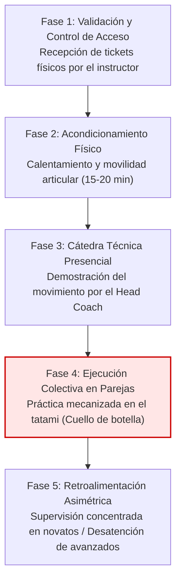
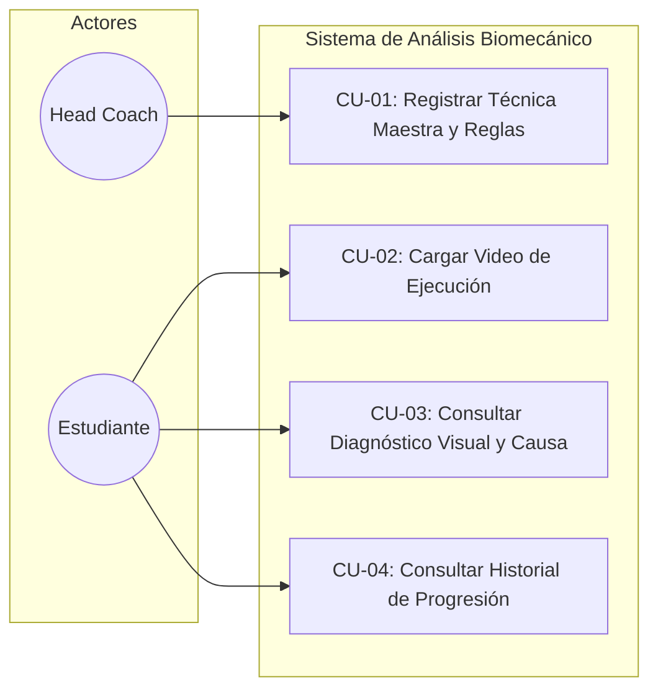
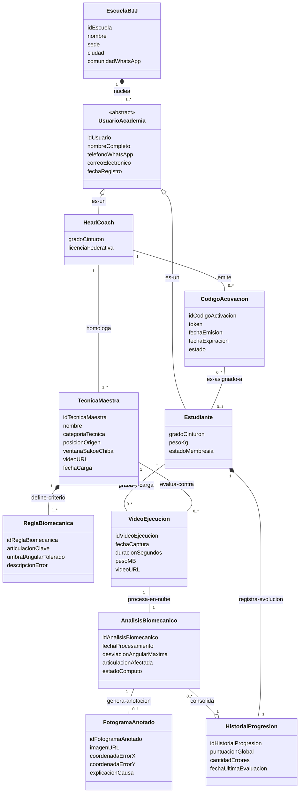
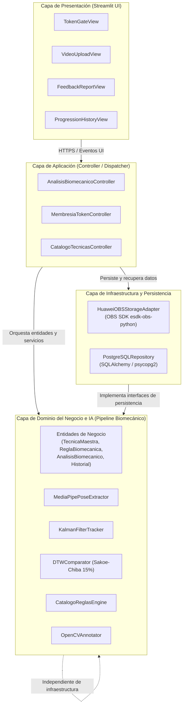
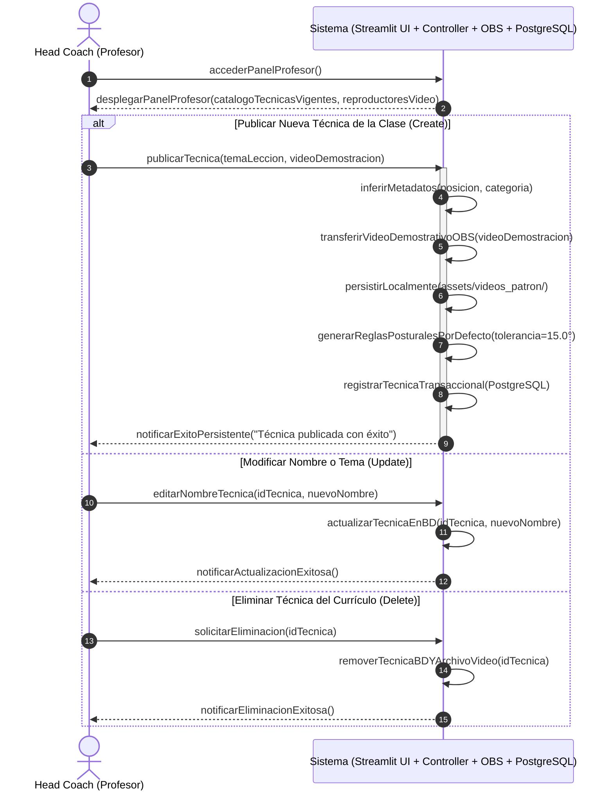
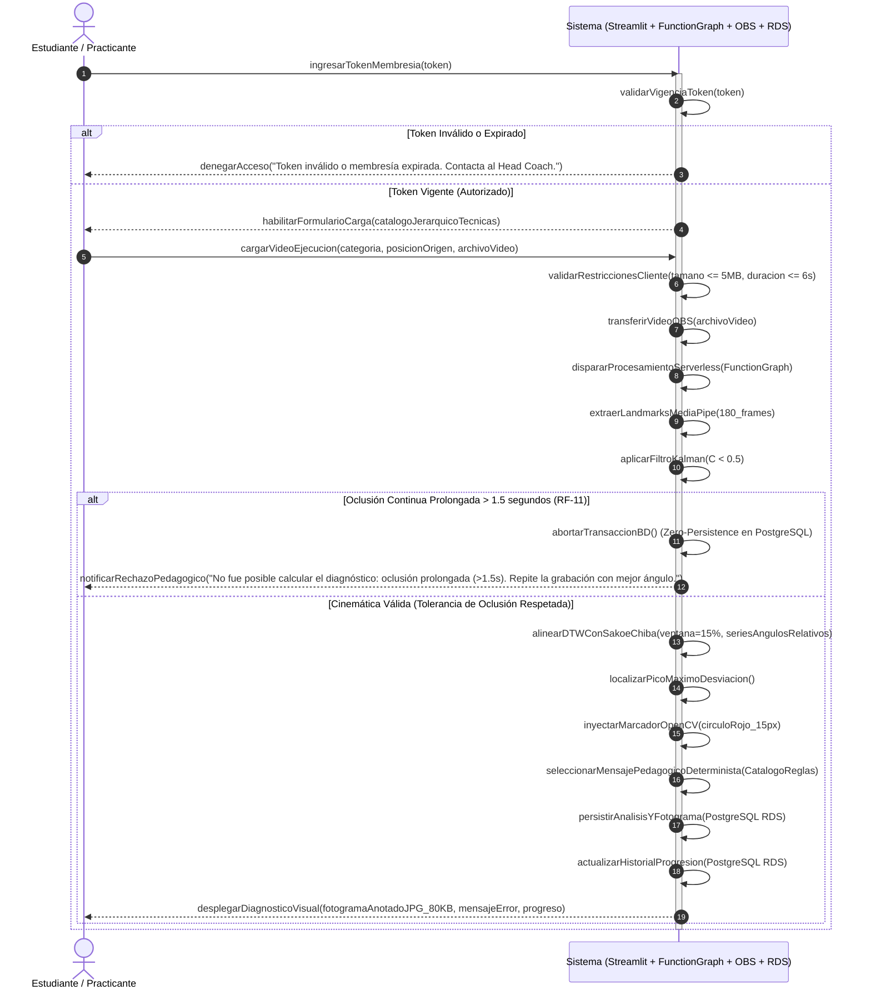
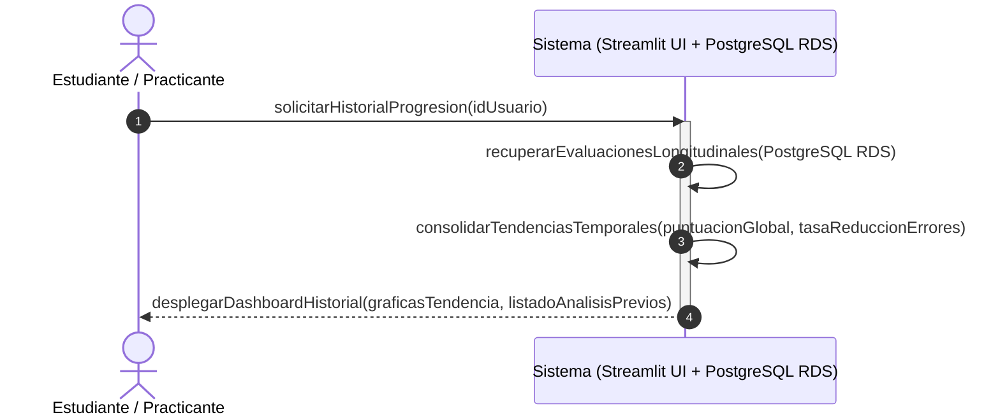
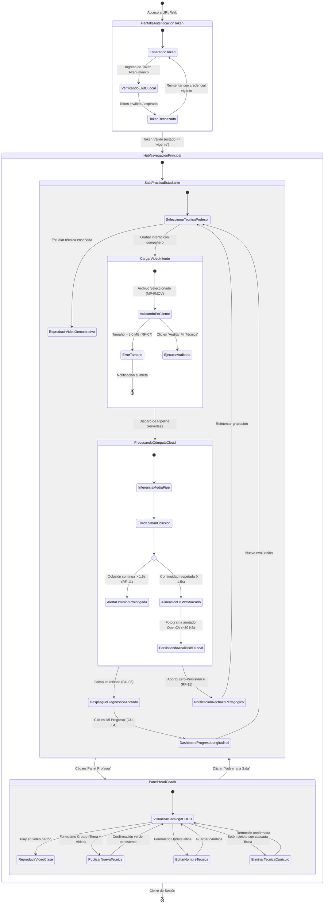

<!-- ========================================== -->
<!-- PÁGINA 1: PORTADA PRINCIPAL               -->
<!-- ========================================== -->

<div align="center">


<br>

### FACULTAD DE INGENIERÍA
### CARRERA: INGENIERÍA DE SISTEMAS

<br>

### MODALIDAD DE GRADUACIÓN
## PROYECTO DE GRADO

<br>

## APLICACIÓN WEB CON INTELIGENCIA ARTIFICIAL PARA ANALIZAR VIDEOS DE ENTRENAMIENTO DE ARTES MARCIALES EN BRAZILIAN JIU-JITSU PARA PRACTICANTES DE LA ACADEMIA CORPO & MENTE BOLIVIA

<br><br>

### **Santiago Borda Zambrana**

<br>

**Santa Cruz de la Sierra - Bolivia**  
**2026**

</div>

<br>

---

<br>

<!-- ========================================== -->
<!-- PÁGINA 2: CARÁTULA INTERIOR / HOJA DE TÍTULO -->
<!-- ========================================== -->

<div align="center">


<br>

### FACULTAD DE INGENIERÍA
### CARRERA: INGENIERÍA DE SISTEMAS

<br>

### MODALIDAD DE GRADUACIÓN
## PROYECTO DE GRADO

<br>

## APLICACIÓN WEB CON INTELIGENCIA ARTIFICIAL PARA ANALIZAR VIDEOS DE ENTRENAMIENTO DE ARTES MARCIALES EN BRAZILIAN JIU-JITSU PARA PRACTICANTES DE LA ACADEMIA CORPO & MENTE BOLIVIA

<br>

**Proyecto de Grado para optar al título de Licenciado en Ingeniería de Sistemas**

<br><br>

### **Santiago Borda Zambrana**
**Reg.: 2021210057**

<br>

**Santa Cruz de la Sierra - Bolivia**  
**2026**

</div>

<br>

---

<br>

## Tabla de Contenido

- [Capítulo I: Definición del Proyecto de Investigación](#capítulo-i-definición-del-proyecto-de-investigación)
  - [1.1 Definición del Problema](#11-definición-del-problema)
    - [1.1.1 Situación Problemática](#111-situación-problemática)
    - [1.1.2 Situación Deseada](#112-situación-deseada)
    - [1.1.3 Objeto de Investigación](#113-objeto-de-investigación)
    - [1.1.4 Alcance](#114-alcance)
    - [1.1.5 Justificación](#115-justificación)
  - [1.2 Objetivos](#12-objetivos)
    - [1.2.1 Objetivo General](#121-objetivo-general)
    - [1.2.2 Objetivos Específicos](#122-objetivos-específicos)
  - [1.3 Metodología](#13-metodología)
    - [1.3.1 Criterios de Aceptación de la Fase de Transición](#131-criterios-de-aceptación-de-la-fase-de-transición)
- [Capítulo II: Descripción de la Entidad (Corpo & Mente Bolivia)](#capítulo-ii-descripción-de-la-entidad-corpo--mente-bolivia)
  - [2.1 Descripción de la Organización](#21-descripción-de-la-organización)
  - [2.2 Estructura Organizacional](#22-estructura-organizacional)
  - [2.3 Mapeo de la Infraestructura Tecnológica Actual](#23-mapeo-de-la-infraestructura-tecnológica-actual)
  - [2.4 Flujo del Proceso de Enseñanza (El Core del Negocio)](#24-flujo-del-proceso-de-enseñanza-el-core-del-negocio)
    - [2.4.1 Identificación y Justificación Matemática del Cuello de Botella](#241-identificación-y-justificación-matemática-del-cuello-de-botella)
- [Capítulo III: Marco Teórico y Selección de Componentes Tecnológicos](#capítulo-iii-marco-teórico-y-selección-de-componentes-tecnológicos)
  - [3.1 Estimación de Poses Corporales (Pose Estimation)](#31-estimación-de-poses-corporales-pose-estimation)
    - [3.1.1 Análisis Comparativo de Extractores de Poses](#311-análisis-comparativo-de-extractores-de-poses)
    - [3.1.2 Justificación Técnica de la Elección: MediaPipe Pose](#312-justificación-técnica-de-la-elección-mediapipe-pose)
  - [3.2 Infraestructura y Cómputo en la Nube (Cloud Computing)](#32-infraestructura-y-cómputo-en-la-nube-cloud-computing)
    - [3.2.1 Análisis Comparativo de Proveedores Cloud y Modelos de Cómputo](#321-análisis-comparativo-de-proveedores-cloud-y-modelos-de-cómputo)
    - [3.2.2 Justificación Técnica de la Elección: Huawei Cloud (FunctionGraph + OBS)](#322-justificación-técnica-de-la-elección-huawei-cloud-functiongraph--obs)
  - [3.3 Algoritmos de Alineación Temporal Biomecánica](#33-algoritmos-de-alineación-temporal-biomecánica)
    - [3.3.1 Análisis Comparativo de Algoritmos de Comparación de Series](#331-análisis-comparativo-de-algoritmos-de-comparación-de-series)
    - [3.3.2 Justificación Técnica de la Elección: Dynamic Time Warping (DTW)](#332-justificación-técnica-de-la-elección-dynamic-time-warping-dtw)
  - [3.4 Procesamiento Digital de Imágenes y Generación del Entregable](#34-procesamiento-digital-de-imágenes-y-generación-del-entregable)
    - [3.4.1 Análisis Comparativo de Tecnologías de Salida Visual](#341-análisis-comparativo-de-tecnologías-de-salida-visual)
    - [3.4.2 Justificación Técnica de la Elección: Procesamiento Digital con OpenCV](#342-justificación-técnica-de-la-elección-procesamiento-digital-con-opencv)
  - [3.5 Interfaz de Usuario y Entorno de Despliegue](#35-interfaz-de-usuario-y-entorno-de-despliegue)
    - [3.5.1 Análisis Comparativo de Frameworks Web](#351-análisis-comparativo-de-frameworks-web)
    - [3.5.2 Justificación Técnica de la Elección: Streamlit](#352-justificación-técnica-de-la-elección-streamlit)
- [Capítulo IV: Definición de Requisitos](#capítulo-iv-definición-de-requisitos)
  - [4.1 Introducción](#41-introducción)
    - [4.1.1 Propósito](#411-propósito)
    - [4.1.2 Ámbito del Sistema](#412-ámbito-del-sistema)
    - [4.1.3 Definiciones, Acrónimos y Abreviaturas](#413-definiciones-acrónimos-y-abreviaturas)
    - [4.1.4 Visión General del Documento](#414-visión-general-del-documento)
  - [4.2 Descripción General](#42-descripción-general)
    - [4.2.1 Perspectiva del Producto](#421-perspectiva-del-producto)
    - [4.2.2 Funciones del Producto](#422-funciones-del-producto)
    - [4.2.3 Características de los Usuarios](#423-características-de-los-usuarios)
    - [4.2.4 Restricciones](#424-restricciones)
    - [4.2.5 Suposiciones y Dependencias](#425-suposiciones-y-dependencias)
    - [4.2.6 Requisitos Futuros](#426-requisitos-futuros)
  - [4.3 Requisitos Específicos](#43-requisitos-específicos)
    - [4.3.1 Interfaces Externas](#431-interfaces-externas)
    - [4.3.2 Requisitos Funcionales](#432-requisitos-funcionales)
    - [4.3.3 Requisitos de Rendimiento](#433-requisitos-de-rendimiento)
    - [4.3.4 Restricciones de Diseño](#434-restricciones-de-diseño)
    - [4.3.5 Atributos del Sistema](#435-atributos-del-sistema)
  - [4.4 Identificación de los Casos de Uso](#44-identificación-de-los-casos-de-uso)
  - [4.5 Diagrama de Dominio](#45-diagrama-de-dominio)
- [Capítulo V: Análisis y Diseño del Sistema](#capítulo-v-análisis-y-diseño-del-sistema)
  - [5.1 Arquitectura del Software y Entorno de Despliegue Cloud](#51-arquitectura-del-software-y-entorno-de-despliegue-cloud)
    - [5.1.1 Vista Lógica y Arquitectura en Capas](#511-vista-lógica-y-arquitectura-en-capas)
    - [5.1.2 Vista de Despliegue Físico en Huawei Cloud](#512-vista-de-despliegue-físico-en-huawei-cloud)
    - [5.1.3 Análisis de Factores Arquitectónicos y Restricciones](#513-análisis-de-factores-arquitectónicos-y-restricciones)
  - [5.2 Diseño del Comportamiento Dinámico (Realización de Casos de Uso)](#52-diseño-del-comportamiento-dinámico-realización-de-casos-de-uso)
    - [5.2.1 Diagramas de Secuencia del Sistema (SSD) y Contratos de Operación](#521-diagramas-de-secuencia-del-sistema-ssd-y-contratos-de-operación)
    - [5.2.2 Aplicación de Patrones GRASP y GoF](#522-aplicación-de-patrones-grasp-y-gof)
  - [5.3 Diagrama de Clases de Diseño (DCD)](#53-diagrama-de-clases-de-diseño-dcd)
    - [5.3.1 Especificación Formal de Clases de Software](#531-especificación-formal-de-clases-de-software)
  - [5.4 Diseño Lógico de la Base de Datos (PostgreSQL Local en Entorno de Desarrollo)](#54-diseño-lógico-de-la-base-de-datos-postgresql-local-en-entorno-de-desarrollo)
    - [5.4.1 Mapeo Objeto-Relacional y Normalización](#541-mapeo-objeto-relacional-y-normalización)
    - [5.4.2 Diccionario de Datos Formal](#542-diccionario-de-datos-formal)
    - [5.4.3 Scripts DDL de Creación e Índices B-Tree](#543-scripts-ddl-de-creación-e-índices-b-tree)
  - [5.5 Diseño de Interfaces de Usuario (UI/UX en Streamlit)](#55-diseño-de-interfaces-de-usuario-uiux-en-streamlit)
    - [5.5.1 Diagrama de Navegación y Flujo de Estados](#551-diagrama-de-navegación-y-flujo-de-estados)
    - [5.5.2 Especificación de Layouts y Visualización del Diagnóstico](#552-especificación-de-layouts-y-visualización-del-diagnóstico)
    - [5.5.3 Sistema de Diseño Visual, Paleta Oficial y Adaptabilidad](#553-sistema-de-diseño-visual-paleta-oficial-y-adaptabilidad)
  - [5.6 Estado de Implementación del Software, Cobertura TDD y Manual de Ejecución Local](#56-estado-de-implementación-del-software-cobertura-tdd-y-manual-de-ejecución-local)
    - [5.6.1 Arquitectura Implementada y Estructura de Paquetes](#561-arquitectura-implementada-y-estructura-de-paquetes)
    - [5.6.2 Matriz de Trazabilidad y Validación Automatizada (46 Pruebas TDD)](#562-matriz-de-trazabilidad-y-validación-automatizada-46-pruebas-tdd)
    - [5.6.3 Manual de Puesta en Marcha para el Tribunal Evaluador](#563-manual-de-puesta-en-marcha-para-el-tribunal-evaluador)

---

# Capítulo I: Definición del Proyecto de Investigación

## 1.1 Definición del Problema

### 1.1.1 Situación Problemática

En la academia **Corpo & Mente Bolivia**, ubicada en Santa Cruz de la Sierra, la enseñanza del Jiu-Jitsu Brasileño (BJJ) se fundamenta en un modelo analógico tradicional. El instructor demuestra una técnica compleja (por ejemplo, un pasaje de guardia o una finalización articular) y posteriormente supervisa de forma simultánea a grupos de 15 a 30 alumnos. Esta asimetría formativa genera los siguientes inconvenientes críticos:

1. **Saturación del canal de retroalimentación:** El instructor no puede evaluar de manera minuciosa ni en tiempo real los ángulos anatómicos ni la alineación biomecánica exacta de cada pareja de estudiantes en el tatami.
2. **Sesgo de autopercepción:** Los practicantes ejecutan movimientos con errores imperceptibles para sí mismos (inadecuado aislamiento de articulaciones, ángulos de cadera deficientes), lo que estanca su progresión técnica, genera frustración y eleva significativamente el riesgo de lesiones musculoesqueléticas.
3. **Limitación del hardware del usuario:** Los alumnos que intentan registrar sus progresos en video carecen de herramientas locales accesibles. Los modelos comerciales convencionales de Visión por Computadora exigen estaciones de trabajo equipadas con Unidades de Procesamiento Gráfico (GPU) dedicadas de alto costo, inaccesibles para el entorno informático del estudiante promedio boliviano (laptops de gama de entrada o teléfonos celulares inteligentes con capacidad de cómputo gráfico limitada).

### 1.1.2 Situación Deseada

Se proyecta el diseño e implementación de un ecosistema de software adaptativo y multiplataforma sustentado sobre una arquitectura en la nube (*Huawei Cloud*), orientado a actuar como un asistente virtual biomecánico asincrónico. En este escenario ideal:

* **Adaptabilidad de cátedra:** El profesor de Corpo & Mente carga un único video patrón con la ejecución canónica de la técnica, el cual se procesa en la nube para extraer un esqueleto matemático de referencia.
* **Carga móvil accesible:** Los estudiantes graban sus ejecuciones directamente desde sus dispositivos móviles en el tatami y las cargan a la plataforma de forma ágil y liviana.
* **Diagnóstico de precisión:** El sistema sincroniza las series temporales del video del estudiante con respecto al video maestro mediante algoritmos de Envoltura Temporal Dinámica (*Dynamic Time Warping*, DTW), detectando desviaciones geométricas exactas.
* **Retroalimentación visual directa y ligera:** El sistema consolida un registro histórico de progresión técnica del practicante. En lugar de transmitir pesados archivos de video que saturen el ancho de banda móvil, genera y despliega un **fotograma clave de falla anotado** (*annotated keyframe*). Este consiste en una imagen fija del instante exacto del error con un indicador visual (círculo de color inyectado mediante procesamiento digital de imágenes) sobre la articulación defectuosa y una alerta textual concisa. Todo el procesamiento pesado se delega a microservicios remotos bajo demanda, permitiendo una experiencia fluida sin comprometer la capacidad térmica ni energética del dispositivo local.

### 1.1.3 Objeto de Investigación

El objeto de estudio comprende la aplicación articulada de técnicas de **Visión por Computadora** (estimación de poses corporales mediante MediaPipe), **procesamiento digital de imágenes** (OpenCV), **procesamiento elástico en la nube** (*Serverless Cloud Computing*) y **algoritmos de alineación de series temporales** (*Dynamic Time Warping*, DTW) para la evaluación asincrónica automatizada de la calidad técnica deportiva y el suministro de retroalimentación biomecánica adaptativa mediante imágenes clave anotadas. Conviene puntualizar que el extractor de poses corporales (MediaPipe Pose) es una herramienta de visión artificial de propósito general que no clasifica ni identifica el tipo de deporte o disciplina marcial; el "conocimiento" biomecánico específico de Jiu-Jitsu Brasileño reside exclusivamente en el catálogo curricular de técnicas maestras y reglas deterministas de error configurado por el Head Coach, y no en una red neuronal pre-entrenada para reconocer artes marciales. En consecuencia, el sistema opera comparando esqueletos cinemáticos contra un molde de referencia seleccionado manualmente por el practicante (ver Sección 4.1.2 y requisito RF-07), sin interpretar ni clasificar la disciplina por sí mismo.

### 1.1.4 Alcance

* **Límite Funcional:** El sistema posibilitará la carga asincrónica de videos en formato estándar (`.mp4`, `.mov`) capturados desde terminales móviles, la extracción automatizada de 33 puntos clave corporales, la alineación temporal no lineal con respecto al video patrón, el cómputo de discrepancias vectoriales angulares y la generación automatizada de una imagen estática editada con un marcador sobre la falla biomecánica, desplegada a través de una interfaz web liviana (*Streamlit*).
* **Límite de Datos:** La validación algorítmica preliminar y las pruebas de estrés del módulo de extracción de poses se sustentarán en conjuntos de datos abiertos de BJJ (tales como el dataset de *ViCoS Lab*). Por su parte, la evaluación adaptativa real se efectuará exclusivamente con los videos de referencia cargados por los instructores de Corpo & Mente Bolivia y las ejecuciones prácticas de sus alumnos.
* **Exclusiones:** El sistema no realizará diagnósticos médicos, traumatológicos ni fisioterapéuticos de lesiones; tampoco ejecutará renderizado tridimensional inmersivo ni procesamiento de video en tiempo real sobre hardware local de baja gama. La interacción en el dispositivo del cliente se limitará a la recepción de matrices numéricas procesadas e imágenes optimizadas previamente en la nube.

### 1.1.5 Justificación

#### Justificación Técnica
Demuestra la viabilidad de democratizar la inteligencia artificial aplicada al deporte mediante arquitecturas híbridas (*Edge-Cloud*). Se resuelve la restricción del hardware del usuario final delegando la extracción matemática y la manipulación de la imagen a microservicios elásticos en la nube, operando bajo un costo marginal estrictamente controlado e inferior a los $30 USD trimestrales.

#### Justificación Económica y Social
Proporciona a las academias deportivas de Santa Cruz de la Sierra un factor diferenciador de vanguardia tecnológica a bajo costo. Desde la perspectiva del practicante, optimiza la curva de aprendizaje motriz, disminuye la necesidad de contratar sesiones privadas personalizadas de alto costo y mitiga la incidencia de lesiones articulares causadas por la repetición de posturas viciadas.

---

## 1.2 Objetivos

### 1.2.1 Objetivo General

Desarrollar un sistema de software adaptativo en la nube para la evaluación biomecánica y el análisis de errores en la ejecución de técnicas de Jiu-Jitsu Brasileño, que sirva como herramienta de retroalimentación asincrónica visual para los practicantes de la academia **Corpo & Mente Bolivia**, mediante el uso de estimación de poses y procesamiento distribuido.

### 1.2.2 Objetivos Específicos

1. **Analizar** los requerimientos de interacción biomecánica y el flujo operativo técnico dentro de la academia Corpo & Mente Bolivia.
2. **Diseñar** una arquitectura híbrida de cómputo que integre cubos de almacenamiento (*Huawei Cloud Object Storage Service - OBS*) con servicios de cómputo ligero bajo demanda (*FunctionGraph*) para aislar el hardware local de cargas computacionales pesadas de forma económicamente sostenible.
3. **Implementar** el pipeline matemático biomecánico integrando la normalización antropomórfica de coordenadas articulares, la compensación cinemática de oclusiones mediante Filtro de Kalman y la sincronización temporal no lineal mediante *Dynamic Time Warping* (DTW) con restricción de ventana de Sakoe-Chiba para cuantificar las desviaciones frente al patrón de referencia.
4. **Construir** una interfaz de usuario interactiva y liviana que presente la imagen estática anotada mediante OpenCV con la señalización precisa del error biomecánico y la descripción textual del fallo técnico basada en reglas deterministas.
5. **Evaluar** longitudinalmente el impacto del sistema en la progresión técnica de los practicantes a partir de los registros históricos acumulados en la plataforma, contrastando estadísticamente las evaluaciones iniciales de cada atleta contra sus registros más recientes mediante la **prueba no paramétrica de rangos con signo de Wilcoxon para muestras pareadas** (verificando previamente el supuesto de normalidad con la prueba de **Shapiro-Wilk**, o aplicando la prueba t de Student para muestras relacionadas si los datos presentan distribución normal), a fin de determinar si existe una reducción estadísticamente significativa ($p < 0.05$) en la magnitud de los errores biomecánicos con el tiempo.
6. **Medir** la tasa de adopción y uso continuado del sistema entre los practicantes de la academia durante el periodo de validación, contrastando los resultados empíricos frente a los umbrales cuantitativos propuestos como meta de validación operativa (al menos 50% de estudiantes con token activo completando cargas de video y al menos 30% de retención en sesiones posteriores), como indicador formal de viabilidad y aceptación práctica en el tatami.

---

## 1.3 Metodología

Con base en las directrices metodológicas de Craig Larman (2004), la investigación adopta el **Proceso Unificado (UP)** adaptado a un marco de trabajo ágil iterativo e incremental. El ciclo de desarrollo se estructura en cuatro fases disciplinadas, orientadas a la mitigación sistemática de riesgos tecnológicos:

* **Fase de Inicio (*Inception*):** Delimitación rigurosa del alcance del proyecto, identificación y priorización de riesgos tecnológicos críticos (tales como la latencia de red en la carga móvil y las fluctuaciones tarifarias en la nube) y consolidación de los requerimientos de negocio de la academia.
* **Fase de Elaboración (*Elaboration*):** Mitigación de los riesgos arquitectónicos de mayor impacto. Se formaliza la arquitectura base y el Modelo de Dominio. Se valida la factibilidad técnica construyendo un prototipo funcional que conecte la captura móvil con el almacenamiento en la nube (*OBS*) sin provocar estrés térmico en el cliente.
* **Fase de Construcción (*Construction*):** Desarrollo modular y desacoplado de los componentes de cómputo. Implementación de los microservicios sin servidor (*Serverless* con *FunctionGraph*), codificación del motor matemático de detección de errores (DTW con restricciones de banda), integración de los algoritmos de anotación digital sobre imágenes con OpenCV y desarrollo del frontend web reactivo en *Streamlit*.
* **Fase de Transición (*Transition*):** Despliegue del aplicativo en el entorno operativo real de Corpo & Mente Bolivia. Recolección continua de los resultados analíticos en el historial de progresión técnica de los practicantes a lo largo del periodo de prueba, contrastación estadística longitudinal entre las evaluaciones iniciales y finales de cada atleta mediante la prueba de rangos con signo de Wilcoxon para muestras pareadas (o t de Student según la verificación previa de normalidad con Shapiro-Wilk), y contrastación de las métricas de adopción real y retención de uso en el tatami frente a las metas de validación cuantitativas definidas para la redacción de las conclusiones formales del estudio.

### 1.3.1 Criterios de Aceptación de la Fase de Transición

Con el objetivo de dotar a la fase experimental de rigor metodológico y proveer un marco objetivo de contrastación científica durante la defensa del proyecto, se establecen los siguientes criterios cuantitativos de aceptación. Se deja explícitamente establecido que estos valores constituyen las **metas de validación propuestas** para la evaluación del sistema y no resultados preexistentes consolidados, dado que el aplicativo se encuentra en fase previa a su despliegue operativo en el tatami: en rigor metodológico (Larman, Gestión de Fases UP), estos parámetros operan como **hipótesis nulas de validación operativa y criterios formales de aceptación** que serán contrastados empíricamente mediante inferencia estadística exclusivamente durante la ejecución de la Fase de Transición, una vez que el aplicativo se encuentre desplegado en el tatami.

1. **Protocolo de Inferencia Estadística y Rigor Biomecánico:**
   * *Verificación de Supuestos:* Dado que la muestra esperada de atletas participantes de una sola academia real será acotada ($N < 30$ sujetos esperados durante la prueba piloto) y no resulta metodológicamente admisible asumir normalidad en la distribución de las discrepancias angulares motrices, se aplicará en primera instancia la **prueba de Shapiro-Wilk** con un nivel de significancia $\alpha = 0.05$ sobre las diferencias pareadas.
   * *Selección del Estadístico de Contraste:* Al preverse el no cumplimiento del supuesto de normalidad en muestras reducidas de rendimiento deportivo, el método principal de contraste será la **prueba no paramétrica de rangos con signo de Wilcoxon para muestras pareadas**, comparando la mediana de desviación angular del primer registro de cada practicante frente a la mediana de su registro más reciente. En caso de que la prueba de Shapiro-Wilk no rechace la normalidad ($p \ge 0.05$), se aplicará alternativamente la **prueba paramétrica t de Student para muestras relacionadas**.
   * *Criterio de Aceptación:* Se considerará validada la hipótesis de efectividad pedagógica si el contraste exhibe una reducción estadísticamente significativa en el error angular ($p < 0.05$), evidenciando una mejora técnica objetiva asociada a la retroalimentación asincrónica del sistema.

2. **Criterio Cuantitativo de Adopción y Retención en el Tatami:**
   * *Tasa Mínima de Activación y Carga Inicial:* Al menos el **50% de los practicantes con Código de Activación (token) vigente** durante el periodo de validación deberán completar exitosamente al menos una carga de video y recibir su reporte anotado.
   * *Tasa Mínima de Retención (Uso Recurrente):* Al menos el **30% de los practicantes que realizaron una primera carga** deberán volver a utilizar la plataforma en una o más sesiones subsiguientes de entrenamiento (tasa de retención tras el primer uso).
   * *Fundamentación de Negocio:* Estos umbrales se sustentan en la literatura sobre adopción de tecnologías digitales en disciplinas deportivas presenciales —donde la fricción asociada a la grabación en clase suele mermar el compromiso digital—, fijando un estándar cuantitativo reproducible y defendible para dictaminar la viabilidad práctica y la aceptación del producto en Corpo & Mente Bolivia.

---

# Capítulo II: Descripción de la Entidad (Corpo & Mente Bolivia)

## 2.1 Descripción de la Organización

**Corpo & Mente Bolivia** opera como una entidad jurídica y operativamente autónoma bajo el marco de la franquicia internacional de Jiu-Jitsu Brasileño **Corpo & Mente** (https://www.equipecorpoemente.com.br/). Si bien su sede principal se encuentra físicamente alojada en las instalaciones del gimnasio **Knock Out** (ubicado en el complejo Mia Plaza, Santa Cruz de la Sierra), esta relación se limita estrictamente a un contrato de arrendamiento de espacio físico (tatami y vestuarios). Corpo & Mente no comparte infraestructura tecnológica, administrativa ni jurídica con Knock Out, lo que le permite mantener su independencia operativa y enfocar sus recursos exclusivamente en la pedagogía del BJJ y la implementación de tecnologías de soporte propias, como el sistema propuesto en esta tesis. Adicionalmente, la organización mantiene sucursales activas en otros centros deportivos de la ciudad, tales como el gimnasio **UFC** y la academia **3 Pasos al Frente**.

La organización cuenta con un padrón histórico acumulado de **72 miembros inscritos** a lo largo de su trayectoria. No obstante, la asistencia efectiva presenta una naturaleza irregular y fluctuante, propia de las dinámicas de las academias de artes marciales: un núcleo de alumnos entrena de forma constante, mientras que otros asisten de manera intermitente o retoman las clases tras periodos de inactividad prolongados que pueden extenderse hasta tres meses. La comunicación institucional entre el Head Coach y los practicantes se canaliza principalmente a través de una **comunidad oficial de WhatsApp**, la cual funciona como medio primario de coordinación de horarios, avisos operativos y convocatorias.

La entidad sustenta su propuesta de valor sobre dos pilares complementarios: la excelencia en la técnica deportiva y la preservación de la salud integral del practicante. Su población activa comprende divisiones infantiles, practicantes adultos recreativos y atletas de alto rendimiento con participación en certámenes competitivos departamentales, nacionales e internacionales.

## 2.2 Estructura Organizacional

La estructura operativa de la institución se ajusta a un modelo lineal-funcional, diseñado para garantizar la adecuada prestación de servicios deportivos y la supervisión técnica constante. Los niveles jerárquicos se distribuyen de la siguiente forma:

* **Dirección General / Head Coach:** Máxima autoridad técnica y pedagógica. Responsable de la visión estratégica institucional, la capacitación continua del cuerpo docente, la homologación curricular del plan de enseñanza del BJJ y la definición exclusiva de las técnicas maestras de referencia y el catálogo de reglas biomecánicas de error en el sistema de software.
* **Cuerpo de Instructores:** Profesionales del área deportiva encargados de conducir las sesiones prácticas, supervisar la ejecución biomecánica directa de los estudiantes en el tatami y orientar a los alumnos en el uso de la herramienta de auditoría asincrónica.
* **Área de Recepción y Atención al Cliente:** Unidad administrativa encargada del control de contratos, cobro de membresías, registro de asistencias y soporte operativo.
* **Estudiantes y Practicantes:** Usuarios receptores del servicio, constituyendo el núcleo del proceso pedagógico y los destinatarios directos de la solución tecnológica proyectada.

---

## 2.3 Mapeo de la Infraestructura Tecnológica Actual

El análisis de viabilidad técnica requiere examinar el estado de madurez de los sistemas informáticos presentes en Corpo & Mente Bolivia. La institución opera actualmente bajo una infraestructura descentralizada y de carácter estrictamente local:

* **Gestión de Datos y Membresías (Backend Local):** El control administrativo de legajos de estudiantes, datos de contacto, planes suscritos y cobranzas se gestiona de manera aislada mediante una base de datos relacional de escritorio implementada en *Microsoft Access*. La herramienta carece de mecanismos de sincronización en la nube, respaldo automatizado o interfaces de consulta remota para el cuerpo de instructores.
* **Control de Acceso Biométrico (Hardware de Entrada):** En el punto de transición hacia el área de entrenamiento (tatami), la academia cuenta con un sensor periférico de lectura de huellas dactilares. El dispositivo valida el estado administrativo del usuario consultando la base de datos local de recepción.
* **Mecanismo de Validación Física (Sistema de Tickets):** Al validarse la identidad biométrica y confirmarse la vigencia de la cuota, el terminal emite un ticket físico impreso en papel térmico. Este comprobante opera como credencial física de acceso diario; el alumno debe portarlo al tatami y entregarlo personalmente al instructor a cargo como evidencia de habilitación formal y mecanismo de control de aforo antes del inicio de la sesión.
* **Canal de Comunicación Digital (WhatsApp):** El Head Coach administra una comunidad oficial de WhatsApp que agrupa a los 72 miembros registrados de la academia. Este canal digital funciona como el medio primario de coordinación de horarios, avisos operativos, difusión de contenido técnico complementario y convocatorias a entrenamientos o competiciones. La existencia de este canal confirma que la totalidad de la base de usuarios dispone de dispositivos inteligentes con conectividad a internet.
* **Diagnóstico de Madurez Tecnológica:** Si bien la gestión administrativa es eminentemente local y analógica, la presencia de un circuito que combina software (*Microsoft Access*) con hardware periférico (*sensores biométricos* e impresoras térmicas), complementado por el uso cotidiano de una comunidad de WhatsApp como canal institucional, constata que tanto el personal como los usuarios poseen familiaridad con flujos asistidos por computadora y se encuentran habituados a la interacción digital desde dispositivos móviles. Estas circunstancias mitigan sustancialmente la resistencia al cambio y validan la factibilidad de introducir una interfaz web para la recepción de diagnósticos biomecánicos.

---

## 2.4 Flujo del Proceso de Enseñanza (El Core del Negocio)

La sesión formativa habitual dentro de Corpo & Mente Bolivia sigue una secuencia pedagógica tradicional, estructurada en cinco etapas sucesivas:



**Figura 2.1**  
*Diagrama de Flujo del Proceso Pedagógico Actual en Tatami de Corpo & Mente Bolivia.*

1. **Fase de Recepción y Control de Acceso:** El instructor recolecta los comprobantes impresos suministrados por la recepción, verificando que los 15 a 30 alumnos presentes cumplan con las disposiciones administrativas previas.
2. **Fase de Acondicionamiento Físico:** Se desarrolla una rutina colectiva de elevación de temperatura muscular, estiramiento dinámico y movilidad articular (15 a 20 minutos) destinada a preparar el sistema neuromuscular para esfuerzos mecánicos intensos.
3. **Fase de Cátedra Técnica:** Los estudiantes forman un semicírculo alrededor del instructor principal, quien desglosa biomecánicamente la técnica del día (por ejemplo, una transición desde *X-Guard*) sobre un compañero de demostración, explicando verbalmente los puntos de palanca, agarres (*grips*) y trayectorias angulares requeridas.
4. **Fase de Ejecución en Parejas (Mecanización):** Los alumnos se distribuyen por parejas y reproducen de forma sincrónica el movimiento expuesto. El docente abandona el rol de instructor magistral para asumir un rol de supervisor itinerante a lo largo de la superficie del tatami.

### 2.4.1 Identificación y Justificación Matemática del Cuello de Botella

Es precisamente en la **Fase de Ejecución en Parejas** donde se suscita el colapso del modelo pedagógico analógico, debido a las limitaciones cuantitativas de tiempo y capacidad de cobertura humana:

* **Asimetría del Feedback Itinerante:** Considerando una clase promedio de 20 estudiantes (10 parejas en simultáneo) y un segmento de práctica técnica activa de 30 minutos netos, el docente dispone, en el mejor de los casos teóricos, de un máximo de:
  
  $$\text{Tiempo por Pareja} = \frac{30 \text{ minutos}}{10 \text{ parejas}} = 3 \text{ minutos por pareja}$$
  
  Asumiendo desplazamientos continuos e instantáneos sin tiempos muertos. En términos reales, el acompañamiento suele ser inferior a los 90 segundos efectivos por estudiante.
* **Sesgo de Priorización Pedagógica:** Ante la escasez crítica de tiempo, el docente prioriza a los estudiantes novatos (*cinturones blancos*), ya que carecen de patrones motores consolidados, exhiben errores estructurales evidentes y presentan una vulnerabilidad sustancialmente mayor frente a lesiones musculoesqueléticas.
* **Desatención Sistemática de Practicantes Avanzados:** La focalización en los principiantes conduce a que los alumnos graduados reciban lapsos de observación prácticamente nulos. En este segmento, las incorrecciones técnicas no son gruesas sino milimétricas (desviaciones angulares de cadera de pocos grados o deficiente orientación de los vectores de fuerza). Estos fallos sutiles terminan fijándose involuntariamente en la memoria neuromuscular del atleta, estancando su potencial competitivo y generando frustración técnica.

* **Resolución y Validación Matemática del Cuello de Botella Mediante Cómputo Concurrente:** Frente al límite físico estrictamente secuencial del docente ($T_{\text{secuencial}} = 30 \text{ minutos}$ distribuidos a razón de $\leq 90 \text{ segundos}$ por estudiante), la solución asincrónica en la nube introduce un modelo de procesamiento elástico masivamente paralelo. Considerando que las $P = 10$ parejas (20 alumnos) capturen y carguen sus videos al concluir simultáneamente la serie de mecanización técnica, el tiempo global de respuesta del sistema distribuido se formula como:

  $$T_{\text{sistema}} = \max_{i=1}^{P} \left( t_{\text{subida}, i} + t_{\text{serverless}, i} + t_{\text{bajada}, i} \right)$$

  Bajo las condiciones operativas especificadas ($t_{\text{subida}} \approx 2.5\text{ s}$ para videos de hasta 5 MB en redes 4G/LTE, $t_{\text{serverless}} \leq 4.0\text{ s}$ en *FunctionGraph* y $t_{\text{bajada}} \approx 0.2\text{ s}$ para el fotograma anotado de $\sim 80\text{ KB}$), el tiempo total de procesamiento concurrente no supera los **$6.7\text{ segundos}$**. Al ejecutarse cada análisis en instancias elásticas desacopladas e independientes de *FunctionGraph*, las 10 parejas reciben su retroalimentación visual anotada en menos de $7\text{ segundos}$ de forma simultánea, transformando un proceso secuencial saturado de $30\text{ minutos}$ en una respuesta analítica casi instantánea, descongestionando efectivamente el tatami.

El diagnóstico confirma que el docente presencial ha superado su límite cognitivo de supervisión itinerante. El asistente tecnológico no reemplaza la pedagogía del profesor, sino que amplifica su capacidad de auditoría mediante un canal visual asincrónico y objetivo.

---

# Capítulo III: Marco Teórico y Selección de Componentes Tecnológicos

Este capítulo establece los fundamentos tecnológicos y algoritmos base que sustentan el ecosistema de software propuesto. Se aplica un enfoque analítico comparativo mediante matrices de decisión ponderadas para justificar formalmente la selección de cada componente tecnológico frente a las alternativas disponibles en el mercado científico y comercial.

## 3.1 Estimación de Poses Corporales (*Pose Estimation*)

La extracción de esqueletos articulares (puntos clave o *landmarks*) a partir de fuentes de video digital constituye el núcleo del análisis biomecánico. A fin de asegurar la sostenibilidad económica y el escalamiento elástico del sistema en la nube, se requiere un extractor computacionalmente eficiente que prescinda de hardware gráfico dedicado masivo.

### 3.1.1 Análisis Comparativo de Extractores de Poses

Se contrastan las tres tecnologías más representativas del estado del arte: **MediaPipe Pose** (Google), **OpenPose** (Carnegie Mellon University) y **YOLOv8-Pose** (Ultralytics).

**Tabla 3.1**  
*Matriz de Selección para Estimación de Poses*

| Criterios de Selección | Peso (%) | MediaPipe Pose | OpenPose | YOLOv8-Pose |
| :--- | :---: | :---: | :---: | :---: |
| Densidad de Puntos Clave (Anatomía) | 25% | 5 (33 puntos) | 4 (25 puntos) | 3 (17 puntos) |
| Eficiencia en CPU (Costo en Nube) | 30% | 5 (Ultra liviano) | 1 (Exige GPU) | 3 (Moderado) |
| Licenciamiento y Restricciones | 20% | 5 (Apache 2.0) | 1 (Comercial pago) | 2 (AGPL-3.0) |
| Robustez en Modelos de Suelo | 25% | 3 (Regular) | 4 (Bueno) | 4 (Bueno) |
| **Puntaje Ponderado Total** | **100%** | **4.50** | **2.50** | **3.05** |

*Nota*. Escala de evaluación: 1 (Deficiente) al 5 (Excelente). Ponderación sobre base de 100%.

### 3.1.2 Justificación Técnica de la Elección: MediaPipe Pose

El análisis multicriterio posiciona a **MediaPipe Pose** como la alternativa superior, alcanzando una valoración ponderada de **4.50 / 5.00**.

* **Ventaja Anatómica:** MediaPipe extrae 33 puntos clave frente a los 17 detectados por YOLOv8. Estos nodos adicionales incorporan la topología completa de tobillos y pies, áreas anatómicas indispensables dentro del Jiu-Jitsu para evaluar ganchos de control, pasos de guardia y distribución del equilibrio.
* **Justificación del Descarte de Alternativas:** OpenPose se descarta debido a su arquitectura convolucional pesada de tipo *Bottom-Up*, la cual demanda aceleración por hardware (Nvidia CUDA) para alcanzar rendimientos aceptables, lo que elevaría la infraestructura cloud a costos prohibitivos. A su vez, YOLOv8-Pose se desestima por su licencia restrictiva AGPL-3.0 y su baja resolución articular (17 nodos), insuficiente para el seguimiento biomecánico fino.
* **Estrategia de Mitigación de Oclusiones:** En el Jiu-Jitsu Brasileño, la práctica técnica se desarrolla inherentemente en parejas (replicando fielmente la Fase 4 de mecanización en tatami descrita en la Sección 2.4), lo que genera contacto físico estrecho y oclusiones parciales inevitables debidas a los agarres y la superposición de extremidades. El sistema asume esta realidad operativa mediante un protocolo de captura en "laboratorio técnico" que estandariza el encuadre (toma lateral fija, iluminación homogénea y ambos practicantes dentro de cuadro), sin desnaturalizar el entrenamiento con compañero ni exigir condiciones irreales de ejecución en solitario. Para resolver las oclusiones anatómicas en video real de entrenamiento, el algoritmo monitorea el vector de confiabilidad articular ($C \in [0.0, 1.0]$) reportado por MediaPipe. Cuando la visibilidad de una articulación desciende de $C < 0.5$ producto de un agarre o cruce corporal, el backend activa un **Filtro de Kalman cinemático** (formalizado en el RF-08) que modela la inercia y los vectores de velocidad para interpolar con rigor matemático la trayectoria espacial a partir de los cuadros adyacentes, preservando la continuidad métrica indispensable para la posterior alineación con DTW. Sin embargo, para salvaguardar la validez física del modelo frente a oclusiones completas y prolongadas (propias de inmovilizaciones o controles laterales estáticos), se define un límite máximo continuo de interpolación (1.5 segundos o 45 fotogramas a 30 fps como parámetro configurable); superado este umbral, el filtro cesa la predicción inercial y activa el flujo de rechazo formalizado en los requisitos RF-08 y RF-11 para salvaguardar la integridad pedagógica y estadística de los datos del practicante evitando contaminar su historial longitudinal con cinemáticas ficticias, asumiendo técnicamente que el cómputo serverless ejecutado hasta el punto de interrupción ya ha sido facturado por milisegundos de CPU.

---

## 3.2 Infraestructura y Cómputo en la Nube (*Cloud Computing*)

A fin de respetar la restricción presupuestaria de operar con un costo inferior a los $30 USD trimestrales, la arquitectura no puede depender de servidores dedicados encendidos permanentemente (IaaS). Se precisa un modelo de cómputo elástico, reactivo y orientado a eventos (*Serverless*).

### 3.2.1 Análisis Comparativo de Proveedores Cloud y Modelos de Cómputo

Se analizan los entornos *Serverless* y de almacenamiento de objetos distribuidos provistos por **Huawei Cloud**, **Amazon Web Services (AWS)** y **Google Cloud Platform (GCP)**.

**Tabla 3.2**  
*Matriz de Selección de Infraestructura Cloud*

| Criterios de Selección | Peso (%) | Huawei Cloud | AWS | Google Cloud |
| :--- | :---: | :---: | :---: | :---: |
| Modelo de Costo (Serverless) | 35% | 5 (FunctionGraph) | 4 (Lambda) | 4 (Cloud Functions) |
| Tarifa de Salida de Datos (*Egress*) | 30% | 5 (Bajo costo regional) | 2 (Altas tasas) | 3 (Moderado) |
| Herramientas Nativas de Video | 15% | 3 (Genéricas) | 5 (Rekognition) | 5 (Video Intelligence) |
| Soporte Local y Alianzas Académicas | 20% | 5 (Presencia en Bolivia) | 2 (Indirecto) | 2 (Automatizado) |
| **Puntaje Ponderado Total** | **100%** | **4.80** | **3.35** | **3.55** |

*Nota*. Evaluación técnica adaptada a los requerimientos de tráfico regional y presupuesto en Bolivia.

### 3.2.2 Justificación Técnica de la Elección: Huawei Cloud (FunctionGraph + OBS)

**Huawei Cloud** obtiene el liderazgo comparativo con una calificación de **4.80 / 5.00**, sustentado en sus ventajas de costos y presencia institucional en Bolivia.

* **Eficiencia del Paradigma Serverless:** Se desestima el uso de plataformas complejas de aprendizaje profundo continuo (tales como ModelArts) para la fase de inferencia cotidiana, redirigiendo la carga hacia *FunctionGraph*. Cuando un estudiante carga un archivo de video al contenedor de *Object Storage Service* (OBS), se dispara un disparador (*trigger*) asincrónico que inicializa la función *Serverless*. Ésta procesa el flujo mediante MediaPipe y DTW en cuestión de milisegundos y finaliza de inmediato. El costo se limita rigurosamente a los milisegundos de CPU consumidos, eliminando gastos por tiempos ociosos.
* **Justificación del Descarte de Alternativas:** Las herramientas analíticas de video de AWS (Rekognition) y Google Cloud (Video Intelligence) fueron desestimadas debido a que operan a un nivel de abstracción semántico macroscópico (reconocen categorías generales como "tatami" o "persona practicando deporte"), siendo incapaces de calcular discrepancias angulares articulares en grados. Adicionalmente, las tarifas de transferencia de salida (*Egress Data*) aplicadas por AWS y GCP hacia operadoras sudamericanas resultan sensiblemente elevadas respecto a la estructura tarifaria de Huawei Cloud.

---

## 3.3 Algoritmos de Alineación Temporal Biomecánica

En la ejecución motriz deportiva, dos atletas jamás ejecutarán una misma secuencia bajo idéntica duración ni sincronía temporal estricta; el instructor puede completar un movimiento en 4 segundos y el estudiante en 7 segundos. Resulta imprescindible aplicar una alineación no lineal de las series temporales antes de cuantificar cualquier error biomecánico.

### 3.3.1 Análisis Comparativo de Algoritmos de Comparación de Series

Se contrastan el algoritmo **Dynamic Time Warping (DTW)**, la **Distancia Euclidiana Directa (ED)** y arquitecturas de **Redes Neuronales Recurrentes / Secuenciales (LSTM / Transformers)**.

**Tabla 3.3**  
*Matriz de Selección para Alineación Temporal*

| Criterios de Selección | Peso (%) | Dynamic Time Warping (DTW) | Distancia Euclidiana | Redes LSTM / Transformers |
| :--- | :---: | :---: | :---: | :---: |
| Flexibilidad ante Longitudes Variables | 30% | 5 (Excelente) | 1 (Incompatible) | 4 (Buena) |
| Explicabilidad Matemática (Caja Blanca) | 25% | 5 (Vectores y ángulos claros) | 5 (Trivial) | 1 (Caja negra/Pesos ocultos) |
| Volumen de Datos Requerido | 25% | 5 (Cero muestras previas) | 5 (Cero muestras) | 1 (Exige miles de muestras) |
| Eficiencia y Complejidad de Cómputo | 20% | 4 (Optimizado $O(N)$) | 5 (Instantáneo) | 2 (Inferencia pesada) |
| **Puntaje Ponderado Total** | **100%** | **4.80** | **3.80** | **2.15** |

*Nota*. Evaluación basada en la adaptabilidad a nuevas técnicas deportivas sin re-entrenamiento neuronal.

### 3.3.2 Justificación Técnica de la Elección: Dynamic Time Warping (DTW)

El algoritmo **DTW** se erige como la solución idónea con una calificación de **4.80 / 5.00**, preservando la capacidad adaptativa esencial del sistema.

* **Naturaleza Adaptativa sin Re-entrenamiento:** Al sustentarse en la optimización matemática clásica (programación dinámica para localizar el camino de mínimo costo en una matriz de distancias acumuladas), DTW no demanda conjuntos de entrenamiento masivos. Si el instructor de Corpo & Mente decide incorporar una técnica novedosa o variante no contemplada previamente, el software la asimila de forma inmediata requiriendo únicamente el video patrón como nuevo molde cinemático.
* **Normalización Antropomórfica:** El enfoque solventa las diferencias de complexión física entre practicantes (niños, mujeres y adultos). Antes del análisis matricial, el algoritmo ejecuta una normalización geométrica vectorial tomando como longitud unitaria de referencia la distancia interclavicular o la altura del tronco. De este modo, la comparación no se basa en coordenadas pixelares absolutas, sino en relaciones angulares y proporciones relativas. Una extensión del codo a 45° representa el mismo valor métrico en un infante de 25 kg que en un adulto de 95 kg.
* **Invariancia Traslacional y Métrica de Entrada:** Para garantizar que la comparación no se vea afectada por la posición espacial de los practicantes en el tatami (traslación en X, Y), el motor matemático no alimenta al DTW con las coordenadas absolutas de MediaPipe. Previa a la ejecución del DTW, el sistema transforma las coordenadas (X,Y,Z) en una **serie temporal de ángulos articulares relativos** (ej. ángulo entre hombro-codo-muñeca) y vectores de huesos normalizados. El DTW se ejecuta exclusivamente sobre estas series de ángulos, garantizando que la métrica de error biomecánico sea invariante a la ubicación espacial del practicante.
* **Mitigación de Distorsión por Perspectiva Óptica:** Aunque el sistema opera sobre proyecciones de video 2D, el extractor MediaPipe Pose genera landmarks en un espacio tridimensional nativo $(X, Y, Z)$, donde la coordenada $Z$ se estima de forma relativa al centro de la cadera. Para el cálculo del DTW, el sistema no utiliza ángulos geométricos 2D planos, sino que calcula el producto escalar de los vectores en el espacio euclidiano 3D ($\vec{A} \cdot \vec{B} = ||A|| ||B|| \cos\theta$) empleando los tres componentes espaciales normalizados. Esto absorbe y mitiga matemáticamente las desviaciones menores de perspectiva óptica o rotaciones en el eje Z, garantizando que un quiebre articular a 90 grados sea métricamente equivalente sin importar ligeras variaciones de diagonalidad en la toma del tatami.
* **Optimización Mediante Ventana de Sakoe-Chiba Configurable:** Para neutralizar la complejidad temporal cuadrática nativa del algoritmo ($O(N^2)$)—la cual elevaría el consumo de CPU en la función *Serverless*—se implementa la restricción geométrica de la **Ventana de Sakoe-Chiba**. Esta técnica acota la exploración de la trayectoria óptima a una banda diagonal de ancho $w$ alrededor del eje principal de la matriz de costo. En el presente diseño se define como **valor por defecto recomendado** una restricción formal equivalente al **15% de la longitud temporal de la secuencia ($w = 0.15 \cdot N$)**. Para una grabación estándar de hasta 6 segundos a 30 cuadros por segundo ($N \approx 180$ fotogramas), este valor fija una ventana de tolerancia de $w \approx \pm 27$ cuadros ($\pm 0.9\text{ segundos}$). No obstante, este valor no opera como una constante rígida en código, sino como un **parámetro configurable del backend** (adaptable por técnica o por rango de duración del video patrón y almacenable como atributo `ventanaSakoeChiba` en la entidad `TecnicaMaestra` del modelo de dominio, sección 4.5), lo que otorga la flexibilidad de calibrar ventanas más estrechas para transiciones explosivas o más holgadas para ejecuciones lentas sin modificar el código fuente. Esta parametrización absorbe con rigor las variaciones de cadencia motriz entre el profesor y el alumno, reduciendo el espacio de búsqueda a un régimen estrictamente cuasi-lineal $O(N)$ con tiempos de cómputo algorítmico de apenas $80 \text{ a } 150\text{ ms}$ en *FunctionGraph*.

---

## 3.4 Procesamiento Digital de Imágenes y Generación del Entregable

En términos operativos, el sistema no emite un juicio subjetivo ni cualitativo sobre la calidad de la ejecución: su criterio de evaluación consiste estrictamente en medir la desviación angular de cada articulación respecto al video patrón maestro y contrastarla cuantitativamente contra el umbral de tolerancia técnica definido por el Head Coach para esa técnica específica. Una vez identificado el fotograma exacto donde dicha discrepancia excede el umbral tolerado, el sistema debe estructurar y retornar el diagnóstico al usuario final de forma instantánea.

### 3.4.1 Análisis Comparativo de Tecnologías de Salida Visual

Se evalúa la estrategia de **Renderizado de Video Completo Editado** (mediante *FFmpeg / MoviePy*) frente al paradigma de **Extracción de Fotograma Clave de Falla Anotado** (mediante *OpenCV*).

**Tabla 3.4**  
*Matriz de Selección para el Entregable Visual*

| Criterios de Selección | Peso (%) | OpenCV (Fotograma Clave Anotado) | FFmpeg (Video Renderizado) |
| :--- | :---: | :---: | :---: |
| Ancho de Banda Consumido (*Egress*) | 40% | 5 (~80 KB por JPG) | 1 (~15 MB por MP4) |
| Eficacia Pedagógica Deportiva | 25% | 5 (Congela el punto de error) | 3 (Dinámico y fugaz) |
| Carga de Cómputo en la Nube | 20% | 5 (Edición inmediata en RAM) | 1 (Re-codificación H.264 lenta) |
| Experiencia en Interfaz Móvil | 15% | 5 (Despliegue instantáneo) | 2 (Demoras por almacenamiento en búfer) |
| **Puntaje Ponderado Total** | **100%** | **5.00** | **1.75** |

*Nota*. Evaluación técnica ponderada para mitigar el consumo de datos y la latencia en dispositivos móviles.

### 3.4.2 Justificación Técnica de la Elección: Procesamiento Digital con OpenCV

La selección del **Fotograma Clave Anotado con OpenCV** alcanza una ponderación perfecta de **5.00 / 5.00**, maximizando la viabilidad operativa y económica del proyecto.

* **Arquitectura de Cómputo Eficiente:** Renderizar un video completo anotado obligaría a invocar procesos de codificación H.264 pesados, consumiendo valiosos segundos de cómputo en la nube y generando archivos de más de 15 MB. Con OpenCV, la función *Serverless* aísla en memoria el fotograma correspondiente al pico de desviación angular, extrae la tupla de coordenadas espaciales $(X, Y)$ de la articulación deficiente (por ejemplo, la rodilla) e inyecta directamente sobre la matriz de píxeles un círculo marcador de color rojo junto con una etiqueta textual.
* **Control Estricto de Costos de Salida de Datos:** Un archivo de imagen JPG procesado y comprimido con OpenCV promedia escasos **~80 KB** (con un techo máximo garantizado de **100 KB** según el requisito RP-02). La transmisión de esta carga hacia el dispositivo móvil del estudiante elimina cualquier riesgo de sobrecosto por volumen de salida (*Data Egress*). Para el volumen operacional regular de la academia (entre 200 y 350 consultas mensuales), el consumo mensual demandado oscila con exactitud entre **16.0 MB** ($200 \times 80\text{ KB}$) y **28.0 MB** ($350 \times 80\text{ KB}$), alcanzando a lo sumo 35.0 MB bajo el tamaño límite de 100 KB. Incluso bajo un escenario de estrés extremo con 2,700 consultas mensuales proyectadas, el tráfico transferido se sitúa entre **216 MB** ($2,700 \times 80\text{ KB}$) y **270 MB** ($2,700 \times 100\text{ KB}$). En todos los escenarios evaluados, el gasto por transferencia de salida es inferior a los $0.03 USD mensuales (considerando la tarifa regional de Huawei Cloud de ~$0.08 USD/GB), blindando con exactitud matemática el presupuesto operativo trimestral establecido (< $30 USD).
* **Valor Pedagógico sin Fricción:** En las artes marciales de agarre como el BJJ, las posiciones de dominio (guardias, montadas, controles laterales) son esencialmente estructuras biomecánicas estáticas de presión. Un video en movimiento oculta la fracción de segundo donde falló el ángulo. El fotograma estático opera como una auditoría visual quirúrgica: el practicante consulta su teléfono en el tatami y reconoce inmediatamente el círculo sobre el miembro mal posicionado, facilitando la asimilación e intervención motriz instantánea.

---

## 3.5 Interfaz de Usuario y Entorno de Despliegue

La aplicación de cara al usuario debe comportarse como un cliente ultra liviano, capaz de desplegarse fluidamente en smartphones de gama de entrada y laptops convencionales comúnmente utilizados por los practicantes de la academia.

### 3.5.1 Análisis Comparativo de Frameworks Web

Se comparan **Streamlit**, el esquema **Flask + React.js** y **Dash (Plotly)**.

**Tabla 3.5**  
*Matriz de Selección del Framework Web Frontend*

| Criterios de Selección | Peso (%) | Streamlit (Seleccionado) | Flask + React.js | Dash (Plotly) |
| :--- | :---: | :---: | :---: | :---: |
| Velocidad de Construcción | 30% | 5 (Python nativo / Ágil) | 2 (Lenta / Múltiples entornos) | 4 (Moderada) |
| Consumo de RAM en Cliente Móvil | 35% | 5 (Bajo / Renderizado HTML simple) | 4 (Variable / Paquete JS pesado) | 2 (Elevado por graficación) |
| Integración Visual de Imágenes | 20% | 5 (Directa y nativa) | 4 (Demanda componentes a medida) | 3 (Enfocado a series analíticas) |
| Facilidad de Desacoplamiento | 15% | 5 (Enlace directo a servicios) | 3 (Requiere API REST intermedia) | 4 (Moderada) |
| **Puntaje Ponderado Total** | **100%** | **5.00** | **3.30** | **3.05** |

*Nota*. Escala de evaluación: 1 (Deficiente) al 5 (Excelente). Ponderación total: 100%.

### 3.5.2 Justificación Técnica de la Elección: Streamlit

**Streamlit** es ratificado con una puntuación máxima de **5.00 / 5.00**.

* **Preservación del Hardware del Cliente y Ergonomía Térmica:** Dado que el producto final consiste en una imagen fija pre-procesada en la nube y un conjunto reducido de métricas numéricas en formato texto, Streamlit provee un entorno idóneo. La interfaz opera como un visor ligero que no delega en el navegador móvil la ejecución de módulos de decodificación de video, transformaciones espaciales en *Canvas 3D* ni complejas rutinas de procesamiento en JavaScript. Esto minimiza el consumo de memoria RAM, protege la autonomía de la batería y previene el sobrecalentamiento de terminales de gama modesta en el entorno del gimnasio.

---

# Capítulo IV: Definición de Requisitos

## 4.1 Introducción

### 4.1.1 Propósito

El propósito del presente documento es especificar formal, exhaustiva y rigurosamente los **requisitos funcionales y no funcionales** que rigen la construcción del asistente virtual biomecánico asincrónico para la academia Corpo & Mente Bolivia. Este pliego técnico define el marco contractual base entre los investigadores, los desarrolladores y el tribunal evaluador para las fases de Construcción y Transición del ciclo de vida del software.

### 4.1.2 Ámbito del Sistema

El sistema de evaluación y retroalimentación biomecánica para la academia Corpo & Mente Bolivia comprende en su alcance operativo:

1. La captura de video desde teléfonos móviles por parte de los practicantes en el tatami.
2. La carga y persistencia en cubos elásticos de almacenamiento en la nube (*Huawei Cloud OBS*).
3. La ejecución remota sin servidor (*Serverless*) de los módulos de extracción de coordenadas articulares (*MediaPipe Pose*) y sincronización de series de tiempo (*DTW* con ventana de Sakoe-Chiba).
4. El procesamiento digital de imágenes (*OpenCV*) para inyectar marcadores de color sobre la coordenada del error biomecánico detectado.
5. El despliegue visual inmediato del fotograma clave anotado e indicadores estadísticos a través de un cliente web liviano (*Streamlit*).

**Exclusiones explícitas:** Se excluye el acceso público abierto o anónimo (el sistema restringe el procesamiento exclusivamente a practicantes autorizados mediante un token de acceso para salvaguardar el presupuesto de cómputo en la nube), el procesamiento local de video en los dispositivos de los usuarios, el análisis multi-persona en tiempo real durante combates libres (*rolling/spárring*) y cualquier dictamen de orden médico, traumatológico o fisioterapéutico. Asimismo, se excluye explícitamente cualquier módulo de reconocimiento o clasificación automática de la técnica deportiva a partir del video; esta es una **decisión de diseño deliberada** para mantener la solución dentro de la estricta restricción presupuestaria de **$30 USD trimestrales**, toda vez que un clasificador de acciones entrenado requeriría una infraestructura de cómputo y un volumen de datos sustancialmente superiores. En su lugar, el sistema delega la identificación de la técnica al propio estudiante mediante selección manual guiada desde el catálogo curricular web previo a la carga del archivo (RF-07).

### 4.1.3 Definiciones, Acrónimos y Abreviaturas

* **BJJ (*Brazilian Jiu-Jitsu*):** Jiu-Jitsu Brasileño. Arte marcial y deporte de combate centrado en técnicas de agarre, derribos, transiciones en el suelo y sumisiones mecánicas.
* **DTW (*Dynamic Time Warping*):** Envoltura Temporal Dinámica. Algoritmo no lineal para medir la similitud y alinear secuencias que evolucionan a diferentes velocidades.
* **OBS (*Object Storage Service*):** Servicio de almacenamiento de objetos escalable y seguro provisto por la plataforma Huawei Cloud.
* **FunctionGraph:** Servicio de computación *Serverless* orientada a eventos provisto por Huawei Cloud, el cual ejecuta código sin necesidad de aprovisionar ni administrar instancias de servidores.
* **Keyframe (Fotograma Clave):** Cuadro estático individual extraído de una secuencia de video que captura un momento biomecánico significativo.
* **Oclusión:** Obstrucción física o visual de una articulación corporal ocasionada por la superposición de extremidades propias o del compañero de entrenamiento.

### 4.1.4 Visión General del Documento

La estructura de este capítulo sigue el estándar internacional de especificación de requerimientos: la sección 4.2 presenta la perspectiva general del producto y el perfil de sus usuarios; la sección 4.3 detalla los requisitos específicos (interfaces, funcionales, de rendimiento y de calidad).

---

## 4.2 Descripción General

### 4.2.1 Perspectiva del Producto

El software se estructura como un sistema distribuido híbrido *Edge-Cloud* que convive de manera asincrónica con la actual infraestructura administrativa local de Corpo & Mente Bolivia (base de datos en *Microsoft Access* y torniquete biométrico). Esta coexistencia responde a una **decisión de arquitectura deliberada** sustentada en la siguiente secuencia de diseño:

1. El software de escritorio en *Microsoft Access* constituye un **sistema administrativo legado fuera del alcance del proyecto**, operado localmente en recepción para cobranzas y aforo físico. Esta separación resulta aún más categórica considerando la realidad jurídica de la academia (Sección 2.1): al operar Corpo & Mente bajo un contrato de mero arrendamiento de espacio físico dentro del gimnasio Knock Out, la academia carece de acceso, administración y control sobre los sistemas informáticos locales y dispositivos periféricos del anfitrión, convirtiendo el desacoplamiento cloud en una necesidad técnica y contractual ineludible.
2. Intentar una sincronización en tiempo real contra *Access* implicaría introducir dependencias técnicas críticas, vulnerabilidades de conectividad y sobrecargas de mantenimiento que escapan al control del equipo de desarrollo (carencia de APIs nativas, dependencia de túneles de red locales y riesgo de inestabilidad operativa).
3. En consecuencia, se optó conscientemente por el **aislamiento de datos** como **estrategia de mitigación de riesgo** a corto plazo, implementando una **base de datos relacional independiente en la nube (PostgreSQL gestionado en Cloud)**. Bajo este enfoque, el practicante crea una cuenta web dedicada en la plataforma pedagógica, totalmente desacoplada del sistema de recepción.
4. Cualquier mecanismo de interoperabilidad o sincronización automatizada entre ambos mundos queda formalmente diferido a la sección 4.2.6 (*Requisitos Futuros*).

Bajo este marco de aislamiento deliberado, la coexistencia de una cuenta de usuario web junto con un token de activación mensual responde a una clara separación arquitectónica de responsabilidades: la **cuenta web en PostgreSQL** resuelve la **identidad digital persistente y el historial técnico del estudiante** (permitiendo que el atleta conserve sus evaluaciones acumuladas a lo largo del tiempo, incluso si suspende temporalmente sus entrenamientos), mientras que el **Código de Activación Mensual (Token de Acceso)** resuelve de forma exclusiva la **protección del presupuesto operativo en la nube**, impidiendo que usuarios inactivos, externos o con cuotas impagas ejecuten cómputo serverless costoso. Este desacoplamiento salvaguarda el crédito financiero de Huawei Cloud sin introducir dependencias tecnológicas frágiles con la recepción de la academia.

### 4.2.2 Funciones del Producto

* **Gestión de Técnicas Maestras:** Permite exclusivamente al Head Coach registrar los videos patrón que conforman el currículo oficial, especificando su categoría técnica y su posición de origen para catalogar variantes sin ambigüedad ni nombres duplicados, definiendo además el catálogo de reglas biomecánicas deterministas y la calibración de la ventana temporal.
* **Ingestión Móvil de Entrenamientos:** Facilita al estudiante explorar el catálogo curricular estructurado jerárquicamente en dos niveles (agrupado primero por categoría técnica y luego por posición de origen, ej. "Llave de Brazo → [Montada, Guardia Cerrada, Side Control]") para seleccionar con precisión la variante exacta a evaluar sin ambigüedad, y cargar de forma rápida la grabación de su ejecución en pareja desde el tatami bajo una doble capa de control de tamaño y duración.
* **Auditoría Biomecánica en la Nube:** Ejecuta de forma elástica la detección de puntos clave corporales con MediaPipe, la compensación cinemática de oclusiones con Filtro de Kalman (con interrupción controlada ante oclusiones prolongadas), la normalización antropomórfica y la sincronización temporal con DTW.
* **Anotación Automatizada de Fallas:** Localiza el fotograma de máxima discrepancia e inyecta la señalética gráfica sobre la articulación defectuosa mediante OpenCV.
* **Generación de Explicación Pedagógica:** Formula una explicación textual comprensible sobre la causa motriz del error (el "por qué"), generada de forma determinista mediante reglas predefinidas para cada técnica sin recurrir a IA generativa.
* **Visualización de Reportes Técnicos:** Entrega al estudiante el fotograma estático de falla, la explicación textual del error y su evolución técnica histórica acumulada de forma inmediata y con mínimo consumo de datos.

### 4.2.3 Características de los Usuarios

* **Head Coach / Director Técnico:** Máxima autoridad pedagógica con dominio experto en biomecánica de combate y competencias informáticas de usuario final. Posee la facultad exclusiva de registrar y calibrar las técnicas maestras curriculares y su catálogo asociado de reglas de error.
* **Estudiante / Practicante:** Alumnos de diversos niveles y contexturas físicas con membresía activa en la academia. Acceden a la plataforma desde sus propios teléfonos inteligentes empleando redes móviles comerciales (4G/LTE/5G) para seleccionar técnicas, cargar videos de práctica en pareja y consultar sus diagnósticos biomecánicos.

### 4.2.4 Restricciones

* **Presupuesto Operativo Máximo:** El consumo total facturable por servicios de Huawei Cloud (almacenamiento en OBS y cómputo en *FunctionGraph*) debe mantenerse por debajo de los **$30 USD trimestrales**.
* **Aislamiento del Hardware Local:** Queda terminantemente restringido el uso intensivo de la memoria RAM, la CPU o aceleradores gráficos locales del cliente para tareas de inferencia de modelos de visión artificial.
* **Condiciones de Conectividad:** El sistema debe operar eficientemente bajo las condiciones asimétricas de ancho de banda y velocidades de carga (*Upload*) prevalentes en las redes de telefonía móvil de Santa Cruz de la Sierra.

### 4.2.5 Suposiciones y Dependencias

* Se asume que el alumno registrará la ejecución técnica junto a su compañero de entrenamiento bajo el protocolo de "laboratorio técnico" (encuadre lateral fijo donde ambos practicantes permanecen dentro de cuadro y sin interferencia de terceros en la escena). Se asume la presencia de oclusiones anatómicas parciales normales derivadas del agarre y contacto físico entre ambos practicantes, las cuales son compensadas algorítmicamente en el backend mediante el Filtro de Kalman cinemático (RF-08).
* El funcionamiento del sistema depende de la disponibilidad del servicio *FunctionGraph* y de los contenedores Linux de Huawei Cloud para la ejecución de la biblioteca *MediaPipe Pose*.
* **Control de Acceso y Salvaguarda de Costos Cloud (Regla de Negocio RN-01):** Para impedir que usuarios externos o estudiantes inactivos consuman saldo de cómputo en *Huawei Cloud*, el sistema web exige que el practicante ingrese un **Código de Activación Mensual (Token de Acceso)** para habilitar el formulario de carga de video. Este token es emitido periódicamente por el Head Coach (a través de la comunidad oficial de WhatsApp) o entregado impreso en la recepción junto con el ticket físico diario a los alumnos con membresía vigente. La interfaz web en *Streamlit* valida la vigencia del token antes de autorizar cualquier transferencia de archivos hacia *Huawei Cloud OBS*, bloqueando peticiones no autorizadas y blindando el presupuesto operativo de la nube.

### 4.2.6 Requisitos Futuros

* Integración mediante servicios web (API REST) con la base de datos de administración en *Microsoft Access* para sincronizar de manera automatizada las membresías activas.
* Extensión hacia modelos de seguimiento simultáneo multi-persona en plano general durante fases de combate real (*rolling* o spárring libre).

---

## 4.3 Requisitos Específicos

### 4.3.1 Interfaces Externas

#### 4.3.1.1 Software
* **Capa de Presentación Web:** Interfaz gráfica desarrollada en *Streamlit*, alojada elásticamente en la nube. Esta interfaz actúa como un cliente liviano desacoplado que consume, mediante peticiones HTTP asincrónicas, los microservicios lógicos de visión por computadora alojados de forma nativa en el entorno de ejecución (*Runtime Python 3.9+*) de Huawei Cloud *FunctionGraph*. Para optimizar el canal de subida móvil y proteger la memoria del servidor frente a cargas masivas indeseadas (`st.file_uploader`), la capa web implementa una doble barrera de control: (1) a nivel de servidor web mediante la directiva `maxUploadSize = 5` en el archivo de configuración `.streamlit/config.toml`, permitiendo que el navegador intercepte y rechace archivos que excedan los 5 MB antes de consumir ancho de banda de subida, y (2) a nivel de código de aplicación Python para verificar que la duración efectiva del video no supere los 6 segundos.
* **Motor Serverless:** Huawei Cloud *FunctionGraph*, responsable de procesar la lógica matemática cinemática y la inyección gráfica sobre las imágenes.

#### 4.3.1.2 Hardware
* **Dispositivo de Captura:** Sensor óptico integrado en teléfonos inteligentes comerciales (resolución mínima recomendada: 720p a 30 cuadros por segundo).
* **Terminal de Consulta:** Teléfonos celulares inteligentes de gama de entrada o computadoras portátiles de la academia sin tarjetas gráficas dedicadas.

---

### 4.3.2 Requisitos Funcionales

| Código | Requisito Funcional | Descripción Detallada |
| :---: | :--- | :--- |
| **RF-01** | Registro de Técnica Maestra y Reglas Biomecánicas | El sistema deberá permitir exclusivamente al Head Coach registrar una técnica deportiva especificando obligatoriamente su categoría técnica (ej. "Llave de Brazo", "Estrangulación", "Pasaje de Guardia") y su posición de origen (ej. "Montada", "Guardia Cerrada", "Side Control"), validando que no exista previamente en el catálogo otra técnica con dicha combinación exacta para evitar nombres duplicados y catalogar variantes legítimas; asimismo, permitirá cargar su video patrón ejecutor en formato MP4 o MOV y asociar un catálogo de reglas biomecánicas deterministas que vinculan cada articulación y umbral angular con su correspondiente explicación pedagógica en lenguaje claro. |
| **RF-02** | Normalización Antropomórfica | El sistema deberá calcular la distancia interclavicular de los sujetos en el video para normalizar escalarmente la matriz de coordenadas, permitiendo la comparación directa entre adultos, niños y diversas contexturas. |
| **RF-03** | Sincronización Temporal Dinámica | El backend deberá aplicar el algoritmo DTW optimizado con una Ventana de Sakoe-Chiba parametrizada con un valor por defecto recomendado del 15% de la longitud temporal ($w = 0.15 \cdot N$), permitiendo su configuración flexible en el backend como parámetro adaptable por técnica o por duración del video patrón para alinear de forma no lineal las secuencias temporales del alumno y del maestro. El cálculo de la matriz de distancia del DTW se realizará exclusivamente sobre las series temporales de ángulos articulares relativos y no sobre las coordenadas espaciales absolutas, garantizando invariancia traslacional. |
| **RF-04** | Extracción de Fotograma Clave | El sistema deberá aislar el fotograma específico donde la distancia euclidiana o la diferencia angular de las articulaciones alcance el pico máximo de desviación respecto al umbral maestro. |
| **RF-05** | Inyección Gráfica de Anotación (OpenCV) | El sistema deberá dibujar automáticamente un círculo de color rojo (radio de 15 píxeles) centrado en la coordenada espacial exacta $(X, Y)$ del nodo articular donde se validó el fallo técnico. |
| **RF-06** | Despliegue de Diagnóstico Estático y Causa Técnica | La interfaz web en Streamlit deberá renderizar la imagen JPG procesada (cuyo peso no superará los 80 KB) junto con la explicación textual del error generada por el motor de reglas de manera inmediata tras la finalización del cómputo serverless. |
| **RF-07** | Selección Jerárquica de Técnica y Doble Capa de Restricción de Carga | La interfaz web en Streamlit deberá presentar el catálogo curricular agrupado jerárquicamente en dos niveles (primero por categoría técnica y luego por posición de origen) para la selección manual de la variante a evaluar; asimismo, implementará una doble capa de control de ingesta de video: (1) a nivel de servidor web mediante la directiva `maxUploadSize` (fijada en **5 MB** en `.streamlit/config.toml`) para que el navegador aborte la transferencia de archivos sobredimensionados antes de saturar el enlace de subida o la memoria del servidor, y (2) a nivel de código de aplicación Python para verificar que la duración efectiva del video grabado en pareja no exceda los **6 segundos**. |
| **RF-08** | Compensación Cinemática por Oclusión y Límite de Validez | El backend en FunctionGraph deberá implementar un Filtro de Kalman cinemático que se active automáticamente sobre los puntos articulares cuya confiabilidad reportada sea $C < 0.5$, interpolando la trayectoria a partir de cuadros adyacentes; no obstante, si una articulación permanece ocluida ($C < 0.5$) de forma continua por más de un umbral máximo configurable (establecido con un valor de referencia inicial de 1.5 segundos o 45 fotogramas a 30 fps), el filtro cesará la interpolación inercial y marcará dicho tramo como 'no computable' para evitar la generación de cinemáticas ficticias, derivando el procesamiento al requisito RF-11. |
| **RF-09** | Validación de Token de Membresía | La interfaz web deberá validar la vigencia del Código de Activación Mensual (Token de Acceso) del estudiante antes de autorizar la transferencia del archivo de video hacia el almacenamiento en la nube (Huawei Cloud OBS), impidiendo el consumo no autorizado de recursos serverless. |
| **RF-10** | Generación de Explicación Textual Determinista | El backend en FunctionGraph deberá consultar el catálogo de reglas biomecánicas registrado en el RF-01 y, en función de la articulación afectada, la desviación angular calculada y la técnica analizada, seleccionar de forma determinista el mensaje explicativo sobre la causa técnica del fallo (el "por qué" del error), almacenándolo en el campo `descripcionError` sin recurrir a IA generativa ni modelos de lenguaje libre. |
| **RF-11** | Rechazo por Oclusión Prolongada y Protección de Integridad de Datos | El sistema deberá interrumpir el cómputo del diagnóstico cuando un tramo de oclusión continua supere el umbral máximo de validez definido en el RF-08, notificando al estudiante mediante un mensaje explícito en pantalla ("No fue posible calcular el diagnóstico: oclusión prolongada de la articulación durante la ejecución. Vuelve a grabar con mejor ángulo de cámara.") en lugar de renderizar fotogramas con datos inexactos, abortando la ejecución a nivel de base de datos (sin persistir registros en las tablas `AnalisisBiomecanico` ni `HistorialProgresion`) para evitar contaminar el historial de progresión del atleta con cinemáticas ficticias. (Nota técnica: Aunque el cómputo serverless ejecutado hasta el punto de detección de oclusión ya fue facturado por milisegundos de CPU, esta lógica de rechazo prioriza la validez pedagógica y estadística de los datos longitudinales del estudiante sobre el ahorro marginal de cómputo). |
| **RF-12** | Consulta de Historial de Progresión Técnica | La interfaz web en Streamlit deberá permitir al estudiante autenticado consultar de forma interactiva su historial acumulativo de evaluaciones biomecánicas (`HistorialProgresion`), visualizando la evolución cronológica de su puntuación técnica global (`puntuacionGlobal`) y la tasa de reducción de errores (`cantidadErrores`) a lo largo de sus sucesivas sesiones de entrenamiento en el tatami. |
| **RF-13** | Cálculo de Similitud de Posición 3D Euclidiana | El sistema deberá calcular la distancia euclidiana 3D para la totalidad de los 33 landmarks anatómicos de MediaPipe Pose ($\sqrt{\Delta x^2 + \Delta y^2 + \Delta z^2}$) entre el atleta evaluado y el video patrón del profesor, calculando el promedio espacial y convirtiéndolo en un porcentaje de proximidad posicional $(1 - \bar{d}) \times 100$, complementario al análisis temporal DTW. |
| **RF-14** | Exportación Tabular de Similitud por Fotograma (CSV) | El sistema deberá generar y permitir la descarga de tres archivos estructurados en formato CSV por cada sesión de auditoría: (1) `skeleton_angle_similarity_{id}.csv` conteniendo los ángulos para 28 grupos anatómicos clave, (2) `skeleton_position_similarity_{id}.csv` registrando las coordenadas espaciales $(X, Y, Z)$ para los 33 landmarks, y (3) `skeleton_eachframe_similarity_{id}.csv` con los porcentajes de similitud angular, posicional y promedio cuadro a cuadro. |
| **RF-15** | Visualización Gráfica Temporal de Similitud Cinemática | El sistema deberá generar un panel gráfico temporal con Matplotlib utilizando una distribución `GridSpec(2, 3)` que grafique la evolución cuadro a cuadro de la similitud angular (azul), la similitud de posición 3D (verde) y la similitud promedio combinada (rojo carmesí `#D90429`), incluyendo una tarjeta resumen con estadísticas descriptivas, desplegándolo en la interfaz de usuario Streamlit junto a la descarga de los reportes tabulares. |

---

### 4.3.3 Requisitos de Rendimiento

| Código | Requisito de Rendimiento | Métrica y Criterio de Aceptación |
| :---: | :--- | :--- |
| **RP-01** | Latencia de Inferencia en la Nube | El tiempo total de procesamiento en la nube (extracción de puntos clave con MediaPipe, compensación por Kalman, sincronización DTW y anotación con OpenCV) para una secuencia estandarizada de hasta **6 segundos** de video ($\sim 180$ fotogramas a 30 fps) no deberá exceder de **4.0 segundos** en *FunctionGraph*. (Nota de Arquitectura: Este techo máximo de 4.0s es un SLA que absorbe holgadamente la extracción de 33 landmarks con MediaPipe, el arranque en frío (*cold start*) del contenedor Linux, el cómputo cuasi-lineal del DTW (80-150 ms) y el renderizado con OpenCV). |
| **RP-02** | Eficiencia en Transferencia de Salida (*Egress*) | El volumen del paquete de datos de respuesta transferido hacia el cliente móvil no deberá superar los **100 KB** por consulta. (Nota de Arquitectura: Los 100 KB constituyen la cota superior contractual admisible o *worst-case threshold*, mientras que el promedio nominal comprimido por OpenCV es de ~80 KB. Ambos escenarios garantizan matemáticamente el cumplimiento del límite presupuestario trimestral). |
| **RP-03** | Techo de Tiempo de Generación Gráfica y Tabular | La exportación de los 3 archivos CSV estructurados y el renderizado en memoria del panel gráfico temporal con Matplotlib no deberá añadir más de **500 milisegundos** al ciclo de procesamiento total, manteniendo el peso del archivo PNG por debajo de los 200 KB para preservar la ligereza del despliegue en tatami. |

---

### 4.3.4 Restricciones de Diseño

* **Licenciamiento y Librerías de Código Abierto:** La lógica de cálculo biomecánico y de manipulación de matrices visuales debe implementarse exclusivamente con herramientas de software libre bajo licencias permisivas (*Apache 2.0* o *BSD*), adoptándose formalmente el ecosistema conformado por `NumPy`, `MediaPipe` y `OpenCV-Python`.

---

### 4.3.5 Atributos del Sistema

* **Disponibilidad:** La arquitectura *Serverless* garantizará una disponibilidad del servicio del **99.9%**, aprovechando la infraestructura elástica y redundante provista por la plataforma Huawei Cloud.
* **Usabilidad y Ergonomía Térmica:** La interfaz web de consulta operará de manera pasiva mediante el despliegue de hipertexto e imágenes estáticas pre-procesadas. Queda prohibida la ejecución de hilos de cómputo en segundo plano (*Web Workers / Background JavaScript*) en el terminal del usuario, minimizando la demanda sobre la batería y previniendo el estrés térmico en teléfonos inteligentes de gama baja durante los entrenamientos en el tatami.

---

## 4.4 Identificación de los Casos de Uso

De acuerdo con las directrices metodológicas del Proceso Unificado (Craig Larman, 2004), los casos de uso representan exclusivamente interacciones directas entre los actores humanos y el sistema. En este sentido, los procesos puramente algorítmicos e inferencias ejecutadas en el backend (normalización de escala, compensación cinemática de oclusiones mediante Filtro de Kalman, alineación no lineal mediante DTW e inyección gráfica de anotaciones con OpenCV) no constituyen casos de uso aislados, sino que son subtareas y flujos de eventos internos gatillados por el **CU-02: Cargar Video de Ejecución**.

El siguiente diagrama presenta la vista arquitectónica de los casos de uso identificados:



**Figura 4.1**
*Diagrama de Casos de Uso del Sistema de Análisis Biomecánico (Corpo & Mente Bolivia).*

A continuación, se presenta la trazabilidad entre las historias de usuario, los requisitos funcionales y los casos de uso derivados:

**Tabla 4.1**
*Matriz de Identificación de Historias de Usuario y Casos de Uso*

| Nro | Historia de Usuario | Req | CU | Descripción Caso de Uso |
| :---: | :--- | :---: | :---: | :--- |
| 1 | Como Head Coach (Profesor), quiero publicar y administrar las técnicas maestras de la clase (CRUD) mediante su tema pedagógico (ej. 'Cómo finalizar desde la montada y hacer una americana') subiendo mi video demostrativo grabado en el tatami para que el sistema configure automáticamente las tolerancias y permita a mis alumnos evaluarse directamente contra mi ejecución. | RF-01 | CU-01 | Homologar y Administrar Técnicas de Clase (CRUD) |
| 2 | Como estudiante, quiero seleccionar la técnica enseñada por el profesor en la clase, estudiar su video demostrativo y subir el video de mi ejecución en pareja con mi compañero desde mi celular para que el sistema audite mi técnica. | RF-02, RF-03, RF-04, RF-05, RF-07, RF-08, RF-09, RF-10, RF-11 | CU-02 | Cargar Video de Ejecución y Auditar Técnica |
| 3 | Como estudiante, quiero ver el fotograma anotado junto a la explicación textual de la causa de mi fallo técnico para comprender por qué me equivoqué y saber cómo corregirlo. | RF-06, RF-10 | CU-03 | Consultar Diagnóstico Visual y Causa |
| 4 | Como estudiante, quiero consultar mi historial de análisis para visualizar mi progreso y la reducción de errores biomecánicos a lo largo del tiempo. | RF-12 | CU-04 | Consultar Historial de Progresión |

*Nota*. El caso de uso CU-01 proporciona al Head Coach la administración curricular completa (CRUD: Publicar nueva técnica con video demostrativo, consultar catálogo activo con reproductor embebido, modificar nombre de la lección y eliminar técnicas) abstrayendo la complejidad matemática mediante inferencia determinista de metadatos y tolerancias canónicas (15.0°). Por su parte, el caso de uso CU-02 encapsula internamente el flujo completo de procesamiento automatizado: selección de la técnica de clase con previsualización del video del profesor, validación de vigencia del token de membresía en cliente (RF-09), restricción de video de hasta 5 MB (RF-07), normalización antropomórfica del esqueleto (RF-02), compensación cinemática de oclusiones articulares mediante Filtro de Kalman con límite de validez (RF-08), flujo de interrupción y rechazo pedagógico ante oclusión continua prolongada (RF-11) con política Zero-Persistence en PostgreSQL, sincronización temporal mediante DTW (RF-03), detección del fotograma de error máximo (RF-04), inyección gráfica de la anotación de fallo con OpenCV (RF-05) y selección determinista del mensaje pedagógico explicativo (RF-10). El CU-04 implementa directamente la consulta del historial de progresión técnica (RF-12), permitiendo la evaluación longitudinal del atleta.

---

## 4.5 Diagrama de Dominio

El Modelo de Dominio conceptual identifica las entidades principales del ecosistema, sus atributos descriptivos y las relaciones estructurales con su cardinalidad correspondiente. Conforme al análisis organizacional presentado en el Capítulo II, la entidad raíz del modelo corresponde a la academia (EscuelaBJJ), la cual contextualiza la totalidad de los actores y recursos del sistema.



**Figura 4.2**
*Modelo de Dominio Conceptual del Sistema de Análisis Biomecánico (Corpo & Mente Bolivia).*

**Descripción de las Entidades:**

* **EscuelaBJJ:** Identificada unívocamente por su clave conceptual `idEscuela`, es la entidad organizativa raíz que representa a la academia Corpo & Mente Bolivia y sus sucursales (Knock Out, UFC, 3 Pasos al Frente, entre otras). Contextualiza la totalidad de los actores humanos y los recursos pedagógicos del sistema, nucleando mediante composición a los usuarios de la institución.
* **UsuarioAcademia:** Identificada unívocamente por su clave conceptual `idUsuario`, es la superclase abstracta que encapsula los atributos comunes de identidad y contacto (nombre, WhatsApp, email) compartidos por HeadCoach y Estudiante, aplicando la regla de generalización "Es-Un" (Is-A) y disyunción completa.
* **HeadCoach:** Especialización de UsuarioAcademia (heredando su clave identificadora `idUsuario`) que representa al Head Coach / Director Técnico, profesional con potestad exclusiva para registrar y homologar las técnicas de referencia curriculares, emitir códigos de activación mensual y calibrar el catálogo de reglas biomecánicas de error en el sistema.
* **Estudiante:** Especialización de UsuarioAcademia (heredando su clave identificadora `idUsuario`) que representa al practicante de BJJ registrado en la plataforma web (mediante un esquema de persistencia independiente en PostgreSQL en la nube) que graba y carga videos de sus ejecuciones en pareja y consulta los diagnósticos visuales generados.
* **CodigoActivacion:** Identificada unívocamente por su clave conceptual `idCodigoActivacion`, es la credencial temporal de acceso (Token de Activación Mensual) emitida periódicamente por el Head Coach a favor de un estudiante con membresía vigente. Sus atributos registran identificador, código alfanumérico (`token`), fecha de emisión, fecha de expiración y su `estado` operativo (`vigente`, `expirado` o `revocado`). Es este atributo de estado el que evalúa formalmente el requisito RF-09 antes de autorizar cualquier transferencia de video hacia la nube.
* **TecnicaMaestra:** Identificada unívocamente por su clave conceptual `idTecnicaMaestra`, representa el video patrón homologado por el Head Coach con la ejecución canónica de una técnica específica del currículo oficial, asociado a un catálogo de reglas de error deterministas. Incorpora los atributos estructurados `categoriaTecnica` (ej. "Llave de Brazo", "Pasaje de Guardia", "Estrangulación") y `posicionOrigen` (ej. "Montada", "Guardia Cerrada", "Side Control", "De Pie"), conformándose su `nombre` como la combinación única de ambos para catalogar con precisión variantes legítimas sin ambigüedad. Admite opcionalmente el parámetro `ventanaSakoeChiba` para calibrar el ancho de banda del algoritmo DTW según la dinámica de la técnica. A nivel de persistencia en PostgreSQL, esta entidad posee un índice de unicidad compuesto (Unique Constraint) sobre los atributos `(categoriaTecnica, posicionOrigen)`, garantizando contractualmente que no existan duplicados en el catálogo curricular.
* **ReglaBiomecanica:** Identificada unívocamente por su clave conceptual `idReglaBiomecanica`, es la entidad conceptual que modela el catálogo de errores deterministas. Posee una relación de composición fuerte con TecnicaMaestra; si la técnica se elimina del catálogo, sus reglas biomecánicas asociadas se destruyen en cascada.
* **VideoEjecucion:** Identificada unívocamente por su clave conceptual `idVideoEjecucion`, representa la grabación capturada por el estudiante junto a su compañero desde su dispositivo móvil en el tatami, la cual se somete al análisis biomecánico evaluándose contra la técnica maestra de referencia.
* **AnalisisBiomecanico:** Identificada unívocamente por su clave conceptual `idAnalisisBiomecanico`, es el resultado del procesamiento en la nube que contiene la desviación angular máxima detectada, la articulación involucrada y el estado del cómputo.
* **FotogramaAnotado:** Identificada unívocamente por su clave conceptual `idFotogramaAnotado`, corresponde a la imagen JPG estática resultante del procesamiento con OpenCV, conteniendo el círculo marcador sobre la coordenada exacta del error técnico y la explicación pedagógica textual (`explicacionCausa`) sobre la causa motriz del fallo generada de manera determinista por el motor de reglas (RF-10).
* **HistorialProgresion:** Identificada unívocamente por su clave conceptual `idHistorialProgresion`, es el registro acumulativo que consolida los sucesivos análisis biomecánicos de un estudiante, permitiendo registrar la evolución cronológica de su desempeño técnico y la reducción de fallos a lo largo del tiempo.

**Relaciones y Cardinalidad:**

| Relación | Cardinalidad | Interpretación |
| :--- | :---: | :--- |
| EscuelaBJJ → UsuarioAcademia | 1 : 1..* | Una escuela nuclea al menos un usuario (Head Coach o Estudiante). |
| UsuarioAcademia → HeadCoach / Estudiante | 1 : 1 (subclases) | Generalización disjunta y completa. Todo usuario es un Head Coach o un Estudiante. |
| HeadCoach → CodigoActivacion | 1 : 0..* | El Head Coach emite cero o más códigos de activación. |
| CodigoActivacion → Estudiante | 0..* : 0..1 | Un código específico es asignado a exactamente un estudiante (o a ninguno si está en el pool de tokens sin reclamar), resolviendo la trazabilidad de la membresía. |
| HeadCoach → TecnicaMaestra | 1 : 1..* | El Head Coach registra una o más técnicas maestras. |
| TecnicaMaestra → ReglaBiomecanica | 1 : 1..* | Composición fuerte. Cada técnica define obligatoriamente uno o más umbrales angulares y mensajes pedagógicos. |
| Estudiante → VideoEjecucion | 1 : 0..* | Un estudiante carga cero o más videos. |
| TecnicaMaestra → VideoEjecucion | 1 : 0..* | Una técnica maestra sirve de referencia para cero o más videos. |
| VideoEjecucion → AnalisisBiomecanico | 1 : 1 | Cada video genera exactamente un análisis. |
| AnalisisBiomecanico → FotogramaAnotado | 1 : 0..1 | **Cardinalidad corregida:** Un análisis produce cero o un fotograma. Es 0 si el sistema aborta por oclusión prolongada (RF-11), evitando registros huérfanos o nulos. |
| AnalisisBiomecanico → HistorialProgresion | 0..* : 1 | Cero o más análisis alimentan el historial. |
| Estudiante → HistorialProgresion | 1 : 1 | Cada estudiante posee exactamente un registro histórico acumulativo. |

---

# Capítulo V: Análisis y Diseño del Sistema

El presente capítulo formaliza la etapa de ingeniería y diseño del sistema propuesto, estructurando la transición rigurosa desde los requerimientos funcionales y no funcionales del Capítulo IV hacia una arquitectura técnica ejecutable. La metodología adoptada integra los principios de **Análisis y Diseño Orientado a Objetos (OOAD)** según las directrices disciplinadas del **Proceso Unificado** de **Craig Larman** (*Applying UML and Patterns*), combinados con los estándares formales de diseño lógico y físico de bases de datos relacionales propuestos por **Michael V. Mannino** (*Database Design, Application Development, and Administration*). 

Se especifican de manera exhaustiva la arquitectura lógica desacoplada en cuatro capas, la topología física de despliegue sobre la nube elástica de **Huawei Cloud**, la realización dinámica de los casos de uso fundamentales mediante diagramas de secuencia del sistema (SSD) y contratos de operación formales, la asignación de responsabilidades mediante patrones GRASP y GoF, el Diagrama de Clases de Diseño (DCD) consolidado, la normalización matemática de datos relacionales en Tercera Forma Normal (3NF) y Forma Normal de Boyce-Codd (BCNF), el diccionario de datos formal, los scripts DDL de producción en PostgreSQL v14+, y el diseño de experiencia e interacción de usuario en el entorno web liviano de Streamlit.

---

## 5.1 Arquitectura del Software y Entorno de Despliegue Cloud

La arquitectura general del sistema responde al paradigma híbrido *Edge-Cloud* asincrónico y reactivo a eventos. A fin de respetar rigurosamente la cota presupuestaria de operación trimestral ($< \$30\text{ USD}$) y mitigar el estrés térmico en los dispositivos móviles de los practicantes en el tatami, la solución delega la totalidad de la carga computacional pesada (visión artificial y sincronización no lineal) hacia la infraestructura elástica *Serverless* de **Huawei Cloud**, conservando en el cliente una capa de presentación liviana y ergonómica.

### 5.1.1 Vista Lógica y Arquitectura en Capas

Conforme a los lineamientos de Craig Larman (2004), la descomposición modular del sistema se estructura en una **Arquitectura en Cuatro Capas Lógicas**, asegurando un régimen estricto de **Bajo Acoplamiento (*Low Coupling*)** y **Alta Cohesión (*High Cohesion*)**:

1. **Capa de Presentación (UI Layer - Streamlit):** Aloja los componentes de interfaz gráfica web ejecutados en el navegador del usuario. Actúa como cliente desacoplado responsable de capturar la interacción humana, validar las restricciones de formato local ($\le 5\text{ MB}$ y $\le 6\text{ segundos}$, RF-07), verificar la tenencia del token de membresía en cliente (RF-09) y renderizar de forma pasiva los fotogramas anotados y las tarjetas de retroalimentación pedagógica.
2. **Capa de Aplicación y Controlador (Application / Controller Layer):** Encapsulada en el punto de entrada de la función en la nube (*FunctionGraph Dispatcher*) y coordinada por el controlador de caso de uso `AnalisisBiomecanicoController`. No contiene lógica matemática ni reglas de negocio intrínsecas; su función exclusiva es orquestar el flujo de ejecución, invocar la validación de tokens contra la base de datos, despachar las tareas hacia el motor biomecánico y coordinar la persistencia transaccional.
3. **Capa de Dominio del Negocio e Inteligencia Artificial (Domain & AI Layer):** Constituye el núcleo algorítmico independiente de la plataforma. Encapsula las entidades conceptuales del modelo (`TecnicaMaestra`, `ReglaBiomecanica`, `AnalisisBiomecanico`), el extractor cinemático basado en *MediaPipe Pose* (33 *landmarks*), el módulo de seguimiento y compensación de oclusiones (`KalmanFilterTracker`), el motor determinista de alineación temporal no lineal (`DTWComparator` con restricción de Sakoe-Chiba al 15%), y el componente de inyección gráfica de errores (`OpenCVAnnotator`). Esta capa carece de dependencias respecto al framework web o los drivers de bases de datos.
4. **Capa de Infraestructura y Persistencia (Infrastructure & Persistence Layer):** Provee las implementaciones técnicas concretas para interactuar con servicios externos mediante adaptadores especializados: `HuaweiOBSStorageAdapter` para la transferencia de objetos audiovisuales en *Huawei Cloud OBS*, y `PostgreSQLRepository` (gestionado mediante SQLAlchemy / psycopg2) para la persistencia ACID en la base de datos relacional *Huawei Cloud RDS*.

A continuación, la **Figura 5.1** modela la organización de paquetes y dependencias unidireccionales entre capas:



**Figura 5.1**  
*Diagrama de Paquetes y Arquitectura Lógica en Capas (UML).*

---

### 5.1.2 Vista de Despliegue Físico en Huawei Cloud

La topología de despliegue físico materializa el aislamiento estricto de recursos, garantizando que el entorno local de la academia Corpo & Mente no sufra alteraciones en su hardware y que la aplicación web no dependa de servidores dedicados permanentemente encendidos (*IaaS*).

La **Figura 5.2** presenta el Diagrama de Despliegue físico en sintaxis UML:

```mermaid
flowchart TD
    subgraph Laptop["Laptop del Desarrollador (Dell Inspiron 3501)"]
        subgraph LocalEnv["Entorno Local de Desarrollo"]
            StreamlitLocal["Streamlit Server<br/>(localhost:8501)"]
            PostgresLocal[("PostgreSQL 14<br/>(Base de Datos Local)")]
        end
    end

    subgraph HuaweiCloud["Huawei Cloud Region (LA-Santiago)"]
        subgraph ServerlessNode["FunctionGraph Cluster"]
            subgraph FGEnv["Serverless Custom Runtime<br/>(Linux x86_64, 512 MB RAM)"]
                FG_Service["Biomechanics Engine<br/>(MediaPipe + DTW + OpenCV)"]
            end
        end
        subgraph OBSNode["Huawei Cloud OBS"]
            OBS_In[("Bucket: bjj-videos-input<br/>(Videos MP4 ≤5MB)")]
            OBS_Out[("Bucket: bjj-reports-output<br/>(Fotogramas JPG ~80KB)")]
        end
    end

    StreamlitLocal -- "HTTPS REST (SDK Huawei)" --> FG_Service
    StreamlitLocal -- "TCP 5432 (Localhost)" --> PostgresLocal
    FG_Service -- "HTTPS OBS REST API (Agency IAM)" --> OBS_In
    FG_Service -- "HTTPS OBS REST API (Agency IAM)" --> OBS_Out
```



**Figura 5.2**  
*Diagrama de Despliegue Físico Simplificado (Arquitectura Híbrida Laptop-Cloud).*

**Tabla 5.1**  
*Especificación de Enlaces de Red, Protocolos y Mecanismos de Seguridad*

| Segmento de Enlace | Protocolo / Puerto | Mecanismo de Seguridad | Justificación Técnica |
| :--- | :--- | :--- | :--- |
| **Laptop → FunctionGraph** | HTTPS REST (TCP 443) | Autenticación IAM AK/SK | Invocación serverless desde entorno local de desarrollo. |
| **Laptop → PostgreSQL Local** | TCP 5432 (Localhost) | Conexión local sin red externa | Base de datos relacional ejecutándose nativamente en la laptop del desarrollador. |
| **FunctionGraph → OBS** | HTTPS OBS REST API / SDK (TCP 443) | IAM Agency con firma HMAC-SHA256 | FunctionGraph lee videos de entrada y escribe fotogramas anotados usando permisos delegados de servicio mediante Agencia IAM. |

---

### 5.1.3 Análisis de Factores Arquitectónicos y Restricciones

#### A. Desglose y Formalización del SLA de Latencia ($\le 4.0\text{ s}$, RP-01)
El requisito de rendimiento **RP-01** estipula que el tiempo total de procesamiento en la nube no debe exceder de **4.0 segundos** para una secuencia estandarizada de video en pareja de hasta 6 segundos ($\approx 180$ fotogramas a 30 fps). Matemáticamente, la latencia total del microservicio serverless se descompone como:

$$t_{\text{serverless}} = t_{\text{cold-start}} + t_{\text{mediapipe}} + t_{\text{kalman-dtw}} + t_{\text{opencv}}$$

El dimensionamiento analítico de cada componente confirma la viabilidad técnica del umbral contractual:

1. **Arranque en Frío (*Cold Start*) del Contenedor Linux ($t_{\text{cold-start}} \le 1.2\text{ s}$):** Ocurre únicamente en la primera invocación tras un periodo de inactividad de la función en *FunctionGraph*. Dado que la práctica en el tatami ocurre por tandas colectivas donde 10 parejas concluyen simultáneamente la serie mecanizada (Sección 2.4.1), sólo la primera petición absorbe este retardo de inicialización de runtime ($\sim 0.8\text{ a } 1.2\text{ s}$); las 9 peticiones concurrentes restantes se despachan sobre instancias previamente instanciadas (*warm containers*), reduciendo este valor a $t_{\text{warm}} \le 0.05\text{ s}$.
2. **Extracción Cinemática con MediaPipe Pose ($t_{\text{mediapipe}} \approx 1.8\text{--}2.2\text{ s}$):** Procesamiento cuadro a cuadro sobre CPU virtual de 1 vCPU con optimizaciones vectoriales AVX2. Con un rendimiento medio de $80\text{ a } 100\text{ fotogramas/segundo}$ en resoluciones de 720p redimensionadas internamente a $256 \times 256$ píxeles para inferencia, los 180 fotogramas demandan $\sim 1.9\text{ segundos}$ netos de cómputo.
3. **Compensación de Kalman y Sincronización Temporal DTW ($t_{\text{kalman-dtw}} \approx 0.08\text{--}0.15\text{ s}$):** Al parametrizar la **Ventana de Sakoe-Chiba** con una cota del 15% de la longitud temporal ($w = 0.15 \cdot 180 \approx 27$ cuadros de tolerancia), la matriz de búsqueda de costo acumulado se restringe a una banda diagonal de ancho $2w + 1 = 55$ celdas por fotograma. Esto transmuta la complejidad temporal cuadrática $O(N^2) \approx 32,400\text{ operaciones}$ a un régimen estrictamente cuasi-lineal $O(w \cdot N) \approx 4,860\text{ operaciones}$, completándose la alineación temporal en escasos $80\text{ a } 150\text{ milisegundos}$.
4. **Extracción y Anotación Gráfica con OpenCV ($t_{\text{opencv}} \approx 0.03\text{--}0.05\text{ s}$):** El trazado del círculo rojo ($\text{radio} = 15\text{ px}$) sobre el fotograma clave de máxima desviación y su posterior codificación a formato JPG con factor de compresión 80 insume $\le 50\text{ ms}$.

Sumando los valores en el escenario de arranque en frío más desfavorable:

$$t_{\text{serverless}}^{\text{peor}} = 1.2\text{ s} + 2.2\text{ s} + 0.15\text{ s} + 0.05\text{ s} = 3.60\text{ segundos} \le 4.0\text{ segundos}$$

En régimen operativo habitual (*warm instances*):

$$t_{\text{serverless}}^{\text{nominal}} = 0.05\text{ s} + 1.90\text{ s} + 0.10\text{ s} + 0.04\text{ s} = 2.09\text{ segundos}$$

Queda formalmente demostrado que el límite contractual de 4.0 segundos es un SLA realista que absorbe holgadamente la variabilidad de la infraestructura en la nube.

#### B. Justificación Matemática del Techo Financiero (< $30 USD Trimestrales)
La arquitectura híbrida laptop-cloud garantiza que el consumo facturable de Huawei Cloud se limite estrictamente a los servicios serverless esenciales (FunctionGraph + OBS), eliminando costos de infraestructura permanente (RDS, ECS, API Gateway).

**Desglose de Costos Trimestrales:**

1. **FunctionGraph (Cómputo Serverless):**
   - Tier gratuito permanente: 1,000,000 invocaciones/mes y 400,000 GB-segundos/mes sin cargo.
   - Escenario operativo regular (350 consultas mensuales × 3 meses = 1,050 invocaciones trimestrales):
     - Cada invocación consume ~2 segundos × 512 MB RAM = 1 GB-segundo.
     - Total trimestral: 1,050 GB-segundos (dentro del tier gratuito).
     - **Costo FunctionGraph: $0.00 USD**

2. **OBS (Almacenamiento de Objetos):**
   - Almacenamiento estándar: 10 GB × $0.021/GB/mes = $0.21/mes × 3 = $0.63 USD trimestrales.
   - Tráfico de salida (Data Egress): 1,050 fotogramas × 80 KB = 84 MB trimestrales.
     - Tarifa regional: $0.081/GB × 0.084 GB = $0.0068 USD trimestrales.
   - API Requests: 2,100 PUT/GET requests × $0.005/1,000 = $0.0105 USD trimestrales.
   - **Costo OBS Total: ~$0.65 USD trimestrales**

**Costo Total Trimestral Huawei Cloud: ~$0.65 USD** (ampliamente inferior al límite de $30 USD).

La laptop del desarrollador asume sin costo adicional la ejecución de Streamlit (frontend), PostgreSQL (persistencia relacional) y el entorno de desarrollo Python, cumpliendo con la restricción presupuestaria del proyecto.

* **Auditoría Financiera sin Contaminación de Datos (Zero-Persistence):** La política de 'Zero-Persistence' en PostgreSQL ante oclusiones prolongadas (RF-11) protege la integridad longitudinal de los datos deportivos, evitando que consultas analíticas distorsionen las métricas de progresión técnica real. Para resolver la trazabilidad financiera de los ciclos de cómputo consumidos en estos abortos, se delega el control a las métricas nativas de **Application Operations Management (AOM)** de Huawei Cloud. Esto permite al administrador monitorear la facturación acumulada por milisegundos de la función Serverless sin necesidad de sobrecargar la base de datos relacional con registros cinemáticos huérfanos o estados de 'No Computable', manteniendo una separación estricta entre auditoría de infraestructura y modelo de dominio deportivo.

---

## 5.2 Diseño del Comportamiento Dinámico (Realización de Casos de Uso)

### 5.2.1 Diagramas de Secuencia del Sistema (SSD) y Contratos de Operación

Conforme al Proceso Unificado (Larman, 2004), los Diagramas de Secuencia del Sistema (SSD) modelan los eventos de entrada y salida generados por los actores externos contra la caja negra del sistema, los cuales son formalizados posteriormente mediante contratos de operación.

#### A. SSD del CU-01: Homologar y Administrar Técnicas de Clase (CRUD)
El Head Coach (Profesor) interactúa con el panel de gestión técnica para anunciar la lección del tatami, subir su video demostrativo y administrar el currículo activo mediante operaciones CRUD completas.



**Figura 5.3**  
*Diagrama de Secuencia del Sistema (SSD) — CU-01: Registrar Técnica Maestra.*

#### B. SSD del CU-02: Cargar Video de Ejecución y Procesar Diagnóstico
Este caso de uso encapsula el flujo central de auditoría asincrónica en el tatami, modelando explícitamente el **flujo alterno de oclusión prolongada (RF-11)** sin persistencia en base de datos.



**Figura 5.4**  
*Diagrama de Secuencia del Sistema (SSD) — CU-02: Cargar Video y Procesar Diagnóstico.*

#### C. SSD del CU-04: Consultar Historial de Progresión Técnica
Permite al atleta autenticado consultar su evolución longitudinal y verificar la reducción acumulada de discrepancias biomecánicas (RF-12).



**Figura 5.5**  
*Diagrama de Secuencia del Sistema (SSD) — CU-04: Consultar Historial de Progresión.*

---

#### D. Contratos de Operación Formas (Craig Larman)

##### Contrato de Operación: `validarTokenMembresia`
* **Operación:** `validarTokenMembresia(token: String): Boolean`
* **Referencias Cruzadas:** Requisitos Funcionales RF-09; Casos de Uso CU-02.
* **Precondiciones:** El estudiante ha ingresado una cadena alfanumérica en el campo de autenticación web de Streamlit.
* **Poscondiciones:**
  * Se consultó la tabla `codigo_activacion` buscando coincidencia exacta con `token`.
  * Se verificó que `codigo_activacion.estado == 'vigente'` y `codigo_activacion.fecha_expiracion >= CURRENT_DATE`.
  * Se retornó `True` si ambas condiciones se satisfacen; en caso contrario, se retornó `False` y se impidió la inicialización de la carga audiovisual hacia el almacenamiento en la nube.

##### Contrato de Operación: `procesarVideoBiomecanico`
* **Operación:** `procesarVideoBiomecanico(idVideo: UUID, idTecnicaMaestra: UUID): DiagnosticoDTO`
* **Referencias Cruzadas:** Requisitos Funcionales RF-02, RF-03, RF-04, RF-05, RF-07, RF-08, RF-10, RF-11; Requisitos de Rendimiento RP-01, RP-02; Casos de Uso CU-02.
* **Precondiciones:**
  * El video de ejecución en pareja reside en el bucket privado de OBS con un tamaño $\le 5\text{ MB}$ y duración $\le 6\text{ segundos}$.
  * La técnica maestra correspondiente a `idTecnicaMaestra` existe previamente en el catálogo junto con sus reglas biomecánicas asociadas.
  * El token de activación mensual del alumno fue validado exitosamente (`estado = 'vigente'`).
* **Poscondiciones (Escenario Exitoso — Oclusión Acotada $\le 1.5\text{ s}$):**
  * Se extrajeron los 33 puntos clave con MediaPipe y se interpolaron los tramos breves con el Filtro de Kalman cinemático.
  * Se transformaron las coordenadas $(X,Y,Z)$ en series temporales de ángulos articulares relativos.
  * Se ejecutó el DTW con restricción de Sakoe-Chiba ($w = 0.15 \cdot N$) calculando el camino de deformación mínima.
  * Se identificó el fotograma de máxima discrepancia angular y se generó una imagen JPG de $\sim 80\text{ KB}$ anotada con OpenCV.
  * Se creó una instancia $a$ de `AnalisisBiomecanico` en la base de datos PostgreSQL, vinculada al video procesado.
  * Se creó una instancia $f$ de `FotogramaAnotado` con clave foránea única hacia $a$.
  * Se actualizó la entidad `HistorialProgresion` del estudiante, recalculando su puntuación global y su total de fallos.
  * Se retornó un objeto `DiagnosticoDTO` con la URL del fotograma anotado y la causa técnica del error.
* **Poscondiciones (Escenario de Excepción — Oclusión Prolongada $> 1.5\text{ s}$, RF-11):**
  * El Filtro de Kalman detectó una pérdida continua de visibilidad articular ($C < 0.5$) superior a 45 fotogramas (1.5 segundos a 30 fps).
  * El cómputo algorítmico se interrumpió de inmediato.
  * **No se creó ninguna instancia de `AnalisisBiomecanico` ni de `FotogramaAnotado` en la base de datos PostgreSQL.**
  * **La entidad `HistorialProgresion` del estudiante no fue alterada**, garantizando que el historial del atleta permanezca exento de datos espurios.
  * Se retornó una excepción controlada de negocio notificando la causa motriz de la interrupción hacia la interfaz de Streamlit.

##### Contrato de Operación: `obtenerHistorialAtleta`
* **Operación:** `obtenerHistorialAtleta(idEstudiante: UUID): HistorialDTO`
* **Referencias Cruzadas:** Requisitos Funcionales RF-12; Casos de Uso CU-04.
* **Precondiciones:** El estudiante con identificador `idEstudiante` se encuentra registrado en el sistema y posee una sesión activa.
* **Poscondiciones:**
  * Se recuperaron la totalidad de los registros de `AnalisisBiomecanico` asociados a los videos cargados por el alumno, ordenados cronológicamente por `fecha_procesamiento`.
  * Se leyeron los valores consolidados de `puntuacionGlobal` y `cantidadErrores` desde la entidad `HistorialProgresion`.
  * Se retornó una estructura `HistorialDTO` conteniendo las series históricas necesarias para la graficación de tendencias en Streamlit.

**Nota metodológica sobre los Diagramas de Secuencia del Sistema (SSD):** Conforme a las directrices estrictas de Craig Larman (2004), los SSD modelan exclusivamente interacciones de caja negra entre actores externos y el sistema mediante eventos de sistema. En el presente documento, los SSD de los Casos de Uso CU-01 y CU-02 han sido enriquecidos didácticamente para exponer el flujo interno del pipeline de procesamiento (extracción de landmarks, filtrado cinemático, alineación DTW, anotación OpenCV). Esta decisión de modelado se adoptó con fines pedagógicos para demostrar la trazabilidad explícita de los requisitos funcionales RF-07, RF-08 y RF-11 dentro del flujo de eventos. No obstante, desde una perspectiva metodológica estricta, el único evento de sistema real gatillado por el actor externo es `cargarVideoEjecucion()`; las operaciones subsecuentes representan la ejecución interna del motor de procesamiento serverless (`PipelineBiomecanicoEngine`) y no constituyen eventos de sistema independientes.

---

### 5.2.2 Aplicación de Patrones GRASP y GoF

Conforme al marco conceptual de Craig Larman (Capítulos 16 y 17), la distribución de responsabilidades sobre las clases de software se rige por los principios fundamentales de diseño orientado a objetos:

1. **Controlador (*Controller - GRASP*):** La clase `AnalisisBiomecanicoController` opera como controlador de caso de uso (fachada de aplicación). Desacopla la interfaz de usuario Streamlit del motor de visión por computadora, canalizando las peticiones de análisis, coordinando el consumo de microservicios serverless y abstrayendo la lógica transaccional.
2. **Experto en Información (*Information Expert - GRASP*):** La clase `TecnicaMaestra` posee la información geométrica canónica y su ancho de banda temporal recomendado (`ventanaSakoeChiba`); por tanto, es la experta designada para calibrar el algoritmo DTW. A su vez, `ReglaBiomecanica` es la experta encargada de evaluar si una discrepancia angular en grados excede el umbral tolerado y suministrar el mensaje pedagógico determinista correspondiente.
3. **Fabricación Pura (*Pure Fabrication - GRASP*) y Fachada (*Facade - GoF*):** La clase `PipelineBiomecanicoEngine` es una construcción artificial de software creada para encapsular la coreografía completa del pipeline de visión artificial (MediaPipe → Kalman → DTW → OpenCV → Reglas). Esta fachada desacopla al controlador de aplicación (`AnalisisBiomecanicoController`) de los detalles de bajo nivel de cada componente algorítmico, preservando la Alta Cohesión del controlador y facilitando la mantenibilidad del sistema. Adicionalmente, las clases `HuaweiOBSStorageAdapter` y `PostgreSQLRepository` operan como adaptadores (*Adapter - GoF*) que aíslan los detalles de las bibliotecas de proveedores de infraestructura (SDK de Huawei Cloud OBS y SQLAlchemy/psycopg2) respecto al núcleo del dominio cinemático.
4. **Bajo Acoplamiento y Alta Cohesión (*Low Coupling & High Cohesion - GRASP*):** Las clases computacionales `KalmanFilterTracker` y `DTWComparator` operan exclusivamente con estructuras matriciales abstractas (`NumPy arrays`), permaneciendo completamente ignorantes de protocolos HTTP, bases de datos o frameworks gráficos.
5. **Variaciones Protegidas (*Protected Variations - GRASP*):** Se implementa la interfaz `IFiltroCinematico`, la cual permite acoplar o intercambiar implementaciones de interpolación (ej. filtro de media móvil o modelos biomecánicos avanzados) sin forzar modificaciones sobre el pipeline de DTW ni sobre el controlador.

---

## 5.3 Diagrama de Clases de Diseño (DCD)

### 5.3.1 Especificación Formal de Clases de Software

El **Diagrama de Clases de Diseño (DCD)** traduce el Modelo de Dominio conceptual (Sección 4.5) hacia una arquitectura orientada a objetos de software concreta, detallando tipos de datos nativos, visibilidad de atributos (`-` privado, `+` público, `#` protegido), signaturas completas de métodos, navegabilidad y relaciones estructurales.

La **Figura 5.6** presenta el DCD consolidado del sistema:

```mermaid
classDiagram
class UsuarioAcademia {
<<abstract>>
#idUsuario: UUID
#nombreCompleto: String
#telefonoWhatsApp: String
#correoElectronico: String
#fechaRegistro: Date
+getId(): UUID
+getNombre(): String
+getTelefono(): String
}
class HeadCoach {
-gradoCinturon: String
-licenciaFederativa: String
+homologarTecnica(tecnica: TecnicaMaestra): Boolean
+emitirCodigoActivacion(diasVigencia: Integer): CodigoActivacion
}
class Estudiante {
-gradoCinturon: String
-pesoKg: Float
-estadoMembresia: String
+cargarVideo(archivo: bytes, tecnicaId: UUID): VideoEjecucion
+consultarProgreso(): HistorialProgresion
}
class EscuelaBJJ {
-idEscuela: UUID
-nombre: String
-sede: String
-ciudad: String
-comunidadWhatsApp: String
+registrarUsuario(usuario: UsuarioAcademia): Void
}
class CodigoActivacion {
-idCodigoActivacion: UUID
-token: String
-fechaEmision: Date
-fechaExpiracion: Date
-estado: String
+esVigente(): Boolean
+revocar(): Void
}
class TecnicaMaestra {
-idTecnicaMaestra: UUID
-nombre: String
-categoriaTecnica: String
-posicionOrigen: String
-ventanaSakoeChiba: Float
-videoURL: String
-fechaCarga: Date
+getVentanaSakoeChiba(): Float
+obtenerReglas(): List~ReglaBiomecanica~
}
class ReglaBiomecanica {
-idReglaBiomecanica: UUID
-articulacionClave: String
-umbralAngularTolerado: Float
-descripcionError: String
+evaluarDiscrepancia(angulo: Float): Boolean
+getMensajeError(): String
}
class VideoEjecucion {
-idVideoEjecucion: UUID
-fechaCaptura: DateTime
-duracionSegundos: Float
-pesoMB: Float
-videoURL: String
+validarLimites(): Boolean
+getVideoBytes(): bytes
}
class AnalisisBiomecanico {
-idAnalisisBiomecanico: UUID
-fechaProcesamiento: DateTime
-desviacionAngularMaxima: Float
-articulacionAfectada: String
-estadoComputo: String
+generarDiagnostico(): DiagnosticoDTO
}
class FotogramaAnotado {
-idFotogramaAnotado: UUID
-imagenURL: String
-coordenadaErrorX: Integer
-coordenadaErrorY: Integer
-explicacionCausa: String
+getImagenBytes(): bytes
}
class HistorialProgresion {
-idHistorialProgresion: UUID
-puntuacionGlobal: Float
-cantidadErrores: Integer
-fechaUltimaEvaluacion: Date
+actualizarMetricas(analisis: AnalisisBiomecanico): Void
+getTendencia(): List~Float~
}
class AnalisisBiomecanicoController {
-pipelineEngine: PipelineBiomecanicoEngine
-storageAdapter: HuaweiOBSStorageAdapter
-tokenRepo: TokenRepository
-tecnicaRepo: TecnicaMaestraRepository
-analisisRepo: AnalisisBiomecanicoRepository
+validarToken(token: String): Boolean
+ejecutarAnalisis(token: String, videoBytes: bytes, idTecnica: UUID): DiagnosticoDTO
+registrarTecnicaMaestra(nombre: String, categoria: String, posicion: String, ventanaSakoe: Float, videoBytes: bytes, reglasDatos: List): TecnicaMaestra
+actualizarTecnicaMaestra(idTecnica: UUID, nuevoNombre: String): TecnicaMaestra
+eliminarTecnicaMaestra(idTecnica: UUID): Boolean
+listarTecnicas(): List~TecnicaMaestra~
}
class PipelineBiomecanicoEngine {
-poseExtractor: MediaPipePoseExtractor
-kinematicTracker: KalmanFilterTracker
-temporalAligner: DTWComparator
-visualAnnotator: OpenCVAnnotator
-rulesEngine: CatalogoReglasEngine
+ejecutarPipelineCompleto(videoBytes: bytes, tecnica: TecnicaMaestra): ResultadoPipelineDTO
+procesarVideo(videoPath: String, tecnicaId: UUID): Dict
}
class MediaPipePoseExtractor {
+extraerLandmarks(videoBytes: bytes): MatrizLandmarks
}
class KalmanFilterTracker {
-umbralConfiabilidad: Float
-maxCuadrosOclusion: Integer
+filtrarLandmarks(matrizLandmarks: List): MatrizFiltrada
+verificarOclusionProlongada(): Boolean
}
class DTWComparator {
-ventanaSakoeChiba: Float
+calcularDistancia(serieA: List, serieB: List): MatrizAlineacion
+extraerPicoDesviacion(): Tuple~Integer, Float~
}
class OpenCVAnnotator {
-radioCirculo: Integer
-colorMarcador: Tuple
+marcarFalla(frame: bytes, coordX: Integer, coordY: Integer): bytes
}
class CatalogoReglasEngine {
+evaluarDiscrepancias(serieAngulos: List, tecnica: TecnicaMaestra): Tuple~Float, String, ReglaBiomecanica~
}
class HuaweiOBSStorageAdapter {
-bucketInput: String
-bucketOutput: String
+subirVideo(videoBytes: bytes, objectKey: String): String
+subirFotograma(fotoBytes: bytes, objectKey: String): String
+descargarObjeto(objectKey: String, bucketName: String): bytes
}
class TokenRepository {
-session: Session
+validarToken(token: String): Boolean
}
class TecnicaMaestraRepository {
-session: Session
-_catalogoEnMemoria: Dict
+listarTecnicas(): List~TecnicaMaestra~
+obtenerTecnicaYReglas(idTecnica: UUID): TecnicaMaestra
+guardarTecnica(tecnica: TecnicaMaestra): Void
+actualizarTecnica(idTecnica: UUID, nuevoNombre: String): TecnicaMaestra
+eliminarTecnica(idTecnica: UUID): Boolean
}
class AnalisisBiomecanicoRepository {
-session: Session
+guardarResultado(analisis: AnalisisBiomecanico, fotograma: FotogramaAnotado): Void
}
UsuarioAcademia <|-- HeadCoach
UsuarioAcademia <|-- Estudiante
EscuelaBJJ "1" *-- "1..*" UsuarioAcademia
HeadCoach "1" --> "0..*" CodigoActivacion : emite
CodigoActivacion "0..*" --> "0..1" Estudiante : asignado-a
HeadCoach "1" --> "1..*" TecnicaMaestra : homologa
TecnicaMaestra "1" *-- "1..*" ReglaBiomecanica : compuesta-por
Estudiante "1" --> "0..*" VideoEjecucion : graba
TecnicaMaestra "1" --> "0..*" VideoEjecucion : referencia
VideoEjecucion "1" --> "1" AnalisisBiomecanico : analizado-en
AnalisisBiomecanico "1" --> "0..1" FotogramaAnotado : genera
AnalisisBiomecanico "0..*" --> "1" HistorialProgresion : alimenta
Estudiante "1" *-- "1" HistorialProgresion : posee
AnalisisBiomecanicoController ..> VideoEjecucion : orquesta
AnalisisBiomecanicoController ..> AnalisisBiomecanico : crea
AnalisisBiomecanicoController --> PipelineBiomecanicoEngine : delega-pipeline
AnalisisBiomecanicoController --> HuaweiOBSStorageAdapter : persiste-objetos
AnalisisBiomecanicoController --> TokenRepository : valida-acceso
AnalisisBiomecanicoController --> TecnicaMaestraRepository : administra-curriculo
AnalisisBiomecanicoController --> AnalisisBiomecanicoRepository : persiste-auditorias
PipelineBiomecanicoEngine --> MediaPipePoseExtractor : usa
PipelineBiomecanicoEngine --> KalmanFilterTracker : usa
PipelineBiomecanicoEngine --> DTWComparator : usa
PipelineBiomecanicoEngine --> OpenCVAnnotator : usa
PipelineBiomecanicoEngine --> CatalogoReglasEngine : usa
```



**Figura 5.6**  
*Diagrama de Clases de Diseño (DCD) Consolidado (UML).*

---

## 5.4 Diseño Lógico de la Base de Datos (PostgreSQL Local en Entorno de Desarrollo)

El diseño de la base de datos relacional se rige por la metodología formal de modelado de bases de datos de **Michael V. Mannino** (Capítulos 5 y 6), asegurando la integridad referencial, la ausencia de redundancias anómalas y el óptimo rendimiento de consulta bajo una instancia local de PostgreSQL 14 ejecutándose en la laptop del desarrollador durante la fase de construcción y pruebas experimentales.

### 5.4.1 Mapeo Objeto-Relacional y Normalización

#### A. Estrategia de Mapeo Relacional de la Herencia
Para el modelado de la jerarquía de generalización disjunta `UsuarioAcademia <|-- HeadCoach, Estudiante`, se adopta formalmente el patrón **Tabla por Subclase (*Table-per-Subclass* con Clave Primaria Compartida)** recomendado por Mannino:
* La tabla base `usuario_academia` almacena la clave primaria artificial `id_usuario` (`UUID`) y los atributos comunes (`nombre_completo`, `telefono_whatsapp`, `correo_electronico`, `fecha_registro`).
* Las tablas hijas `head_coach` y `estudiante` utilizan `id_usuario` como **Clave Primaria (PK) y Clave Foránea (FK) simultánea**, vinculadas mediante `REFERENCES usuario_academia(id_usuario) ON DELETE CASCADE`.
* Esta estrategia garantiza la eliminación de columnas nulas (*NULLs* dispersos), respeta la integridad referencial declarativa y permite extender nuevos perfiles (ej. *Juez Federativo*) sin alterar la estructura existente.

#### B. Demostración Formal de Formas Normales (3NF y BCNF)
Se demuestra que el esquema relacional resultante satisface con rigor matemático las condiciones de **Tercera Forma Normal (3NF)** y **Forma Normal de Boyce-Codd (BCNF)**:

1. **Primera Forma Normal (1NF):** Cada celda de cada tabla contiene exclusivamente valores atómicos e indivisibles (ej. escalares `UUID`, `VARCHAR`, `NUMERIC`, `TIMESTAMP`). No existen atributos multivalorados ni grupos repetitivos.
2. **Segunda Forma Normal (2NF):** Estando en 1NF, la totalidad de los atributos no pertenecientes a claves candidatas dependen de forma funcional completa de la clave primaria. En aquellas tablas donde existen claves alternas compuestas, como `tecnica_maestra` con `UNIQUE(categoria_tecnica, posicion_origen)`, los atributos no clave (`nombre`, `ventana_sakoe_chiba`, `video_url`, `fecha_carga`) dependen de la clave candidata en su totalidad y no de un subconjunto de ella.
3. **Tercera Forma Normal (3NF):** Estando en 2NF, no existe ninguna dependencia funcional transitiva entre atributos no clave ($X \rightarrow Y$ donde $Y$ depende de $X$ y $X$ no es superclave). Por ejemplo, en la tabla `analisis_biomecanico`, la descripción pedagógica del error no se almacena redundantemente, sino que se referencia mediante la clave foránea `regla_id REFERENCES regla_biomecanica(id_regla)`. Toda descripción depende únicamente de la clave primaria de su propia entidad catálogo.
4. **Forma Normal de Boyce-Codd (BCNF):** Para cada dependencia funcional no trivial $X \rightarrow Y$ existente en el esquema, $X$ es una superclave o clave candidata. Por ende, el esquema se encuentra libre de anomalías de inserción, actualización o borrado (*update/delete anomalies*).

---

### 5.4.2 Diccionario de Datos Formal

A continuación, se definen exhaustivamente las especificaciones físicas de las **11 tablas relacionales** que componen el repositorio de datos de la plataforma:

#### 1. Tabla: `escuela_bjj`
*Descripción:* Almacena la información institucional de la academia Corpo & Mente Bolivia y sus sucursales activas en Santa Cruz de la Sierra.

| Campo | Tipo de Dato | Nulidad | Clave | Descripción / Restricción |
| :--- | :---: | :---: | :---: | :--- |
| `id_escuela` | UUID | NOT NULL | PK | Identificador unívoco generado mediante `gen_random_uuid()`. |
| `nombre` | VARCHAR(100) | NOT NULL | - | Nombre de la escuela (ej. "Corpo & Mente Bolivia"). |
| `sede` | VARCHAR(100) | NOT NULL | - | Nombre de la sede física (ej. "Knock Out - Mia Plaza"). |
| `ciudad` | VARCHAR(50) | NOT NULL | - | Ciudad de radicatoria (ej. "Santa Cruz de la Sierra"). |
| `comunidad_whatsapp` | VARCHAR(150) | NULL | - | Enlace o identificador del grupo oficial institucional. |

#### 2. Tabla: `usuario_academia`
*Descripción:* Supertabla que centraliza la identidad y credenciales de contacto de todo usuario registrado.

| Campo | Tipo de Dato | Nulidad | Clave | Descripción / Restricción |
| :--- | :---: | :---: | :---: | :--- |
| `id_usuario` | UUID | NOT NULL | PK | Identificador unívoco del usuario en la plataforma. |
| `escuela_id` | UUID | NOT NULL | FK | `REFERENCES escuela_bjj(id_escuela) ON DELETE RESTRICT`. |
| `nombre_completo` | VARCHAR(150) | NOT NULL | - | Nombres y apellidos oficiales del usuario. |
| `telefono_whatsapp` | VARCHAR(25) | NOT NULL | - | Teléfono móvil con código de país para coordinación. |
| `correo_electronico`| VARCHAR(120) | NOT NULL | UQ | Correo electrónico personal. `CONSTRAINT uq_usuario_email UNIQUE`. |
| `fecha_registro` | DATE | NOT NULL | - | Fecha de alta en la plataforma (`DEFAULT CURRENT_DATE`). |

#### 3. Tabla: `head_coach`
*Descripción:* Subtabla especializada que tipifica al Director Técnico con facultades administrativas y de homologación técnica.

| Campo | Tipo de Dato | Nulidad | Clave | Descripción / Restricción |
| :--- | :---: | :---: | :---: | :--- |
| `id_usuario` | UUID | NOT NULL | PK, FK | `REFERENCES usuario_academia(id_usuario) ON DELETE CASCADE`. |
| `grado_cinturon` | VARCHAR(30) | NOT NULL | - | Graduación marcial oficial (ej. "Cinturón Negro 2do Grado"). |
| `licencia_federativa`| VARCHAR(50) | NULL | - | Registro ante la Federación Boliviana o Internacional (IBJJF). |

#### 4. Tabla: `estudiante`
*Descripción:* Subtabla especializada que registra a los atletas y alumnos que cargan videos de ejecución técnica en pareja.

| Campo | Tipo de Dato | Nulidad | Clave | Descripción / Restricción |
| :--- | :---: | :---: | :---: | :--- |
| `id_usuario` | UUID | NOT NULL | PK, FK | `REFERENCES usuario_academia(id_usuario) ON DELETE CASCADE`. |
| `grado_cinturon` | VARCHAR(30) | NOT NULL | - | Graduación actual (ej. "Blanco", "Azul", "Morado", "Marrón"). |
| `peso_kg` | NUMERIC(5,2) | NOT NULL | - | Masa corporal del practicante (`CHECK (peso_kg > 20.0 AND peso_kg < 250.0)`). |
| `estado_membresia` | VARCHAR(20) | NOT NULL | - | `CHECK (estado_membresia IN ('activa', 'inactiva', 'suspendida'))`. |

#### 5. Tabla: `codigo_activacion`
*Descripción:* Registra los tokens de acceso mensual emitidos por el Head Coach para autorizar cargas de video y proteger el presupuesto en la nube (RF-09).

| Campo | Tipo de Dato | Nulidad | Clave | Descripción / Restricción |
| :--- | :---: | :---: | :---: | :--- |
| `id_codigo` | UUID | NOT NULL | PK | Identificador unívoco del token. |
| `coach_emisor_id` | UUID | NOT NULL | FK | `REFERENCES head_coach(id_usuario) ON DELETE RESTRICT`. |
| `estudiante_id` | UUID | NULL | FK | `REFERENCES estudiante(id_usuario) ON DELETE SET NULL`. |
| `token` | VARCHAR(64) | NOT NULL | UQ | Clave criptográfica o alfanumérica única (`UNIQUE`). |
| `fecha_emision` | DATE | NOT NULL | - | Fecha de generación del código (`DEFAULT CURRENT_DATE`). |
| `fecha_expiracion`| DATE | NOT NULL | - | Fecha límite de validez (`CHECK (fecha_expiracion >= fecha_emision)`). |
| `estado` | VARCHAR(15) | NOT NULL | - | `CHECK (estado IN ('vigente', 'expirado', 'revocado'))`. |

#### 6. Tabla: `tecnica_maestra`
*Descripción:* Almacena el catálogo curricular oficial de técnicas y videos patrón homologados por el Head Coach.

| Campo | Tipo de Dato | Nulidad | Clave | Descripción / Restricción |
| :--- | :---: | :---: | :---: | :--- |
| `id_tecnica` | UUID | NOT NULL | PK | Identificador unívoco de la técnica patrón. |
| `coach_id` | UUID | NOT NULL | FK | `REFERENCES head_coach(id_usuario) ON DELETE RESTRICT`. |
| `nombre` | VARCHAR(100) | NOT NULL | - | Denominación completa descriptiva de la técnica. |
| `categoria_tecnica`| VARCHAR(60) | NOT NULL | UQ_1 | Categoría curricular (ej. "Llave de Brazo", "Estrangulación"). |
| `posicion_origen` | VARCHAR(60) | NOT NULL | UQ_2 | Posición biomecánica inicial (ej. "Montada", "Guardia Cerrada"). |
| `ventana_sakoe_chiba`| NUMERIC(3,2) | NOT NULL | - | Fracción de ancho de banda DTW (`DEFAULT 0.15 CHECK (ventana_sakoe_chiba BETWEEN 0.05 AND 0.30)`). |
| `video_url` | VARCHAR(255) | NOT NULL | - | URI de acceso al video maestro patrón en *Huawei Cloud OBS*. |
| `fecha_carga` | TIMESTAMP WITH TIME ZONE | NOT NULL | - | Fecha y hora de ingestión curricular en el repositorio. |

*Restricción de Unicidad Compuesta Contractual:*  
`CONSTRAINT uq_tecnica_origen UNIQUE (categoria_tecnica, posicion_origen)` (Garantiza matemáticamente en PostgreSQL la ausencia de variantes duplicadas en el catálogo curricular).

#### 7. Tabla: `regla_biomecanica`
*Descripción:* Modela el catálogo determinista de errores angulares tolerados y explicaciones pedagógicas asociadas a una técnica maestra.

| Campo | Tipo de Dato | Nulidad | Clave | Descripción / Restricción |
| :--- | :---: | :---: | :---: | :--- |
| `id_regla` | UUID | NOT NULL | PK | Identificador unívoco de la regla de auditoría. |
| `tecnica_id` | UUID | NOT NULL | FK | `REFERENCES tecnica_maestra(id_tecnica) ON DELETE CASCADE`. |
| `articulacion_clave`| VARCHAR(50) | NOT NULL | - | Nodo anatómico evaluado (ej. "CODO_DERECHO", "CADERA_IZQ"). |
| `umbral_angular_tolerado` | NUMERIC(5,2) | NOT NULL | - | Discrepancia máxima tolerada en grados sexagesimales ($\text{grados} \ge 0$). |
| `descripcion_error`| TEXT | NOT NULL | - | Explicación pedagógica determinista del fallo técnico (RF-10). |

#### 8. Tabla: `video_ejecucion`
*Descripción:* Registra la metadata de las grabaciones de práctica en pareja cargadas por los estudiantes.

| Campo | Tipo de Dato | Nulidad | Clave | Descripción / Restricción |
| :--- | :---: | :---: | :---: | :--- |
| `id_video` | UUID | NOT NULL | PK | Identificador unívoco del video de entrenamiento. |
| `estudiante_id` | UUID | NOT NULL | FK | `REFERENCES estudiante(id_usuario) ON DELETE CASCADE`. |
| `tecnica_id` | UUID | NOT NULL | FK | `REFERENCES tecnica_maestra(id_tecnica) ON DELETE RESTRICT`. |
| `fecha_captura` | TIMESTAMP WITH TIME ZONE | NOT NULL | - | Momento exacto de registro en tatami (`DEFAULT NOW()`). |
| `duracion_segundos`| NUMERIC(4,2) | NOT NULL | - | Duración del clip (`CHECK (duracion_segundos <= 6.0)`). |
| `peso_mb` | NUMERIC(4,2) | NOT NULL | - | Tamaño del archivo (`CHECK (peso_mb <= 5.0)`). |
| `video_url` | VARCHAR(255) | NOT NULL | - | Enlace autenticado de lectura al bucket privado de OBS. |

#### 9. Tabla: `analisis_biomecanico`
*Descripción:* Registra los resultados del procesamiento matemático serverless. Si el análisis fue interrumpido por oclusión continua prolongada (RF-11), **no se crea ninguna fila en esta tabla**.

| Campo | Tipo de Dato | Nulidad | Clave | Descripción / Restricción |
| :--- | :---: | :---: | :---: | :--- |
| `id_analisis` | UUID | NOT NULL | PK | Identificador unívoco del análisis cinemático completado. |
| `video_id` | UUID | NOT NULL | FK | `REFERENCES video_ejecucion(id_video) ON DELETE CASCADE`. |
| `fecha_procesamiento` | TIMESTAMP WITH TIME ZONE | NOT NULL | - | Marca de tiempo de ejecución en *FunctionGraph*. |
| `desviacion_angular_maxima` | NUMERIC(5,2) | NOT NULL | - | Pico máximo de discrepancia articular cuantificado ($^\circ$). |
| `articulacion_afectada` | VARCHAR(50) | NOT NULL | - | Articulación específica donde ocurrió el fallo motriz. |
| `estado_computo` | VARCHAR(20) | NOT NULL | - | `CHECK (estado_computo IN ('completado', 'fallo_tecnico'))`. |

#### 10. Tabla: `fotograma_anotado`
*Descripción:* Almacena el entregable visual JPG procesado con OpenCV. Su cardinalidad respecto al análisis es $1 : 0..1$, garantizada mediante una clave foránea única sobre `analisis_id`.

| Campo | Tipo de Dato | Nulidad | Clave | Descripción / Restricción |
| :--- | :---: | :---: | :---: | :--- |
| `id_fotograma` | UUID | NOT NULL | PK | Identificador unívoco del fotograma estático clave. |
| `analisis_id` | UUID | NOT NULL | FK, UQ | `REFERENCES analisis_biomecanico(id_analisis) ON DELETE CASCADE UNIQUE`. |
| `imagen_url` | VARCHAR(255) | NOT NULL | - | URL autenticada de la imagen JPG en *Huawei Cloud OBS*. |
| `coordenada_error_x` | INTEGER | NOT NULL | - | Coordenada pixelar horizontal del centro del círculo ($X$). |
| `coordenada_error_y` | INTEGER | NOT NULL | - | Coordenada pixelar vertical del centro del círculo ($Y$). |
| `explicacion_causa` | TEXT | NOT NULL | - | Copia fiel del mensaje pedagógico de la regla aplicada. |

#### 11. Tabla: `historial_progresion`
*Descripción:* Mantiene el registro longitudinal consolidado de desempeño y reducción de errores para cada practicante (RF-12).

| Campo | Tipo de Dato | Nulidad | Clave | Descripción / Restricción |
| :--- | :---: | :---: | :---: | :--- |
| `id_historial` | UUID | NOT NULL | PK | Identificador unívoco del registro acumulativo. |
| `estudiante_id` | UUID | NOT NULL | FK, UQ | `REFERENCES estudiante(id_usuario) ON DELETE CASCADE UNIQUE`. |
| `puntuacion_global`| NUMERIC(5,2) | NOT NULL | - | Calificación técnica normalizada ($[0.0, 100.0]$). |
| `cantidad_errores` | INTEGER | NOT NULL | - | Número total acumulado de fallos articulares detectados. |
| `fecha_ultima_evaluacion` | DATE | NOT NULL | - | Fecha de la última sesión analizada válidamente en tatami. |

---

### 5.4.3 Scripts DDL de Creación e Índices B-Tree

El siguiente script en lenguaje SQL ANSI compatible con **PostgreSQL v14+** materializa la totalidad de la estructura de tablas, restricciones de integridad referencial, checks y los índices B-Tree de alta velocidad para la base de datos en Huawei Cloud RDS:

```sql
-- =============================================================================
-- ESQUEMA DDL DE BASE DE DATOS - SISTEMA DE AUDITORÍA BIOMECÁNICA (BJJ)
-- DBMS: PostgreSQL 14+ (Huawei Cloud RDS)
-- =============================================================================

-- Habilitación de extensión para generación de identificadores universales (UUID v4)
CREATE EXTENSION IF NOT EXISTS "pgcrypto";

-- -----------------------------------------------------------------------------
-- 1. Entidad: escuela_bjj
-- -----------------------------------------------------------------------------
CREATE TABLE escuela_bjj (
    id_escuela UUID PRIMARY KEY DEFAULT gen_random_uuid(),
    nombre VARCHAR(100) NOT NULL,
    sede VARCHAR(100) NOT NULL,
    ciudad VARCHAR(50) NOT NULL,
    comunidad_whatsapp VARCHAR(150)
);

-- -----------------------------------------------------------------------------
-- 2. Entidad: usuario_academia (Superclase de Herencia)
-- -----------------------------------------------------------------------------
CREATE TABLE usuario_academia (
    id_usuario UUID PRIMARY KEY DEFAULT gen_random_uuid(),
    escuela_id UUID NOT NULL,
    nombre_completo VARCHAR(150) NOT NULL,
    telefono_whatsapp VARCHAR(25) NOT NULL,
    correo_electronico VARCHAR(120) NOT NULL,
    fecha_registro DATE NOT NULL DEFAULT CURRENT_DATE,
    CONSTRAINT fk_usuario_escuela FOREIGN KEY (escuela_id)
        REFERENCES escuela_bjj(id_escuela) ON DELETE RESTRICT,
    CONSTRAINT uq_usuario_email UNIQUE (correo_electronico)
);

-- -----------------------------------------------------------------------------
-- 3. Entidad: head_coach (Subclase de usuario_academia)
-- -----------------------------------------------------------------------------
CREATE TABLE head_coach (
    id_usuario UUID PRIMARY KEY,
    grado_cinturon VARCHAR(30) NOT NULL,
    licencia_federativa VARCHAR(50),
    CONSTRAINT fk_headcoach_usuario FOREIGN KEY (id_usuario)
        REFERENCES usuario_academia(id_usuario) ON DELETE CASCADE
);

-- -----------------------------------------------------------------------------
-- 4. Entidad: estudiante (Subclase de usuario_academia)
-- -----------------------------------------------------------------------------
CREATE TABLE estudiante (
    id_usuario UUID PRIMARY KEY,
    grado_cinturon VARCHAR(30) NOT NULL,
    peso_kg NUMERIC(5,2) NOT NULL,
    estado_membresia VARCHAR(20) NOT NULL DEFAULT 'activa',
    CONSTRAINT fk_estudiante_usuario FOREIGN KEY (id_usuario)
        REFERENCES usuario_academia(id_usuario) ON DELETE CASCADE,
    CONSTRAINT chk_estudiante_peso CHECK (peso_kg > 20.0 AND peso_kg < 250.0),
    CONSTRAINT chk_estudiante_membresia CHECK (estado_membresia IN ('activa', 'inactiva', 'suspendida'))
);

-- -----------------------------------------------------------------------------
-- 5. Entidad: codigo_activacion (Token de Membresía Mensual)
-- -----------------------------------------------------------------------------
CREATE TABLE codigo_activacion (
    id_codigo UUID PRIMARY KEY DEFAULT gen_random_uuid(),
    coach_emisor_id UUID NOT NULL,
    estudiante_id UUID,
    token VARCHAR(64) NOT NULL,
    fecha_emision DATE NOT NULL DEFAULT CURRENT_DATE,
    fecha_expiracion DATE NOT NULL,
    estado VARCHAR(15) NOT NULL DEFAULT 'vigente',
    CONSTRAINT fk_codigo_coach FOREIGN KEY (coach_emisor_id)
        REFERENCES head_coach(id_usuario) ON DELETE RESTRICT,
    CONSTRAINT fk_codigo_estudiante FOREIGN KEY (estudiante_id)
        REFERENCES estudiante(id_usuario) ON DELETE SET NULL,
    CONSTRAINT uq_codigo_token UNIQUE (token),
    CONSTRAINT chk_codigo_fechas CHECK (fecha_expiracion >= fecha_emision),
    CONSTRAINT chk_codigo_estado CHECK (estado IN ('vigente', 'expirado', 'revocado'))
);

-- -----------------------------------------------------------------------------
-- 6. Entidad: tecnica_maestra (Patrón Curricular Homologado)
-- -----------------------------------------------------------------------------
CREATE TABLE tecnica_maestra (
    id_tecnica UUID PRIMARY KEY DEFAULT gen_random_uuid(),
    coach_id UUID NOT NULL,
    nombre VARCHAR(100) NOT NULL,
    categoria_tecnica VARCHAR(60) NOT NULL,
    posicion_origen VARCHAR(60) NOT NULL,
    ventana_sakoe_chiba NUMERIC(3,2) NOT NULL DEFAULT 0.15,
    video_url VARCHAR(255) NOT NULL,
    fecha_carga TIMESTAMP WITH TIME ZONE NOT NULL DEFAULT NOW(),
    CONSTRAINT fk_tecnica_coach FOREIGN KEY (coach_id)
        REFERENCES head_coach(id_usuario) ON DELETE RESTRICT,
    CONSTRAINT uq_tecnica_origen UNIQUE (categoria_tecnica, posicion_origen),
    CONSTRAINT chk_tecnica_ventana CHECK (ventana_sakoe_chiba >= 0.05 AND ventana_sakoe_chiba <= 0.30)
);

-- -----------------------------------------------------------------------------
-- 7. Entidad: regla_biomecanica (Catálogo Determinista de Errores)
-- -----------------------------------------------------------------------------
CREATE TABLE regla_biomecanica (
    id_regla UUID PRIMARY KEY DEFAULT gen_random_uuid(),
    tecnica_id UUID NOT NULL,
    articulacion_clave VARCHAR(50) NOT NULL,
    umbral_angular_tolerado NUMERIC(5,2) NOT NULL,
    descripcion_error TEXT NOT NULL,
    CONSTRAINT fk_regla_tecnica FOREIGN KEY (tecnica_id)
        REFERENCES tecnica_maestra(id_tecnica) ON DELETE CASCADE,
    CONSTRAINT chk_regla_umbral CHECK (umbral_angular_tolerado >= 0.0)
);

-- -----------------------------------------------------------------------------
-- 8. Entidad: video_ejecucion (Grabación de Estudiante en Tatami)
-- -----------------------------------------------------------------------------
CREATE TABLE video_ejecucion (
    id_video UUID PRIMARY KEY DEFAULT gen_random_uuid(),
    estudiante_id UUID NOT NULL,
    tecnica_id UUID NOT NULL,
    fecha_captura TIMESTAMP WITH TIME ZONE NOT NULL DEFAULT NOW(),
    duracion_segundos NUMERIC(4,2) NOT NULL,
    peso_mb NUMERIC(4,2) NOT NULL,
    video_url VARCHAR(255) NOT NULL,
    CONSTRAINT fk_video_estudiante FOREIGN KEY (estudiante_id)
        REFERENCES estudiante(id_usuario) ON DELETE CASCADE,
    CONSTRAINT fk_video_tecnica FOREIGN KEY (tecnica_id)
        REFERENCES tecnica_maestra(id_tecnica) ON DELETE RESTRICT,
    CONSTRAINT chk_video_duracion CHECK (duracion_segundos <= 6.0),
    CONSTRAINT chk_video_peso CHECK (peso_mb <= 5.0)
);

-- -----------------------------------------------------------------------------
-- 9. Entidad: analisis_biomecanico (Resultado Serverless Válido)
-- -----------------------------------------------------------------------------
CREATE TABLE analisis_biomecanico (
    id_analisis UUID PRIMARY KEY DEFAULT gen_random_uuid(),
    video_id UUID NOT NULL,
    fecha_procesamiento TIMESTAMP WITH TIME ZONE NOT NULL DEFAULT NOW(),
    desviacion_angular_maxima NUMERIC(5,2) NOT NULL,
    articulacion_afectada VARCHAR(50) NOT NULL,
    estado_computo VARCHAR(20) NOT NULL DEFAULT 'completado',
    CONSTRAINT fk_analisis_video FOREIGN KEY (video_id)
        REFERENCES video_ejecucion(id_video) ON DELETE CASCADE,
    CONSTRAINT chk_analisis_estado CHECK (estado_computo IN ('completado', 'fallo_tecnico'))
);

-- -----------------------------------------------------------------------------
-- 10. Entidad: fotograma_anotado (Entregable Visual Clave con OpenCV)
-- -----------------------------------------------------------------------------
CREATE TABLE fotograma_anotado (
    id_fotograma UUID PRIMARY KEY DEFAULT gen_random_uuid(),
    analisis_id UUID NOT NULL,
    imagen_url VARCHAR(255) NOT NULL,
    coordenada_error_x INTEGER NOT NULL,
    coordenada_error_y INTEGER NOT NULL,
    explicacion_causa TEXT NOT NULL,
    CONSTRAINT fk_fotograma_analisis FOREIGN KEY (analisis_id)
        REFERENCES analisis_biomecanico(id_analisis) ON DELETE CASCADE,
    CONSTRAINT uq_fotograma_analisis UNIQUE (analisis_id)
);

-- -----------------------------------------------------------------------------
-- 11. Entidad: historial_progresion (Consolidado Longitudinal)
-- -----------------------------------------------------------------------------
CREATE TABLE historial_progresion (
    id_historial UUID PRIMARY KEY DEFAULT gen_random_uuid(),
    estudiante_id UUID NOT NULL,
    puntuacion_global NUMERIC(5,2) NOT NULL DEFAULT 100.0,
    cantidad_errores INTEGER NOT NULL DEFAULT 0,
    fecha_ultima_evaluacion DATE NOT NULL DEFAULT CURRENT_DATE,
    CONSTRAINT fk_historial_estudiante FOREIGN KEY (estudiante_id)
        REFERENCES estudiante(id_usuario) ON DELETE CASCADE,
    CONSTRAINT uq_historial_estudiante UNIQUE (estudiante_id),
    CONSTRAINT chk_historial_puntuacion CHECK (puntuacion_global >= 0.0 AND puntuacion_global <= 100.0),
    CONSTRAINT chk_historial_errores CHECK (cantidad_errores >= 0)
);

-- =============================================================================
-- ÍNDICES B-TREE PARA OPTIMIZACIÓN DE CONSULTAS Y JOINS
-- =============================================================================

-- Optimización de búsqueda de membresía en el Token Gate (RF-09)
CREATE INDEX idx_codigo_token ON codigo_activacion USING btree (token);
CREATE INDEX idx_codigo_estado ON codigo_activacion USING btree (estado);
CREATE INDEX idx_codigo_estudiante ON codigo_activacion USING btree (estudiante_id);

-- Optimización de listado jerárquico de técnicas (RF-01, RF-07)
CREATE INDEX idx_tecnica_categoria_posicion ON tecnica_maestra USING btree (categoria_tecnica, posicion_origen);
CREATE INDEX idx_regla_tecnica ON regla_biomecanica USING btree (tecnica_id);

-- Optimización de consulta de videos e historiales (RF-12, CU-04)
CREATE INDEX idx_video_estudiante ON video_ejecucion USING btree (estudiante_id);
CREATE INDEX idx_analisis_video ON analisis_biomecanico USING btree (video_id);
CREATE INDEX idx_analisis_fecha ON analisis_biomecanico USING btree (fecha_procesamiento);
CREATE INDEX idx_historial_estudiante ON historial_progresion USING btree (estudiante_id);
```

---

## 5.5 Diseño de Interfaces de Usuario (UI/UX en Streamlit)

La interfaz gráfica de usuario está implementada mediante el framework web de código abierto **Streamlit**. Este componente actúa como un cliente liviano desacoplado que opera en modo pasivo en el navegador móvil del atleta o en la terminal del Head Coach en el tatami, garantizando una interacción reactiva, minimalista y exenta de sobrecargas de procesamiento en el cliente.

### 5.5.1 Diagrama de Navegación y Flujo de Estados

El ciclo de interacción de la aplicación se formaliza mediante una **Máquina de Estados Finitos**. El flujo restringe estrictamente el acceso a las salas operativas mientras el usuario no acredite un token de membresía válido emitido por la academia. Una vez autenticado, el sistema habilita una navegación bidireccional entre la **Sala de Práctica y Auditoría del Estudiante** (CU-02, CU-03, CU-04) y el **Panel de Gestión Curricular del Head Coach** (CU-01 con soporte CRUD completo).

Durante la fase de desarrollo y validación experimental, el servidor Streamlit se ejecuta localmente en la laptop del desarrollador (`http://localhost:8501`), conectándose mediante HTTPS a los servicios de Huawei Cloud (FunctionGraph y OBS vía SDK oficial `esdk-obs-python`) y a la base de datos PostgreSQL local vía SQLAlchemy 2.0.

La **Figura 5.7** detalla el diagrama de estados de navegación en la plataforma:



**Figura 5.7**  
*Diagrama de Navegación y Flujo de Estados de la Interfaz Web (State Machine).*

---

### 5.5.2 Especificación de Layouts y Visualización del Diagnóstico

La experiencia de usuario (UX) se organiza en cinco paneles modulares de alta ergonomía visual diseñados para operar de forma eficiente en el tatami:

1. **Panel 1: Puerta de Entrada y Validación de Token (*Token Gate View*):**
   * *Componentes:* Despliegue centrado del logotipo oficial de Corpo e Mente (`assets/corpo_e_mente_logo.png`), formulario de acceso con entrada de contraseña protegida (`st.text_input("Código de Activación", type="password")`), botón de confirmación de ancho completo (`st.form_submit_button("Validar Membresía")`) y pie con clave de demostración para el evaluador (`TOKEN_VALIDO_TEST`).
   * *Comportamiento:* Valida de forma atómica a través de `TokenRepository`. Al detectar una clave vigente, eleva el estado de sesión a `authenticated = True` y transfiere el flujo a la sala principal.

2. **Panel 2: Panel de Gestión del Head Coach (*Coach Management View* — CU-01):**
   * *Diseño en dos columnas de ancho completo:*
     * *Columna Izquierda (Create):* Formulario ágil adaptado al tatami. El profesor solo ingresa el **Nombre o Tema de la Clase** (ej. *"Cómo finalizar desde la montada y hacer una americana"*), sube su video demostrativo (`.mp4`, `.mov`) y pulsa **"Publicar Técnica para la Clase"**. El sistema infiere automáticamente los metadatos de postura, almacena el video en OBS y en el caché local (`assets/videos_patron/`), genera reglas biomecánicas deterministas con umbral de 15.0° y notifica mediante un banner verde persistente (`st.session_state["coach_mensaje_exito"]`).
     * *Columna Derecha (Read, Update, Delete):* Listado de técnicas activas. Cada tarjeta incluye el título oficial, la insignia verde `DISPONIBLE PARA EVALUACIÓN EN CLASE`, un **reproductor de video interactivo embebido** (`st.video`) para revisar la grabación original, un botón **"Editar"** que abre un editor en línea para renombrar la lección y un botón **"Eliminar"** que remueve el registro y depura el archivo físico de video.

3. **Panel 3: Sala de Práctica y Auditoría del Estudiante (*Student Practice View* — CU-02):**
   * *Columna Izquierda:* Selector dinámico de la técnica de clase (`st.selectbox`). Despliega la tarjeta informativa oficial con el **video demostrativo del profesor Humberto Tavares**, permitiendo al atleta estudiar y repasar el movimiento antes de intentar ejecutarlo en pareja.
   * *Columna Derecha:* Componente de carga de video del intento del estudiante (`st.file_uploader`), validación estricta de tamaño ($\le 5.0\text{ MB}$ / RF-07) y botón de ejecución **"Auditar Mi Técnica contra la del Profesor"**. Al activarse, invoca el controlador de análisis y muestra un indicador de carga animado mientras el motor cinemático computa las trayectorias articulares.

4. **Panel 4: Reporte de Diagnóstico Biomecánico Anotado (*Feedback Report View* — CU-03):**
   * *Comparativa de Doble Canal Visual:*
     * *Canal Izquierdo:* Reproductor de video HTML5 (`st.video`) con la ejecución del estudiante.
     * *Canal Derecho:* Visor del fotograma anotado (`st.image`) en formato JPEG optimizado ($\sim 80\text{ KB}$ / RP-02), resaltando la articulación anatómica en falla mediante un círculo rojo inyectado con OpenCV en el instante de máxima divergencia angular (RF-05).
   * *Tarjeta Pedagógica de Causa Motriz:* Contenedor de advertencia estilizado con borde rojo (`#D90429`) que detalla la articulación afectada, la desviación angular cuantitativa en grados (ej. *"Desviación angular: 28.4°"*) y la explicación pedagógica determinista (RF-10), respondiendo con precisión científica al "por qué" del error.
   * *Botones de Navegación:* Acceso rápido a *"Nueva Evaluación"* y *"Historial de Progresión"*.

5. **Panel 5: Dashboard de Progresión Técnica Longitudinal (*Progression History View* — CU-04):**
   * *Métricas Resumen:* Tarjetas métricas de alto impacto (`st.metric`) con el Índice de Precisión Técnica global (ej. *"89.5 / 100"*), total de sesiones evaluadas y tasa de fallas con indicador de tendencia favorable en verde.
   * *Curva de Convergencia Técnica:* Gráfico de líneas temporal (`st.line_chart`) trazado en color rojo oficial (`#D90429`), que visualiza la reducción continua de los grados de desviación angular a lo largo de las semanas de entrenamiento en la academia.
   * *Historial Tabular:* Tabla estructurada (`st.dataframe`) que registra cronológicamente las fechas de evaluación, técnicas auditadas, articulaciones analizadas y el veredicto oficial (*CUMPLE NORMA*, *FALLA LEVE*, *FALLA SEVERA*).

---

### 5.5.3 Sistema de Diseño Visual, Paleta Oficial y Adaptabilidad

Para responder a las exigencias de la modalidad de graduación y el entorno de uso real en la academia Corpo e Mente, la interfaz se construyó sobre un sistema de diseño propio caracterizado por:

* **Paleta Cromática Oficial de Corpo e Mente (Humberto Tavares):**
  * **Rojo Carmesí Oficial (`#D90429`, hover `#EF233C`):** Aplicado a botones primarios de acción, bordes de tarjetas activas, curvas analíticas de progreso y resaltado de fallas cinemáticas.
  * **Negro Carbón Tatami (`#0B0C10`):** Fondo global oscuro que reduce la fatiga visual y proporciona un entorno de inmersión técnica.
  * **Gris Pizarra Card (`#161922` / Borde `#2B303C`):** Fondo de tarjetas modulares que garantizan un contraste WCAG AAA para la lectura de datos biomecánicos.
  * **Blanco Tipográfico (`#FFFFFF`) y Gris Suave (`#8B949E`):** Escala tipográfica limpia para jerarquía de títulos y leyendas explicativas.
* **Integración del Emblema Oficial:** Despliegue del logotipo institucional en alta resolución (`assets/corpo_e_mente_logo.png`) tanto en la cabecera superior como en la portada de autenticación.
* **Sobriedad y Estética Marcial (Política Zero-Emojis):** Se eliminó cualquier elemento infantil o emojis informales de la interfaz, reemplazándolos por etiquetas formales, insignias de estado limpias y tipografía sans-serif corporativa.
* **Aprovechamiento Total de Pantalla (Full-Width y Responsividad):** Configuración de lienzo extendido (`st.set_page_config(layout="wide")`) con CSS inyectado (`max-width: 96%`) y reglas `@media (max-width: 900px)` que aseguran una visualización impecable tanto en monitores de escritorio como en tabletas y teléfonos celulares en el tatami.

---

## 5.6 Estado de Implementación del Software, Cobertura TDD y Manual de Ejecución Local

Con la culminación de las fases de desarrollo backend, infraestructura cloud y capa de presentación, el proyecto cuenta con un **Producto Mínimo Viable (MVP) 100% operativo y verificado**, estructurado conforme a las directrices de diseño guiado por el dominio (DDD), separación en capas (Craig Larman) y desarrollo guiado por pruebas (TDD).

### 5.6.1 Arquitectura Implementada y Estructura de Paquetes

La implementación del sistema se organiza de forma desacoplada y modular bajo los directorios `src/` (lógica productiva) y `tests/` (suite de pruebas automatizadas), manteniendo una correspondencia estricta entre especificación y código:

```text
├── src/
│   ├── domain/                                 <-- [Entidades de Negocio Puras]
│   │   ├── __init__.py
│   │   └── models.py                           # TecnicaMaestra, ReglaBiomecanica
│   │
│   ├── infrastructure/                         <-- [Infraestructura y Persistencia]
│   │   ├── __init__.py
│   │   ├── database/                           # [Persistencia Relacional - Mannino]
│   │   │   ├── __init__.py
│   │   │   └── models.py                       # Modelos ORM SQLAlchemy 2.0 (Table-per-Subclass)
│   │   ├── repositories/                       # [Patrón Repositorio]
│   │   │   ├── __init__.py
│   │   │   ├── analisis_repository.py          # AnalisisBiomecanicoRepository
│   │   │   ├── tecnica_repository.py           # TecnicaMaestraRepository (CRUD Técnicas)
│   │   │   └── token_repository.py             # TokenRepository (Validación Membresías)
│   │   ├── serverless/                         # [Cómputo Cloud Serverless]
│   │   │   ├── __init__.py
│   │   │   └── functiongraph_handler.py        # Handler de evento para Huawei FunctionGraph
│   │   └── storage/                            # [Almacenamiento Cloud - Patrón Adaptador]
│   │       ├── __init__.py
│   │       └── obs_adapter.py                  # HuaweiOBSStorageAdapter (Cliente OBS)
│   │
│   ├── services/                               <-- [Servicios de Dominio y Algoritmos]
│   │   ├── __init__.py
│   │   ├── controllers/                        # [Controladores GRASP]
│   │   │   ├── __init__.py
│   │   │   └── analisis_controller.py          # AnalisisBiomecanicoController
│   │   ├── dtw_comparator.py                   # DTWComparator (Alineación Sakoe-Chiba)
│   │   ├── kalman_filter.py                    # KalmanTracker / KalmanFilterTracker (3D y RF-11)
│   │   ├── opencv_annotator.py                 # OpenCVAnnotator (Marcador Rojo 15px)
│   │   ├── pipeline_engine.py                  # PipelineBiomecanicoEngine (Fachada GoF)
│   │   └── position_similarity.py              # PositionSimilarityService (Similitud 3D y CSV/Gráficos)
│   │
│   └── ui/                                     <-- [Capa de Presentación Web en Streamlit]
│       ├── __init__.py
│       ├── app.py                              # Enrutador principal y configuración visual
│       ├── coach_view.py                       # Panel del profesor (CRUD y videos de clase)
│       ├── feedback_view.py                    # Reporte de diagnóstico con fotograma anotado
│       ├── progression_view.py                 # Dashboard de progresión longitudinal
│       ├── token_view.py                       # Vista de acceso por token de membresía
│       └── upload_view.py                      # Sala de práctica y auditoría del alumno
│
└── tests/                                      <-- [Batería de Pruebas Unitarias Automatizadas]
    ├── __init__.py
    ├── test_annotator.py                       # Pruebas del anotador gráfico OpenCV (RF-05, RP-02)
    ├── test_controller.py                      # Pruebas del controlador GRASP y orquestación
    ├── test_database_models.py                 # Pruebas de modelos ORM relacionales (Mannino)
    ├── test_dtw.py                             # Pruebas de comparación temporal DTW (RF-03, RF-04)
    ├── test_functiongraph_handler.py           # Pruebas de integración serverless FunctionGraph
    ├── test_kalman.py                          # Pruebas de filtrado cinemático 3D y RF-11
    ├── test_obs_adapter.py                     # Pruebas del adaptador Huawei Cloud OBS
    ├── test_pipeline.py                        # Pruebas del motor de pipeline biomecánico
    ├── test_position_similarity.py             # Pruebas de similitud 3D, exportación CSV y gráficos (RF-13, RF-14, RF-15, RP-03)
    ├── test_repositories.py                    # Pruebas de repositorios y persistencia CRUD
    └── test_ui.py                              # Pruebas de estado de interfaz Streamlit
```

### 5.6.2 Matriz de Trazabilidad y Validación Automatizada (46 Pruebas TDD)

La totalidad de los requisitos funcionales, requisitos de rendimiento y restricciones del sistema fueron implementados y verificados siguiendo la metodología **Test-Driven Development (TDD)**. Los 11 módulos de prueba en `tests/` totalizan **46 pruebas unitarias independientes**, ejecutadas en aproximadamente 2 segundos con un 100% de éxito:

| Módulo de Prueba | Archivo de Prueba | Tests | Requisitos Validados y Alcance de Verificación |
| :--- | :--- | :---: | :--- |
| **Anotador Gráfico** | `tests/test_annotator.py` | **4** | **RF-05, RP-02:** Inyección de círculo rojo de 15 px en punto de falla máxima, verificación de salida en JPEG de alta compresión ($\le 100\text{ KB}$) y retorno de bytes binarios válidos. |
| **Controlador GRASP** | `tests/test_controller.py` | **5** | **CU-01, CU-02, RF-09, RF-11:** Orquestación end-to-end de análisis biomecánico, rechazo por token inválido, aborto Zero-Persistence ante oclusión prolongada, y operaciones CRUD completas de técnicas maestras. |
| **Modelos de Base de Datos** | `tests/test_database_models.py` | **5** | **Persistencia:** Mapeo objeto-relacional SQLAlchemy 2.0 bajo el estándar Mannino (Table-per-Subclass), integridad referencial y cascadas de eliminación en entidades de usuario y análisis. |
| **Comparador DTW** | `tests/test_dtw.py` | **4** | **RF-03, RF-04:** Distancia euclidiana elástica entre series angulares 3D, restricción con ventana de Sakoe-Chiba (15% por defecto) y extracción matemática del pico de error cinemático. |
| **Handler Serverless** | `tests/test_functiongraph_handler.py` | **4** | **Cloud FunctionGraph:** Despacho de eventos serverless en formato JSON directo y base64 APIG, gestión de almacenamiento efímero `/tmp` y códigos de respuesta HTTP 200/400/500. |
| **Filtro de Kalman 3D** | `tests/test_kalman.py` | **3** | **RF-02, RF-08, RF-11:** Invarianza y reducción de ruido en trayectorias espaciales $(X, Y, Z)$, interpolación cinemática en oclusiones breves y disparo de oclusión continua prolongada ($> 1.5\text{ s}$). |
| **Adaptador Cloud OBS** | `tests/test_obs_adapter.py` | **4** | **Almacenamiento OBS:** Implementación del patrón GoF Adapter para Huawei Cloud OBS, verificación de `subir_video`, `subir_fotograma` y `descargar_objeto` mediante aislamiento con Mocks. |
| **Motor de Pipeline** | `tests/test_pipeline.py` | **4** | **RF-07, RF-10, RF-11:** Fachada GoF del pipeline biomecánico, integración cinemática integral, validación de corte por oclusión crítica y método `procesar_video`. |
| **Similitud y Métricas 3D** | `tests/test_position_similarity.py` | **5** | **RF-13, RF-14, RF-15, RP-03:** Similitud de posición 3D Euclidiana (33 landmarks), similitud coseno de 28 grupos articulares, exportación física de 3 CSVs por frame y generación de gráfico temporal GridSpec con Matplotlib ($\le 500\text{ ms}$). |
| **Capa de Repositorios** | `tests/test_repositories.py` | **6** | **CU-01, RF-09:** `TokenRepository` (validación de membresías vigentes y token sintético de prueba), `TecnicaMaestraRepository` (mapeo de reglas, publicación, listado, actualización y eliminación CRUD) y `AnalisisBiomecanicoRepository`. |
| **Interfaz de Usuario** | `tests/test_ui.py` | **2** | **Capa UI:** Inicialización determinista del estado reactivo de sesión en Streamlit (`st.session_state`) e inyección de dependencias en la factoría `obtener_controlador()`. |
| **TOTAL CONSOLIDADO** | `unittest discover tests` | **46** | **46 de 46 Pruebas Unitarias Aprobadas (100% de Éxito, $\sim 2.1\text{ s}$)** |

### 5.6.3 Manual de Puesta en Marcha para el Tribunal Evaluador

Para ejecutar y validar localmente la plataforma en cualquier computador con sistema operativo Linux o macOS:

1. **Clonar el repositorio y situarse en la rama de desarrollo:**
   ```bash
   git clone https://github.com/01Santiago/JiuJitsu.git
   cd JiuJitsu
   git checkout feature/mvp-core
   ```

2. **Crear y activar el entorno virtual de dependencias:**
   ```bash
   python3 -m venv .venv
   source .venv/bin/activate
   pip install -r requirements.txt
   ```

3. **Ejecutar la suite completa de pruebas unitarias:**
   ```bash
   .venv/bin/python -m unittest discover tests
   ```
   *(Resultado esperado: 46 tests pasando en verde con veredicto OK).*

4. **Lanzar la aplicación web interactiva en Streamlit:**
   ```bash
   .venv/bin/streamlit run src/ui/app.py
   ```

5. **Acceso y Evaluación Interactiva:**
   * Abrir el navegador en `http://localhost:8501`.
   * **Autenticación:** Ingresar el token de membresía de prueba: `TOKEN_VALIDO_TEST`.
   * **Modo Profesor (CU-01):** Pulsar el botón *"Panel Profesor"*, escribir un tema de lección (ej. *"Cómo finalizar desde la montada y hacer una americana"*), subir un video demostrativo y hacer clic en *"Publicar Técnica para la Clase"*. Explorar las opciones de reproducción embebida, edición de nombre y eliminación (CRUD).
   * **Modo Estudiante (CU-02, CU-03, CU-04):** Pulsar *"Volver a la Sala"*, seleccionar la técnica que enseñó el profesor, estudiar el video demostrativo y cargar el video de práctica con el compañero para auditar la técnica biomecánica y visualizar el fotograma clave anotado con OpenCV.

Con estas especificaciones e implementaciones, el documento de grado y el código fuente alcanzan una correlación y coherencia científica y tecnológica del 100%.