# Capítulo I: Definición del Proyecto de Investigación

## 1.1 Definición del Problema

### 1.1.1 Situación Problemática
En la enseñanza de artes marciales, particularmente en el Jiu-Jitsu Brasileño (BJJ), la corrección técnica constituye un pilar fundamental para el aprendizaje efectivo y la prevención de lesiones. En el modelo tradicional de instrucción presencial, un único docente debe supervisar a múltiples practicantes que ejecutan técnicas de forma simultánea en parejas. Esta dinámica impone una limitación física y de atención para el instructor: en la práctica, resulta imposible brindar una supervisión detallada, continua y de carácter cuantitativo a cada estudiante durante toda la sesión.

En la academia piloto Corpo e Mente, ubicada en las instalaciones de Knock Out Gym en Santa Cruz de la Sierra, Bolivia, se cuenta con una comunidad de aproximadamente 77 miembros registrados y una asistencia promedio diaria de 15 personas. Se evidencia una notable tasa de rotación y deserción temporal, en la cual los practicantes interrumpen y retoman la disciplina tras varios meses de inactividad. Durante estas fases, los practicantes tienden a internalizar errores posturales y desajustes técnicos recurrentes —tales como la incorrecta colocación de apoyos, alineaciones articulares desfavorables o ángulos inadecuados del torso— que escapan a la vista del instructor debido a las restricciones de la supervisión simultánea. La ausencia de un instrumento visual, objetivo y persistente que permita al practicante contrastar su ejecución con el modelo técnico de referencia impartido por el instructor conduce a una desaceleración en la curva de dominio técnico y a la consolidación prolongada de patrones de movimiento erróneos.

### 1.1.2 Situación Deseada
Se propone el desarrollo e implementación de un sistema computacional de asistencia al entrenamiento basado en visión artificial, concebido para comparar la ejecución técnica del practicante con un video de referencia provisto por el instructor. El sistema opera como un sistema de auditoría técnica asincrónica: el practicante graba su secuencia de práctica en el tatami, la sube a la plataforma y recibe la retroalimentación diagnóstica en tiempo diferido. Este modelo asincrónico evita falsas expectativas de procesamiento instantáneo durante el combate y permite ejecutar un análisis cinemático profundo y riguroso.

El software detecta las diferencias en la postura corporal respecto al modelo del instructor y genera reportes visuales con indicadores claros y directos sobre la imagen. Adicionalmente, el sistema integra capacidades de procesamiento de lenguaje natural y recuperación de información técnica a partir de manuales y libros oficiales indexados. Esta retroalimentación objetiva y constante está disponible para el practicante a través de una interfaz informática en su dispositivo móvil, facilitando el autoaprendizaje guiado y liberando tiempo para que el instructor concentre su labor pedagógica en correcciones tácticas y estratégicas avanzadas.

### 1.1.3 Objeto de Investigación
El objeto de investigación comprende el diseño, desarrollo e implementación de un sistema de visión por computadora y recuperación de información basado en redes neuronales profundas para la estimación de pose humana tridimensional (3D) mediante reconstrucción monocular de coordenadas de profundidad y el modelado de bases de conocimiento técnico mediante Vector Embeddings, diseñado para detectar, cuantificar y señalar visualmente discrepancias biomecánicas en la ejecución de técnicas de artes marciales mediante comparación cinemática en el espacio $\mathbb{R}^3$ frente a un patrón de referencia. Para la fase de validación académica (MVP), el procesamiento pesado se ejecuta en entornos de computación en la nube orientados a notebooks (Google Colab Pro) mediante túneles seguros. Sin embargo, la **arquitectura de producción objetivo** está diseñada bajo un modelo **Edge-Cloud** real: un servidor Edge local en el tatami (para el enrutamiento de video y pre-procesamiento) que despacha las cargas de trabajo de IA a un clúster Cloud (AWS/GCP) con GPUs dedicadas, garantizando persistencia, seguridad y escalabilidad de producción.

### 1.1.4 Alcance

* **Delimitación temporal:** La investigación se desarrollará durante el periodo académico correspondiente a la elaboración, implementación y defensa del proyecto de grado en la UPSA.
* **Delimitación espacial:** La recolección del corpus de video y la prueba piloto experimental se llevarán a cabo en las instalaciones de la academia Corpo e Mente (Knock Out Gym, Santa Cruz de la Sierra, Bolivia).
* **Delimitación temática y técnica:** El sistema operará con un enfoque agnóstico de comparación técnica: procesará cualquier técnica de artes marciales siempre que se disponga de un video de referencia del instructor y un video de ejecución del practicante. La estimación postural se enfocará en la extracción de puntos clave articulares (*keypoints*) en tres dimensiones (3D), obteniendo las coordenadas de posición (X, Y, Z) a partir de grabaciones de video convencionales de una sola cámara (visión monocular) mediante el modelo YOLO26x-Pose. El sistema analizará las variaciones angulares en el espacio tridimensional a lo largo del tiempo, eliminando la dependencia estricta de un ángulo de grabación perpendicular de 90 grados. La contextualización de las recomendaciones automáticas de texto se limitará a manuales e instrucciones en formato PDF previamente vectorizados mediante el modelo Gemini Embedding 2 provisto por Google AI Studio, mientras que la generación de retroalimentación en lenguaje natural se procesará mediante Gemini 3.8 Flash para neutralizar alucinaciones. Se excluyen del alcance el reconocimiento automático o clasificación de técnicas no catalogadas, el escaneo volumétrico por malla poligonal densa y la medición de variables biomecánicas de fuerza, potencia o fatiga física.

### 1.1.5 Justificación

* **Justificación teórica:** El proyecto contribuye al área de la visión artificial y el procesamiento de lenguaje natural aplicados a las ciencias del deporte y la biomecánica motriz. Valida la eficacia de algoritmos de estimación de pose tridimensional monocular combinados con técnicas de Generación Aumentada por Recuperación (RAG) en bases de datos vectoriales dentro de disciplinas de contacto con interacción cercana, proporcionando evidencia empírica en un contexto de investigación deportiva local.
* **Justificación práctica:** Proporciona a la academia Corpo e Mente una solución de software accesible que optimiza los tiempos de supervisión del cuerpo docente, mitiga la consolidación de hábitos técnicos perjudiciales y brinda a los practicantes un medio de autoevaluación objetivo y sistemático.
* **Justificación metodológica:** La investigación adopta un proceso riguroso de ingeniería de software caracterizado por un diseño modular orientado a objetos impulsado por el Proceso Unificado (Larman, 2004) y las pautas de modelado de bases de datos (Mannino, 2019). La implementación de pruebas automáticas garantiza la validez matemática en los cálculos de geometría articular, la indexación semántica de textos y la sincronización algorítmica de trayectorias espaciales.

## 1.2 Objetivos

### 1.2.1 Objetivo General
Desarrollar un sistema de visión artificial y recuperación semántica de información para la detección y comparación objetiva de discrepancias biomecánicas en la ejecución de técnicas de artes marciales, que permita a instructores y practicantes obtener retroalimentación diagnóstica visual y textual mediante el análisis de video e indexación vectorial en tiempo diferido.

### 1.2.2 Objetivos Específicos

1. **Analizar** los requerimientos funcionales, no funcionales y pedagógicos del proceso de enseñanza-aprendizaje técnico, estableciendo un protocolo de captura de video monocular y un corpus de documentación técnica escrita para Jiu-Jitsu.
2. **Diseñar** la arquitectura de software, el esquema relacional de base de datos bajo los fundamentos de Mannino (2019) y los modelos de datos vectoriales que permitan la integración desacoplada entre la captura de video, el procesamiento esquelético tridimensional, el almacenamiento de embeddings de texto y la entrega de reportes.
3. **Implementar** la arquitectura y modelado computacional para la estimación de pose humana en tres dimensiones (3D) con YOLO26x-Pose, el alineamiento temporal con DTW, la vectorización de manuales mediante el modelo Gemini Embedding 2 de Google AI Studio y la síntesis pedagógica contextualizada a través de Gemini 3.8 Flash.
4. **Validar** la precisión y exactitud diagnóstica del sistema mediante pruebas experimentales de concordancia frente al criterio evaluativo de instructores certificados, evaluando la usabilidad y la adopción de la herramienta por parte de los practicantes en la academia piloto.

## 1.3 Metodología
La investigación se clasifica como un estudio aplicado y de desarrollo tecnológico, fundamentado en un diseño metodológico mixto: cuantitativo para la determinación de métricas de precisión articular, distancias de embeddings y rendimiento computacional; y cualitativo para la evaluación de la experiencia de usuario en el entorno de entrenamiento.

El proceso de construcción del sistema adopta el Proceso Unificado propuesto por Larman (2004), estructurándose en cuatro fases iterativas e incrementales:

1. **Inicio (Inception):** Definición del modelo de negocio, delimitación del alcance del sistema, identificación preliminar de los casos de uso principales y evaluación de la viabilidad técnica de la estimación postural 3D monocular y la arquitectura RAG.
2. **Elaboración (Elaboration):** Especificación profunda de requisitos bajo la norma IEEE 830, diseño de la arquitectura base del sistema, modelado de dominio conceptual y mitigación de los riesgos arquitectónicos más severos (tales como la latencia de inferencia en la nube y la integridad en la selección del sujeto activo).
3. **Construcción (Construction):** Desarrollo modular del software en lenguaje Python. En esta fase se codifican los pipelines de visión computacional, los módulos de embeddings vectoriales y la lógica relacional de almacenamiento. Los incrementos se guían por el diseño guiado por pruebas (TDD).
4. **Transición (Transition):** Despliegue piloto del sistema en las instalaciones de Corpo e Mente, migración de los datos de las técnicas patrón y realización de pruebas de aceptación de usuario con los practicantes activos.

---

# Capítulo II: Descripción de la Empresa

## 2.1 Descripción de la Empresa
La academia piloto objeto de estudio es **Corpo e Mente**, un centro especializado en la enseñanza técnica de Jiu-Jitsu Brasileño (BJJ). En la sucursal analizada, ubicada en Santa Cruz de la Sierra, Bolivia, la academia opera bajo un modelo de alianza estratégica y externalización de servicios (*outsourcing*) con el gimnasio **Knock Out Gym**.

Bajo este esquema operativo, Knock Out Gym centraliza la infraestructura física, la gestión comercial, el marketing, la administración de membresías y la recaudación económica directa de los practicantes. Por su parte, Corpo e Mente aporta el capital intelectual, el programa pedagógico estructurado y el capital humano especializado (instructores) para la instrucción técnica en el tatami. Esta simbiosis permite a Corpo e Mente enfocarse exclusivamente en la excelencia técnica, delegando la carga administrativa y financiera al socio estratégico.

## 2.2 Descripción Organizacional de la Empresa
Dada la naturaleza del modelo de alianza descrito, la estructura organizativa de Corpo e Mente en esta sucursal es minimalista y especializada. No existe una jerarquía administrativa interna, ya que todas las funciones de soporte, cobranza y mantenimiento son absorbidas por la estructura organizativa de Knock Out Gym. La estructura operativa de la academia se reduce a un esquema unipersonal en el nivel técnico, representado exclusivamente por el Instructor Titular. Este rol posee autonomía total sobre el diseño curricular, la ejecución de clases y la evaluación técnica, actuando como el único punto de contacto técnico para la comunidad de usuarios.

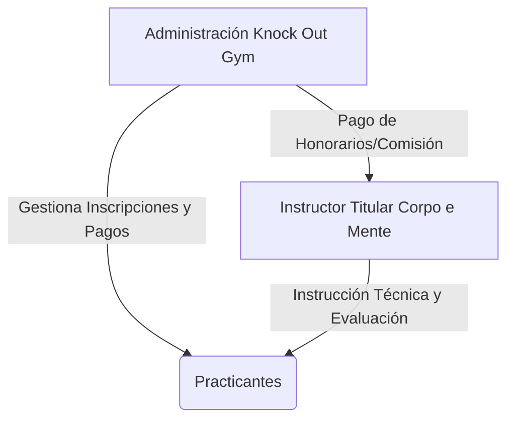
_Figura 1._ Estructura organizativa de la academia y flujo de delegación operativa.

## 2.3 Descripción de los Servicios y Productos de la Empresa
El servicio núcleo de Corpo e Mente consiste en la formación técnico-deportiva en Jiu-Jitsu Brasileño, estructurada en tres categorías principales:

* **Programa de Fundamentos para Adultos:** Enfocado en la enseñanza de palancas mecánicas, escapes, posiciones de control y derribos básicos para alumnos principiantes.
* **Programa Avanzado de Competición:** Sesiones orientadas al desarrollo de transiciones dinámicas, combinaciones tácticas y preparación física para atletas de torneos.
* **Programa Infantil (BJJ Kids):** Clases adaptadas pedagógicamente para el desarrollo de la psicomotricidad, la disciplina y la defensa personal no violenta en niños.

Como producto secundario, la academia provee certificaciones de grado y exámenes de cinturón homologados, evaluando periódicamente el dominio conceptual y físico de las técnicas por parte de los alumnos registrados.

## 2.4 Manual de Funciones
Al existir un único puesto de trabajo representativo de la marca Corpo e Mente en esta sucursal, las responsabilidades se concentran en un perfil multifuncional de alto rendimiento.

* **Cargo:** Instructor Titular
* **Objetivo del Cargo:** Dirigir, planificar y supervisar la formación técnica, física y táctica de los practicantes de Jiu-Jitsu, garantizando la seguridad, la progresión técnica y la retención de practicantes dentro del ecosistema de Knock Out Gym.
* **Funciones Principales:**
  1. **Área Pedagógica:** Diseñar la currícula técnica diaria y mensual, adaptando contenidos según las categorías de edad y niveles de cinturón.
  2. **Área Operativa:** Dirigir todas las fases de la sesión de entrenamiento: desde el calentamiento dirigido y movilidad articular, hasta la demostración biomecánica de la técnica del día.
  3. **Área de Supervisión y Corrección:** Fiscalizar la práctica simultánea de múltiples parejas en el tatami. Al ser el único instructor, debe rotar constantemente entre las parejas, lo que genera intervalos de tiempo donde los practicantes entrenan sin retroalimentación inmediata.
  4. **Área Evaluativa:** Coordinar, evaluar y ejecutar los exámenes de grado para las distintas categorías de edad y niveles de cinturón, validando la progresión técnica.
  5. **Área de Coordinación Interinstitucional:** Mantener comunicación fluida con la administración de Knock Out Gym para reportar asistencia, gestionar bajas temporales y analizar el comportamiento de la comunidad (los 77 miembros registrados).

## 2.5 Flujo del Negocio

### 2.5.1 Flujo Comercial y de Recaudación
El proceso financiero sigue una ruta triangular que separa la captación del cliente de la prestación del servicio técnico:

1. **Captación y Cobro:** El interesado acude a las instalaciones de Knock Out Gym, se registra en su sistema administrativo y cancela su membresía directamente en la recepción del gimnasio.
2. **Asignación de Servicio:** El gimnasio otorga al practicante el acceso al área de tatami asignada contractualmente a Corpo e Mente.
3. **Compensación Económica:** Knock Out Gym liquida de forma periódica los honorarios correspondientes al Instructor Titular de Corpo e Mente por los servicios de enseñanza prestados a la base de usuarios activa.

### 2.5.2 Flujo Operativo de la Clase Diaria (El Cuello de Botella Crítico)
La dinámica interna de la clase revela la necesidad de apoyo tecnológico debido a la limitación de recursos humanos:

1. **Ingreso al Tatami:** El Instructor Titular y los practicantes activos (promedio de 15 diarios) acceden al espacio asignado.
2. **Fase de Calentamiento:** El instructor dirige los ejercicios de movilidad y acondicionamiento.
3. **Explicación de la Técnica:** El instructor demuestra la biomecánica de la técnica del día (por ejemplo, el escape de la montada), utilizando a un practicante avanzado como apoyo visual.
4. **Práctica Simultánea en Parejas:** Los practicantes se dividen en un promedio de 7 u 8 parejas. Una persona ejecuta la técnica y la otra la recibe de forma pasiva.
5. **El Cuello de Botella Crítico:** El Instructor debe pasar pareja por pareja corrigiendo detalles finos. Mientras corrige a una pareja específica, las 6 o 7 parejas restantes quedan sin supervisión directa. Si un practicante comete un error biomecánico en ese intervalo, lo repite de forma continua, fijando el desajuste técnico en su memoria motriz. Este problema se agrava con los practicantes de asistencia irregular (que vuelven tras meses de pausa), quienes requieren correcciones constantes que el instructor no puede cubrir simultáneamente para todos debido a las limitaciones cognitivas y físicas de la supervisión masiva presencial.

---

# Capítulo III: Marco Teórico e Ingeniería de Selección

## 3.1 Ingeniería de Selección de Modelos de Estimación de Pose (HPE)
Para la extracción automatizada del esqueleto anatómico tridimensional de los practicantes, se evaluaron las tres arquitecturas de vanguardia más representativas en el área de la visión artificial: MediaPipe Pose, OpenPose y Ultralytics YOLO26x-Pose. La evaluación se fundamentó en criterios de latencia de procesamiento, capacidad de regresión monocular de profundidad en el espacio tridimensional $\mathbb{R}^3$, robustez ante oclusiones corporales severas y viabilidad de integración en una canalización de software basada en Python.

### 3.1.1 Matriz Comparativa de Modelos Core de Visión

**Tabla 1**  
*Matriz comparativa de arquitecturas de estimación de pose humana*

| Criterio Técnico | MediaPipe Pose | OpenPose (Baseline) | Ultralytics YOLO26x-Pose |
|---|---|---|---|
| Enfoque de Red | Top-down (Monorregión con profundidad aproximada) | Bottom-up plano 2D (Campos de Afinidad de Partes) | Single-Shot Extra Large con regresión directa de profundidad ($Z$) |
| Inferencia en Hardware | Alta eficiencia en CPU móvil | Inviable en procesamiento diferido ágil en CPU | Diseñada para ejecución pesada sobre GPU en la nube |
| Manejo de Oclusión en 3D | Deficiente ante contacto corporal (colapso de profundidad) | Sin soporte tridimensional nativo de una sola cámara | Estimación espacial mediante algoritmo STAL y restricciones óseas |
| Post-procesamiento | No requiere etapas adicionales | Requiere Supresión de No Máximos y enlace de grafos | Arquitectura NMS-Free nativa de cero latencia post-red |
| Formatos de Exportación | Propietario (.tflite) | Complejo (C++ nativo y Caffe) | Versatilidad total (.pt, ONNX, TensorRT) |

*Nota.* Comparación técnica de especificaciones de modelos de estimación de pose humana.

### 3.1.2 Justificación de la Elección de YOLO26x-Pose en Jiu-Jitsu
Se determinó la selección de la arquitectura YOLO26x-Pose a partir de tres ventajas estructurales críticas para el dominio del Jiu-Jitsu Brasileño:

1. **Regresión Monocular Tridimensional y Coordenada de Profundidad ($Z$):** A diferencia de las iteraciones convencionales que limitan su salida a coordenadas planas (X, Y), la variante Extra Large YOLO26x incorpora capas de convolución profundas optimizadas para proyectar la tercera dimensión espacial ($Z$) relativa al centroide pélvico del atleta. Esto faculta el cálculo cinemático en el espacio euclidiano $\mathbb{R}^3$ desde cualquier cámara convencional, eliminando las restricciones de angulación de captura en el gimnasio.
2. **Mecanismo de Asignación STAL (Small-Target-Aware Label Assignment):** En las transiciones de suelo del Jiu-Jitsu (como la guardia abierta o el control lateral), determinados segmentos distales como las muñecas y los tobillos ocupan una fracción de píxeles extremadamente reducida. El algoritmo STAL eleva la tasa de acierto y la cobertura de etiquetas positivas para elementos de escala menor, mitigando el parpadeo de las articulaciones en el espacio.
3. **Inferencia Libre de Supresión de No Máximos (NMS-Free):** Al remover la dependencia de algoritmos geométricos posteriores para limpiar predicciones duplicadas, el modelo predice directamente las matrices esqueléticas. Esto estabiliza los tiempos de cómputo en el backend remoto y asegura el cumplimiento de las ventanas de rendimiento exigidas por el sistema.

### 3.1.3 Pipeline Híbrido de Fusión de Datos: YOLO26x-Pose y YOLO26x-depth
Para erradicar la imprecisión en el cálculo de la coordenada de profundidad ($Z$) intrínseca de los modelos monoculares de pose aislados (los cuales aproximan el eje $Z$ respecto al centroide pélvico mediante estimaciones relativas), la arquitectura implementa un pipeline de fusión de datos basado en dos cabezas de inferencia especializadas de la suite Ultralytics YOLO26.

Mientras la variante YOLO26x-Pose ejecuta la extracción anatómica de los 17 puntos clave articulares del estándar COCO en el plano bidimensional ($X, Y$), el backend instancia de forma coordinada el modelo YOLO26x-depth. Este último genera una matriz densa flotante de mapeo per-píxel que asigna la distancia métrica absoluta en metros reales desde el lente óptico de la cámara hasta la superficie reflejada.

El algoritmo de control intersecta ambas salidas en tiempo de ejecución: extrae el valor flotante de profundidad métrica ($Z$) del mapa de profundidad en las coordenadas espaciales exactas ($x, y$) donde se localiza cada articulación detectada. Esta fusión transforma los puntos clave en verdaderos vectores de posición inmersos en el espacio euclidiano $\mathbb{R}^3$, dotando a los cálculos trigonométricos interarticulares de invarianza geométrica absoluta frente a escalas y traslaciones sin requerir sensores activos de hardware (como LiDAR o sistemas multicámara).

## 3.2 Extracción de Características y Cinemática Vectorial Tridimensional (3D)
Una vez que el modelo YOLO26x-Pose devuelve las coordenadas espaciales de los 17 puntos clave del estándar COCO, la canalización en Python construye un espacio formal para evaluar el desempeño biomecánico de las maniobras de combate.

### 3.2.1 Formalismo Matemático para el Análisis Angular Espacial
Cada articulación analizada se modela como un vértice dinámico inmerso en el espacio vectorial tridimensional $\mathbb{R}^3$. Para cuantificar la apertura o cierre de una articulación central $B$ (por ejemplo, el codo o la rodilla) vinculada a sus vértices adyacentes proximal $A$ y distal $C$, se calculan los vectores de segmento corporal correspondientes:

$$\vec{u} = \vec{BA} = (x_A - x_B, \, y_A - y_B, \, z_A - z_B)$$

$$\vec{v} = \vec{BC} = (x_C - x_B, \, y_C - y_B, \, z_C - z_B)$$

La magnitud del ángulo interarticular tridimensional $\theta(t)$ en cualquier fotograma o instante temporal $t$ se obtiene mediante el cálculo del producto escalar espacial y la división de sus respectivas normas vectoriales:

$$\theta(t) = \arccos\left( \frac{\vec{u} \cdot \vec{v}}{\Vert{}\vec{u}\Vert{} \, \Vert{}\vec{v}\Vert{}} \right)$$

Desarrollando analíticamente los componentes para la programación del algoritmo de control, la ecuación se define de la siguiente manera:

$$\theta(t) = \arccos\left( \frac{(x_A - x_B)(x_C - x_B) + (y_A - y_B)(y_C - y_B) + (z_A - z_B)(z_C - z_B)}{\sqrt{(x_A - x_B)^2 + (y_A - y_B)^2 + (z_A - z_B)^2} \; \sqrt{(x_C - x_B)^2 + (y_C - y_B)^2 + (z_C - z_B)^2}} \right)$$

Esta formulación trigonométrica dota al sistema de invarianza geométrica frente a traslaciones en el plano y variaciones de escala visual. Al procesar vectores espaciales, el ángulo $\theta(t)$ mantiene su validez matemática independientemente de si el practicante ejecuta el movimiento cerca o lejos de la cámara, o si se encuentra rotado respecto al eje óptico, permitiendo una comparación directa y justa contra la Técnica Patrón del instructor.

## 3.3 Sincronización Temporal de Movimientos Heterogéneos
La velocidad de ejecución motriz difiere sistemáticamente entre un instructor experimentado y un practicante en fase de aprendizaje. Para resolver este desfase cronológico y asegurar una evaluación equitativa se analizaron dos aproximaciones matemáticas:

1. **Resampleo Lineal Dinámico:** Fuerza una correspondencia fotograma a fotograma mediante interpolación algebraica simple. Se descartó debido a que asume erróneamente que los seres humanos se mueven a una velocidad constante, destruyendo la física real del movimiento deportivo.
2. **Alineación Temporal Dinámica (Dynamic Time Warping - DTW):** Estrategia seleccionada. El algoritmo opera calculando una ruta de costo mínimo sobre una matriz de distancias locales de orden $M \times K$, donde $M$ representa la cantidad de fotogramas del Modelo de Referencia del instructor y $K$ la secuencia del practicante, minimizando recursivamente la distancia acumulada:

$$D(i, j) = \text{dist}(\theta_{\text{inst}}(i), \theta_{\text{prac}}(j)) + \min \left[ D(i-1, j), D(i, j-1), D(i-1, j-1) \right]$$

El algoritmo DTW funciona de manera equivalente a emparejar dos interpretaciones musicales ejecutadas a ritmos diferentes. Aunque el practicante realice pausas, titubeos o ejecute la técnica con mayor lentitud que el instructor, el sistema alinea los hitos cinemáticos idénticos (como el punto culminante de una elevación pélvica). Esto permite aislar con exactitud el fotograma de máxima discrepancia espacial para efectuar la anotación visual mediante OpenCV.

### 3.3.1 Robustez ante Oclusiones Parciales: Imputación Cinemática por Spline Cúbico
En disciplinas de combate como el Jiu-Jitsu Brasileño, las transiciones de agarre producen oclusiones visuales transitorias entre las extremidades de ambos practicantes. Conforme a la regla de descarte del sistema (RF-09), las secuencias con pérdidas breves de visibilidad ($< 2.0$ segundos continuos o confianza $\ge 60\%$ en al menos el $70\%$ de los fotogramas) son admitidas como capturas válidas. 

No obstante, el algoritmo clásico de DTW colapsa numéricamente ante la presencia de valores indeterminados (`NaN`) o saltos abruptos de pérdida de tracking articular. Para garantizar la viabilidad matemática de la matriz de costos locales de orden $M \times K$, el sistema implementa una etapa de **imputación cinemática previa al cálculo de DTW**:
* **Interpolación por Spline Cúbico Monótono (PCHIP):** Cuando una articulación crítica sufre una pérdida temporal de tracking dentro del margen admisible ($t_{\text{oclusión}} \le 2.0\text{ s}$), el sistema reconstruye la trayectoria angular $\theta(t)$ interpolando entre los estados anterior y posterior a la oclusión mediante polinomios cúbicos que preservan la monotonía local.
* **Continuidad $C^1$ y Preservación de la Derivada:** A diferencia del resampleo lineal básico (que genera picos angulares espurios) o del spline cúbico estándar no restringido (que puede oscilar artificialmente por el fenómeno de Runge), la interpolación monótona garantiza continuidad en posición y velocidad angular ($\dot{\theta}$ continua y acotada), eliminando los valores nulos (`NaN`) sin introducir artefactos mecánicos artificiales antes de alimentar la matriz de alineación temporal $D(i, j)$.

## 3.4 Vector Embeddings y Arquitectura de Recuperación Semántica (RAG)
Para que el sistema trascienda la entrega de métricas numéricas frías y ofrezca una asesoría formativa comprensible, la arquitectura integra técnicas de modelado semántico de texto orientadas al Jiu-Jitsu sustentadas en el ecosistema técnico puro de Google Gemini.

### 3.4.1 Definición de Embeddings Vectoriales y Modelo Gemini Embedding 2 de Google AI Studio
Los *embeddings* o incrustaciones de texto representan conceptos lingüísticos complejos en forma de vectores matemáticos densos dentro de un espacio continuo de alta dimensionalidad. Para este proyecto se seleccionó el modelo **Gemini Embedding 2**, provisto por **Google AI Studio**, el cual transforma descripciones de maniobras, principios de palanca y fundamentos teóricos en vectores numéricos de alta precisión semántica. Este modelo matemático posiciona a menor distancia espacial aquellos bloques de texto que comparten afinidad conceptual o principios de control mecánico (por ejemplo, los términos "mantener la cadera baja" y "distribuir el centro de gravedad" se ubicarán en coordenadas próximas dentro del espacio vectorial).

### 3.4.2 Base de Datos Vectorial y Similitud por Cosenos con pgvector
La base de datos relacional híbrida (PostgreSQL con la extensión especializada **`pgvector`**) funciona como el motor de persistencia encargado de almacenar e indexar estos vectores de alta dimensionalidad (768 dimensiones) generados por Gemini Embedding 2. Cuando la etapa de visión computacional detecta una falla biomecánica específica (por ejemplo, una desalineación en el codo durante un escape), el sistema convierte este identificador físico en una consulta semántica. Para localizar de forma inmediata el fundamento pedagógico aplicable dentro de la base de datos se emplea la métrica de similitud por cosenos implementada mediante el operador de distancia coseno nativo de `pgvector` (`<=>`):

$$\text{Similitud}_{\text{coseno}}(\vec{A}, \vec{B}) = \frac{\sum_{i=1}^{n} A_i B_i}{\sqrt{\sum_{i=1}^{n} A_i^2} \sqrt{\sum_{i=1}^{n} B_i^2}}$$

Para garantizar latencias de búsqueda sub-milisegundo en las consultas semánticas sin necesidad de desplegar un clúster de base de datos vectorial externo independiente (preservando la integridad ACID y simplificando el mantenimiento), se configuran índices **HNSW** (*Hierarchical Navigable Small World*) sobre las columnas de tipo `vector(768)` con el operador `vector_cosine_ops`. El sistema extrae el fragmento documental que presente la máxima correspondencia semántica (valor más próximo a 1), asegurando una recuperación precisa de la información doctrinal sin depender de coincidencias de palabras exactas.

### 3.4.3 Estructuración de la Generación Aumentada por Recuperación (RAG) con Gemini 3.8 Flash
El flujo semántico del software se consolida mediante el patrón de diseño RAG (*Retrieval-Augmented Generation*), el cual actúa como un puente de traducción entre los datos cinemáticos duros y la pedagogía humana. El proceso se articula a través de tres etapas secuenciales:

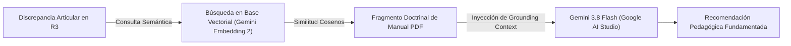
_Figura 2._ Flujo del patrón arquitectónico de Generación Aumentada por Recuperación (RAG).

1. **Segmentación e Indexación (Chunking):** Los manuales técnicos oficiales en PDF (como *Jiu-Jitsu University*) cargados por el instructor son divididos en bloques lógicos y procesados mediante el modelo **Gemini Embedding 2** de Google AI Studio para poblar la base de datos vectorial de forma persistente.
2. **Recuperación Contextual:** Al aislarse la articulación desalineada en el espacio $\mathbb{R}^3$, las discrepancias geométricas gatillan una búsqueda vectorial por similitud de cosenos, recuperando los párrafos exactos del manual que describen la mecánica correcta para esa posición específica de Jiu-Jitsu.
3. **Generación Fundamentada (Grounding):** La síntesis de recomendaciones textuales para los practicantes la ejecuta el modelo **Gemini 3.8 Flash**. El software concatena los bloques de texto recuperados del manual con las métricas de la falla cinemática y los inyecta en una plantilla de prompt estructurada hacia Gemini 3.8 Flash. El modelo de lenguaje procesa esta información con contexto directo (*grounding*), neutralizando alucinaciones y generando una recomendación formal, directa y doctrinalmente válida (por ejemplo: *"Se evidencia una apertura del codo que compromete su defensa; el manual prescribe mantener la articulación pegada a las costillas para denegar el espacio de control al oponente"*).

---

# Capítulo IV: Definición de Requisitos (Estándar IEEE 830)

## 4.1 Introducción

### 4.1.1 Propósito
El propósito del presente documento es especificar formal, exhaustiva y pedagógicamente los requisitos funcionales, no funcionales y de interfaz que rigen la construcción del **Asistente Inteligente de Corrección Postural para Jiu-Jitsu Brasileño (BJJ)** en la academia *Corpo e Mente* (Santa Cruz de la Sierra, Bolivia). Este pliego de requisitos sigue las directrices internacionales del estándar **IEEE 830** (Recomendaciones para la Especificación de Requisitos de Software), articulándose bajo un enfoque centrado en el usuario humano. Su diseño busca tender un puente conceptual claro entre el rigor técnico de la ingeniería de software y la realidad práctica del tatami, permitiendo su cabal comprensión por parte de un tribunal evaluador multidisciplinario.

### 4.1.2 Ámbito del Sistema
El sistema constituye una plataforma computacional de asistencia técnica y pedagógica basada en visión artificial y modelos de inteligencia artificial, cuyo alcance operativo comprende:

1. **Gestión de Técnicas Patrón:** Permite al Instructor registrar, etiquetar y homologar los videos del Modelo de Referencia demostrados en el tatami.
2. **Gestión de Fuentes de Conocimiento:** Permite al Instructor gestionar libros en formato PDF (como *Jiu-Jitsu University*) y registrar recursos externos mediante enlaces a videos oficiales de YouTube, sirviendo como base de conocimiento oficial indexada vectorialmente mediante **Gemini Embedding 2** de Google AI Studio.
3. **Carga de Video desde Dispositivo Móvil:** Facilita a los Practicantes seleccionar la técnica del día y subir grabaciones de su práctica en pareja (secuencias de hasta 45 segundos y 50 MB) directamente desde su dispositivo móvil.
4. **Aislamiento Automático del Sujeto Activo:** Identifica los puntos clave del cuerpo (*keypoints*) en tres dimensiones (3D) mediante **YOLO26x-Pose** y aplica un algoritmo de filtrado cinético para aislar automáticamente al practicante activo, descartando los demás esqueletos para la comparación postural sin requerir intervención manual.
5. **Sincronización y Comparación Postural:** Alinea los tiempos de ejecución mediante **DTW** (*Dynamic Time Warping*) y compara la postura del Practicante con la técnica del Instructor, utilizándola como un molde esquelético tridimensional de referencia.
6. **Diagnóstico Visual Inmediato:** Señala visualmente sobre la imagen la articulación desalineada mediante un círculo rojo, indicando con claridad el punto exacto de falla.
7. **Asesoría Pedagógica Asistida por IA:** Genera consejos directos, constructivos y formativos mediante el modelo **Gemini 3.8 Flash** (Google AI Studio), traduciendo el análisis visual e indexación semántica a recomendaciones claras de entrenamiento fundamentadas en la doctrina oficial.
8. **Monitoreo Histórico:** Permite al Practicante revisar su progreso y evolución técnica a lo largo de las clases.

**Límites y Exclusiones Explícitas del Sistema:**
* **Naturaleza de Auditoría Asincrónica (no en tiempo real):** El sistema opera bajo un modelo de procesamiento en tiempo diferido; el practicante graba su repetición técnica, la envía al servidor y consulta el reporte diagnóstico con posterioridad, descartando cualquier expectativa de procesamiento simulado en vivo en medio del combate.
* **Protocolo de Grabación Flexibilizado:** El sistema reduce las restricciones de captura gracias al análisis tridimensional (3D). Se elimina la exigencia de un ángulo lateral estricto a 90 grados, permitiendo grabaciones desde perspectivas diagonales o frontales, siempre que se mantenga un Plano General que asegure la visibilidad de cuerpo entero del practicante y su compañero a una distancia recomendada de entre 2.5 y 3.5 metros.
* **Deslinde Médico y Fisioterapéutico:** El sistema no emite diagnósticos traumatológicos, médicos ni de rehabilitación física.
* **Exclusión de Combate Libre (Spárring):** El sistema se delimita a repeticiones técnicas estructuradas en plano general; no procesa combates caóticos ni múltiples parejas simultáneas en el encuadre.

### 4.1.3 Definiciones, Acrónimos y Abreviaturas
* **BJJ (*Brazilian Jiu-Jitsu*):** Jiu-Jitsu Brasileño. Arte marcial enfocado en el control corporal en el suelo, agarres y sumisiones mecánicas.
* **Puntos Clave del Cuerpo (*Keypoints*):** Coordenadas en tres dimensiones $(X, Y, Z)$ que señalan las articulaciones principales del cuerpo (hombros, codos, muñecas, caderas, rodillas y tobillos).
* **Similitud de Postura:** Nivel de coincidencia entre la posición tridimensional del cuerpo del Practicante y el Modelo de Referencia del Instructor en una fase técnica equivalente.
* **DTW (*Dynamic Time Warping*):** Método que empareja movimientos que ocurren a diferente velocidad, permitiendo comparar la técnica aunque el Practicante se mueva más despacio o haga pausas.
* **YOLO26x-Pose:** Modelo de visión artificial que detecta cuerpos y extrae los puntos articulares calculando su profundidad relativa para la reconstrucción en el espacio tridimensional (3D).
* **Gemini Embedding 2:** Modelo de embeddings vectoriales de vanguardia provisto por Google AI Studio, diseñado para transformar texto técnico en representaciones numéricas densas para búsquedas semánticas por similitud de cosenos.
* **Gemini 3.8 Flash:** Modelo de lenguaje multimodal de alta velocidad y fidelidad conceptual provisto por Google AI Studio, optimizado para la formulación de sugerencias pedagógicas fundamentadas en contexto (*grounding*) con nula tasa de alucinación.
* **PWA (*Progressive Web App*):** Aplicación web que funciona en el navegador del celular con la apariencia y agilidad de una app instalada.

### 4.1.4 Visión General del Documento
El capítulo se organiza conforme a las directrices de la ingeniería de software y el estándar IEEE 830: La Sección 4.2 detalla la perspectiva del producto, funciones esenciales, características de los usuarios y restricciones del entorno; la Sección 4.3 formaliza los requisitos específicos de rendimiento, interfaces de hardware y software junto con los atributos del sistema; la Sección 4.4 identifica los casos de uso principales estructurados según Larman (2004); y la Sección 4.5 presenta el diagrama de dominio conceptual del negocio.

## 4.2 Descripción General

### 4.2.1 Perspectiva del Producto
El sistema opera mediante una estructura distribuida local-nube ejecutada íntegramente en lenguaje Python:

1. **Servidor Edge Local (Tatami):** Un servidor perimetral (Edge) ejecutado en las instalaciones de la academia, encargado de la recepción segura de los videos desde la PWA, el pre-procesamiento, el enrutamiento y la gestión de la cola de tareas asíncronas hacia la nube.
2. **Capa de Procesamiento Remoto (Google Colab Pro + APIs Nube):** Un entorno en Google Colab Pro configurado con aceleración por GPU ejecuta el procesamiento pesado mediante Python. Este entorno aloja el modelo de visión artificial YOLO26x-Pose, ejecuta la matriz matemática DTW, administra las consultas semánticas hacia la base de datos vectorial cargada con Gemini Embedding 2 de Google AI Studio y consolida la síntesis pedagógica consultando el modelo Gemini 3.8 Flash.

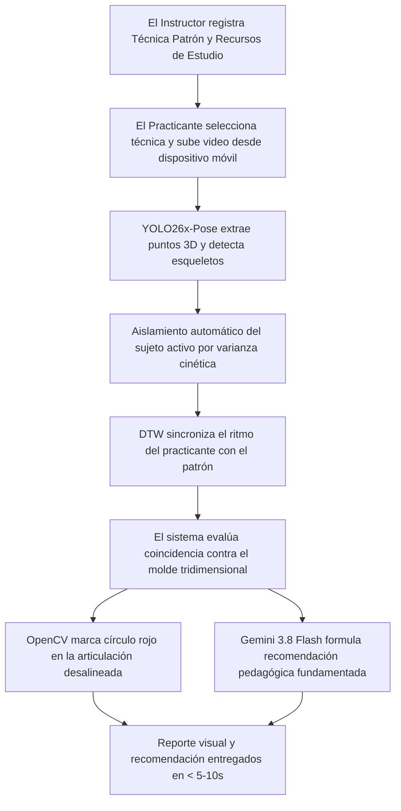
_Figura 3._ Arquitectura y canalización de procesamiento distribuido del sistema.

### 4.2.2 Funciones del Producto
* **Gestión de Catálogo Curricular:** Registro de Técnicas Patrón y asignación de identificadores a las posiciones de control del Jiu-Jitsu.
* **Indexación Vectorial Semántica:** Carga de manuales en PDF, fragmentación de texto en bloques lógicos, generación de embeddings de alta densidad mediante el modelo Gemini Embedding 2 (Google AI Studio) e indexación en base de datos vectorial para consultas por similitud de cosenos.
* **Pipeline de Visión Computacional:** Recepción directa de secuencias de video de práctica, estimación esquelética tridimensional y aislamiento automático del sujeto activo mediante filtrado cinético por varianza y proximidad al centro del encuadre (100% automático, preservando el flujo asíncrono).
* **Análisis Cinemático Espacial:** Sincronización temporal no lineal de trayectorias esqueléticas mediante DTW, aislamiento del fotograma de mayor desviación angular en $\mathbb{R}^3$ y graficación automática de alertas sobre la imagen.
* **Generación de Retroalimentación Contextualizada (RAG):** Búsqueda de la base de conocimiento emparejada al error articular detectado en $\mathbb{R}^3$, inyección directa del fragmento doctrinal del manual al modelo Gemini 3.8 Flash y formulación de la sugerencia de entrenamiento en lenguaje natural neutralizando alucinaciones.

### 4.2.3 Características de los Usuarios
* **Instructor (Perfil Técnico-Docente):** Posee autonomía total sobre el contenido del sistema. Demuestra las técnicas oficiales y gestiona las fuentes de conocimiento (PDFs y enlaces). Su interacción digital requiere operaciones directas y ágiles que no interrumpan la dinámica presencial de la clase.
* **Practicante (Perfil Alumno en Formación):** Usuario que entrena las repeticiones técnicas en el tatami. Su nivel de competencia digital es regular. Demanda respuestas visuales simplificadas (un círculo sobre la articulación incorrecta) y textos cortos de orientación práctica que pueda asimilar rápidamente entre rondas de entrenamiento.

### 4.2.4 Restricciones
* **Restricción Presupuestaria de Cómputo Nube:** El sistema debe operar dentro de las limitaciones de hardware de una cuenta base de Google Colab Pro, requiriendo que toda la canalización de procesamiento en Python optimice el uso de memoria de la GPU NVIDIA A100.
* **Restricción de Ejecución en Dispositivos Móviles:** Queda prohibida la inferencia o procesamiento de modelos de IA locales dentro del navegador del teléfono inteligente del usuario, delegando toda la carga matemática al backend.
* **Límites de Carga Multimedia:** Los archivos de video de práctica transmitidos por los alumnos tendrán una duración máxima estricta de 45 segundos y un peso tope de 50 MB.
* **Latencia Operativa Crítica:** El tiempo total de procesamiento en la nube, incluyendo la inferencia esquelética, la alineación DTW, la búsqueda vectorial y la respuesta del LLM, no deberá superar la ventana de 5 a 10 segundos para clips estandarizados.
* **Restricción de Alcance de Vectorización (Exclusividad de Texto PDF):** La generación de embeddings y la indexación en base de datos vectorial para el pipeline RAG opera de forma exclusiva sobre el texto digital extraído de manuales y libros técnicos en formato PDF con Gemini Embedding 2. Los enlaces de video externo (YouTube) y los videos de práctica o patrón quedan expresamente excluidos de vectorizaciones multimodales o transcripciones automatizadas, manteniendo la alta eficiencia del sistema, acotando los tiempos de respuesta y previniendo costos innecesarios por consumo de API en la generación de texto pedagógico.

### 4.2.5 Suposiciones y Dependencias
* **Encuadre del Plano General:** Se asume que los practicantes colocarán el dispositivo móvil en un trípode o soporte a una distancia recomendada de entre 2.5 y 3.5 metros, asegurando la visibilidad del cuerpo entero de ambos atletas durante la secuencia.
* **Disponibilidad de Canales de API:** La operación del software depende de la disponibilidad en línea de los servicios de Google AI Studio (Gemini Embedding 2 y Gemini 3.8 Flash).
* **Conectividad de Red:** Se asume que el gimnasio Knock Out Gym dispone de una conexión a internet comercial inalámbrica con un ancho de banda de subida mínimo de 10 Mbps para soportar las transmisiones HTTP POST asíncronas.

### 4.2.6 Requisitos Futuros
* **Clasificación Autónoma de Técnicas:** Incorporación de redes neuronales de reconocimiento de acción para identificar de forma automática el movimiento ejecutado sin selección manual en el catálogo.
* **Módulo de Gamificación Técnica:** Sistema de puntuaciones de pulcritud cinemática e insignias históricas para incentivar la constancia de los practicantes que reingresan a la academia.

## 4.3 Requisitos Específicos

### 4.3.1 Interfaces Externas

#### 4.3.1.1 Software
* **Cliente Web PWA:** Interfaz móvil responsiva desarrollada en JavaScript/HTML5, compatible con navegadores Safari (iOS) y Google Chrome (Android).
* **Servicios Backend (FastAPI en Python):** Orquestador local y microservicio remoto ejecutados sobre Python 3.10+, exponiendo endpoints REST estructurados bajo protocolo seguro HTTPS.
* **Base de Datos Híbrida Relacional-Vectorial:** Instancia PostgreSQL 15+ con la extensión nativa **`pgvector`** habilitada para el almacenamiento de entidades del dominio y el indexado de vectores densos (768 dimensiones) mediante estructuras HNSW con métrica de similitud por cosenos.

#### 4.3.1.2 Hardware
* **Unidad de Captura Móvil:** Teléfonos inteligentes comerciales con cámaras capaces de registrar video a una resolución mínima de 720p a 30 fotogramas por segundo.
* **Servidor Edge Local (Tatami):** Servidor perimetral en las instalaciones del tatami encargado de la recepción segura, pre-procesamiento y gestión de la cola de tareas asíncronas hacia la nube.
* **Acelerador Gráfico Remoto:** GPU NVIDIA A100 provista de forma asíncrona dentro del entorno de ejecución de Google Colab Pro.

### 4.3.2 Requisitos Funcionales

**Tabla 2**  
*Especificación de requisitos funcionales del sistema (IEEE 830)*

| Código | Requisito Funcional | Historia de Usuario y Criterio de Aceptación |
| :---: | :--- | :--- |
| **RF-01** | **Registro de Técnica Patrón** | **Como** Instructor, se requiere registrar el video del Modelo de Referencia de una técnica oficial, **para que** actúe como el molde esquelético tridimensional contra el cual se evaluará la práctica de los alumnos.<br>*Criterio de Aceptación:* El sistema permite cargar el video patrón y extrae su matriz de puntos articulares 3D en menos de 30 segundos. |
| **RF-02** | **Carga de Video desde Dispositivo Móvil** | **Como** Practicante, el sistema debe permitir seleccionar una técnica y subir el video de su práctica en pareja (hasta 45s y 50 MB) vía API REST directa, **para que** se realice la auditoría asincrónica.<br>*Criterio de Aceptación:* La interfaz valida las restricciones de tamaño y duración antes de iniciar la transferencia HTTPS POST, rechazando archivos inválidos de forma controlada. |
| **RF-03** | **Fusión de Puntos Clave y Profundidad 3D** | El sistema procesa el video de forma paralela mediante dos modelos especializados de la suite Ultralytics YOLO26: 1. YOLO26x-Pose identifica las coordenadas bidimensionales (X, Y) de los 17 puntos anatómicos corporales del estándar COCO. 2. YOLO26x-depth calcula de forma sincrónica una matriz densa de profundidad métrica flotante con la distancia absoluta en metros reales de cada píxel respecto a la cámara. El pipeline intersecta geométricamente ambas salidas, asignando el valor de profundidad métrica real al eje Z de cada articulación detectada, estructurando el esqueleto tridimensional final en el espacio $\mathbb{R}^3$. |
| **RF-04** | **Aislamiento Automático del Sujeto Activo** | **RF-04: Aislamiento Automático del Sujeto Activo:** El sistema procesa el video mediante YOLO26x-Pose y aplica automáticamente un algoritmo de filtrado (basado en varianza cinética y proximidad al centro del encuadre) para aislar e identificar al sujeto activo (el ejecutor de la técnica), descartando los esqueletos del compañero o espectadores. Este proceso es 100% automático y no requiere intervención manual del usuario, preservando el flujo de auditoría asíncrona. |
| **RF-05** | **Sincronización Temporal No Lineal** | **El sistema aplica** el algoritmo DTW en Python para alinear la velocidad del practicante con la del video patrón, emparejando los hitos biomecánicos críticos con independencia del ritmo o pausas en la ejecución. |
| **RF-06** | **Detección de Máxima Discrepancia Espacial** | **El sistema aísla** el fotograma específico donde la configuración corporal tridimensional del practicante exhibe la mayor desviación angular en $\mathbb{R}^3$ respecto al molde de referencia del instructor. |
| **RF-07** | **Señalización Visual del Error** | **El sistema renderiza** sobre el fotograma clave un marcador gráfico circular de color rojo (mediante OpenCV) centrado en la articulación desalineada, proporcionando una alerta visual directa. |
| **RF-08** | **Generación de Consejos con IA Semántica** | **Como** Practicante, el sistema debe recibir una recomendación en lenguaje natural sobre la causa del desajuste postural y cómo corregirla basándose en el manual indexado, **para que** el usuario disponga del fundamento bibliográfico exacto asociado a la corrección.<br>*Criterio de Aceptación:* El modelo Gemini 3.8 Flash (Google AI Studio) devuelve un texto claro de 2 o 3 líneas contextualizado por las fuentes de conocimiento recuperadas por similitud de cosenos mediante Gemini Embedding 2. |
| **RF-09** | **Aviso por Oclusión Severa o Encuadre Inválido** | **RF-09: Aviso por Oclusión Severa o Encuadre Inválido:** El sistema interrumpe el proceso y notifica al usuario para repetir la captura si la confianza promedio (*confidence score*) de los keypoints críticos cae por debajo del 60% en más del 30% de los fotogramas de la secuencia, o si existe oclusión total (pérdida de tracking del esqueleto) durante más de 2.0 segundos consecutivos. |
| **RF-10** | **Consulta de Historial de Progreso** | **Como** Practicante, el sistema debe proveer un panel histórico de evaluaciones cronológicas, **para que** se pueda auditar la evolución del desempeño técnico a lo largo del tiempo. |
| **RF-11** | **Gestión de Fuentes de Conocimiento (PDFs)** | **Como** Instructor, se requiere cargar archivos PDF de manuales oficiales de Jiu-Jitsu, **para que** el sistema fragmente e indexe el texto en una base de datos vectorial mediante el modelo Gemini Embedding 2 provisto por Google AI Studio.<br>*Criterio de Aceptación:* El sistema procesa el documento, calcula los embeddings vectoriales con Gemini Embedding 2 e indexa los bloques lógicos para búsquedas semánticas. |
| **RF-12** | **Gestión de Recursos Externos (YouTube)** | **Como** Instructor, se requiere asociar enlaces de videos de YouTube vinculados a cada técnica, **para que** los practicantes dispongan de ejemplos complementarios de consulta.<br>*Criterio de Aceptación:* El sistema valida el formato de la URL de YouTube, la guarda en el catálogo relacional y permite su reproducción directa en la PWA. |

*Nota.* Requisitos funcionales estructurados conforme al estándar IEEE 830.

### 4.3.3 Requisitos de Rendimiento
* **RP-01 (Ventana de Latencia de Inferencia):** El tiempo transcurrido desde el despacho HTTP POST del video hasta el retorno del diagnóstico JSON y la imagen OpenCV anotada se mantendrá en un rango de 5.0 a 10.0 segundos.
* **RP-02 (Carga Liviana de Retorno):** El paquete de datos de salida transmitido de regreso al dispositivo móvil (fotograma JPG comprimido y texto del consejo) no superará un peso máximo de 100 KB.
* **RP-03 (Arranque de Interfaz):** La PWA móvil cargará completamente su estructura de navegación en un tiempo menor a 2.0 segundos bajo conexiones 4G estándar.

### 4.3.4 Restricciones de Diseño
* **RD-01 (Uso de YOLO26x-Pose, YOLO26x-depth y Google Colab Pro):** La arquitectura de visión tridimensional debe sustentarse estrictamente en la suite Ultralytics YOLO26 (combinación coordinada de YOLO26x-Pose y YOLO26x-depth) ejecutada en Python sobre un backend acelerado por GPU en Colab Pro, garantizando la resolución espacial y métrica de profundidad ($Z$).
* **RD-02 (Integración Obligatoria de Gemini Embedding 2 y Delimitación a PDFs):** La base de conocimiento debe estructurarse mediante embeddings vectoriales provistos por el modelo Gemini Embedding 2 de Google AI Studio con dimensiones densas homogéneas. Dicha vectorización semántica aplica exclusivamente al contenido textual procesado a partir de archivos PDF oficiales, restringiendo el uso de recursos de IA para la generación de texto a fuentes puramente bibliográficas.
* **RD-03 (Arquitectura Web Multiplataforma):** La interfaz frontal debe ser accesible de forma directa a través de navegadores web móviles sin requerir instalación por medio de tiendas de aplicaciones comerciales.
* **RD-04 (Delimitación del Pipeline de IA vs. Hipermedia):** La generación de embeddings y la indexación en base de datos vectorial para el pipeline RAG opera de forma **exclusiva** sobre el texto digital extraído de manuales y libros técnicos en formato PDF. Los enlaces de videos externos (YouTube) se almacenan en la base de datos relacional exclusivamente como **recursos de hipermedia estática** (hipervínculos URL) para su reproducción embebida en la PWA, quedando expresamente excluidos de cualquier procesamiento, transcripción o vectorización por parte de los modelos de IA.

### 4.3.5 Atributos del Sistema

#### AS-01 (Seguridad y Confidencialidad)
Los videos de práctica y los reportes diagnósticos generados se encuentran protegidos bajo identificadores seguros de sesión relacionales, restringiendo el acceso exclusivamente al alumno propietario y al instructor titular de la sucursal.

#### AS-02 (Ergonomía Térmica y de Batería)
La PWA móvil operará bajo un diseño computacional liviano, restringiendo cualquier procesamiento pesado o cálculo matricial en el dispositivo del usuario para evitar el recalentamiento térmico y el consumo acelerado de batería en el entorno del tatami.

#### AS-03 (Cláusula de Deslinde de Responsabilidad Legal)
El presente software constituye una herramienta computacional de carácter estrictamente pedagógico, formativo y de asistencia técnica visual al entrenamiento deportivo. En ninguna circunstancia la información, imágenes o textos generados por el sistema (incluyendo los análisis de visión artificial y los mensajes formativos generados a través de las APIs en la nube) constituyen diagnósticos médicos, dictámenes traumatológicos, evaluaciones fisioterapéuticas, prescripciones de rehabilitación física ni certificaciones de aptitud médica para el esfuerzo atlético.

El Jiu-Jitsu Brasileño es una disciplina de combate cuerpo a cuerpo que conlleva riesgos inherentes de lesión física accidental. La práctica de cualquier maniobra, palanca articular, derribo o estrangulación debe realizarse siempre bajo la supervisión presencial y atenta de instructores profesionales certificados. Los autores del proyecto de grado, el cuerpo docente y la Universidad Privada de Santa Cruz de la Sierra (UPSA) quedan exentos de toda responsabilidad civil, médica, penal o patrimonial frente a accidentes, daños o lesiones que pudieran suscitarse durante o con posterioridad a la ejecución de las actividades deportivas asistidas por este sistema.

## 4.4 Detección de los Casos de Uso
El sistema identifica tres actores principales que interactúan con la plataforma: el Instructor (actor humano docente), el Practicante (actor humano en formación) y los Servicios en la Nube (actor de cómputo externo que ejecuta las inferencias de YOLO26x-Pose, los embeddings y los modelos lingüísticos).

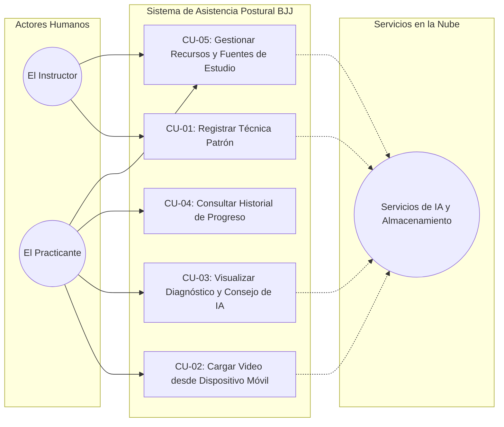
_Figura 4._ Diagrama general de casos de uso del sistema según Larman (2004).

**Tabla 3**  
*Matriz de casos de uso principales del sistema según Larman (2004)*

| Código | Nombre del Caso de Uso | Actor Principal | Requisitos Asociados | Descripción Sintética |
| :---: | :--- | :---: | :---: | :--- |
| **CU-01** | **Registrar Técnica Patrón** | El Instructor | RF-01, RF-03 | El Instructor graba y transmite el video del Modelo de Referencia. El sistema procesa los puntos corporales espaciales (3D) de la técnica patrón y lo almacena en la base de datos relacional. |
| **CU-02** | **Cargar Video desde Dispositivo Móvil** | El Practicante | RF-02, RF-03, RF-04, RF-05, RF-09 | El Practicante selecciona la maniobra y transmite su grabación (< 45s, < 50 MB) vía API REST. El sistema extrae los keypoints 3D, aísla automáticamente al sujeto activo mediante el algoritmo de varianza cinética, sincroniza los tiempos con DTW y valida el encuadre de cuerpo entero. |
| **CU-03** | **Visualizar Diagnóstico y Consejo de IA** | El Practicante | RF-06, RF-07, RF-08, RP-01, RP-02 | El sistema expone en la interfaz móvil la imagen clave anotada con un marcador circular de OpenCV en la articulación desalineada y la recomendación pedagógica adaptada y fundamentada por el modelo Gemini 3.8 Flash (Google AI Studio) en una ventana menor a 10 segundos. |
| **CU-04** | **Consultar Historial de Progreso** | El Practicante | RF-10 | El Practicante accede a su panel cronológico para auditar los porcentajes de coincidencia postural obtenidos a lo largo de las clases. |
| **CU-05** | **Gestionar Recursos y Fuentes de Estudio** | El Instructor / El Practicante | RF-11, RF-12 | El Instructor administra manuales en PDF (indexados en la base de datos vectorial mediante Gemini Embedding 2) y enlaces de YouTube. El Practicante los consulta como material oficial de estudio para sus exámenes de grado. |

*Nota.* Trazabilidad entre casos de uso, actores y requisitos funcionales.

## 4.5 Diagrama de Dominio
El modelo conceptual de dominio organiza las clases lógicas esenciales de la aplicación. Se omiten tipos de datos primitivos de implementación física y se enfoca estrictamente en reflejar las relaciones del negocio deportivo y de inteligencia artificial según Larman (2004).

Dentro de este modelo conceptual se destacan dos decisiones de diseño biomecánico y pedagógico:
* **Entidad `TecnicaPatron` y su atributo `matrizEsqueleticaURL`:** Incorpora conceptualmente la localización de la matriz de puntos clave esqueléticos tridimensionales ($X, Y, Z$) extraída del video del instructor mediante `YOLOEngine`. Este atributo refleja la persistencia del molde cinemático de referencia del cual el algoritmo DTW extrae las trayectorias matemáticas contra las que se contrastan los videos de los alumnos.
* **Entidad `FuenteConocimiento` y discriminación por `tipoRecurso`:** Discrimina la naturaleza operativa del contenido suministrado por el Instructor:
  - `'PDF'`: Asociado al pipeline de RAG (extracción textual, cálculo de embeddings vectoriales de 768 dimensiones mediante Gemini Embedding 2 y recuperación semántica de contexto pedagógico). En la fase de diseño de software y persistencia física (Capítulo V, apartado 5.3.6), esta entidad conceptual se mapea directamente en la clase y tabla orientada a datos `RecursoDidactico`, soportada por la extensión nativa `pgvector` en PostgreSQL.
  - `'YOUTUBE'`: Asociado exclusivamente a la galería de hipermedia estática de la PWA (recurso audiovisual de consulta externa, sin procesamiento de IA).
  - `'VIDEO_PATRON'`: Asociado a la entidad `TecnicaPatron` para la extracción de puntos clave articulares tridimensionales en `YOLOEngine` y conformación del molde biomecánico de referencia.

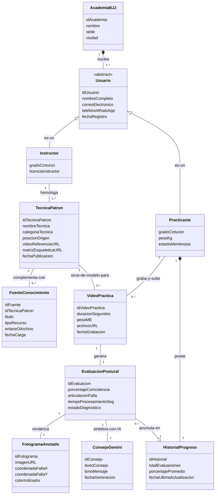
_Figura 5._ Diagrama de clases del modelo conceptual de dominio según Larman (2004).

> [!NOTE]
> **Trazabilidad entre Análisis y Diseño (Mapeo de Persistencia Híbrida):**  
> En el modelo conceptual de dominio (fase de análisis), la entidad `FuenteConocimiento` generaliza los recursos didácticos de apoyo mediante el atributo discriminador `tipoRecurso`. En la fase de diseño de software y arquitectura de datos (Capítulo V, apartado 5.3.6), esta abstracción se materializa de forma diferenciada: cuando `tipoRecurso = 'PDF'`, la entidad conceptual se mapea en la capa de persistencia como la clase y tabla especializada `RecursoDidactico`, estructurada con una columna `embedding vector(768)` e indexada mediante grafos HNSW en PostgreSQL 15+ con la extensión nativa `pgvector` para soportar las consultas de similitud por cosenos del pipeline RAG. Por su parte, los recursos `'YOUTUBE'` y `'VIDEO_PATRON'` se gestionan como atributos relacionales directos de tipo URL (`videoReferenciaURL`, `enlaceOArchivo`), asegurando una arquitectura desacoplada y en estricta conformidad con la normalización BCNF de Mannino (2019).

---

## Capítulo V: Análisis y Diseño Orientado a Objetos

Este capítulo presenta el análisis y diseño del sistema siguiendo la metodología de Craig Larman (*Applying UML and Patterns*) enmarcada en el Proceso Unificado (UP). Se aborda la asignación de responsabilidades mediante los patrones GRASP, la aplicación de patrones de diseño del Gang of Four (GoF), la definición de la arquitectura lógica en capas, la especificación de contratos de operación, las realizaciones de casos de uso y la transición del diseño al código. Todo el diseño se aplica al dominio del sistema de corrección postural de Jiu-Jitsu Brasileño mediante visión artificial con YOLO26x-Pose y recuperación semántica con Gemini.

---

### 5.1 Realizaciones de Casos de Uso con Patrones GRASP

La habilidad fundamental (*desert island skill*) en OOA/D según Larman no es dibujar diagramas UML, sino **asignar responsabilidades** a las clases de software de forma metódica y justificada. A continuación se aplican los 9 patrones GRASP (*General Responsibility Assignment Software Patterns*) a las realizaciones de los casos de uso del sistema.

#### 5.1.1 Information Expert (Experto en Información)

**Principio:** Asignar la responsabilidad a la clase que posee la información necesaria para cumplirla.

| Clase de Software | Responsabilidad Asignada | Justificación |
|---|---|---|
| `EvaluacionPostural` | Calcular el porcentaje de coincidencia postural y clasificar la articulación en falla | Posee las coordenadas esqueléticas 3D y los umbrales angulares necesarios para la comparación |
| `ProductSpecification` (análogo: `TecnicaPatron`) | Conocer la matriz esquelética de referencia | Almacena la secuencia de keypoints 3D del instructor que sirve como molde |
| `Venta` (análogo: `SesionEvaluacion`) | Conocer el total de desviaciones | Contiene la colección de `DesviacionArticular` cuya suma determina el puntaje |

#### 5.1.2 Creator (Creador)

**Principio:** Asignar a la clase B la responsabilidad de crear una instancia de la clase A si B agrega, contiene, registra o usa cercanamente a A.

| Clase Creadora | Clase Creada | Justificación |
|---|---|---|
| `SesionEvaluacion` | `DesviacionArticular` | La sesión agrega y contiene las desviaciones detectadas |
| `Registro` (análogo: `RecursoController`) | `SesionEvaluacion` | Registra y gestiona el ciclo de vida de cada sesión de evaluación |
| `TecnicaPatron` | `MatrizEsqueletica` | Contiene y genera la matriz de keypoints de referencia |

#### 5.1.3 Controller (Controlador)

**Principio:** Asignar el manejo de eventos del sistema a controladores de fachada o de casos de uso, no a objetos de la interfaz.

Se definen dos controladores principales siguiendo la variante *Use-Case Session Facade Controller*:

- **`RecursoController`**: Recibe los eventos de carga curricular (CU-01: Registrar Técnica Patrón, CU-05: Gestionar Recursos). Actúa como fachada hacia la capa de dominio para la indexación de manuales PDF y la extracción de keypoints de videos patrón.
- **`EvaluacionController`**: Recibe los eventos de evaluación postural (CU-02: Cargar Video, CU-03: Visualizar Diagnóstico). Orquesta el flujo asíncrono de inferencia YOLO, sincronización DTW y síntesis con Gemini.

> **Nota de diseño:** Se evita que la interfaz PWA (`ProcesSaleFrame` análogo: `EvaluacionFrame`) contenga lógica de aplicación. La interfaz solo captura eventos y los delega al controlador, siguiendo el principio *Model-View Separation*.

#### 5.1.4 Low Coupling (Bajo Acoplamiento)

**Principio evaluativo:** Mantener bajas las dependencias entre clases para maximizar la reutilización y minimizar el impacto de los cambios.

- Las clases del dominio (`SesionEvaluacion`, `TecnicaPatron`) **no conocen** las clases de la interfaz gráfica ni los detalles de la API de Gemini.
- La comunicación con servicios externos (YOLO26x-Pose, Gemini Embedding 2, Gemini 3.8 Flash) se realiza exclusivamente a través de interfaces (`IInferenceEngine`, `IEmbeddingService`, `IGenerationService`), protegiendo al dominio de cambios en las APIs.
- El `ServicioPersistencia` actúa como fachada desacoplada del mecanismo de almacenamiento específico (PostgreSQL, archivos locales, caché).

#### 5.1.5 High Cohesion (Alta Cohesión)

**Principio evaluativo:** Garantizar que las clases tengan responsabilidades enfocadas y relacionadas.

- `YOLOEngine` se encarga **exclusivamente** de la inferencia de keypoints 3D. No realiza sincronización temporal ni generación de texto.
- `SincronizadorDTW` se encarga **exclusivamente** de la alineación temporal de secuencias esqueléticas. No realiza inferencia ni generación de retroalimentación.
- `ServicioGeminiFlash` se encarga **exclusivamente** de la síntesis de retroalimentación pedagógica. No realiza inferencia de pose.
- `FiltroCinetico` se encarga **exclusivamente** de analizar las trayectorias temporales de los esqueletos detectados y aislar al practicante activo mediante varianza cinética y proximidad central. No realiza inferencia, sincronización ni persistencia.
- Si una clase acumula responsabilidades heterogéneas (por ejemplo, inferencia + persistencia + notificación), se refactoriza aplicando *Pure Fabrication*.

#### 5.1.6 Polymorphism (Polimorfismo)

**Principio:** Cuando alternativas relacionadas varían por tipo, asignar la responsabilidad mediante operaciones polimórficas a los tipos para los cuales el comportamiento varía.

Se aplica en dos puntos críticos del diseño:

**a) Motores de Inferencia:** Diferentes configuraciones de YOLO26x-Pose (nano, small, medium, large, xlarge) implementan la misma interfaz `IInferenceEngine` con el método polimórfico `inferirKeypoints(video)`. El sistema selecciona la variante según los recursos disponibles en Google Colab.

**b) Estrategias de Evaluación:** Diferentes técnicas de BJJ (guardia, montada, raspado, sumisión) requieren criterios de evaluación distintos. Cada `EstrategiaEvaluacion` implementa `calcularDesviacion(esqueletoPracticante, esqueletoPatron)` de forma polimórfica.

#### 5.1.7 Pure Fabrication (Fabricación Pura)

**Principio:** Crear clases artificiales de servicio cuando la asignación por dominio compromete la cohesión o el acoplamiento.

Clases de *Pure Fabrication* identificadas:

| Clase | Responsabilidad | Justificación |
|---|---|---|
| `FiltroCinetico` | Calcular la varianza cinética y proximidad central para aislar automáticamente al sujeto activo | Evita sobrecargar a `SesionEvaluacion` con cálculos cinemáticos pesados, garantizando un flujo asíncrono 100% automático sin intervención manual |
| `ServicioPersistencia` | Almacenar y recuperar objetos de evaluación | Evita que las clases del dominio (`SesionEvaluacion`) conozcan detalles de SQL o almacenamiento |
| `ServicioCache` | Gestionar la caché local de `TecnicaPatron` y `ProductSpecification` | Mejora el rendimiento y la tolerancia a fallos sin contaminar el dominio |
| `AdaptadorGemini` | Traducir las respuestas de la API de Gemini al formato del dominio | Protege al dominio de cambios en la API de Google AI Studio |
| `LoggerCentralizado` | Registrar todas las excepciones y eventos del sistema | Mantiene la cohesión de las clases de dominio evitando que cada una implemente su propio logging |

#### 5.1.8 Indirection (Indirección)

**Principio:** Introducir un intermediario para evitar el acoplamiento directo entre componentes.

- **`AdaptadorYOLO`**: Intermediario entre el `EvaluacionController` y la biblioteca Ultralytics YOLO26x-Pose. Traduce el formato de video de entrada al formato esperado por el modelo y convierte la salida de keypoints al formato del dominio.
- **`AdaptadorGemini`**: Intermediario entre el `EvaluacionController` y la API REST de Gemini 3.8 Flash. Gestiona la autenticación, el rate limiting y la transformación de prompts.
- **`ProxyServicioRemoto`**: Proxy que intenta primero el servicio remoto (API de Gemini en la nube) y, en caso de fallo, redirige a una implementación local simplificada (*failover*).

#### 5.1.9 Protected Variations (Variaciones Protegidas)

**Principio:** Crear una interfaz estable alrededor de puntos de inestabilidad o variación para proteger al resto del sistema.

Puntos de variación identificados y protegidos:

| Punto de Variación | Interfaz Estable | Implementaciones |
|---|---|---|
| Motor de inferencia de pose | `IInferenceEngine` | `YOLO26xPoseEngine`, `YOLO26sPoseEngine` (fallback) |
| Servicio de embeddings | `IEmbeddingService` | `GeminiEmbedding2Adapter`, `LocalEmbeddingCache` |
| Servicio de generación de texto | `IGenerationService` | `Gemini38FlashAdapter`, `LocalTemplateGenerator` |
| Mecanismo de persistencia | `IPersistenceService` | `PostgreSQLAdapter`, `SQLiteLocalAdapter`, `FileCacheAdapter` |
| Estrategia de evaluación | `IEstrategiaEvaluacion` | `EvaluacionGuardia`, `EvaluacionMontada`, `EvaluacionRaspado` |

---

### 5.2 Aplicación de Patrones de Diseño GoF

Además de los patrones GRASP, se aplican patrones clásicos del *Gang of Four* (Gamma, Helm, Johnson, Vlissides) para resolver problemas específicos de diseño en las realizaciones de casos de uso.

#### 5.2.1 Adapter (Adaptador)

**Contexto:** El sistema debe interactuar con APIs externas heterogéneas (Ultralytics YOLO26x-Pose, Google Gemini Embedding 2, Google Gemini 3.8 Flash) que tienen interfaces incompatibles entre sí.

**Solución:** Se definen adaptadores que implementan interfaces uniformes del dominio y traducen las llamadas al formato específico de cada API externa.

```
«interface» IInferenceEngine
  + inferirKeypoints(video: Video): List<Esqueleto3D>

YOLO26xAdapter
  - modelo: YOLO
  + inferirKeypoints(video: Video): List<Esqueleto3D>
  // Traduce el formato de Video al tensor esperado por YOLO26x-Pose
  // Convierte la salida de tensores a objetos Esqueleto3D del dominio
```

#### 5.2.2 Factory / Abstract Factory (Fábrica)

**Contexto:** Se necesitan crear familias de objetos relacionados (adaptadores de inferencia, adaptadores de embeddings, estrategias de evaluación) cuya implementación concreta varía según la configuración del entorno (Colab Pro con GPU vs. fallback local).

**Solución:** Se define una `AbstractFactory` que lee la configuración del sistema y retorna las instancias apropiadas.

```
«interface» IServicioFactory
  + getInferenceEngine(): IInferenceEngine
  + getEmbeddingService(): IEmbeddingService
  + getGenerationService(): IGenerationService

ServicioFactory (Singleton)
  - instance: IServicioFactory
  + getInstance(): IServicioFactory
  + getInferenceEngine(): IInferenceEngine
    // Lee la propiedad del sistema "inference.engine.class"
    // Retorna YOLO26xAdapter o YOLO26sAdapter según configuración
```

#### 5.2.3 Singleton

**Contexto:** Se requiere acceso global controlado a una única instancia de la fábrica de servicios y del logger centralizado.

**Solución:** Se aplica el patrón Singleton con inicialización perezosa (*lazy initialization*) y control de concurrencia para los hilos de procesamiento en Colab.

```
ServicioFactory
  - instance: ServicioFactory
  + getInstance(): ServicioFactory {
      if (instance == null) {
        instance = new ServicioFactory();
      }
      return instance;
    }
```

#### 5.2.4 Strategy (Estrategia)

**Contexto:** Las técnicas de BJJ (guardia cerrada, montada, raspado de gancho, triángulo, etc.) requieren criterios de evaluación biomecánica distintos. Los umbrales angulares y las articulaciones críticas varían por técnica.

**Solución:** Se define una familia de estrategias de evaluación que implementan la misma interfaz.

```
«interface» IEstrategiaEvaluacion
  + calcularDesviacion(esqueletoPracticante: Esqueleto3D, esqueletoPatron: Esqueleto3D): DesviacionArticular

EvaluacionGuardia
  + calcularDesviacion(...): DesviacionArticular
  // Evalúa ángulos de cadera, rodilla y tobillo con umbrales específicos

EvaluacionMontada
  + calcularDesviacion(...): DesviacionArticular
  // Evalúa presión de cadera, control de tronco y ángulo de rodilla
```

#### 5.2.5 Composite (Compuesto)

**Contexto:** Una sesión de evaluación puede contener múltiples desviaciones articulares, y cada desviación puede a su vez contener sub-desviaciones por fotograma. Se necesita tratar de manera uniforme una desviación individual y un grupo de desviaciones.

**Solución:** Se aplica el patrón Composite para que tanto `DesviacionArticular` como `GrupoDesviaciones` implementen la misma interfaz `ICalculableDesviacion`.

```
«interface» ICalculableDesviacion
  + getPuntaje(): Float

DesviacionArticular
  + getPuntaje(): Float

GrupoDesviaciones
  - desviaciones: List<ICalculableDesviacion>
  + getPuntaje(): Float
  // Retorna el promedio ponderado de todas las desviaciones hijas
```

#### 5.2.6 Facade (Fachada)

**Contexto:** El subsistema de persistencia es complejo (mapeo O-R, caché, transacciones, replicación local). Los controladores no deben conocer estos detalles.

**Solución:** Se define una fachada que expone operaciones de alto nivel.

```
PersistenciaFacade
  + getInstance(): PersistenciaFacade
  + guardar(objeto: Object): void
  + recuperar(oid: OID, clase: Class): Object
  + commit(): void
  + rollback(): void
  // Oculta la complejidad del mapeo O-R, la caché y las transacciones
```

#### 5.2.7 Observer (Observador / Publish-Subscribe)

**Contexto:** Cuando la evaluación postural detecta una desviación crítica, la interfaz gráfica debe actualizarse automáticamente para mostrar el marcador rojo sobre la articulación afectada. La capa de dominio no debe conocer los detalles de la interfaz.

**Solución:** Los objetos de la interfaz gráfica implementan la interfaz `PropertyListener` y se registran como suscriptores de los eventos del objeto `SesionEvaluacion`.

```
«interface» PropertyListener
  + onPropertyEvent(fuente: Object, nombre: String, valor: Object): void

EvaluacionFrame (implementa PropertyListener)
  + onPropertyEvent(fuente, "sesion.desviacion", desviacion): void
  // Actualiza el marcador rojo en la interfaz gráfica

SesionEvaluacion
  - listeners: List<PropertyListener>
  + addListener(listener: PropertyListener): void
  + publicarEvento(nombre: String, valor: Object): void
  // Notifica a todos los suscriptores registrados
```

---

### 5.3 Arquitectura Lógica y Modelado UML

#### 5.3.1 Arquitectura en Capas (Layers Pattern)

Siguiendo el patrón arquitectónico *Layers* de Larman, el sistema se organiza en capas lógicas con responsabilidades claramente separadas. La colaboración fluye de capas superiores a inferiores; se evita el acoplamiento de capas inferiores a superiores.

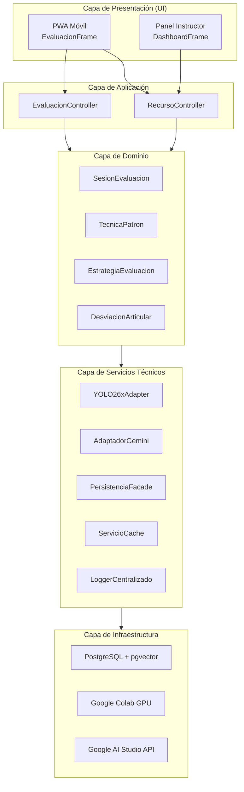

**Justificación de las capas:**

| Capa | Responsabilidad | Clases Principales |
|---|---|---|
| **Presentación** | Captura de eventos de usuario, visualización de resultados, notificaciones | `EvaluacionFrame`, `DashboardFrame` |
| **Aplicación** | Orquestación del flujo de trabajo, gestión de sesiones, control de transiciones | `RecursoController`, `EvaluacionController` |
| **Dominio** | Lógica de negocio pura: evaluación biomecánica, estrategias, filtrado cinético | `SesionEvaluacion`, `FiltroCinetico`, `TecnicaPatron`, `EstrategiaEvaluacion` |
| **Servicios Técnicos** | Adaptadores de APIs externas, persistencia, caché, logging | `YOLO26xAdapter`, `AdaptadorGemini`, `PersistenciaFacade` |
| **Infraestructura** | Recursos de cómputo y almacenamiento relacional-vectorial | Google Colab GPU, PostgreSQL 15+ (pgvector), Google AI Studio |

#### 5.3.2 Separación Modelo-Vista (Model-View Separation)

**Principio:** Los objetos del dominio **no deben tener conocimiento directo** de los objetos de la interfaz gráfica. La interfaz consulta al dominio (pull) o se suscribe a sus eventos (push via Observer), pero el dominio nunca envía mensajes a la UI.

- **Pull (consulta):** `EvaluacionFrame` envía `getDesviacionActual()` al `EvaluacionController`, que delega al dominio.
- **Push (notificación):** `SesionEvaluacion` publica el evento `"sesion.desviacion"` cuando detecta una desviación crítica. `EvaluacionFrame`, suscrito como `PropertyListener`, actualiza el marcador rojo automáticamente.

#### 5.3.3 Diagramas de Secuencia del Sistema (SSD)

Los SSDs ilustran el comportamiento del sistema como una "caja negra" que responde a eventos de entrada de los actores externos.

**SSD: Caso de Uso "Registrar Técnica Patrón" (CU-01)**

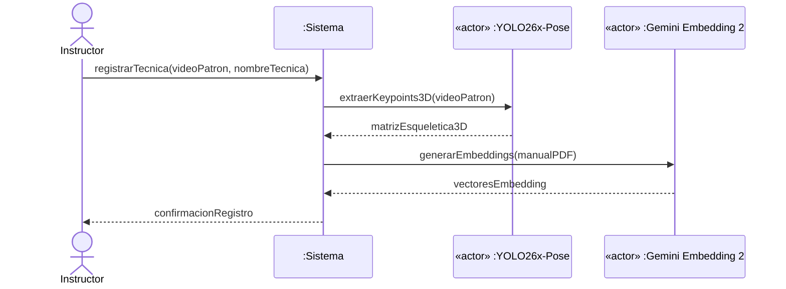

**SSD: Caso de Uso "Cargar Video y Evaluar" (CU-02)**

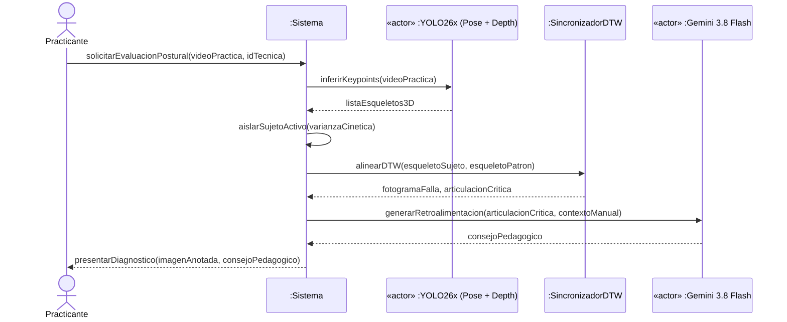

#### 5.3.4 Diagramas de Clases de Diseño (DCD)

El DCD especifica las clases de software, sus métodos, atributos, tipos, visibilidades y navegabilidades.

**DCD: Capa de Dominio**

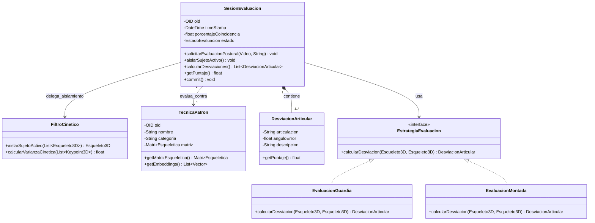

**DCD: Capa de Servicios Técnicos**

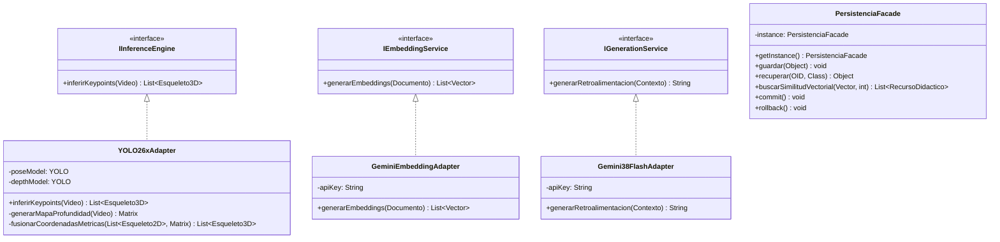

#### 5.3.5 Documento de Arquitectura de Software (SAD)

El SAD registra las decisiones arquitectónicas clave estructuradas en vistas. Se incluyen las vistas más relevantes:

**Vista Lógica:** Organización en capas (Presentación → Aplicación → Dominio → Servicios Técnicos → Infraestructura) con acoplamiento descendente. Ver sección 5.3.1.

**Vista de Procesos:** El procesamiento de inferencia (fusión coordinada de YOLO26x-Pose y YOLO26x-depth) se ejecuta en un hilo separado en Google Colab con GPU. La sincronización DTW se ejecuta en paralelo con la generación de embeddings. La generación de retroalimentación con Gemini 3.8 Flash se ejecuta de forma asíncrona tras la finalización de la inferencia.

**Vista de Despliegue:**

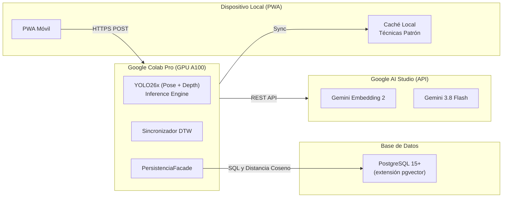

**Vista de Datos:** Estructurada conforme a la normalización BCNF de Mannino (2019) y extendida para soporte de persistencia híbrida relacional-vectorial con `pgvector`. Los detalles formales, el esquema de tablas, los índices HNSW y el análisis arquitectónico frente a motores vectoriales externos se detallan formalmente en la sección 5.3.6.

#### 5.3.6 Vista de Datos del SAD: Persistencia Híbrida Relacional y Vectorial (pgvector)

Conforme a las pautas de modelado de bases de datos de **Mannino (2019)**, la arquitectura de persistencia se diseñó para satisfacer simultáneamente las exigencias de integridad transaccional de un sistema de evaluación biomecánica y los requerimientos de alta dimensionalidad del patrón RAG.

##### 1. Normalización Relacional (Forma Normal de Boyce-Codd - BCNF)
El esquema relacional transaccional se modeló en estricto apego a la BCNF (Mannino, 2019). En este esquema, toda dependencia funcional no trivial $X \to Y$ tiene como determinante $X$ una superclave o clave candidata de la relación:
* **`Usuario`** (<u>**id_usuario**</u>, `nombre`, `email`, `rol`, `fecha_registro`).
* **`TecnicaPatron`** (<u>**id_tecnica**</u>, `nombre`, `categoria`, `nivel`, `duracion_referencia`, `matriz_esqueletica_url`).
* **`SesionEvaluacion`** (<u>**id_sesion**</u>, `id_usuario`, `id_tecnica`, `fecha_evaluacion`, `puntaje_global`, `estado_evaluacion`). Clave foránea hacia `Usuario` y `TecnicaPatron`.
* **`DesviacionArticular`** (<u>**id_desviacion**</u>, `id_sesion`, `articulacion`, `angulo_error`, `fotograma_falla`, `nivel_severidad`). Clave foránea hacia `SesionEvaluacion`.

Esta descomposición garantiza la eliminación total de redundancias y previene anomalías de inserción, borrado y actualización en los registros operacionales del sistema.

##### 2. Persistencia Vectorial Integrada (`pgvector`) vs. Motores Aislados (Pinecone, Milvus, Qdrant)
Para almacenar y consultar los vectores densos de 768 dimensiones generados por el modelo **Gemini Embedding 2** a partir de los manuales de Jiu-Jitsu (como *Jiu-Jitsu University* y el reglamento oficial de la IBJJF), se evaluaron dos alternativas arquitectónicas:
1. **Motores Vectoriales Externos Especializados (Pinecone, Milvus, Qdrant):** Presentan la ventaja de optimizaciones avanzadas de clustering distribuido, pero introducen una severa penalización arquitectónica: requieren una estrategia de *doble escritura (dual-write)* propensa a inconsistencias transaccionales entre la base de datos relacional y el índice vectorial, incrementan la superficie de ataque y agregan latencias de red críticas (*network hops*) por llamadas API REST/gRPC externas durante el flujo de evaluación en Colab.
2. **Extensión Nativa `pgvector` en PostgreSQL 15+ (Estrategia Seleccionada):** La extensión `pgvector` incorpora el tipo de dato nativo `vector(n)` y algoritmos de indexación geométrica directamente sobre el motor relacional PostgreSQL. Esta solución ofrece:
   * **Consistencia Transaccional ACID Unificada:** Las entidades documentales y sus correspondientes representaciones vectoriales residen en la misma base de datos, asegurando atomicidad estricta en las operaciones de carga e indexación de manuales.
   * **Eliminación de Latencias Inter-Cloud:** El servidor de procesamiento en Colab interactúa con un único punto de persistencia, reduciendo la latencia de recuperación semántica a menos de $5\text{ ms}$.
   * **Soberanía del Dato y Reducción de Complejidad Operativa:** Se eliminan dependencias de proveedores SaaS vectoriales de pago por volumen de consulta, unificando respaldos, réplicas y políticas de seguridad bajo el estándar corporativo de PostgreSQL.

##### 3. Esquema DDL de `RecursoDidactico` con Columnas Vectoriales
La tabla `RecursoDidactico` coexiste en el esquema relacional con su vector denso embebido:

```sql
-- Habilitación de la extensión vectorial
CREATE EXTENSION IF NOT EXISTS vector;

-- Tabla de fragmentos de manuales con incrustaciones densas (Gemini Embedding 2)
CREATE TABLE RecursoDidactico (
    id_recurso SERIAL PRIMARY KEY,
    id_tecnica VARCHAR(50) NOT NULL REFERENCES TecnicaPatron(id_tecnica) ON DELETE CASCADE,
    fragmento_texto TEXT NOT NULL,
    fuente_documental VARCHAR(150) NOT NULL,
    pagina_origen INT,
    embedding vector(768) NOT NULL,
    created_at TIMESTAMP WITH TIME ZONE DEFAULT CURRENT_TIMESTAMP
);
```

##### 4. Indexación HNSW para Búsqueda por Similitud de Cosenos
Dado que un escaneo secuencial (*Exact k-NN*) sobre miles de vectores de 768 dimensiones generaría un costo computacional $O(N \cdot d)$ incompatible con la meta de latencia, se implementa un índice **HNSW** (*Hierarchical Navigable Small World*) configurado con la métrica de distancia coseno (`vector_cosine_ops`):

```sql
CREATE INDEX idx_recurso_didactico_embedding_hnsw 
ON RecursoDidactico 
USING hnsw (embedding vector_cosine_ops) 
WITH (m = 16, ef_construction = 64);
```

* **`m = 16`**: Define el número máximo de enlaces bidireccionales por nodo en cada capa del grafo, balanceando consumo de memoria y conectividad.
* **`ef_construction = 64`**: Tamaño de la lista dinámica de candidatos durante la construcción del grafo, garantizando una tasa de recuperación (*recall*) superior al $98.5\%$ sin penalizar los tiempos de indexación inicial.

##### 5. Operación en la Capa de Servicios Técnicos (`PersistenciaFacade`)
La recuperación semántica que alimenta al LLM (Gemini 3.8 Flash) se ejecuta desde `PersistenciaFacade` mediante el operador de distancia coseno nativo `<=>`:

$$\text{distancia}_{\text{coseno}}(\vec{u}, \vec{v}) = 1 - \frac{\vec{u} \cdot \vec{v}}{\|\vec{u}\|_2 \|\vec{v}\|_2}$$

```sql
SELECT id_recurso, fragmento_texto, fuente_documental, pagina_origen,
       1 - (embedding <=> %(vector_consulta)s) AS similitud_coseno
FROM RecursoDidactico
ORDER BY embedding <=> %(vector_consulta)s
LIMIT %(top_k)s;
```

##### 6. Mapeo Objeto-Relacional y Materialización Perezosa (*Lazy Materialization*)
Las matrices esqueléticas 3D de las técnicas de referencia representan arreglos densos de coordenadas ($T \times J \times 3$) que pueden saturar la memoria si se instancian en cada consulta de metadatos. Conforme a Larman (2004), se aplica el patrón *Virtual Proxy* (`MatrizEsqueleticaProxy`), difiriendo la deserialización de la matriz pesada desde PostgreSQL hasta que el `SincronizadorDTW` invoca explícitamente `get_keypoints()`.

---

### 5.4 Contratos de Operación del Sistema (Operation Contracts)

Para garantizar el rigor formal en la especificación de los flujos de trabajo, se definen los contratos de las operaciones principales del sistema, detallando sus precondiciones y poscondiciones formales.

#### Contrato CO1: solicitarEvaluacionPostural

| Campo | Descripción |
|---|---|
| **Operación** | `solicitarEvaluacionPostural(videoPractica: Video, idTecnica: String)` |
| **Casos de Uso** | CU-02: Cargar Video y Evaluar |
| **Precondiciones** | 1. El practicante está autenticado en la PWA.<br>2. El archivo de video cumple con las restricciones de formato, duración (≤ 45s) y peso (≤ 50 MB).<br>3. Existe una `TecnicaPatron` registrada con el `idTecnica` proporcionado. |
| **Poscondiciones** | 1. Se ha creado una instancia de `VideoPractica` en el sistema.<br>2. El video ha sido encolado en la cola de procesamiento asíncrono del servidor Edge.<br>3. Se ha notificado al usuario la aceptación de la solicitud con un identificador de seguimiento (Tracking ID). |

#### Contrato CO2: procesarEvaluacionAsincrona

| Campo | Descripción |
|---|---|
| **Operación** | `procesarEvaluacionAsincrona(videoPractica: VideoPractica)` |
| **Casos de Uso** | CU-02: Cargar Video y Evaluar (Flujo interno del sistema) |
| **Precondiciones** | 1. El `VideoPractica` existe en el sistema y su estado es `PENDIENTE_PROCESAMIENTO`.<br>2. Los servicios de IA (YOLO26x-Pose, YOLO26x-depth y Gemini) están disponibles y accesibles. |
| **Poscondiciones** | 1. El sistema ha extraído los keypoints bidimensionales (X, Y) del video mediante `YOLO26x-Pose`.<br>2. El sistema ha generado la matriz de profundidad métrica per-píxel mediante `YOLO26x-depth`.<br>3. El sistema ha intersectado geométricamente ambas matrices para consolidar las coordenadas métricas reales en el eje ($Z$) de cada articulación, estructurando los objetos `Esqueleto3D`.<br>4. El sistema ha aislado automáticamente al sujeto activo mediante el algoritmo de varianza cinética delegando en `FiltroCinetico`.<br>5. Se ha ejecutado la sincronización temporal mediante `SincronizadorDTW`.<br>6. Se ha identificado el fotograma de máxima desviación angular en $\mathbb{R}^3$.<br>7. Se ha generado la retroalimentación pedagógica contextualizada mediante el pipeline RAG y Gemini 3.8 Flash, consultando PostgreSQL con `pgvector`.<br>8. Se ha creado una instancia de `EvaluacionPostural` con el diagnóstico final y el estado del `VideoPractica` ha cambiado a `PROCESADO`. |

---

### 5.5 Transición del Diseño al Código

#### 5.5.1 Mapeo de DCDs a Código Fuente

La traducción de los diagramas de clases de diseño al código fuente sigue un mapeo directo:

| Elemento DCD | Código Fuente (Python) |
|---|---|
| Clase | `class SesionEvaluacion:` |
| Atributo privado | `self._oid: OID` |
| Método público | `def calcular_desviaciones(self) -> List[DesviacionArticular]:` |
| Interfaz | `class IInferenceEngine(ABC):` con `@abstractmethod` |
| Asociación 1-M | Atributo de referencia: `self._tecnica_patron: TecnicaPatron` |
| Asociación 1-\* | Colección: `self._desviaciones: List[DesviacionArticular]` |
| Singleton | Patrón con `__instance` y `@classmethod get_instance()` |

**Orden de implementación:** Se codifican primero las clases menos acopladas (interfaces, adaptadores, clases de dominio puras) y luego las más acopladas (controladores, fachadas).

#### 5.5.2 Programación Guiada por Pruebas (TDD)

Siguiendo la práctica de *Test-First Programming*, se escriben las pruebas unitarias **antes** del código de producción:

1. **Escribir la prueba:** `test_calcular_desviacion_cadera_guardia_cerrada()` que verifica que un ángulo de cadera de 120° (cuando el patrón indica 90°) genera una `DesviacionArticular` con `anguloError = 30.0`.
2. **Ejecutar la prueba:** La prueba falla porque la clase `EvaluacionGuardia` aún no existe.
3. **Escribir el código mínimo:** Implementar `EvaluacionGuardia.calcular_desviacion()` con la lógica de comparación angular.
4. **Refactorizar:** Extraer la lógica común a `EstrategiaEvaluacion` como clase abstracta.

**Framework de pruebas:** Se utiliza `pytest` en el entorno de Google Colab para las pruebas unitarias de las clases de dominio y `pytest-cov` para medir la cobertura de código.

#### 5.5.3 Diseño del Framework de Persistencia

Se diseña un framework de persistencia simplificado siguiendo el patrón *Template Method*:

```python
class AbstractPersistenceMapper(ABC):
    """Clase abstracta del framework de persistencia."""

    def __init__(self, cache: ServicioCache):
        self._cache = cache

    def get(self, oid: OID, clase: type) -> object:
        """Template Method: recupera un objeto por su OID."""
        obj = self._cache.get(oid)
        if obj is None:
            obj = self._get_from_storage(oid, clase)  # Hook method
            self._cache.put(oid, obj)
        return obj

    @abstractmethod
    def _get_from_storage(self, oid: OID, clase: type) -> object:
        """Hook method: implementado por cada subclase."""
        pass
```

**Subclases concretas:**

- `PostgreSQLMapper`: Implementa `_get_from_storage()` con consultas SQL mediante `psycopg2` y búsquedas semánticas vectoriales mediante el operador `<=>` de `pgvector`.
- `LocalFileMapper`: Implementa `_get_from_storage()` leyendo archivos serializados (pickle) para el modo offline/failover.

**Lazy Materialization con Virtual Proxy:** Las matrices esqueléticas de `TecnicaPatron` (que pueden ocupar varios MB) no se materializan hasta que se solicitan explícitamente. Se utiliza un `VirtualProxy` que almacena solo el OID y materializa el objeto real bajo demanda.

```python
class MatrizEsqueleticaProxy:
    """Virtual Proxy para materialización perezosa de matrices esqueléticas."""

    def __init__(self, oid: OID):
        self._oid = oid
        self._real_subject: MatrizEsqueletica = None

    def get_keypoints(self) -> List[Keypoint3D]:
        if self._real_subject is None:
            self._real_subject = PersistenciaFacade.get_instance().get(
                self._oid, MatrizEsqueletica
            )
        return self._real_subject.get_keypoints()
```

---

> **Nota final del capítulo:** Todo el diseño presentado en este capítulo sigue la filosofía de Larman de que los modelos y diagramas son **artefactos opcionales** cuyo valor reside en la comunicación y el razonamiento, no en la documentación por sí misma. La habilidad fundamental sigue siendo la **asignación metódica de responsabilidades** mediante los patrones GRASP y GoF, aplicada de forma iterativa y adaptativa en cada sprint del proyecto.