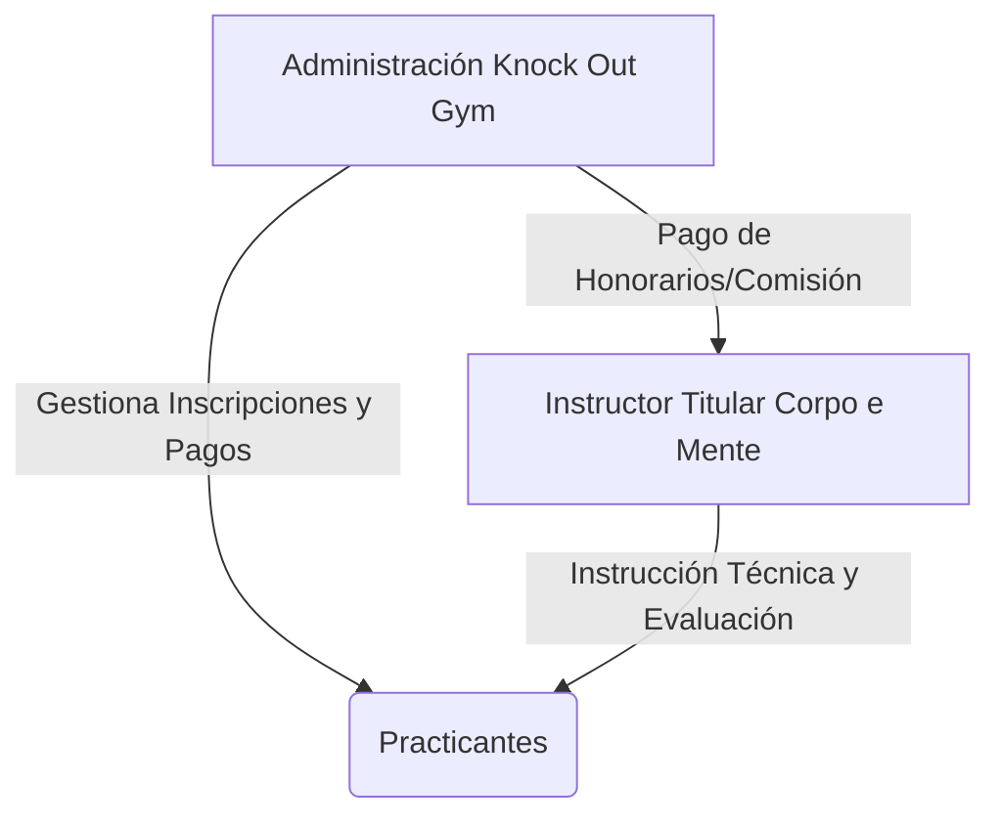
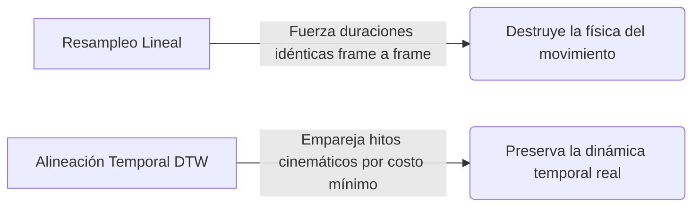
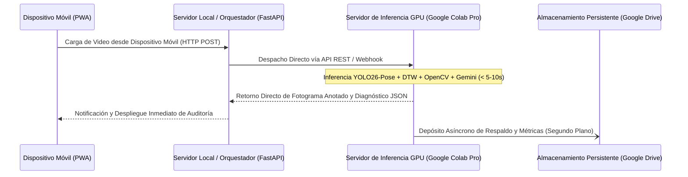
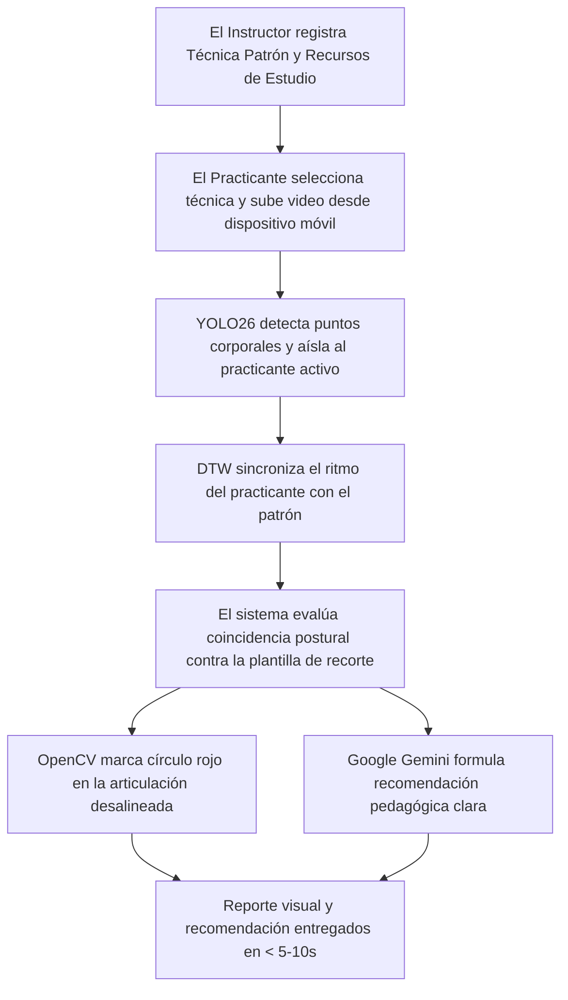
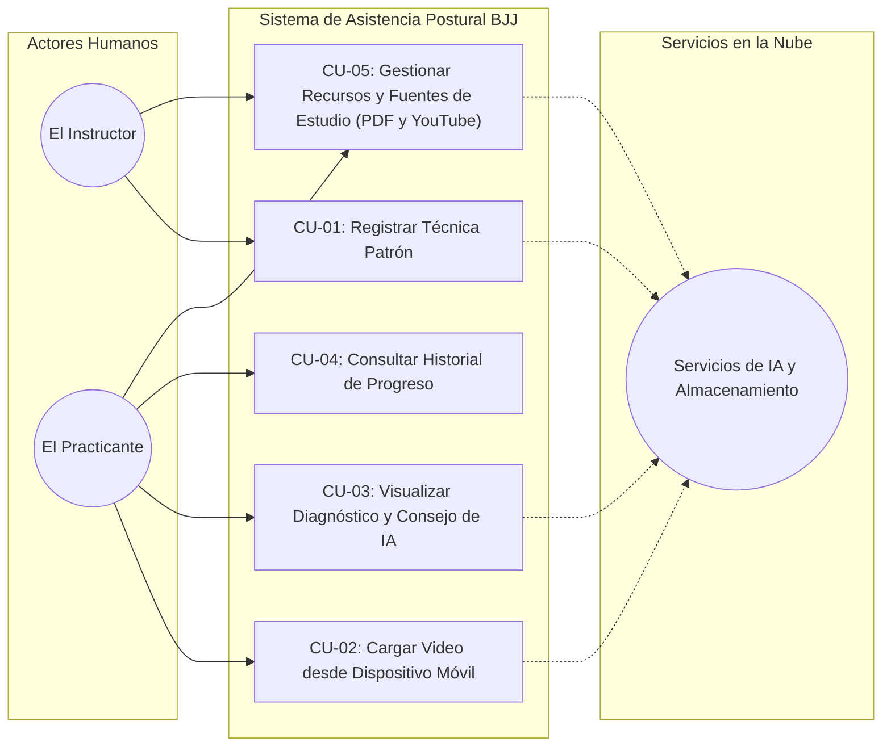
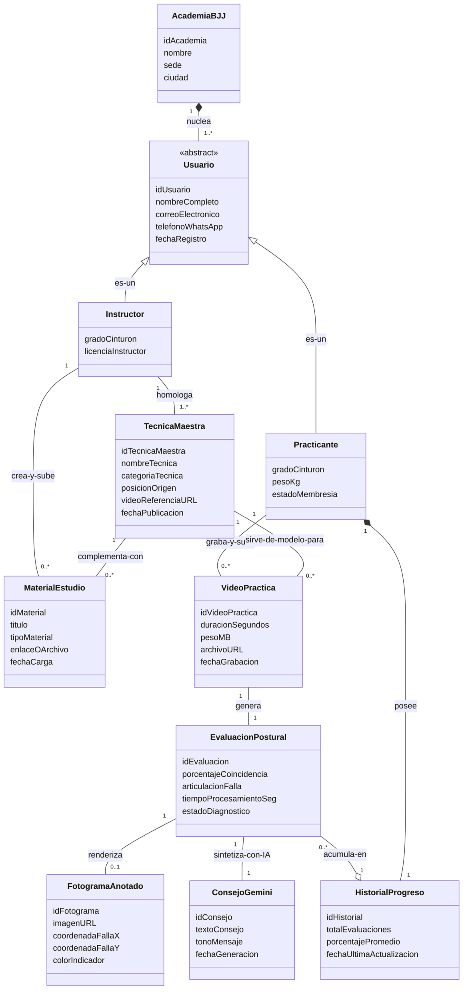

# Capítulo 1: Definición del Proyecto de Investigación

## 1.1 Definición del Problema

### 1.1.1 Situación Problemática

En la enseñanza de artes marciales, particularmente en el Jiu-Jitsu Brasileño (BJJ), la corrección técnica constituye un pilar fundamental para el aprendizaje efectivo y la prevención de lesiones. En el modelo tradicional de instrucción presencial, un único docente debe supervisar a múltiples practicantes que ejecutan técnicas de forma simultánea en parejas. Esta dinámica impone una limitación física y cognitiva inherente: la imposibilidad práctica de brindar una supervisión masiva, exhaustiva, continua y objetiva a cada estudiante durante toda la sesión.

En la academia piloto Corpo e Mente (ubicada en las instalaciones de Knock Out Gym, Santa Cruz de la Sierra, Bolivia), se cuenta con una comunidad de aproximadamente 77 miembros registrados y una asistencia promedio diaria de 15 personas. Se evidencia una notable tasa de rotación y deserción temporal, en la cual los practicantes interrumpen y retoman la disciplina tras varios meses de inactividad. Durante estas fases, los practicantes tienden a internalizar errores posturales y desajustes técnicos recurrentes —tales como la incorrecta colocación de apoyos, alineaciones articulares desfavorables o ángulos inadecuados del torso— que eluden la observación del instructor debido a las restricciones de la supervisión simultánea. La ausencia de un instrumento visual, objetivo y persistente que permita al practicante contrastar su ejecución con el modelo técnico de referencia impartido por el instructor conduce a una desaceleración en la curva de dominio técnico y a la consolidación prolongada de patrones de movimiento erróneos.

### 1.1.2 Situación Deseada

Se propone el desarrollo e implementación de un sistema computacional de asistencia al entrenamiento basado en visión artificial, concebido para comparar la ejecución técnica del practicante con un video de referencia provisto por el instructor. El sistema opera como un **sistema de auditoría técnica asincrónica**: el practicante graba su secuencia de práctica en el tatami, la sube a la plataforma y recibe la retroalimentación diagnóstica en tiempo diferido (no en vivo ni en tiempo real). Este modelo asincrónico evita falsas expectativas de procesamiento instantáneo durante el combate y permite ejecutar un análisis cinemático profundo y riguroso. El software detecta las diferencias en la postura corporal respecto al modelo del instructor y genera reportes visuales con indicadores claros y directos sobre la imagen. Esta retroalimentación objetiva y constante está disponible para el practicante a través de su dispositivo móvil, facilitando el autoaprendizaje guiado y liberando tiempo para que el instructor concentre su labor pedagógica en correcciones tácticas y estratégicas avanzadas.

### 1.1.3 Objeto de Investigación

El objeto de investigación comprende el diseño, desarrollo e implementación de un sistema de visión por computadora basado en redes neuronales profundas para la estimación de pose humana bidimensional (2D), diseñado para detectar, cuantificar y señalar visualmente discrepancias biomecánicas en la ejecución de técnicas de artes marciales mediante comparación cinemática directa frente a un patrón de referencia, operando bajo una arquitectura distribuida (edge-cloud).

### 1.1.4 Alcance y Delimitación

* **Delimitación temporal:** La investigación se desarrollará durante el periodo académico correspondiente a la elaboración, implementación y defensa del proyecto de grado.
* **Delimitación espacial:** La recolección del corpus de video y la prueba piloto experimental se llevarán a cabo en las instalaciones de la academia Corpo e Mente (Knock Out Gym, Santa Cruz de la Sierra, Bolivia).
* **Delimitación temática y técnica:** El sistema operará con un enfoque agnóstico de comparación técnica: procesará cualquier técnica de artes marciales siempre que se disponga de un video de referencia del instructor y un video de ejecución del practicante bajo un protocolo de grabación estandarizado (Plano General Lateral Estricto a 90 grados respecto al eje de movimiento y a una distancia fija de 3.0 metros). La estimación postural se enfocará estrictamente en la extracción de puntos clave articulares (*keypoints*) en dos dimensiones (2D) y el análisis de variaciones angulares relativas a lo largo del tiempo. El sistema constituye una herramienta complementaria de autoevaluación y auditoría técnica, sin pretender sustituir el juicio pedagógico del instructor. Se excluyen del alcance el reconocimiento automático o clasificación de técnicas no catalogadas, la reconstrucción volumétrica tridimensional (3D) y la medición de variables biomecánicas de fuerza, potencia o fatiga física.

### 1.1.5 Justificación de la Investigación

* **Justificación teórica:** El proyecto contribuye al área de la visión artificial aplicada a las ciencias del deporte y la biomecánica motriz, validando la eficacia de algoritmos de estimación de pose bidimensional y comparación temporal de series cinemáticas en deportes de contacto con interacción cercana, proporcionando evidencia empírica en un contexto de investigación deportiva local.
* **Justificación práctica:** Proporciona a la academia Corpo e Mente una solución de software escalable y accesible que optimiza los tiempos de supervisión del cuerpo docente, mitiga la consolidación de hábitos técnicos perjudiciales y brinda a los practicantes un medio de autoevaluación objetivo y sistemático.
* **Justificación metodológica:** La investigación adopta un proceso riguroso de ingeniería de software caracterizado por un diseño modular orientado a objetos y ciclos de desarrollo iterativos e incrementales. La implementación de prácticas de aseguramiento de calidad y desarrollo guiado por pruebas (*Test-Driven Development*, TDD) garantiza la validez matemática en los cálculos de geometría articular y la sincronización algorítmica de trayectorias previas a su integración en el producto final.

---

## 1.2 Objetivos de la Investigación

### 1.2.1 Objetivo General

Desarrollar un sistema de visión artificial para la detección y comparación objetiva de discrepancias biomecánicas en la ejecución de técnicas de artes marciales, que permita a instructores y practicantes obtener retroalimentación visual diagnóstica mediante el análisis de video en tiempo diferido.

### 1.2.2 Objetivos Específicos

1. **Analizar** los requerimientos funcionales, no funcionales y pedagógicos del proceso de enseñanza-aprendizaje técnico, estableciendo un protocolo de captura de video que defina las condiciones óptimas de ángulo, distancia e iluminación para minimizar el impacto de las oclusiones corporales.
2. **Diseñar** la arquitectura de software y los modelos de datos que permitan la integración desacoplada entre la captura y preprocesamiento de video, el motor de inferencia en la nube y la entrega de reportes visuales interactivos.
3. **Implementar** los módulos computacionales de estimación de pose humana en dos dimensiones (2D), extracción secuencial de coordenadas articulares y comparación algorítmica de curvas de desviación angular respecto al video patrón del instructor.
4. **Validar** la precisión y exactitud diagnóstica del sistema mediante pruebas experimentales de concordancia frente al criterio evaluativo de instructores certificados, evaluando adicionalmente la usabilidad y adopción de la herramienta por parte de los practicantes en la academia piloto.

---

## 1.3 Metodología

La investigación se clasificó como un estudio aplicado y de desarrollo tecnológico, fundamentado en un diseño metodológico mixto: cuantitativo para la determinación de métricas de precisión articular, desviación angular y rendimiento computacional; y cualitativo para la evaluación de la experiencia de usuario y utilidad pedagógica en el entorno real de entrenamiento.

El proceso de construcción del sistema se articuló a través de las siguientes dimensiones de ingeniería:

1. **Modelado y Arquitectura Orientada a Objetos:** Se definió formalmente el dominio del problema, descomponiendo la estructura en componentes de alta cohesión y bajo acoplamiento para independizar el motor de visión de las capas de persistencia e interfaces de usuario.
2. **Ciclo de Desarrollo Iterativo e Incremental:** Se planificaron ciclos de desarrollo para evolucionar la solución de forma controlada, integrando retroalimentación empírica continua proveniente de las pruebas de video en el tatami.
3. **Desarrollo Guiado por Pruebas (TDD):** Se implementó una batería de pruebas unitarias y de integración previa a la codificación de la lógica algorítmica, blindando la consistencia matemática de los cálculos trigonométricos, la correspondencia temporal de keypoints y la correcta anotación gráfica de fotogramas.

---

# Capítulo 2: Marco Contextual y Análisis Organizacional

## 2.1 Descripción de la Empresa

La academia piloto objeto de este estudio es **Corpo e Mente**, un centro especializado en la enseñanza técnica de Jiu-Jitsu Brasileño (BJJ). En la sucursal analizada, ubicada en Santa Cruz de la Sierra, Bolivia, la academia opera bajo un modelo de **alianza estratégica y externalización de servicios (outsourcing)** con el gimnasio **Knock Out Gym**.

Bajo este esquema operativo:
* **Knock Out Gym** centraliza la infraestructura física, la gestión comercial, el marketing, la administración de membresías y la recaudación económica directa de los practicantes.
* **Corpo e Mente** aporta el capital intelectual, el programa pedagógico estructurado y el capital humano especializado (instructores) para la instrucción técnica en el tatami.

Esta simbiosis permite a Corpo e Mente enfocarse exclusivamente en la excelencia técnica, mientras delega la carga administrativa y financiera al socio estratégico.

## 2.2 Descripción Organizacional de la Empresa

Dada la naturaleza del modelo de alianza descrito, la estructura organizativa de Corpo e Mente en esta sucursal es **minimalista y altamente especializada**. No existe una jerarquía administrativa interna, ya que todas las funciones de soporte, cobranza y mantenimiento son absorbidas por la estructura de Knock Out Gym.

La estructura operativa se reduce a un esquema unipersonal en el nivel técnico:

* **Nivel Administrativo (Externo):** Gestionado íntegramente por el personal de Knock Out Gym. Responsables del registro de nuevos miembros, cobro de mensualidades y mantenimiento de las instalaciones.
* **Nivel Técnico-Pedagógico (Interno):** Representado exclusivamente por el **Instructor Titular** de Corpo e Mente. Este rol posee autonomía total sobre el diseño curricular, la ejecución de clases y la evaluación técnica, actuando como el único punto de contacto técnico para la comunidad de usuarios.

## 2.4 Manual de Funciones (Perfil Unipersonal)

Al existir un único puesto de trabajo representativo de la marca Corpo e Mente en esta sucursal, las responsabilidades se concentran en un perfil multifuncional de alto rendimiento.

**Cargo:** Instructor Titular  
**Objetivo del Cargo:** Dirigir, planificar y supervisar la formación técnica, física y táctica de los practicantes de Jiu-Jitsu, garantizando la seguridad, la progresión técnica y la retención de practicantes dentro del ecosistema de Knock Out Gym.

**Funciones Principales:**
1. **Área Pedagógica:** Diseñar la currícula técnica diaria y mensual, adaptando contenidos tanto para grupos infantiles como adultos, y diferenciando entre clases grupales masivas y sesiones individuales.
2. **Área Operativa (Ejecución Integral):** Dirigir todas las fases de la sesión de entrenamiento: desde el calentamiento dirigido y movilidad articular, hasta la demostración biomecánica de la técnica del día.
3. **Área de Supervisión y Corrección:** Fiscalizar la práctica simultánea de múltiples parejas en el tatami. *Nota crítica:* Al ser el único instructor, debe rotar constantemente entre las parejas, lo que genera intervalos de tiempo donde los practicantes entrenan sin retroalimentación inmediata.
4. **Área Evaluativa:** Coordinar, evaluar y ejecutar los exámenes de grado para las distintas categorías de edad y niveles de cinturón, validando la progresión técnica.
5. **Área de Coordinación Interinstitucional:** Mantener comunicación fluida con la administración de Knock Out Gym para reportar asistencia, gestionar bajas temporales y analizar el comportamiento de la comunidad (los 77 miembros registrados).

## 2.5 Flujo del Negocio

### 2.5.1 Flujo Comercial y de Recaudación

El proceso financiero sigue una ruta triangular que separa la captación del cliente de la prestación del servicio técnico:

1. **Captación y Cobro:** El interesado acude a las instalaciones de Knock Out Gym, se registra en su sistema administrativo y cancela su membresía directamente en la recepción del gimnasio. El dinero ingresa a las cuentas de Knock Out.
2. **Asignación de Servicio:** El gimnasio otorga al practicante el acceso al área de tatami asignada contractualmente a Corpo e Mente.
3. **Compensación Económica:** Knock Out Gym liquida de forma periódica (mensual o por comisión) los honorarios correspondientes al Instructor Titular de Corpo e Mente por los servicios de enseñanza prestados a la base de usuarios activa.

### 2.5.2 Flujo Operativo de la Clase Diaria (El Cuello de Botella Crítico)

La dinámica interna de la clase revela la necesidad urgente de apoyo tecnológico debido a la limitación de recursos humanos:

1. **Ingreso al Tatami:** El Instructor Titular y los practicantes activos (promedio de 15 diarios) acceden al espacio asignado.
2. **Fase de Calentamiento:** El instructor dirige personalmente los ejercicios de movilidad y acondicionamiento. Durante esta fase, su atención está dividida entre demostrar y asegurar que nadie se lesione.
3. **Explicación de la Técnica:** El instructor demuestra la biomecánica de la técnica del día (ej. escape de la montada), utilizando a un practicante avanzado como apoyo visual.
4. **Práctica Simultánea en Parejas:** Los ~15 practicantes se dividen en ~7-8 parejas. Una persona ejecuta la técnica y la otra la recibe.
5. **El Cuello de Botella Crítico:**
   * El Instructor debe pasar pareja por pareja corrigiendo detalles finos.
   * Mientras corrige a la **Pareja A**, las **Parejas B, C, D, E, F, G y H** quedan sin supervisión directa.
   * Si un practicante comete un error biomecánico en ese intervalo, lo repite varias veces hasta que el instructor llega, fijando el desajuste técnico.
   * Este problema se agrava con los **practicantes con asistencia irregular** (que vuelven tras meses de pausa), quienes han perdido memoria motriz y requieren correcciones constantes que el instructor no puede cubrir simultáneamente para todos.

---

# Capítulo 3: Marco Teórico e Ingeniería de Selección

## 3.1 Ingeniería de Selección de Modelos de Estimación de Pose (HPE)

Para la extracción del esqueleto anatómico de los practicantes, se evaluaron tres arquitecturas de vanguardia en visión artificial: MediaPipe Pose (Google), OpenPose (CMU) y Ultralytics YOLO26-Pose. La evaluación se fundamentó en criterios de latencia en inferencia remota, robustez ante oclusiones corporales severas originadas por el contacto estrecho y facilidad de integración en una canalización (*pipeline*) de software basada en Python.

### 3.1.1 Matriz Comparativa de Modelos Core de Visión

| Criterio Técnico | MediaPipe Pose | OpenPose (Baseline) | Ultralytics YOLO26-Pose |
| :--- | :--- | :--- | :--- |
| **Enfoque de Red** | Top-down (Monorregión) | Bottom-up (Campos de Afinidad Part Affinity Fields) | Single-Shot Retainers (End-to-End) |
| **Inferencia en CPU** | Alta eficiencia (Mobile) | Inviable ($< 3$ FPS) | Optimizada (Hasta 43% más rápida) |
| **Manejo de Oclusión** | Deficiente en contacto (pérdida de *keypoints*) | Alto costo computacional | Excelente (Alineación por STAL y pérdida progresiva) |
| **Post-procesamiento** | No requiere | Requiere NMS pesado y enlace algebraico | NMS-Free nativo (Cero latencia post-red) |
| **Formato de Exportación** | Propietario (`.tflite`) | Complejo (C++ nativo / Caffe) | Altamente versátil (`.pt`, `ONNX`, `TensorRT`) |

### 3.1.2 Justificación de la Elección de YOLO26-Pose

Se determinó la selección de YOLO26-Pose a partir de dos ventajas arquitecturales determinantes para el dominio de estudio:

1. **Inferencia End-to-End libre de NMS (Non-Maximum Suppression):** A diferencia de las iteraciones previas de la familia YOLO o de arquitecturas basadas en agrupamiento como OpenPose, YOLO26 efectúa la predicción directa de las coordenadas articulares sin demandar una etapa posterior de supresión de no máximos. Dicho factor elimina cuellos de botella algorítmicos en el backend local y confiere estabilidad a los tiempos de inferencia en la nube sobre Google Colab Pro.
2. **Algoritmo STAL (Small-Target-Aware Label Assignment):** Durante las transiciones en el suelo características del Jiu-Jitsu, determinados segmentos anatómicos distales (como muñecas, tobillos o pies en posiciones de sumisión o guardia) ocupan una fracción reducida de píxeles en el fotograma. El mecanismo STAL incrementa sustancialmente la cobertura de etiquetas positivas asignadas a objetos y coyunturas de escala reducida, mitigando el parpadeo (*jitter*) o la desconexión del grafo esquelético ante deformaciones complejas.

---

## 3.2 Extracción de Características y Cinemática Vectorial Bidimensional (2D)

Tras la detección de los 17 puntos articulares del estándar COCO por parte de YOLO26-Pose, se estructura un plano bidimensional (2D) para el análisis biomecánico de las trayectorias.

### 3.2.1 Formalismo Matemático para el Análisis Angular

Cada articulación de interés se modela como un vértice dinámico inmerso en un espacio vectorial $\mathbb{R}^2$. Para cuantificar la conformación de una articulación central $B$ conectada a sus vértices adyacentes proximal $A$ y distal $C$, se construyen los vectores de segmento corporal correspondientes:

$$\vec{u} = \vec{BA} = (x_A - x_B, \, y_A - y_B)$$

$$\vec{v} = \vec{BC} = (x_C - x_B, \, y_C - y_B)$$

La magnitud del ángulo interarticular $\theta(t)$ en el instante de tiempo o fotograma $t$ se obtiene a través del producto escalar euclidiano y la función arco coseno:

$$\theta(t) = \arccos\left( \frac{\vec{u} \cdot \vec{v}}{\Vert{}\vec{u}\Vert{} \, \Vert{}\vec{v}\Vert{}} \right) = \arccos\left( \frac{(x_A - x_B)(x_C - x_B) + (y_A - y_B)(y_C - y_B)}{\sqrt{(x_A - x_B)^2 + (y_A - y_B)^2} \; \sqrt{(x_C - x_B)^2 + (y_C - y_B)^2}} \right)$$

**Justificación de invarianza y protocolo de grabación:** La formulación vectorial asegura invarianza matemática frente a traslaciones en el plano y variaciones de escala geométrica. Para que esta formulación en 2D sea rigurosa y no sufra distorsiones de perspectiva angular, el sistema establece un protocolo de captura estandarizado: el video debe ser grabado desde un **Plano General Lateral Estricto** (ángulo perpendicular de 90 grados respecto al eje longitudinal de movimiento) y a una **distancia fija de 3.0 metros**. Bajo estas condiciones, divergencias en la posición de los practicantes respecto a la cámara no alteran la estimación angular, facultando una comparación directa y robusta entre el Modelo de Referencia del instructor y la ejecución del practicante. El sistema utiliza la técnica del instructor como una **plantilla de recorte** (o molde de referencia): compara la postura del practicante con este Modelo de Referencia para identificar con precisión qué articulaciones no coinciden con la alineación técnica esperada.

---

## 3.3 Algoritmo de Aislamiento y Priorización del Ejecutor (Target Isolation)

Dada la co-presencia inevitable de dos cuerpos en interacción física dentro del encuadre (practicante ejecutor y compañero de apoyo o receptor pasivo), es indispensable aislar las coordenadas esqueléticas del sujeto activo. Se contrastaron dos alternativas de ingeniería para su resolución en el backend:

* **Alternativa A: Clasificación por área de Bounding Box:** Asignación del rol de ejecutor a la silueta con mayor envolvente en píxeles. Resulta errática en fases de suelo donde el receptor suele quedar posicionado por encima del ejecutor.
* **Alternativa B (Seleccionada): Filtro de Varianza Cinemática Acumulada (Kinematic Variance Filter):** Detección del sujeto activo mediante la energía de movimiento temporal.

### 3.3.1 Formalismo Matemático del Aislamiento Cinemático

En técnicas de defensa y escape en el tatami, el sujeto receptor adopta un rol de contención predominantemente estático o isométrico, en tanto que el ejecutor despliega aceleraciones angulares y traslaciones significativas de su centro de gravedad. El sistema evalúa la varianza temporal de las coordenadas del centroide $(\bar{x}, \bar{y})$ de cada individuo detectado durante una ventana inicial de $N$ fotogramas ($N = 30$):

$$\sigma^2_{x} = \frac{1}{N}\sum_{t=1}^{N}(x_t - \bar{x})^2, \quad \sigma^2_{y} = \frac{1}{N}\sum_{t=1}^{N}(y_t - \bar{y})^2$$

$$V_{\text{total}} = \sigma^2_{x} + \sigma^2_{y}$$

El algoritmo asocia la etiqueta de *Ejecutor Objetivo* al identificador de seguimiento (*tracking ID*) que presenta el valor máximo de $V_{\text{total}}$ en la serie analizada. Las trayectorias del sujeto secundario son enmascaradas en las matrices subsiguientes, previniendo perturbaciones en la cuantificación del error biomecánico.

**Nota de limitación técnica:** El filtro de varianza cinemática está optimizado para técnicas donde el compañero receptor adopta una postura relativamente estática o de contención isométrica pasiva (actuando como un soporte o 'dummy humano'), situación habitual en la práctica técnica de escapes y defensas en el suelo. En técnicas donde ambos practicantes ejecutan movimientos explosivos simultáneos (como en derribos o proyecciones dinámicas), ambos sujetos presentan alta energía de movimiento; en estos casos, el sistema reconoce esta limitación técnica y prevé la posibilidad de intervención manual en la interfaz para confirmar o seleccionar al ejecutante evaluado.

---

## 3.4 Sincronización Temporal de Movimientos Heterogéneos

La cadencia y velocidad de ejecución entre el instructor y el practicante presentan diferencias temporales sistemáticas. Para el alineamiento de las series temporales de ángulos articulares se evaluaron dos estrategias:

1. **Resampleo Lineal Dinámico:** Forzamiento algebraico de correspondencia marco a marco por interpolación. Se desestimó debido a la asunción errónea de velocidades de ejecución constantes en sujetos humanos.
2. **Alineación Temporal Dinámica (Dynamic Time Warping - DTW) (Seleccionada):** Determina una ruta óptima de emparejamiento sobre una matriz de distancias locales de orden $M \times K$, siendo $M$ el número de fotogramas de la referencia del instructor y $K$ el de la ejecución del practicante. El algoritmo minimiza recursivamente la distancia acumulada:

$$D(i, j) = \text{dist}(\theta_{\text{inst}}(i), \theta_{\text{prac}}(j)) + \min \left[ D(i-1, j), D(i, j-1), D(i-1, j-1) \right]$$

**Justificación técnica y analógica:** El algoritmo DTW opera de forma análoga a comparar dos interpretaciones de una misma **canción a distinta velocidad**: aunque un músico ejecute el tema con mayor rapidez y otro lo haga con pausas o lentitud, el algoritmo empareja los acordes y compases equivalentes en vez de forzar una alineación rígida segundo a segundo. En el tatami, esto permite hacer converger los hitos cinemáticos críticos (por ejemplo, el punto más alto del puente defensivo o el momento de control de cadera) con independencia del ritmo o fluidez motriz del practicante.

---

## 3.5 Arquitectura de Datos e Infraestructura de Cómputo (Cloud-Edge)

En correspondencia con las restricciones operativas y el requisito de rendimiento (< 5 a 10 segundos), se estableció una arquitectura desacoplada basada en **comunicación directa vía API REST y Webhooks**, suprimiendo la dependencia de sincronizaciones lentas de archivos virtuales para la ruta crítica de inferencia.

### 3.5.1 Topología del Flujo de Datos

### 3.5.2 Justificación de la Infraestructura Seleccionada

1. **Despacho Directo mediante API REST y Webhooks:** La comunicación punto a punto entre el orquestador local y el microservicio en Google Colab Pro mediante llamadas HTTP REST directas o Webhooks elimina la latencia de escaneo y sincronización de carpetas virtuales. Esto garantiza que el procesamiento y retorno del diagnóstico ocurra dentro de la ventana de 5 a 10 segundos requerida en el entrenamiento.
2. **Procesamiento Acelerado y Almacenamiento Persistente Desacoplado:** El backend en Google Colab Pro ejecuta la inferencia pesada en una GPU de alta velocidad (NVIDIA A100), calcula las discrepancias articulares y consulta la API de Google Gemini para emitir la recomendación técnica. Paralelamente, Google Drive opera fuera de la ruta crítica como un repositorio persistente en segundo plano para el respaldo histórico de videos y reportes, evitando cuellos de botella en la entrega de resultados al practicante.

---

# Capítulo 4: Definición de Requisitos del Sistema (Estándar IEEE 830)

## 4.1 Introducción

### 4.1.1 Propósito
El propósito del presente documento es especificar formal, exhaustiva y pedagógicamente los requisitos funcionales, no funcionales y de interfaz que rigen la construcción del **Asistente Inteligente de Corrección Postural para Jiu-Jitsu Brasileño (BJJ)** en la academia *Corpo e Mente* (Santa Cruz de la Sierra, Bolivia).

Este pliego de requisitos sigue las directrices internacionales del estándar **IEEE 830** (Recomendaciones para la Especificación de Requisitos de Software), articulándose bajo un enfoque centrado en el usuario humano. Su diseño busca tender un puente conceptual claro entre el rigor técnico de la ingeniería de software y la realidad práctica del tatami, permitiendo su cabal comprensión por parte de un tribunal evaluador multidisciplinario (integrado por especialistas en ingeniería, negocios, educación física y gestión deportiva).

### 4.1.2 Ámbito del Sistema
El sistema constituye una plataforma computacional de asistencia técnica y pedagógica basada en visión artificial y modelos de inteligencia artificial (**Google Gemini**), cuyo alcance operativo comprende:

1. **Gestión de Técnicas Patrón:** Permite al Instructor registrar, etiquetar y homologar los videos del **Modelo de Referencia** demostrados en el tatami.
2. **Gestión de Materiales de Estudio:** Permite al Instructor gestionar fuentes de conocimiento en formato PDF (como *Jiu-Jitsu University*) y registrar recursos externos mediante enlaces a videos oficiales de YouTube, sirviendo como base de conocimiento para la IA y material de consulta para los practicantes.
3. **Carga de Video desde Dispositivo Móvil:** Facilita a los Practicantes seleccionar la técnica del día y subir grabaciones de su práctica en pareja (secuencias de hasta 45 segundos y 50 MB) directamente desde su dispositivo móvil.
4. **Extracción y Aislamiento Corporal Automatizado:** Identifica los puntos clave del cuerpo (*keypoints*) mediante **YOLO26-Pose** y separa de forma automática al Practicante activo de su compañero de apoyo estático.
5. **Sincronización y Comparación Postural:** Alinea los tiempos de ejecución mediante **DTW** (*Dynamic Time Warping*) y compara la postura del Practicante con la técnica del Instructor, utilizándola como una **plantilla de recorte** (o molde de referencia).
6. **Diagnóstico Visual Inmediato:** Señala visualmente sobre la imagen la articulación desalineada mediante un círculo rojo, indicando con claridad el punto exacto de falla.
7. **Asesoría Pedagógica Asistida por IA:** Genera consejos directos, constructivos y formativos mediante la **API de Google Gemini**, traduciendo el análisis visual a recomendaciones claras de entrenamiento.
8. **Monitoreo Histórico:** Permite al Practicante revisar su progreso y evolución técnica a lo largo de las clases.

**Límites y Exclusiones Explícitas del Sistema:**
* **Naturaleza de Auditoría Asincrónica (no en tiempo real):** El sistema opera bajo un modelo de procesamiento en tiempo diferido; el practicante graba su repetición técnica, la envía al servidor y consulta el reporte diagnóstica con posterioridad, descartando cualquier expectativa de visualización o procesamiento simultáneo en vivo sobre el tatami.
* **Protocolo de Grabación Obligatorio:** La validez geométrica del análisis 2D requiere que las grabaciones se realicen estrictamente desde un **Plano General Lateral Estricto** (ángulo perpendicular de 90 grados respecto al eje de movimiento) y a una distancia fija estandarizada de 3.0 metros.
* **Deslinde Médico y Fisioterapéutico:** El sistema no emite diagnósticos traumatológicos, médicos ni de rehabilitación física.
* **Exclusión de Combate Libre (Spárring):** El sistema se delimita a repeticiones técnicas estructuradas en plano lateral fijo; no procesa combates caóticos en plano general ni múltiples parejas simultáneas.
* **Selección Guiada:** El sistema no clasifica técnicas de forma automática; el practicante elige la técnica desde el catálogo curricular para asegurar la máxima precisión.
* **Preservación del Rol Docente:** El software no sustituye el criterio, la autoridad pedagógica ni la supervisión de seguridad del Instructor en el tatami.

### 4.1.3 Definiciones, Acrónimos y Abreviaturas
* **BJJ (*Brazilian Jiu-Jitsu*):** Jiu-Jitsu Brasileño. Arte marcial y deporte de combate enfocado en el control corporal en el suelo, agarres y sumisiones mecánicas.
* **Puntos Clave del Cuerpo (*Keypoints*):** Coordenadas en dos dimensiones que señalan las articulaciones principales del cuerpo (hombros, codos, muñecas, caderas, rodillas y tobillos).
* **Similitud de Postura / Coincidencia de Posición:** Nivel de coincidencia entre la posición del cuerpo del Practicante y el Modelo de Referencia del Instructor en una fase técnica equivalente.
* **DTW (*Dynamic Time Warping* / Sincronizador de Movimiento):** Método que empareja movimientos que ocurren a diferente velocidad (análogo a dos versiones de una misma canción interpretada a distinta cadencia), permitiendo comparar la técnica aunque el Practicante se mueva más despacio o haga pausas.
* **YOLO26-Pose:** Modelo de visión artificial que detecta cuerpos y extrae los puntos articulares de forma rápida y precisa en el plano bidimensional (2D).
* **Google Gemini API:** Servicio de inteligencia artificial de Google que analiza los desajustes técnicos y redacta recomendaciones pedagógicas en lenguaje claro.
* **Google Colab Pro:** Servidor en la nube con tarjetas gráficas (GPU) encargado del procesamiento pesado del video.
* **PWA (*Progressive Web App*):** Aplicación web que funciona en el navegador del celular con la apariencia y agilidad de una app instalada, sin necesidad de descargas de tiendas virtuales.
* **IEEE 830:** Norma internacional para redactar especificaciones de requisitos de software de forma clara y ordenada.

### 4.1.4 Visión General del Documento
El capítulo se organiza conforme a las mejores prácticas de la ingeniería de software y el estándar IEEE 830:
* La **Sección 4.2 (Descripción General)** detalla la arquitectura global, funciones maestras, perfiles de usuario (arquetipos funcionales), restricciones y dependencias.
* La **Sección 4.3 (Requisitos Específicos)** formaliza las interfaces externas, requisitos funcionales descritos mediante especificaciones formales, requisitos de rendimiento, restricciones de diseño y atributos de calidad con cláusula legal de deslinde.
* La **Sección 4.4 (Identificación de Casos de Uso)** ilustra la dinámica operativa mediante diagramas Mermaid y matrices de casos de uso estructuradas según el Proceso Unificado.
* La **Sección 4.5 (Diagrama de Dominio)** expone el modelo conceptual de clases, entidades de datos y sus relaciones estructurales.

---

## 4.2 Descripción General

### 4.2.1 Perspectiva del Producto
El sistema opera mediante una estructura distribuida en dos partes:

1. **Capa Frontal en el Tatami (PWA Móvil):** Funciona en los dispositivos móviles del Instructor y de los Practicantes. Permite consultar el catálogo técnico, realizar la carga de videos de práctica y revisar los diagnósticos visuales y las recomendaciones pedagógicas en tiempo diferido.
2. **Capa de Procesamiento en la Nube (Google Colab Pro + FastAPI + Gemini API):** Servicio centralizado que recibe los videos mediante comunicación directa por API REST o Webhooks, extrae las posiciones corporales con YOLO26, sincroniza los tiempos con DTW, analiza la coincidencia postural y consulta la API de Google Gemini para redactar las recomendaciones de mejora.

Este diseño permite un funcionamiento económico y evita instalar equipos costosos en el gimnasio (*Knock Out Gym*).

### 4.2.2 Funciones del Producto
El funcionamiento del sistema se resume en los siguientes pasos:

**Figura 4.1**  
*Flujo Funcional del Sistema de Asistencia Postural.*

*Nota.* Flujo secuencial de auditoría técnica asincrónica para asistencia en el tatami.

1. **Gestión de Técnicas Patrón:** Registro del video del Modelo de Referencia por parte del Instructor.
2. **Gestión de Materiales de Estudio:** Subida de fuentes de conocimiento en PDF y registro de enlaces a videos oficiales de YouTube por parte del Instructor.
3. **Carga de Video desde Dispositivo Móvil:** Subida ágil desde el dispositivo móvil con validación de duración (hasta 45 segundos) y tamaño (hasta 50 MB).
4. **Aislamiento del Practicante Activo:** Separación automática del compañero que actúa como soporte estático pasivo.
5. **Sincronización Temporal (DTW):** Comparación justa de movimientos ejecutados a distintas velocidades.
6. **Evaluación de Coincidencia Postural:** Comparación con la Técnica Patrón del Instructor usada como plantilla de recorte.
7. **Anotación Visual:** Marcado de un círculo rojo en el fotograma clave sobre la articulación con desajuste técnico.
8. **Generación de Consejos con IA (Gemini):** Entrega de una recomendación en lenguaje directo, constructivo y fácil de aplicar en la práctica.

---

### 4.2.3 Perfiles de Usuario (Arquetipos Funcionales)
El sistema reconoce dos perfiles de usuario en el tatami:

#### Perfil A: El Instructor
* **Rol y Responsabilidades:** Máxima autoridad técnica y pedagógica en la academia. Diseña el programa de clases, demuestra las Técnicas Patrón oficiales, gestiona los materiales de estudio (PDFs y enlaces de YouTube) y evalúa los avances para los ascensos de cinturón.
* **Contexto Operativo:** Supervisa clases con múltiples parejas entrenando al mismo tiempo. Necesita una herramienta que le permita establecer Modelos de Referencia oficiales para que los practicantes puedan auditar sus ejecuciones asincrónicamente mientras asiste a otras parejas de practicantes.
* **Competencia Digital:** Nivel intermedio; acostumbra usar aplicaciones móviles y mensajería. Requiere una interfaz sencilla que no le quite tiempo durante la clase.
* **Necesidades Principales:** Registrar de forma rápida los videos del Modelo de Referencia de cada técnica y compartir material de apoyo confiable con los practicantes.

#### Perfil B: El Practicante
* **Rol y Responsabilidades:** Usuario que aprende y entrena las técnicas de Jiu-Jitsu. Realiza las repeticiones con su compañero de práctica y busca mejorar su ejecución.
* **Contexto Operativo:** Asiste a las clases regulares y requiere verificar si sus posturas y apoyos son correctos, especialmente si ha dejado de entrenar por algún tiempo y necesita refrescar los movimientos.
* **Competencia Digital:** Nivel regular o avanzado; usuario habitual de dispositivos móviles. Espera respuestas ágiles, bajo consumo de datos y explicaciones fáciles de entender.
* **Necesidades Principales:** Ver en una imagen clara qué parte del cuerpo debe corregir (con un círculo rojo) y recibir un consejo práctico en texto para aplicar en la siguiente repetición.

---

### 4.2.4 Restricciones
* **Restricción Presupuestaria de Nube:** La solución debe operar íntegramente dentro del plan base de Google Colab Pro (~$10 a $20 USD mensuales), descartando el aprovisionamiento de clústeres dedicados o instancias de alto coste.
* **Protección del Dispositivo Móvil:** Queda estrictamente prohibida la ejecución de modelos de IA en el navegador del teléfono del usuario para evitar recalentamiento, consumo excesivo de batería o congelamiento en dispositivos de gama media o baja.
* **Límite de Carga Multimedia:** Los videos cargados podrán tener una duración máxima de hasta **45 segundos** y un peso máximo de **50 MB**, eliminando restricciones restrictivas previas para asegurar el registro completo de la técnica sin saturar los enlaces móviles.
* **Condiciones de Conectividad:** El sistema debe ser tolerante a la latencia variable y micro-cortes frecuentes en las redes celulares comerciales y Wi-Fi de gimnasios locales.

### 4.2.5 Suposiciones y Dependencias
* **Protocolo de Captura en Tatami:** Se establece de forma obligatoria que los practicantes colocarán el dispositivo móvil en un trípode o soporte a una **distancia fija de 3.0 metros**, registrando la escena en un **Plano General Lateral Estricto** (ángulo perpendicular de 90 grados respecto al eje del movimiento), garantizando la visibilidad de cuerpo entero y la validez matemática de las proyecciones en 2D.
* **Condiciones Ambientales:** Se asume una iluminación regular de gimnasio (luz artificial uniforme) y uso de vestimenta de entrenamiento contrastante con el tatami.
* **Dependencias de Servicios Externos:** El sistema depende operativamente de la disponibilidad del servicio Google Colab Pro para la inferencia de YOLO26 y de la API de Google Gemini para la síntesis pedagógica textual.

### 4.2.6 Requisitos Futuros
* **Reconocimiento Autónomo de Técnicas:** Incorporación de modelos de clasificación de video que identifiquen la técnica ejecutada sin necesidad de selección manual previa en el catálogo.
* **Auditoría de Combate Libre (Rolling):** Expansión hacia el análisis postural continuo en planos generales durante sesiones de combate real.
* **Módulo de Gamificación:** Sistema de insignias y niveles de pulcritud técnica para estimular la adherencia de los practicantes que retoman sus entrenamientos.

---

## 4.3 Requisitos Específicos

### 4.3.1 Interfaces Externas

#### 4.3.1.1 Interfaces de Software
* **Cliente Web Progresivo (PWA):** Desarrollada como interfaz web ligera y responsiva para navegadores móviles (Google Chrome, Safari), optimizada para pantallas táctiles y con validación previa de archivos en el cliente.
* **Microservicio de Visión y Cómputo (FastAPI en Google Colab Pro):** Servicio backend que expone endpoints de API REST directa y Webhooks para recibir los videos, ejecutar la inferencia esquelética de YOLO26-Pose, calcular la sincronización temporal mediante DTW y renderizar las marcas visuales de desalineación en OpenCV, respondiendo en una ventana de 5 a 10 segundos y eliminando la dependencia crítica de sincronizaciones lentas en disco virtual.
* **API de Google Gemini:** Integración directa mediante SDK oficial para el envío de métricas de discrepancia postural y recepción de recomendaciones pedagógicas en lenguaje natural.
* **Almacenamiento Persistente en la Nube (Google Drive Storage):** Repositorio secundario en la nube para el archivado histórico y asincrónico de secuencias de video, diagnósticos y reportes, operando de forma desacoplada del flujo de procesamiento crítico de la API REST.

#### 4.3.1.2 Interfaces de Hardware
* **Dispositivo de Adquisición y Consulta:** Teléfonos inteligentes convencionales con cámara digital integrada (resolución mínima recomendada: 720p a 30 fotogramas por segundo).
* **Terminal Local de Tatami:** Computadora portátil estándar ubicada en la recepción o área técnica, operando como orquestador ligero sin requerir tarjeta gráfica dedicada.
* **Unidad de Procesamiento Acelerado (Nube):** Procesador gráfico NVIDIA A100 provisto en el entorno Google Colab Pro.

#### 4.3.1.3 Interfaces de Comunicación
* Protocolo seguro **HTTPS** con cifrado **TLS 1.3** para todas las transferencias de video y datos entre el cliente móvil y los servicios en la nube.

---

### 4.3.2 Requisitos Funcionales

**Tabla 4.1**  
*Matriz de Requisitos Funcionales del Sistema*

| Código | Requisito Funcional | Historia de Usuario y Criterio de Aceptación |
| :---: | :--- | :--- |
| **RF-01** | **Registro de Técnica Patrón (Modelo de Referencia)** | **Como** Instructor, **se requiere** registrar y homologar el video de la Técnica Patrón oficial (ej. *'Escape de Montada mediante Puente y Giro'*), **para que** sirva como Modelo de Referencia (plantilla) contra el cual se evaluará la ejecución técnica de los practicantes. *Criterio de Aceptación:* El sistema permite cargar el video patrón, asociar los metadatos de categoría y posición de origen en menos de 30 segundos, extrayendo y almacenando el esqueleto de referencia en el servidor remoto. |
| **RF-02** | **Carga de Video desde Dispositivo Móvil** | **Como** Practicante, **el sistema debe** permitir seleccionar desde el teléfono móvil la técnica demostrada en la sesión y subir la grabación de su práctica en pareja (con una duración máxima de hasta 45 segundos), **para que** el sistema realice la evaluación postural. *Criterio de Aceptación:* La interfaz valida que el archivo no supere 50 MB de tamaño ni 45 segundos de duración, transmitiendo la secuencia directamente hacia el backend vía API REST o Webhook y rechazando de forma controlada archivos que excedan dichos límites antes de saturar el enlace de red. |
| **RF-03** | **Detección Automática de Puntos Clave** | **El sistema procesa** cada fotograma del video mediante YOLO26-Pose para identificar con precisión los 17 puntos anatómicos corporales del estándar COCO (hombros, codos, muñecas, caderas, rodillas y tobillos), preservando el seguimiento continuo ante cruces y oclusiones dinámicas en el tatami. |
| **RF-04** | **Aislamiento del Practicante Activo** | **El sistema discrimina** automáticamente al practicante en ejecución frente al compañero que ejerce el rol de soporte estático mediante el análisis de varianza cinemática temporal, enmascarando las coordenadas del sujeto secundario para garantizar la precisión del análisis. |
| **RF-05** | **Sincronización Temporal (DTW)** | **El sistema aplica** el algoritmo DTW (*Dynamic Time Warping*) para alinear la velocidad del practicante con la del video patrón, asegurando una correspondencia postural justa e independiente del ritmo o fluidez de ejecución. |
| **RF-06** | **Detección del Momento de Máxima Discrepancia** | **El sistema aísla** de forma automática el fotograma temporal donde la configuración corporal del practicante presenta el mayor desvío espacial respecto a la plantilla de referencia del instructor. |
| **RF-07** | **Señalización Visual del Error** | **El sistema renderiza** sobre el fotograma clave un marcador gráfico circular de color rojo (mediante OpenCV) centrado en la articulación desalineada, brindando un indicador visual objetivo e inmediato. |
| **RF-08** | **Generación de Consejos con Inteligencia Artificial** | **Como** Practicante, **el sistema debe** recibir una recomendación clara, formal y fácil de entender sobre la causa del desajuste postural y cómo corregirla, **para que** se facilite la comprensión motriz sin depender de interpretaciones matemáticas complejas. *Criterio de Aceptación:* La API de Google Gemini genera una explicación de 2 a 3 líneas con orientación práctica (ej. *"Se detecta una apertura excesiva del codo derecho durante el giro; mantenga la articulación próxima a las costillas para preservar el control mecánico"*). |
| **RF-09** | **Aviso por Bloqueo Visual o Mala Grabación** | **El sistema interrumpe** de forma controlada el proceso ante oclusiones corporales continuas que excedan el límite de validez o ante encuadres incompletos, notificando al usuario mediante un mensaje claro en pantalla (ej. *"No se visualizan con claridad los segmentos inferiores. Repita la captura ajustando el ángulo lateral de la cámara"*), evitando registrar datos erróneos en el historial. |
| **RF-10** | **Consulta de Historial de Progreso** | **Como** Practicante, **el sistema debe** permitir acceder a un panel histórico de evaluaciones técnicas, **para que** se pueda auditar la evolución cronológica del desempeño y la reducción sostenida de discrepancias posturales. *Criterio de Aceptación:* El panel presenta la lista cronológica de evaluaciones realizadas con sus fechas y niveles de coincidencia alcanzados. |
| **RF-11** | **Gestión de Fuentes de Conocimiento (PDFs)** | **Como** Instructor, **se requiere** subir y gestionar archivos PDF de libros y manuales de Jiu-Jitsu (como *Jiu-Jitsu University*), **para que** el sistema procese e indexe estas fuentes de conocimiento oficial y las suministre como contexto técnico al formular las recomendaciones para los practicantes. *Criterio de Aceptación:* El sistema permite cargar y administrar archivos PDF, indexa su contenido técnico y lo vincula a las técnicas correspondientes como base de conocimiento oficial para la inteligencia artificial. |
| **RF-12** | **Gestión de Recursos Externos (YouTube)** | **Como** Instructor, **se requiere** gestionar y asociar enlaces de videos externos de YouTube vinculados a cada técnica, **para que** los practicantes dispongan de recursos audiovisuales de consulta al prepararse para sus evaluaciones de cinturón. *Criterio de Aceptación:* El sistema valida el formato de la URL de YouTube, la asocia a la Técnica Patrón y permite su reproducción directa desde la interfaz de usuario. |

*Nota.* Requisitos funcionales elaborados según el estándar IEEE 830 y los lineamientos del Proceso Unificado.

---

### 4.3.3 Requisitos de Rendimiento
* **RP-01 (Latencia Total de Procesamiento):** El tiempo total transcurrido desde la recepción directa del video en el microservicio (vía API REST o Webhook) hasta la entrega del fotograma anotado y la recomendación de Gemini deberá situarse entre **5.0 y 10.0 segundos** para secuencias estandarizadas de hasta 45 segundos.
* **RP-02 (Carga Liviana de Retorno / Egress):** El paquete de datos devuelto al teléfono del practicante (fotograma clave comprimido en formato JPG más el texto del consejo) no superará los **100 KB**, garantizando despliegues casi instantáneos incluso en redes celulares lentas.
* **RP-03 (Arranque de la PWA Móvil):** La interfaz web móvil deberá cargar completamente y estar disponible para grabar o consultar en menos de **2.0 segundos** bajo conexiones 4G estándar.

---

### 4.3.4 Restricciones de Diseño
* **RD-01 (Uso de YOLO26-Pose y Google Colab Pro):** La arquitectura de visión debe sustentarse en YOLO26-Pose por su naturaleza NMS-Free y su algoritmo STAL, ejecutándose en Colab Pro para maximizar velocidad y minimizar costos fijos.
* **RD-02 (Integración Obligatoria de Google Gemini):** La generación de retroalimentación en lenguaje natural debe articularse a través de la API de Gemini mediante plantillas de prompts contextualizadas al Jiu-Jitsu.
* **RD-03 (Acceso Multiplataforma sin Barreras):** El sistema debe ser 100% accesible vía web desde navegadores iOS (Safari) y Android (Chrome), sin forzar al usuario a instalar aplicaciones de tiendas comerciales.

---

### 4.3.5 Atributos del Sistema y Deslinde de Responsabilidad Legal
* **AS-01 (Seguridad y Confidencialidad):** Los videos y reportes técnicos de cada practicante están protegidos bajo identificadores seguros de sesión, asegurando que solo el practicante y el instructor titular tengan acceso a sus registros.
* **AS-02 (Ergonomía Térmica y de Batería):** La interfaz web operará en modo liviano, restringiendo el cómputo pesado en segundo plano en el dispositivo móvil para evitar sobrecalentamiento y consumo acelerado de batería en el tatami.
* **AS-03 (Cláusula de Deslinde de Responsabilidad Civil, Médica y Deportiva):**

> **CLÁUSULA DE DESLINDE DE RESPONSABILIDAD CIVIL, MÉDICA Y DEPORTIVA**  
> *El presente software constituye una herramienta computacional de carácter estrictamente pedagógico, formativo y de asistencia técnica visual al entrenamiento deportivo. En ninguna circunstancia la información, imágenes o textos generados por el sistema (incluyendo los análisis de visión artificial y los mensajes formativos generados a través de la API de Google Gemini) constituyen diagnósticos médicos, dictámenes traumatológicos, evaluaciones fisioterapéuticas, prescripciones de rehabilitación física ni certificaciones de aptitud médica para el esfuerzo atlético.*  
>  
> *El Jiu-Jitsu Brasileño es una disciplina de combate cuerpo a cuerpo que conlleva riesgos inherentes de lesión física accidental. La práctica de cualquier maniobra, palanca articular, derribo o estrangulación debe realizarse siempre bajo la supervisión presencial y atenta de instructores profesionales certificados. Los autores del proyecto de grado, el cuerpo docente y la Universidad Privada de Santa Cruz de la Sierra (UPSA) quedan exentos de toda responsabilidad civil, médica, penal o patrimonial frente a accidentes, daños o lesiones que pudieran suscitarse durante o con posterioridad a la ejecución de las actividades deportivas asistidas por este sistema.*

---

## 4.4 Identificación de los Casos de Uso

### 4.4.1 Actores del Sistema
1. **El Instructor:** Usuario docente responsable de registrar las Técnicas Patrón oficiales (Modelos de Referencia), gestionar fuentes de conocimiento en PDF (como *Jiu-Jitsu University*), administrar recursos externos de YouTube y supervisar la progresión técnica en el tatami.
2. **El Practicante:** Usuario en formación que selecciona técnicas, graba y sube videos de práctica desde su teléfono celular, revisa los diagnósticos visuales, lee las recomendaciones de la IA y consulta los materiales de estudio.
3. **Servicios en la Nube:** Componente computacional externo que recibe el video vía API REST directa, ejecuta la inferencia esquelética con YOLO26, sincroniza las secuencias temporales mediante DTW, evalúa la coincidencia postural y sintetiza las recomendaciones mediante Google Gemini.

### 4.4.2 Diagrama de Casos de Uso
A continuación se presenta el diagrama formal de casos de uso que modela las interacciones entre los actores humanos y el sistema:

**Figura 4.2**  
*Diagrama de Casos de Uso del Sistema de Asistencia Postural.*

*Nota.* Casos de uso estructurados según las pautas del Proceso Unificado (Larman).

### 4.4.3 Matriz de Trazabilidad de Casos de Uso

**Tabla 4.2**  
*Matriz de Trazabilidad de Casos de Uso*

| Código | Nombre del Caso de Uso | Actor Principal | Requisitos Asociados | Descripción Sintética |
| :---: | :--- | :---: | :---: | :--- |
| **CU-01** | Registrar Técnica Patrón (Modelo de Referencia) | El Instructor | RF-01, RF-03 | El Instructor graba y sube el video del Modelo de Referencia. El sistema procesa los puntos corporales de la técnica patrón y lo guarda en el catálogo oficial. |
| **CU-02** | Cargar Video desde Dispositivo Móvil | El Practicante | RF-02, RF-03, RF-04, RF-05, RF-09 | El Practicante selecciona la técnica y sube su grabación (< 45 s, < 50 MB) vía API REST directa. El sistema filtra al compañero de apoyo, sincroniza los tiempos con DTW y verifica que la toma cumpla el protocolo lateral estricto. |
| **CU-03** | Visualizar Diagnóstico y Consejo de IA | El Practicante | RF-06, RF-07, RF-08, RP-01, RP-02 | El sistema muestra la imagen clave con un marcador circular rojo en la articulación desalineada y la recomendación pedagógica generada por Google Gemini en una ventana de 5 a 10 segundos. |
| **CU-04** | Consultar Historial de Progreso | El Practicante | RF-10 | El Practicante revisa sus evaluaciones anteriores y el porcentaje de coincidencia técnica obtenido a lo largo de las sesiones. |
| **CU-05** | Gestionar Recursos y Fuentes de Estudio | El Instructor / El Practicante | RF-11, RF-12 | El Instructor administra fuentes de conocimiento en PDF y recursos externos de YouTube. El Practicante los consulta como material de estudio para sus exámenes de grado. |

*Nota.* Trazabilidad entre actores, casos de uso e historias funcionales del sistema.

---

## 4.5 Diagrama de Dominio

### 4.5.1 Diagrama de Clases Conceptual del Dominio
El modelo conceptual organiza las entidades esenciales del negocio, prescindiendo de detalles de bajo nivel y centrándose en el flujo pedagógico y deportivo:

**Figura 4.3**  
*Modelo de Dominio Conceptual del Sistema.*

*Nota.* Modelo conceptual desarrollado según los lineamientos de Craig Larman, libre de tipos de datos de implementación.

### 4.5.2 Descripción de Entidades y Relaciones

* **AcademiaBJJ:** Entidad que representa la institución deportiva (*Corpo e Mente*). Reúne a todos los miembros y protege sus datos bajo un esquema seguro.
* **Usuario:** Clase general que contiene los datos básicos comunes (nombre, correo, WhatsApp) compartidos por el Instructor y los Practicantes.
* **Instructor:** Especialización de Usuario que representa al Instructor Titular. Posee permisos exclusivos para registrar y homologar Técnicas Patrón (Modelos de Referencia), así como para administrar fuentes de conocimiento en PDF y recursos externos de YouTube.
* **Practicante:** Especialización de Usuario que representa al practicante en formación. Graba y sube videos de práctica desde su teléfono celular, revisa sus evaluaciones y consulta los materiales de estudio disponibles.
* **TecnicaMaestra:** Modela la Técnica Patrón oficial (Modelo de Referencia) demostrada por el Instructor. Incluye el nombre de la técnica (ej. *'Escape de Montada'*), su categoría, la posición inicial y el video patrón con sus puntos articulares de referencia.
* **MaterialEstudio:** Modela las fuentes de conocimiento en formato PDF (RF-11, como *Jiu-Jitsu University*) y los recursos externos de YouTube (RF-12) administrados por el Instructor. Sirve como base de conocimiento para contextualizar los consejos de la inteligencia artificial y como material de consulta para los practicantes.
* **VideoPractica:** Registro en video grabado por el Practicante junto a su compañero desde el dispositivo móvil, bajo el protocolo lateral estricto (90°, 3.0 m), con una duración máxima de hasta 45 segundos y un peso inferior a 50 MB.
* **EvaluacionPostural:** Resultado del análisis realizado en la nube. Guarda el nivel de coincidencia con la plantilla de referencia del Instructor, la articulación desalineada y el estado del procesamiento.
* **FotogramaAnotado:** Imagen estática JPG en el momento de mayor desajuste técnico, con un círculo rojo dibujado sobre la articulación que requiere corrección.
* **ConsejoGemini:** Recomendación pedagógica generada por la inteligencia artificial de Google, expresada en lenguaje claro y motivacional para el Practicante.
* **HistorialProgreso:** Registro acumulado que reúne las evaluaciones del Practicante a lo largo de las sesiones, permitiéndole observar su avance y la reducción progresiva de errores.